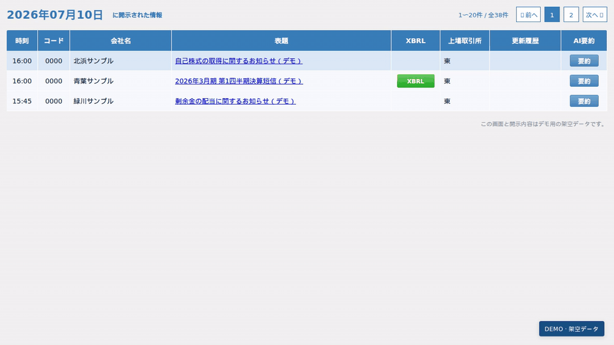

# TDnet Digest

TDnetの適時開示一覧で、PDFの要約をその場で読めるChrome拡張です。決算短信では、資料に記載された前年同期比や業績予想の修正も根拠ページ付きで表示します。

## インストール

1. [Releases](https://github.com/ivgtr/tdnet-digest/releases)から最新のZIPをダウンロードし、解凍します。
2. Chromeで `chrome://extensions/` を開き、デベロッパーモードをオンにします。
3. 「パッケージ化されていない拡張機能を読み込む」を押し、解凍したフォルダを選びます。

## 使い方

1. Chromeの拡張機能メニューからTDnet Digestを開き、「設定を開く」でLLMプロバイダー、モデル、APIキーを登録します。
2. [TDnetの開示一覧](https://www.release.tdnet.info/)で、確認したい資料の「要約」を押します。

要約には自分で契約したLLMのAPIキーを使います。PDFから抽出したテキストが設定先に送信され、モデルに応じてAPI料金が発生します。[料金の目安](docs/api-cost.md)を参照してください。要約は原文と照らし合わせてください。

## 開発・評価

[開発ガイド](docs/development.md)と[評価ガイド](evaluation/README.md)を参照してください。
