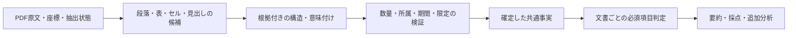

# 開発ガイド

## セットアップと確認

Node.js 20以上を使用します。依存関係とコマンドは [package.json](../package.json) を正本とします。

```bash
npm install
npm run dev         # 変更を監視してビルド
npm run build       # 配布用ビルド
npm run type-check
npm run lint
npm test
```

ビルド後、Chrome の `chrome://extensions/` でデベロッパーモードを有効にし、`dist/` を「パッケージ化されていない拡張機能を読み込む」から選択します。拡張機能のコードを変更した後は、必要に応じて拡張機能と TDnet のページを再読み込みしてください。

## リリース

[Release workflow](../.github/workflows/release.yml) は、`main` へマージされたPRの `release:major`、`release:minor`、`release:patch` のいずれか1つを読み、直前のリリースタグからバージョンを計算します。ラベルなしでは公開せず、複数のリリースラベルがある場合はエラーにします。マージ前にラベルを設定してください。

1. レビューと必要な検証を完了し、PR本文を利用者向けに整理します。PR本文はリリース説明にも掲載されます。
2. リリースラベルを付けてマージします。Actionsが依存関係を導入し、バージョン更新、型チェック、Lint、テスト、ビルド、ZIP作成を行います。
3. 検証成功後、`package.json` と `package-lock.json` を同じコミットに保存し、そのコミットとタグを一括でpushします。途中で `main` が進んだ場合は強制pushせず停止します。
4. GitHub ReleasesにタグとZIPを公開します。Actionsの成功、タグのコミット、ZIP内のManifestのバージョンを確認します。Chrome Web Storeへの公開は行いません。
5. ZIPを既存の読み込み先フォルダへ差し替え、拡張機能とTDnetページを再読み込みして確認します。設定保持、要約の先行表示、スコアON時の権限許可と採点、スコアOFF時の追加分析、採点失敗時の要約保持を確認してください。

失敗時は、まずActionsログとリモートのブランチ・タグ・Releaseの有無を確認します。タグ作成後に公開だけが失敗した場合は、既存タグのコミットからZIPを再生成してそのタグのReleaseを完成させます。タグを移動したり、再実行のためにバージョンを重ねて更新したりしません。

## 主な構成

| 場所                         | 役割                                         |
| ---------------------------- | -------------------------------------------- |
| `src/content/`               | TDnet の一覧へのボタン・要約表示の挿入       |
| `src/background/`            | PDF の取得、設定・キャッシュ、LLM 呼び出し   |
| `src/offscreen/`             | PDF.js によるテキスト抽出                    |
| `src/lib/`                   | 文書分類、プロンプト、出力検証、評価ロジック |
| `src/options/`, `src/popup/` | 設定画面と有効・無効の切り替え               |
| `manifest.config.ts`         | 権限と拡張機能のエントリーポイント           |

Content Script は TDnet の iframe 内を操作します。ページ側の CSS に影響しないよう、挿入する UI はインラインスタイルを使います。PDF.js は Service Worker から直接実行せず、Offscreen Document で動かします。

API の設定は拡張機能の設定画面から行います。実 PDF を使うローカル評価の手順とデータの扱いは [評価ガイド](../evaluation/README.md) を参照してください。

## 事実要約・採点・追加分析

通常の「要約」は、PDF.jsで抽出したテキストから構造化事実を生成し、本文の連続引用または表の根拠セルIDから、数値、単位、対象期間、物理ページ、行列の対応を検証して表示します。検証できない事実は確定事実として表示せず、必須事実を確認できなければエラーにします。投資判断や星評価は要約に含めません。PDFファイルの直接入力は既定で使用しません。

要約の表示後、実験的スコアがONなら採点を開始します。採点は要約で確認した事実を起点に、元PDFと必要な過去資料を照合します。採点に失敗しても要約は残ります。「追加分析」はボタンを押したときだけ生成し、採点設定とは独立しています。

| 場所                                | 役割                                         |
| ----------------------------------- | -------------------------------------------- |
| `src/lib/fact-summary.ts`           | 構造化事実の生成、原文照合、要約文の組み立て |
| `src/lib/additional-analysis.ts`    | 事実IDに基づく追加分析の生成と検証           |
| `src/background/index.ts`           | `summarize`、`score`、`analyze` の要求処理   |
| `src/content/hooks/useSummarize.ts` | 3段階の表示状態と個別キャッシュ              |

要約・採点・追加分析は別のキャッシュキーで保存します。設定画面の2パス切替は廃止しました。更新前の保存領域に `twoPassMode` が残っていれば、その廃止済みキーだけを削除して現在の設定を読み込みます。実PDFによる要約の確認手順と公開資料の期待値は[評価ガイド](../evaluation/README.md)を参照してください。

### 決算表の根拠参照

企業別・指標別の固定列番号は使用しません。現行の事実スキーマv4では、表の数値に `evidence` を必須とし、値セルと指標・期間・単位・文脈の根拠IDを照合します。分析指紋はv32です。旧スキーマは受け入れず、旧条件のキャッシュは再利用しません。

| 層           | 実装と責務                                                                                                                                                               |
| ------------ | ------------------------------------------------------------------------------------------------------------------------------------------------------------------------ |
| 抽出         | `pdf-layout.ts` がPDF.jsの文字列・座標・大きさとページ内IDを保持。本文も同じPDF文字から作る。数値の後続語は別IDで保持し、円銭は数値表記の構文から結合する                |
| 意味付け     | LLMが `valueId`、`metricIds`、`periodIds`、`unitIds`、`contextIds` を選ぶ。列順や企業名による分岐は持たない                                                              |
| 表構造と検証 | `numeric-evidence.ts` が参照先の行、単位見出しの列領域、指標見出しの適用範囲を確認。指標が行にある表も扱う。金額と増減率は別セルとし、両者にまたがる指標見出しを認識する |
| 確定         | 値・符号、指標の全見出し、期間、単位、実績／予想区分を照合し、参照元から引用を組み立てる。空欄・欠損記号はゼロにしない。別セクションの見出しや曖昧な列は未確認にする     |
| 利用         | 要約・採点・追加分析は確定事実v4を参照する。採点候補は事実IDだけを選び、値と属性は共通事実から作る。元PDF・過去PDFも同じ事実検証を通す                                   |

説明文は `evidence.kind: prose` と段落ID・段落全体の引用を必須とします。数量の直接対応と出来事の全文保持は別に検証します。指標・数値・単位の直接対応を検証し、表の失敗を固定列推測や単位換算で補う経路は持ちません。確認できない必須事実は従来どおり要約エラーにします。`column` は現行形式ではnullのみです。

本文の指標と数量の間は、助詞・句読点だけを同じ行の最大6文字まで認めます。「について」「に関して」「に対して」「において」「として」は語単位で扱い、「については」などの組合せも照合します。任意のひらがなや否定・概数表現は認めません。照合した行番号も共通検証器から返し、要約で対象行の期間・実績／予想区分を検証します。他の指標・数量・文を跨ぐ対応は採用しません。

`quantity.ts` は数値と原文の単位候補を分離します。文字種だけで単位の意味を確定せず、通貨・株式だけの単位リストも持ちません。PDF抽出では、数値の直後にある「店舗」「合計」などの語を結合せず別IDで保持します。要約・採点の共通検証器は、値と一体の単位、列単位、値に隣接する別IDの単位を原文の文字列と位置で照合します。値セル内に単位が含まれる場合は、単位の参照IDに値セル自身を必須とし、列見出しによる代用は認めません。120百と万円のように値セル内の単位も分かれている場合は、値セルを含む全断片のIDをunitIdsで参照し、値セル内の単位と右隣の断片を原文順に合わせて照合します。隣接単位は同じ行・右側に限り、間隔は文字高の0.6倍までとし、間に別セルがある参照は拒否します。参照済み単位の直後に、複合単位として読める未参照セルが残る場合も未確認にします。後続セルが「万円※」などの注記を含む場合も、接頭部分が単位候補として読めれば同じ条件で拒否します。セル全体が「注＋数字＋任意の末尾区切り」の参照構文（例: `注1`、`注12`、`注1）`、`注1.`）に一致する場合は、独立した注記参照として単位の続きから除外します。末尾区切りはUnicodeの閉じ括弧・閉じ引用符と句点（.、。）の合計2文字までとし、%・/・·などの単位記号や数字・文字を含めません。単位を含む「万円注1」や、番号のない曖昧な「注」にはこの分類を適用しません。注記を削除して単位を採用する処理は行いません。続きを自動的に補ったり、指標見出しと推測して無視したりしません。円銭だけは数値表記の構文から結合します。セルIDの変更を旧結果へ適用しないため、分析指紋を更新しています。

数量が1つだけの表は、指標が数量と同じ行にある場合に限り、数量セルの幅と文字高から列の領域を限定します。列単位と期間見出しの中央がその領域に入ることを確認し、曖昧な配置は採用しません。採点の累計・単独区分は、表の根拠参照を検証した後で `periodIds` と `contextIds` の文字から確認します。期間名に「累計」がなくても、参照した見出しに記載があれば照合できます。表を空の本文引用やページ内の未参照文字で補う処理は持ちません。

汎用性の検証では、固定順の合成テキストを座標付きの実PDFデータへ置き換えました。5社の6ページで、報告対象の11項目、日本基準／IFRS、赤字と欠損値、配当の決定額・直近予想を確認します。列の並び替え・追加、見出しの改行、空欄、指標と期間の行列入れ替え、同額の別指標、前年・当年、通常予想・修正後予想の誤採用もテストします。取得元と再評価コマンドは[評価ガイド](../evaluation/README.md)を参照してください。

位置情報だけで全形式を確定できるわけではありません。回転文字、数量と見出しの所属を一意に決められない配置、未対応の複雑な結合セルは表の根拠として採用しません。実PDFの位置情報をLLMへ渡すため、今回の対象ページでは入力文字数が本文のみの約5～6倍でした。固定候補の回帰と実LLM評価は別です。実装後の利用量・時間・失敗・拡張経路は、末尾の実行記録と評価ガイドに記録します。

### 汎用IR対応の調査と設計案（2026-09-30の開始前調査）

起点は[BlueMemeの2026年3月期決算短信](https://www.release.tdnet.info/inbs/140120260930543649.pdf)。正しい根拠を選んでも通期純利益予想が拒否され、小数の一部を正しい値として受理する。追加調査では、符号・期間・範囲・限定条件・否定の欠落も再現した。文字のエスケープや個別表記の許可を増やすのではなく、原文の構造と意味を保持する共通の事実表現を設計する。

#### 確認した根拠

- v0.7.1のタグは `c2c5fd6776ef6e4e5b4aa7a482f375507d82f26a`、比較したv0.7.0は `ca7eeb79305cdbd9503b053d9db45b38ee1978a4`。調査開始時のローカルHEADは `2bd805b70c93c05ef25ade9ed4c48a7b7d470cb9` で未コミット変更あり。配布版のソースを `/tmp/tdnet-v0.7.1` に取得し、`pdf-layout.ts`、`quantity.ts`、`numeric-evidence.ts`、`fact-summary.ts`、`score-extraction.ts` が作業ツリーと一致することを確認した。依存ロックはv0.7.0とv0.7.1でルートの版番号以外に差がない。
- Node.jsの同じ実行環境・PDF・正しい事実を用い、各版の現行スキーマで検証した。v0.7.0は純利益予想−400百万円を受理、v0.7.1は拒否。この検証経路での分類は `introducedByChange`。スキーマv2の引用とv3のセルIDをそれぞれ使用する検証器の比較であり、実LLMを含む要約成功率全体の比較ではない。
- 物理p.1の純利益の根拠は値 `p1s283`、指標 `p1s255,p1s261`、期間 `p1s272,p1s273`、単位 `p1s269`、文脈 `p1s253`。これで「指標見出しの一部が未参照」が発生する。隣のEPS見出しの「１」(`p1s256`) を指標参照に追加すると「指標名」で失敗する。この「１」だけを診断用のページコピーから取り除くと元の正しい参照が通る。文字の除去は原因の切り分けであり、実装案ではない。利用者の実際のLLM応答は未取得で、再生成時にどのIDを選んだかは未確認。
- `numeric-evidence.ts` は単位文字の中央から列範囲を作り、金額と増減率の範囲を合わせる。その範囲の右端が隣のEPS見出しの「１」まで含むため、文字断片単位の未参照検査が別指標を欠落と判定する。必要なのは見出しブロックの所属の確認であり、数字だけの断片を一律に無視する処理ではない。
- 同じPDFの営業利益率1.4％は `p1s118="1"` と `p1s119=".4"` に分かれる。抽出時、途中の `1.` が完成した数量として解析できず結合されない。正しい1.4は「値・符号」で拒否される一方、1を指定すると表照合を通過する。実際のモデルが1を出力した証拠はないが、検証器が誤った値を受理する経路は再現した。
- 全18ページの本文18,713文字に対し、位置情報込みの入力は88,795文字（約4.7倍）。文字数の増加だけでモデル精度低下を断定しない。リリース時のブラウザー検証はAPI応答を固定しており、実LLMの精度は未評価だった。

一時的な再現スクリプトは `/tmp/tdnet-543649-diagnosis.mjs`、結果は `/tmp/tdnet-543649-diagnosis.json`。リポジトリのルートで `node --import tsx /tmp/tdnet-543649-diagnosis.mjs` を実行し、配布版ソースと公開PDFから上記を再現した。環境ファイル・APIは使わず、製品コードは変更していない。`/tmp`のファイルは恒久的な回帰fixtureではない。

#### 追加調査で再現した抜け漏れ

本番の `parseFactSummary`、`verifyTableEvidence`、`verifyProseEvidence`、`validateScoreInput` を呼ぶ合成入力14条件で確認した。各条件の期待と実際は `/tmp/tdnet-ir-design-probes.json`、再現コマンドはリポジトリルートから `node --import tsx /tmp/tdnet-ir-design-probes.mjs`。正常な入力の誤拒否と、不正な対応の誤受理を区別する。実モデルがこれらの入力を生成する頻度を測ったものではない。

| 優先度 | 共通原因                                     | 再現した結果                                                                                                                       | 必要な不変条件                                                                                          |
| ------ | -------------------------------------------- | ---------------------------------------------------------------------------------------------------------------------------------- | ------------------------------------------------------------------------------------------------------- |
| P0     | 数量の全断片を参照しない                     | 分離した「△」を落とした正の値を受理。`1,2` を12と解析。BlueMemeでは小数部分を落とした値も受理                                      | 符号・桁・小数・桁区切りの構文と全断片を確認し、一部だけの参照を拒否                                    |
| P0     | 期間・区分を局所の根拠に結び付けない         | Q1累計の値を年度だけで表し、採点でもfullYearとして受理。文脈の「予想」を落とし実績として受理。月次本文の7月値を8月と表示しても受理 | 表／段落に適用する期間・区分を一つの対応として確定し、四半期・月・累計・単独を省略して意味を変えない    |
| P0     | 限定・否定を事実表現に保持しない             | 「配当増額を決定していません」から「配当増額を決定」だけを抜いて表示可能                                                           | 主体、述語、否定、条件、予定・決定・実施、数量の上限・概算・範囲を保持                                  |
| P0     | 会計基準・範囲が資料全体の文字存在だけで通る | 日本基準・連結の表に、別の箇所のIFRS・非連結を割り当てても採点入力を受理                                                           | 基準・連結／個別・会社／セグメントを対象の値に適用する見出しへ結び付ける                                |
| P1     | 必須項目が部分一致で、報告対象の軸を持たない | 営業利益率とEPSで営業利益・純利益を代用可能。前年だけの実績で必須判定を通過。正しい「純損失」は不足と判定                          | 指標の意味、報告対象期間、主体・範囲を揃えた充足判定。利益／損失の表記を扱い、金額・率・1株当たりを区別 |
| P1     | 行見出しと列見出しで完全性の検査が違う       | 複数行の行見出しから「調整後」を落として営業利益として受理                                                                         | 両軸とも親見出しを含む指標の経路を保持し、限定の省略を拒否                                              |
| P1     | 決算期・同一行・同一ページを全形式へ要求     | 正しい年月だけの月次表、段落内で指標が改行する本文を拒否                                                                           | 決算期、暦月、基準日、対象期間を明示的に扱い、表示上の改行と段落・セルの境界を区別                      |

公開PDFを追加で3件読み、実際の形式も確認した。手作業の候補応答による検証であり、実LLMでの成功／失敗ではない。

- [丸八倉庫の自己株取得](https://www2.jpx.co.jp/disc/93130/140120260709590524.pdf) p.1: 「取得する株式の総数200,000株（上限）」を本文引用として渡し、取得予定日の2026年7月15日・actualを指定すると、未確認事項なしで「200000株、実績」と表示する。上限と取得予定・実施結果の違いを失う。結果は `/tmp/tdnet-ir-buyback-diagnosis.json`。
- [うるるの月次IR](https://www2.jpx.co.jp/disc/39790/140120260714592844.pdf) p.4: 2026年6月のMRR338,214千円を、値・MRR・6月行・単位・直近見出しの原文IDで選んでも「対象年度・決算月」で拒否する。暦月と2027年3月期の所属を分離できない。p.5には同じ系列のグラフと速報値の注記もある。結果は `/tmp/tdnet-ir-monthly-diagnosis.json`。
- [IZUMIの子会社化](https://www2.jpx.co.jp/disc/551A0/140120260709590424.pdf): 対象会社と2023～2025年7月期の列見出しはp.1、売上・利益の続きはp.2。現スキーマの同一ページ参照では、その続きの行と期間・対象会社を結び付けられない。また取得価額は非開示、株式譲渡実行日は予定であり、数値の欠落・実施済みと混同しない表現が必要。ここは抽出結果とスキーマから確認した制約で、LLM応答を用いた再現は行っていない。

抽出の失敗状態にもコード上の不足がある。Offscreenは失敗したページを非空のエラー文字列で置き換え、fullモードではそのページも `extractedPages` に数える。`ExtractedPage` に失敗・画像のみ・読取不能を表す状態がなく、全ページ失敗でも非空判定を通り得る。これには故障注入をまだ行っていない。抽出の成功と、重要情報の確認完了を別の状態として扱う必要がある。

#### 共通設計の責務



| 層         | 決めること                                                             | 持たせない判断                                                  |
| ---------- | ---------------------------------------------------------------------- | --------------------------------------------------------------- |
| 原文取得   | 元の文字アイテム・変換行列・物理ページ・範囲・資料IDと抽出状態を保存   | 後続の日本語を単位と決める、失敗を本文で代用する                |
| 構造候補   | 文字列のまとまり、段落、表、セル、行列、結合見出し、継続表の関係を保持 | 単位文字の中央だけで列を確定する、近いものを必ず同じセルにする  |
| 意味付け   | LLMが候補の構造関係・指標・主体・期間・条件を原文参照付きで提案        | 未知の指標や欠損を既知の指標・ゼロ・別の入力形式へ読み替える    |
| 検証・確定 | コードが参照存在、構造整合、数量の完全性、適用範囲、限定の保持を確認   | 単なる文字存在・IDの有効性だけで意味も正しいと断定する          |
| 利用       | 同じ事実から必須判定、表示、比較・採点を行う                           | 採点がscopeや期間を独自に付け直す、表示が否定・予定・上限を削る |

構造は座標から一度に確定する前提を置かず、複数行の見出し、罫線の有無、表の両軸、値と単位の配置から関係候補を作る。LLMの構造提案も検証対象とし、原文の断片へ遡れることを必須とする。曖昧な候補は推測で確定しない。所属を確認できた見出しブロックの全断片で完全性を検査するため、数値で始まる指標の見出しも保持できる。回転文字や図表の値は、現行の水平表へ黙って当てはめず、対応可否を記録する。画像入力・OCRの導入は別途評価する機能であり、今回の調査で有効化しない。

共通事実には、以下を独立した属性として持たせる。LLMが自由文字列で指定しただけでは確定せず、それぞれの原文参照と適用範囲を照合する。

- 指標の原文名と意味上の区分。金額／割合／1株当たり、調整前／調整後、利益／損失を区別し、企業固有KPIも原文名を保持する。
- 発行会社、数値の対象会社・セグメント、連結／個別、会計基準。M&Aの対象会社を発行会社の実績と混ぜない。
- 対象期間の開始・終了、暦月、決算年度・決算月、累計／単独、基準日。対象期間と開示日・取締役会日・実行予定日は別属性とする。
- 完全な数値表記と単位、正負、金額／率、上限・下限・範囲・概算・速報値、非開示・未定・該当なし。数量の構文を確認してから正規化し、確定した換算規則を使う場合も原文量と導出量を別々に保持する。
- 実績／予想と修正前後、提案／決議／契約／実施の状態、否定・条件。予定を通常の業績予想へ一括分類せず、数量の上限とも別に保持する。
- 根拠の種別と所属する段落／表／セル、必要な限定語を含む参照群。継続表は各ページの参照を保ち、列構造・指標・対象範囲の継続を確認した場合だけ結ぶ。

本文は表示上の改行を含む段落内で数量と指標を照合する。イベントは主語・述語・否定・条件を含む原文の節／文を保持し、部分文字列の肯定表現だけを表示しない。どちらも、引用の存在確認と意味上の正しさの評価を区別する。一般的な意味理解を正規表現だけで保証する設計にはせず、限定を保った原文表示と実モデルの期待結果評価を併用する。

必須項目は「文書種別＋報告対象期間＋対象会社・範囲＋指標区分」で判定する。前年値・EPS・利益率を当年の利益額へ代用しない。非開示・未定など原文に明記された状態と、抽出・照合の失敗は別に記録する。曖昧な資料で必須項目が揃ったと扱わず、現在の必須事実不足時のエラー方針を維持する。

#### 実装順序と完了条件

1. **誤受理を先に固定する。** 上記の診断と実PDF文字アイテムを恒久fixtureへ移し、符号・小数・否定・上限・予定・期間・範囲を落とした候補を拒否する条件を決める。同時に、正しい値・対応・原文表示の期待結果も記録する。今回はまだ一時的な診断スクリプトであり、恒久テストは未追加。
2. **原文・構造・共通事実の契約を定義する。** 既存v3へ曖昧な任意項目を足すのではなく、対応する根拠種別と必須属性を新しいスキーマで定める。旧スキーマの黙った変換やキャッシュ再利用は行わない。抽出・要約・採点・表示の利用経路を同じ契約へ移す。
3. **数値の組立と見出し所属を修正する。** 符号・桁・小数点の途中状態を含む数量列を組み立て、未参照の続きによる桁落ち・符号落ちを拒否する。所属を検証したブロックから指標の全経路を確認する。BlueMemeの−400百万円、1.4％、−119.53円を照合し、EPSとの取り違えと限定語の省略を拒否する。既存のEBITDA・IFRS・配当表も保持する。
4. **形式横断の意味検証を統合する。** 表と本文で期間・範囲・数量の限定・実績／予定の意味判定を共通化する。月次、複数行の行見出し、段落内の改行、確認できる継続表へ拡張する。要約の確定事実を採点がIDで参照できるようにし、対象範囲を再推測しない。
5. **診断・修復・表示を更新する。** 診断に失敗段階、理由コード、対象の事実・ブロックID、原文、不足／衝突した参照を残す。抽出・構造の失敗とLLMの選択ミスを分け、修復は失敗候補と必要な原文範囲を対象とする。確認済み事実を維持し、応答内のf1等の番号だけに依存した統合・重複判定を見直す。LLMへ渡す量を減らす際も見出し・単位・限定・対象範囲を落とさない。
6. **実モデルと拡張の実経路で完了を判定する。** 以下の評価軸を、未対応・誤拒否・誤受理に分けて記録する。API応答を固定したテストだけでリリースを判定しない。

評価資料は既存5社6ページとBlueMemeに、今回読んだ月次・自己株取得・M&Aを加える。設計の検証軸は、行列の入替え・追加、複数段見出し・結合セル、罫線あり／なし、本文／箇条書き、同額の別指標、単位の位置と桁、符号・小数・欠損・注記、年度／暦月／日付、累計／単独、連結／個別・対象会社、上限／概算／予定／否定、継続表とページ失敗。単にPDF件数を増やすのではなく、各軸に正しい採用例と誤対応の拒否例を置く。文字アイテムの分割・順序、フォント・倍率、空白・改行の変化でも意味が保たれることを確認する。

固定した原文・設定・モデルで初回成功、修復成功、最終失敗、必須項目の欠落、誤値と限定の欠落、入力トークン・時間を記録する。原文の真値はモデル応答から作らず、実PDFを人が確認した期待値と根拠を使う。今回の利用者向け完了条件は、BlueMemeの当年実績・通期予想・配当と純損失の背景（調査関連費用394百万円、概算額）、自己株取得の上限と予定、月次の暦月と速報値を正しく区別して伝えること。部品の検証と文章要約の完成を分け、配布前には実際の拡張で確認する。

次の操作は恒久fixtureと共通事実の契約を用意し、誤受理を固定してから数量・構造・意味判定を順に統合すること。今回の追加調査でも製品実装・実LLM評価・リリースは行っていない。抽出失敗の故障注入と、画像・グラフを含む形式の実測は未達条件として残る。

#### 現行コードから再判断した実装計画（2026-09-30、承認済み）

目的は、正しい事実を採用し、意味を変えた候補を拒否したうえで、利用者に原文の期間・対象・限定を保った要約を届けること。上記の調査案を材料として、抽出から拡張の表示・採点までを読み直した。計画提示時にはこの文書と評価ガイドだけを変更し、製品実装へ進まず停止した。その後、利用者の「OK」により、実装・検証・コミットが承認された。以下の計画と後述の実装記録を区別する。

**基準となる状態と変更の扱い**

- 開始HEADは `2bd805b70c93c05ef25ade9ed4c48a7b7d470cb9`、元ブランチは `feat/separate-fact-summary-analysis`。専用ブランチ `feat/ir-semantic-contract` を作成した。
- 実装・回帰比較の基準は、このHEADに開始時の未コミット差分（追跡済み25ファイル、未追跡9ファイル）を含めた作業ツリー。HEAD単体や配布版へ戻して実装しない。開始時の追跡差分は `/tmp/tdnet-ir-plan-start.patch`、未追跡9ファイルは `/tmp/tdnet-ir-plan-start-untracked.tar` に保存した。前者のSHA-256は `1b51489ac81c12068762d857159595e045034e76c86c726f11603affede49840`、後者は `f0b6f146ebd3d4dce5fb28a6e81f4a51afa57805384f334b353bc851de4cb57e`。これらは一時的な保全資料で、評価fixtureではない。
- 配布版v0.7.1のSHAは上記の調査記録による。ローカルGitにはそのコミットオブジェクトがなく、今回タグをcheckoutして検証したとは扱わない。既存の `/tmp/tdnet-v0.7.1` と内容を比較し、主要な抽出・検証・採点・表示・キャッシュ経路と位置情報fixture・関連テストの一致を再確認した。一方、作業ツリーのpackage版番号は0.6.0、配布版は0.7.1で、package/lock・開発資料などに差がある。全ツリーの同一性を主張しない。
- 開始時に関連10テストファイルの222件が成功した。対象は `fact-summary`、`fact-summary-release`、`numeric-evidence`、`score-extraction`、`quantity`、`scoring`、`page-text`、background、`useSummarize`、`summaryHtmlBuilder`。これは既存動作の基準で、既知の誤受理がないという証拠ではない。
- 確認後は、開始時の既存変更を「着手前の変更」と明記した基準コミットとして独立して記録し、計画追記と新規実装を別の差分・コミットで管理する。開始時パッチと未追跡保全資料から対象を照合し、後から入った利用者の変更を混ぜない。reset・clean・既存変更の上書きは行わず、pushしない。

**実経路と原因**

現行経路は `handleSummarize` → PDF取得 → Offscreenの `extractPageLayout` → smart/fullのページ選択 → `generateVerifiedFactSummary` → `parseFactSummary` → `verifyTableEvidence` / `verifyProseEvidence` → `verifyCoverage` → `renderFacts` → Content ScriptのHTML・キャッシュ。採点と追加分析は別要求でPDFを全文再抽出し、要約事実を再検証する。採点はさらに独立したLLM応答を `validateScoreInput` と `restrictToFacts` に渡す。

| コード上の前提                                                                              | 原因・同じ前提による抜け漏れ                                                                                                             | 変更後の不変条件                                                                               |
| ------------------------------------------------------------------------------------------- | ---------------------------------------------------------------------------------------------------------------------------------------- | ---------------------------------------------------------------------------------------------- |
| `pdf-layout.ts:17` が文字を結合し、`quantity.ts` が空白・カンマを除去して完成値を判定       | 原アイテムとの対応がなく、途中の `1.` が数量として成立せず1と.4に分離。`1,2` も12に変わる                                                | 原アイテムを保存し、数量の構文と全断片を確認してから正規化する                                 |
| `numeric-evidence.ts` の `bandFor`、`metricBand`、未参照見出し検査                          | 単位中央間の境界と金額・率の合算範囲が隣のEPSの「１」へ及ぶ。行指標では同じ完全性検査をしない                                            | 表・セル・見出しブロックの所属と親見出しの経路を確認し、両軸の限定を保持する                   |
| `TableEvidence.valueId` だけで値を比較                                                      | 隣接する符号・小数・桁の未参照を拒否できない                                                                                             | 数量列の全参照を必須とし、欠損や途中状態を値としない                                           |
| `verifyPeriodAndKind`、本文の `periodVerified` / `earningsRowVerified`                      | 決算期・同じ行・近傍見出しに依存。文脈のQ1/予想を落とせる一方、年月だけの月次や改行本文を拒否                                            | 対象期間と状態を局所ブロックの適用関係として確定し、暦月・年度・累計・単独・日付役割を分離する |
| `verifyCoverage` がlabelの部分一致とactual/forecastで判定                                   | 率・EPS・前年で当年の利益額を代用でき、純損失が不足扱いになる。必須性をページ内の単語存在から推定する                                    | 報告対象期間・主体/範囲・指標の意味と量の種類・状態が一致した事実だけで充足する                |
| eventのstatementがquoteの部分文字列、`renderFacts` が数値以外の限定を持たない               | 否定の末尾を切った肯定文、上限の取得枠を実績、概算費用を確定額として表示可能                                                             | 主語・述語・否定・条件を含む文/節を保持し、数量の限定と実施状態を表示する                      |
| `score-extraction.ts:323` がbasis/scopeを資料全体で探し、採点だけのperiodKind等を受け入れる | 別セクションのIFRS・非連結を借用可能。要約はscope/basisを持たず、`restrictToFacts` でも照合できない。通常forecastは採点のValueKindにない | 元資料も比較資料も共通の事実検証を通し、採点は確定した属性をIDで参照する                       |
| Offscreenがページ失敗を本文文字列へ置換し、smart品質ゲートが単語出現で合格                  | 失敗ページが抽出済みページ数へ入り、限定や背景が未選択でも要約の完了と区別できない                                                       | 抽出状態と選択状態を持ち、根拠閉包・必須対象を欠く入力で完全性を主張しない                     |

開始時の本番検証器へ既存の公開PDF抽出結果を渡し、BlueMemeの−400の誤拒否、1.4の誤拒否、1の誤受理を再確認した。PDFのSHA-256は `2d91317dc77bcc30397b5fed3ea0d7168be8ccb91d05535ce42501f530a50dea`。`/tmp/tdnet-ir-design-probes.mjs` も現行コードで実行し、上記14条件の結果を再確認した。いずれも固定候補の診断で、実モデルの応答や恒久回帰テストではない。BlueMemeの物理p.1・p.5、月次のp.4・p.5はローカルの実PDFを画像化して期待内容を確認した。

**責務とデータ契約**

事実スキーマはv4へ更新する。v3に任意属性を継ぎ足して欠けた意味を既定値で補う方式は採らない。次の契約を、抽出・LLM候補・検証・保存・利用の各境界で厳密に検査する。

| 層         | 入出力と責務                                                                                                                                                                                                                                                                                                         |
| ---------- | -------------------------------------------------------------------------------------------------------------------------------------------------------------------------------------------------------------------------------------------------------------------------------------------------------------------- |
| 原文       | `SourceDocument` はPDFの内容ハッシュ、URL、発行会社の原文参照、物理ページ一覧を持つ。ページは成功・空/文字なし・失敗と、選択/未選択を区別。原文字アイテムにID、文字列、transform、幅・高さ・方向・改行情報を保存し、回転文字も消さない。整形本文は派生表示とし、事実検証の正本にしない                               |
| 構造候補   | `DocumentStructure` は段落/箇条書き/表/セル/見出し/注記のID、範囲、原アイテム参照、表の両軸、親子/結合見出し、適用先を持つ。文字座標・余白・反復する行列から候補を作り、原文字から遡れることを必須とする。必要な罫線情報はPDF描画情報から取得する。座標の近さや単位中央だけで確定しない。LLMの構造選択も整合検査する |
| 候補事実   | LLMは構造候補と根拠群を選び、指標・対象・期間・数量・状態を提案する。通常1回、失敗時の修復は最大1回を維持。数値/出来事/明記された非開示等の状態を判別できるunionとし、不明属性は理由付き未確認として表す。nullをactual、連結、通期などへ読み替えない                                                                 |
| 検証・確定 | 共通検証器が根拠存在・構造所属・数量の完全性・意味属性の根拠と競合を確認し、`VerifiedFact` と段階/理由コード付き診断を返す。数量は全断片の原表記と正確な十進表現を保存し、桁区切り・小数・符号・円銭を構文として扱う。JS numberへ先に丸めず、採点で数値化する場合も扱える精度・範囲を検査する                        |
| 必須判定   | 原文の報告対象を要約候補とは別に確認した `ReportingContext` と、確定事実を照合する。候補自身が当年・必須項目を決めて充足を自己証明することは認めない。原文の未定/非開示/該当なしは明示状態として、抽出失敗とは別に判定する                                                                                           |
| 利用       | 要約表示・比較/採点・追加分析が同じ確定事実を使う。利用側が期間・対象・限定を付け直さない。追加分析とスコア理由は推論であり、事実IDの存在だけで文章の正しさを保証した扱いにしない                                                                                                                                    |

`VerifiedFact` の属性と参照は次を独立して持つ。複数ページの根拠は資料ID・ページ・構造ID・原アイテムIDで識別する。

- `metric`: 原文名と見出しの全経路、金額/率/1株当たり/件数等の種類、標準指標区分、調整後・帰属先などの限定。未知KPIは原文名のまま保持し、既知の利益額の充足には使わない。
- `subject`: 発行会社と数値の対象会社を分離し、連結/個別・セグメント/事業・会計基準と各適用根拠を保持する。文書全体の見出しは対象ブロックへ適用すると確認できた場合だけ継承する。
- `period`: 対象の開始/終了、決算年度/決算月、暦月、累計/単独、基準日を別属性にする。開示日・決議日・契約日・実行予定日は役割付き日付で分離する。原文から一意に導ける月次の年などは導出元と規則を残す。
- `quantity`: 原表記、全数量断片、正確な値/範囲、単位、上限/下限/概算/速報の各限定と適用根拠。欠損記号や非開示をゼロにしない。正の「純損失400」と負の「純利益−400」は原表記を別々に残し、損益として比較する場合に限り符号の導出規則を記録する。
- `status`: 実績/通常予想/修正前後と、提案/決議/契約/実施予定/実施済み、否定、条件を別軸で持つ。上限と予定をactual/forecastに一括分類しない。出来事は主語と限定を含む完結した原文文/節を表示単位とする。
- `evidence` / `diagnostics`: 本文と表を識別し、原文範囲と構造所属、属性ごとの根拠、継続/注記の適用関係を保持。構造曖昧・参照不足・属性競合・不正値・抽出失敗を区別する。確定IDは資料と根拠/意味の同一性から作り、LLMが付けるf1等を修復前後の統合キーにしない。

量の正規化や段落の改行結合は、原表記を残す規定済み処理として行う。通貨/単位の推測、未知スキーマの変換、別根拠形式への救済は行わない。同じ指標/期間でも、百万円の切捨て値と千円の詳細値を黙って同値として統合しない。一般的な自然言語の意味をID・引用・正規表現だけで完全に証明できるとは扱わず、完結した原文の保持、検証可能な属性の制約、実モデルの期待結果評価を組み合わせる。限定の適用先や主体を解決できない候補は確定・採点に使わない。

**対応形式と停止境界**

今回の対応対象は、文字を取得できる水平の表・段落・箇条書き。決算（日本基準/IFRS、通期/四半期/中間、実績/予想、配当）、業績/配当修正、自己株取得の決議/予定/結果、月次の企業固有KPI、M&Aの対象会社情報・取引条件・日程・非開示を重点評価する。その他のIRも、同じ根拠契約に適合する数量・完結した出来事を扱うが、タイトル分類11種類の存在を全形式の対応保証にはしない。

複数段見出し・行列の入替え・セル内の複数断片・本文の表示改行・罫線あり/なしを扱う。結合セルと継続表/離れた注記は、列/指標/期間/対象の一致と適用関係が確認できたものを対象とする。M&Aのp.1→p.2の対象会社表、月次p.4→p.5の同じMRR系列と速報注記も検証例にする。隣接ページという理由だけで注記を資料全体へ適用しない。

画像だけのPDF、グラフの図形からの読み取り、回転表の数値化、所属を一意に確認できない複雑な結合、異なる系列の注記、暗黙の主体/否定/条件は未対応または曖昧として記録する。OCR・画像をモデルへ直接渡す機能はこの計画に含めない。文字として存在するグラフの数字も、系列との対応を確認できなければ値として採用しない。明記された範囲数量は上下限を保持して表示し、単一確定額への変換や採点への投入はしない。必須対象が未対応/曖昧/抽出失敗なら要約エラーにし、任意対象の未確認は理由を表示する。

smartは省略した根拠がないという保証を単語品質ゲートへ持たせない。構造候補を全ページから作り、選択する段落/表の見出し・単位・主体・注記・継続先を一緒に渡す。閉包を確認できなければ未確認/全文再要約の理由を返し、欠けた限定を補わない。自動で別保存先や別モデルへ切り替える救済は追加しない。

**変更するファイルと統合先**

| ファイル                                                                                                                                                                                          | 変更                                                                                                                                               |
| ------------------------------------------------------------------------------------------------------------------------------------------------------------------------------------------------- | -------------------------------------------------------------------------------------------------------------------------------------------------- |
| `src/lib/pdf-layout.ts`、`pdf-lines.ts`、`page-text.ts`、`src/offscreen/index.ts`、`src/types/summaryMetadata.ts`                                                                                 | 原文字・ページ状態・文書IDの契約、構造候補生成への入力、smart/fullとメッセージの厳密検査。失敗を本文へ混ぜない                                     |
| 新設 `src/lib/document-structure.ts`                                                                                                                                                              | 段落/表/セル/親見出し/注記/継続関係の候補と検証。原アイテムと派生構造のIDを分離                                                                    |
| `src/lib/quantity.ts`、`numeric-evidence.ts`、新設 `fact-contract.ts` / `fact-validation.ts` / `fact-coverage.ts`                                                                                 | v4の厳密な候補/確定型、数量全断片、本文/表共通の意味属性検証、報告対象を含む充足判定                                                               |
| `src/lib/fact-summary.ts`                                                                                                                                                                         | 構造と意味の候補生成、限定した修復、確定IDによる統合、共通事実からの表示。期間/区分の独立した再推測を廃止                                          |
| `src/lib/score-extraction.ts`、`scoring.ts`、`disclosure-search.ts`、`src/background/index.ts`                                                                                                    | 採点入力を共通事実IDの比較関係へ変更。元PDFの値の再抽出をやめ、比較PDFの追加事実も共通検証器を通す。検索候補の取得/発行会社/開示日前後の検査を維持 |
| `src/lib/additional-analysis.ts`、`src/content/hooks/useSummarize.ts`、`src/content/utils/summaryHtmlBuilder.ts`、`src/options/Options.tsx`、`src/lib/analysis-version.ts`                        | 追加分析への属性伝達、限定を保つ表示、キャッシュ契約/復元/削除、指紋更新。採点失敗時も要約を保持                                                   |
| 上記の関連テスト、`src/lib/fixtures/pdf-layout-corpus.json`、`evaluation/fixtures/fact-summary-cases.json`、`evaluation/scripts/run-fact-summary.ts` / `check-layout.ts`、`src/lib/llm-client.ts` | 正負の回帰、実PDF照合、実モデルの意味属性評価、利用量/試行/時間の観測。LLM応答は新契約として一斉更新し旧形式のfixture変換経路を残さない            |
| `docs/development.md`、`evaluation/README.md`、`CLAUDE.md`                                                                                                                                        | 契約・進捗・判断・検証コマンド/証拠・未達条件を既存正本に反映                                                                                      |

新モジュール名は責務を示す予定名であり、既存構成に合わせた通常の技術判断で整理する。旧2パスの評価経路は今回の製品経路へ戻さず、現行評価と区別する。

キャッシュは事実v4と分析指紋v28へ更新する。採点スキーマも版を付け、score cacheはV4、追加分析cacheはV2とする。summaryのV2外側の保存キーは指紋で分離できるため維持し、内部をv4で厳密検査する。内容ハッシュと全属性をresultIdへ含め、元PDFが変わったfollowupを拒否する。旧事実・旧採点・旧追加分析の暗黙変換/再利用はしない。既存キャッシュを一括削除せず、設定画面では旧データの版を確認して表示/削除できるようにする。不正な現行キャッシュは理由を表示し、別キーの旧結果を探して補わない。

**実装順序と回帰検証**

1. 開始時差分を区別して記録し、既存診断の期待と原文を恒久fixtureへ移す。BlueMeme、自己株取得、月次、M&Aの取得元・PDFハッシュ・物理ページ・原文字・人が確認した真値を保存する。現状の不具合が期待条件を満たさないことを示し、先に既存成功例と誤対応の拒否例を固定する。
2. 原文/構造/v4事実の契約と厳密な境界検証を実装し、数量列と見出し所属を統合する。−400、1.4、−119.53、分割した符号/桁/小数の全断片を採用し、一部参照を拒否する。EPSの隣接文字を除去する修正や固定列の分岐は入れない。
3. 本文/表の期間・主体・範囲・限定・状態と必須判定を統合する。月次の年度と暦月、純損失の意味、当年/前年、予定/実施、否定/条件、非開示/欠損を扱う。段落・継続表・注記の正しい採用と誤所属の拒否を一緒に確認する。
4. 生成/修復/表示、採点の事実ID参照、比較資料、追加分析、background通信、キャッシュ/設定画面を移す。新しい契約が利用者の入口から表示まで到達する結合テストを置く。事実IDの順序変更、重複、修復時の衝突も検証する。
5. 実PDFを本番と同じ抽出/検証に通し、既存5社6ページと追加資料を評価する。文字分割/順序、倍率/フォント、空白/改行、列追加/入替え、罫線/結合、同額異指標、年度/暦月/日付、累計/単独、主体/範囲、上限/概算/速報/予定/否定/条件を、正しい採用と誤対応の拒否で対にする。ページ抽出失敗・文字なし・smartの限定脱落も故障注入する。
6. `npm run type-check`、`npm run lint`、`npm test`、`npm run build`、位置情報再抽出、実PDF評価を行う。既知失敗の再診断は変更後に必要な範囲だけ実行し、成功済み条件を理由なく反復しない。
7. 現行の評価スクリプトで実モデルを評価し、ビルドした拡張の実経路を確認する。実モデルの失敗はプロンプト/構造/検証/必須性のどこに原因があるか記録して修正する。適切な単位でコミットし、最終的に成果・検証・未達・ブランチ・コミットを報告する。pushは明示指示まで行わない。

**利用者の結果で判定する完了条件**

| 対象          | 正しい表示と拒否条件                                                                                                                                                                                                                                                                                                                                                                                            |
| ------------- | --------------------------------------------------------------------------------------------------------------------------------------------------------------------------------------------------------------------------------------------------------------------------------------------------------------------------------------------------------------------------------------------------------------- |
| BlueMeme      | 2026年3月期連結の実績は売上3,298・営業利益47・親会社帰属純利益24百万円、2027年3月期通期予想は2,600・30・−400百万円。実績と予想、当年と前年、EPSと利益額を分離する。配当0、営業利益率1.4%、EPS予想−119.53円を原文の量/限定のまま扱う。物理p.5の調査関連費用394百万円（概算額）と損失予想の関係を伝え、p.18の翌連結会計年度の特別損失計上予定を実績としない。率1%・純利益+400・EPS代用・概算/予定の削除は拒否する |
| 丸八倉庫      | 200,000株と206,200,000円は取得の上限で、7月14日決議・7月15日買付予定。未実施の可能性を含む条件を保持する。取得済み実績や無条件の確定数量として表示/採点しない。発行済株式数の6月30日時点と実行日を混ぜない                                                                                                                                                                                                      |
| うるる月次    | NJSSの2026年6月MRR338,214千円と当期2027年3月期を分離する。前年比18.0%は別の率。前年の286,637千円と列を混ぜず、系列の継続を確認したp.5の速報/修正可能性も保持する。2027年6月や7月への割当、百万円のグラフ丸め値338への代用を拒否する                                                                                                                                                                             |
| M&A・既存資料 | 対象会社の実績を発行会社の業績と混ぜない。実行予定と決議/契約を区別し、非開示の価格を補わない。既存のEBITDA、IFRS帰属利益、赤字/欠損、配当決定額/直近予想の成功例を維持する                                                                                                                                                                                                                                     |

実LLM評価は、モデル応答から正解を作らず、実PDFを確認した意味属性/根拠と表示結果を評価する。初回成功・修復成功・最終失敗・必須欠落・誤受理・誤拒否・入力トークン/API利用量・時間を保存する。モデル名・設定・仕様版・PDF/原文ハッシュを固定し、最低限、上記3つの利用者向け重点資料と既存の決算/修正/提携を通す。実モデルの通常抽出と、固定した誤候補を使う拒否試験を区別する。

ブラウザーでは、ビルド済み拡張→TDnet一覧の要約ボタン→PDF取得→Offscreen→実API→表示を重点3資料で確認し、スコアON/OFF、比較可能な事実の採点/比較不能時の拒否、採点失敗後の要約保持/再試行、追加分析、非表示/再表示、キャッシュ、旧結果の非再利用を確認する。安定した結合試験のため一覧/APIを固定する試験も残すが、実サイト/実APIを通した証拠とは別記する。

計画時点の未達は、恒久回帰の追加、新契約の実装、抽出故障の検証、今回の実モデル評価、実サイト/実APIを通す拡張確認。実行時に設定不足やブラウザー制約等が生じた場合は原因と必要操作を明記し、固定応答の成功で未達を埋めない。自然言語全般や未対応の画像/グラフ形式の保証は完了条件に含めず、対応境界と残る限界を報告する。

### 過去資料の検索と取得

実験的スコアで元PDF内の比較値が不足する場合、API側のWeb検索を1回使い、JPX、EIR、IR Pocketの過去開示PDFを優先して探します。元資料の開示日と前年同期の表題を検索語に含め、同日以降の資料は採用しません。検索結果は候補発見に限り、採点根拠にはしません。API応答のモデル本文からだけ候補URLを読み、取得前にHTTPS、正確なホスト名、PDFパス、証券コードとの対応を検証します。取得後は発行会社、開示日の前後、数値、単位、対象期間、物理ページを原文と照合します。対応を確認できない共用ホストや候補は採点に使いません。

必須のホスト権限はTDnetと標準のLLM APIに限定します。実験的スコアをONで保存する場合は上記3サイトへの権限だけを要求します。カスタムAPIはその設定URLのホスト権限を別途要求します。任意のカスタムAPIホストに個別権限を求めるため、ManifestにはHTTPS全域の任意権限宣言を残しますが、採点では全域権限を要求しません。旧版で付与された全域権限は更新時に削除し、必要な権限を設定画面で保存し直してもらいます。権限がなければ過去資料を取得せず、画面に理由を示します。現行は採点キャッシュV4、追加分析キャッシュV2です。要約キャッシュの外側のV2キーは分析指紋v29で分離し、内部の事実v4を厳密に検査します。旧スキーマの結果は暗黙変換・再利用しません。

検索APIの失敗と、検索後も比較値を原文照合できない場合は採点エラーとして表示し、結果をキャッシュせず「採点を再試行」から再要求できます。要約は保持します。候補が見つからない場合も未検証の値は採用しません。

実PDFの回帰確認は[評価ガイド](../evaluation/README.md)の `npm run test:real-pdf -- --fetch` で18件を再取得して行います。JPX・IRホスティング先のURL取得、会社・期間・ページ照合、拒否されるURLも確認します。

決算短信の千円本文と百万円表を個別の正規表現で対応付ける経路、および特定の配当表を固定順で読む経路は削除しました。採点は上記の共通根拠検証を使います。過去資料の検索・発行会社・開示日・会計基準・事業範囲の検証は引き続き必要です。

## 汎用IR改善の実行記録（2026-10-01）

承認後、原文・構造候補・候補事実・確定事実・必須判定・表示/採点の実経路を変更した。基準は開始時の作業ツリーであり、配布版v0.7.1との差を含む。既存変更は `78dd320`、承認済み計画は `aa3436b` に分けて保存した。主要実装は `c1b01d4`、実モデルで見つかった参照・範囲の問題の修正は `e9d66fc`、計上予定の期間・財務範囲の修正は `931a696`、会社名の完全性と最終キャッシュ分離は `5f79440`。作業ブランチは `feat/ir-semantic-contract`。reset・clean・既存変更の破棄・pushは行っていない。

### 実装した契約と実経路

| 境界             | 実装と保持する内容                                                                                                                                                                                                                                                         |
| ---------------- | -------------------------------------------------------------------------------------------------------------------------------------------------------------------------------------------------------------------------------------------------------------------------- |
| PDF → 原文       | `pdf-layout.ts` / `document-structure.ts`。PDF.js原アイテムを `sourceItems` に保存し、文字・transform・方向・改行・幅・高さ・原IDを保持。派生spanは原IDを参照する。`ExtractedPage` のstatus=ok/empty/failedとselection=selected/omittedを分離する                          |
| 原文 → 構造候補  | 段落と表の行、数量の全断片、水平文字列のまとまりを構成する。分割符号・小数・桁区切りを保存し、EPS見出しの先頭数字を隣の数量の指標限定としない。表参照候補は行区分・列指標・単位・文脈のID群のみで、意味を確定しない                                                        |
| 複数ページの適用 | `document-links.ts`。ページ境界で完全な数量列・列の右端・年度見出し・会社概要が一致する継続表と、隣接する一意な系列の定義/注記を扱う。年度・会社・速報注記を、無関係な別ページから借りない                                                                                 |
| LLM → 候補       | `fact-summary.ts`。v4の全項目を要求し、候補のquantity/dateRoles/qualifiers/conditionsは明示null。コードが原文から導出するための契約であり、欠損した旧形式の補完ではない。重要事実を優先し、通常1回・修復最大1回。修復は不足/訂正分だけを返し、初回の確定済み事実を保持する |
| 候補 → 確定      | `fact-validation.ts` / `numeric-evidence.ts` / `quantity.ts`。数量の全断片・正確な十進値/範囲・単位・指標の全見出し・行列の所属・主体/範囲/基準・期間区分・予定/実績・否定・条件を照合する。本文出来事は段落全体の引用とstatementが必要。参照の存在だけで採用しない        |
| 確定 → 必須判定  | `fact-coverage.ts`。報告期・会社・報告範囲・指標の種類を原文と照合する。率/EPS/前年/別会社を利益額の代用にしない。業績/配当修正の前後、月次KPIと対象月、自己株取得の上限/予定/条件、損失背景と計上予定も確認する                                                           |
| 確定 → 要約/採点 | `renderFacts` が正確な数量原表記と確定属性、完結した原文を表示する。`score-extraction.ts` はv4事実IDで比較対象を選び、`toValue` が同じ値・意味属性を渡す。利用側で範囲・基準・期間を再解釈せず、会計基準nullを「非財務」へ変換しない。過去PDFも共通検証器を通す            |
| 確定 → 追加分析  | 追加分析v2の各見方に確定事実IDを要求する。根拠不足は「判断不能」。文章の推論の正しさはID存在検査だけでは証明できない                                                                                                                                                       |
| 抽出/保存/通信   | OffscreenとBackgroundのページ契約を検査し、失敗ページを架空の本文に置換しない。PDF実バイトのSHA-256をmetadataへ保存。followupでは元PDFを再取得して同一ハッシュ・事実の意味を再検証する                                                                                     |

`VerifiedFact` は原文名label、kind=number/range/event/status、値・単位・原文期間と区分、実績/予想区分、本文statement、表/proseの根拠、semantics、原数量quantity、役割付きdateRolesを持つ。根拠には物理ページ、段落/セル、指標/期間/単位/文脈/範囲/限定の各IDを保存する。期間を勝手に開示日や決議日へ替えず、複数の絶対日付は役割付きで全て保持し、単一期間へ潰さない。「翌連結会計年度」の属性欠落も検証エラーにする。開始/終了日の汎用的な会計カレンダー再構成は実装しておらず、原文期間と役割付き日付を保持する。

確定事実IDは根拠・数量・意味属性を含むcanonical JSONから作り、resultIdはPDF内容ハッシュ・URL・分析指紋・確定事実を含む。Chrome.storageによるオブジェクトキー順序の変更でID検査が壊れたため、キー順をcanonical化した。これは内容の整合性検査であり、ID/ハッシュそのものを原文意味の証明とは扱わない。

事実スキーマv4、分析指紋v29、採点の構造化入力v4/キャッシュV4、追加分析v2/キャッシュV2へ移した。要約キャッシュ外側のV2キーは指紋で分離する。旧形式・未知フィールド・不正値は明示エラーにし、別キーの旧結果を探して補完しない。不正な現行保存結果は再要約を促す。保存要約を表示するときの検査は形/数量/ID/表示の整合性であり、PDF意味の再証明ではない。外部比較資料の保存スコアもPDF全体をキャッシュして再証明する設計ではなく、使用時の元資料検証と保存値の厳密な整合性検査を分けている。

### 実モデルで再判断した箇所

原文全文を残したまま、段落と参照候補をLLM入力へ追加した。単位中央だけの検証を例外で広げる方法は採らず、横につながる見出し全体と全数量断片で所属を確認する。上下にずれた行区分、共有年度キャプション、分割した単位見出しも同じ所有関係で扱う。表参照候補に数量値や確定済み意味は与えず、検証器が不一致を拒否する。

年間配当の人手期待値に付けていた「連結」/「日本基準」は修正した。BlueMemeのp.1の「(連結)」は隣の配当性向/純資産配当率の列の限定で、1株当たり年間配当の対象限定ではない。年間配当は原文の会社名をsubjectで保持し、当該配当の株式種類などの明記がなければscope/basis=nullとする。財務諸表の範囲/基準の転用を拒否する恒久試験を追加した。業績修正の配当指標は、親見出し「年間配当金」と子見出し「期」「末」の全断片を合わせた「年間配当金期末」を、原文で確認した期待名へ追加した。いずれも原文の契約に基づく訂正で、部分一致への緩和ではない。訂正前の評価失敗JSONと、API再生成なしの再判定JSONを別々に保持した。

実APIでは候補の誤対応に加え、空応答・推論だけで出力上限に達する応答も観測した。上限到達や空応答を成功として扱わず、別モデル/認証情報へのフォールバックはしない。今回のOpenRouter評価は出力上限32,768、reasoning effort=low、temperature=0。他のプロバイダーで大きなv4応答が収まるかは未検証。失敗を含むモデル応答・利用量・設定・実装/入力ハッシュは[評価ガイドの実行記録](../evaluation/README.md#汎用ir改善の実行記録2026-10-01)を参照する。

### 対応境界と残る限界

横書きテキストの決算/業績・配当修正、上限と日程の本文、月次の年度×月のKPI、対象会社の継続した業績表、非開示と日程、基本合意/事業展開の本文を恒久fixtureと実PDFで確認した。企業名・固定列番号に基づく分岐は追加していない。

一般的な結合セル/罫線表の復元、画像OCR、グラフからの数値復元、回転文字の数値対応、曖昧な多段セル、複数の相対年度を含む段落の単一事実化は未対応。罫線の描画情報は今回取得していない。今回の誤対応は原文字の全断片と文字列のまとまりで解決できたためであり、対応を広げていない形式の正しさは主張しない。原アイテムは保持し、対応できない根拠は未確認/エラーにする。

限定・条件・状態・否定・必須項目の認識は原文構造と対応する表現の規則であり、任意の自然言語の意味を証明するものではない。共同提携の相手会社や契約関係は本文全文に残るが、複数主体の役割グラフは持たない。smart抽出は既知の根拠関係を追加選択し、未選択/空ページを警告するが、全文との意味的完全性を証明しない。重点の実モデル/拡張評価はfull抽出で行った。

採点は不明な財務基準/範囲、範囲数量、相対年度、比較属性の相違、純損失の符号を独自補正する比較を拒否する。会計基準が明示されない財務金額や月次MRRは、要約できても比較採点を確定しない。自己株取得予定日と発行済株式数の基準日が異なる比率も確定しない。追加分析やスコア理由は推論として扱い、事実IDの正しさだけで文章の妥当性は保証しない。

回帰370件、lint、build、公開PDF18件の抽出、11資料19ページの保存原文字との一致を確認した。これは利用者経路の完了判定とは別の証拠である。実モデル/ブラウザーの結果、固定応答との区別、未達の実サイト条件と次の操作は評価ガイド末尾へ記録する。

会社名の部分一致でも必須判定が通る抜けを最終確認で再現した。会社名/上場会社名/名称の欄と、独立した法人名の明記を完全な名称として照合し、「株式会社」や名称の途中だけのsubjectを拒否する。複数の属性を曖昧に連結していた合成fixtureも、会社名・基準・範囲の欄を明示する原文へ修正した。企業別の別名・略名変換は追加していない。宣言された会社名を一意に読み取れない形式は未確認とする。実モデル7件と拡張の実応答3件は、API再生成なしでこの会社名検証にも合格した。

会社名検証を強める前の途中結果を再利用しないため、最終の分析指紋をv29へ更新した。承認時の計画と途中の実API証拠はv28であり、既存の実応答をv29の意味検証へ再判定したことと、v29での新規モデル生成は区別する。

### PR #24のレビュー対応（2026-10-01）

未選択ページの本文を必須判定が走査する指摘を採用した。Offscreenが返す全ページは原文・構造・根拠関係の検証に保持し、`verifyCoverage` の本文と継続表/系列注記の必須判定だけをselection=selectedへ揃えた。smartで省略したページの事実を要求せず、選択したページの不足は従来どおり拒否する。smartの品質警告と全文再要約の経路は維持する。

Anthropicの4,096固定と打ち切り未検出の指摘も採用した。事実v4の生成/修復は通常32,768の出力予算を渡し、設定に残るSonnet 3.5の既知上限は8,192、明示予算はその値を保持する。未知モデル/上限のAPIエラーを別モデルや認証で補わない。一般のクライアント呼出しでは、予算の仕様上の省略値4,096を維持するが、不正な指定値は送信前に拒否する。`max_tokens` と `model_context_window_exceeded` は本文のJSONが有効でも採用せず、停止理由と利用量を記録する。モデル能力は[Anthropicのモデル仕様](https://platform.claude.com/docs/fr/models/sonnet-4-5/overview)、打ち切り判定は[公式の停止理由](https://platform.claude.com/docs/en/build-with-claude/handling-stop-reasons)、Sonnet 3.5の上限は[リリースノート](https://platform.claude.com/docs/ja/release-notes/overview)を確認した。

評価スクリプトも同じ出力予算関数を使って設定を記録する。生成条件と必須判定の変更を反映し、現在の分析指紋はv30。上記のv28生成/v29再判定の実API証拠をv30の新規生成成功へ読み替えない。事実スキーマv4・採点v4・追加分析v2は変更していない。

再レビューで、smartの後続要求を全文再抽出すると未選択ページの必須判定が復活する指摘を採用した。初回の必須判定は選択範囲で実施し、追加分析/採点の全文再取得では原文と各確定事実の意味だけを再照合する。事実・未確認内容・元PDFのバイトが変わればresultIdが一致せず、後続処理を拒否する。省略ページの事実を追加生成して元要約を置き換える経路は追加しない。

相対PDF URLの保存採点が破損扱いになる指摘も採用した。取得/採点生成とキャッシュ復元で同じ `normalizeTdnetPdfUrl` を使い、復元時の元資料照合には検証済みの絶対URLを渡す。要約キーやresultIdに使う元リンクは維持し、旧キャッシュの変換はしない。別のPDFへのURL差し替えは引き続き拒否する。

原文検証がscope=nullと確定した1株配当を採点入口で拒否する指摘も採用した。`ScoreSource.scope` をnullableとし、生成・比較・保存検査で、metricKind=perShareかつ配当指標に限りnullをそのまま使う。主体・指標・期間・状態・限定・条件の一致は引き続き必要で、範囲指定ありと指定なしは混ぜない。財務金額/利益率/EPSや株数比率の範囲欠落は拒否する。表示は「範囲の指定なし」で、連結等の意味を補わない。既存の採点v4の属性を変換せず扱い、利用条件の変更を反映した現在の分析指紋はv31。実APIの旧証拠をv31の新規成功へ流用しない。

### PR #24の再々レビュー対応（2026-10-01）

開始状態は `feat/ir-semantic-contract-pr` の `60f5c10`、未コミット差分なし。レビュー3件を採用した。配当総額をperShareと誤分類する原因は、通貨単位の判定より先に「配当金」だけで分類していたことだった。`metric-semantics.ts` で指標名・分母・単位を共通判定し、明示された1株当たりの指標、または円建ての配当金（総額・支払額等を除く）を1株配当として扱う。率は率、配当金総額や百万円の配当金は金額とする。原文検証、採点入口、比較のnull範囲許容、保存スコア検査に同じ判定を使う。総額が原文に正しく存在しても、範囲・財務基準なしで1株配当へ読み替えて採点しない。

決算の配当必須判定は、選択ページの配当表の構造候補から対象期と実績/予想を確認する。報告期または業績予想対象期に対応する配当予想が数値としてある場合はその予想を要求し、なければ報告期の実績配当を要求する。確定事実の指標・単位・通期・対象期・valueKind/state・主体が一致することを確認し、前年実績、当年実績による翌期予想の代用、別会社、期末EPSによる誤充足を拒否する。表の円/銭表記は原文の単位として解釈するが、本文だけの配当欄、未定/非開示などで対象期・数値区分を一意に確認できない場合は不足を明示する。構造候補の存在だけで値の正しさを保証しない。

smartでは、本文に加えて見出し候補・継続表・系列注記・段落注記のモデル入力も選択ページだけから生成する。未選択ページを主根拠とする新規事実と、未選択ページのID参照を拒否する。全ページの原文字・構造の整合性検査と、後続要求時の全文再取得による確定事実の照合は保持する。

分析指紋はv32へ更新し、弱い条件で生成した旧結果と分離する。事実v4・採点v4・追加分析v2の形式は維持し、旧形式の暗黙変換は追加しない。検証結果と実モデル/拡張の未達条件は評価ガイドに記録する。

### v0.7.2のリリース準備（2026-10-01）

利用者のパッチリリース指示に基づき、PR #24を `release:patch` で公開する。製品コードの対象は `113635c`。同コミットへの[Codex再レビュー](https://github.com/ivgtr/tdnet-digest/pull/24#issuecomment-5921872648)は重大な問題なしで完了し、レビュー指摘への返信・解決も完了した。この準備では現在の分析指紋の説明と公開記録だけを更新し、製品コードは変更していない。

直前の公開版はv0.7.1。版更新は手元で重複実施せず、マージ時のRelease workflowへ委ねる。Actionsが型チェック・lint・410件の回帰・ビルドを実行し、成功後にバージョンコミット/タグ/ZIPを公開する。公開完了の確認対象は[Release v0.7.2](https://github.com/ivgtr/tdnet-digest/releases/tag/v0.7.2)、タグのコミット、ZIP内Manifestの版とする。評価ガイドの実LLM/実ブラウザー・比較採点・7月TDnet実経路の未達条件は公開後も残る。Chrome Web Storeや利用者の既存読み込み先の差し替えはこの操作に含めない。

PR #24はUTC2026-10-01 00:16:42に `ebb8edd` へsquashマージされた。[Release Actions #36795367125](https://github.com/ivgtr/tdnet-digest/actions/runs/36795367125)は成功し、UTC00:17:29にv0.7.2を公開した。タグは版更新コミット `519a616fb42ca5f27f9bcf11466fd35ba0cc3d2e` を参照し、その変更はpackage.json/lockの版だけ。公開ZIPのManifest=0.7.2、LICENSE、ZIP整合性、公開assetのSHA-256一致を確認した。公開後のこの記録更新も文書だけで、タグは移動しない。

### v0.7.2の要約失敗と再設計判断（2026-10-01）

利用者から、損失背景f13の `COVERAGE:損失予想の背景・限定` と `SCOPE:直近見出し p5b17 が未参照` が繰り返し発生する報告を受けた。調査基準はHEAD `918658a`（文書以外は公開タグv0.7.2 `519a616` と同一）、比較対象は公開v0.7.1 `c2c5fd6`。開始時は未コミット差分なし。ブランチは `investigate/v0.7.2-summary-convergence`。今回は原因調査と対策の整理までで、製品コード・公開タグは変更しない。

#### 確認した原因

- 候補生成が、事実の選択だけでなく、段落全文の複写、局所見出し・会社・範囲・基準のID配線、同じ意味属性の再記述もモデルへ要求している。本文と構造から一意に構成できる部分まで生成の成功条件になっている。
- `fact-summary.ts` の初回指示はcontextIdsを年度・期間・実績/予想見出しと説明する。一方、`fact-validation.ts` は「今後の見通し」等の直近節見出しも要求する。`pdf-layout.ts` の見出し候補にp5b17は含まれず、本文一覧からモデルが独自に探す必要がある。会社/連結範囲の根拠が正しくても節見出しの欠落だけで背景事実が拒否される。
- `validateFact` は最初の違反で停止する。節見出しを直すと会社/範囲等の別違反が初めて判明し得るが、修復機会は1回だけ。さらにcoverageの修復文は会社/範囲を常に要求し、実際に欠けている局所文脈と区別しない。個別指示の追記と全入力の再送だけでは収束を保証できない。
- 直近見出し検査は、他ページのcontextIdを現ページで探した際に座標をInfinityとするため、p1b1をcontextIdsへ入れるとp5b17欠落の検査を通る。これは意味が誤っていることの証明ではないが、同じ適用関係を一貫して検査できていない証拠であり、欠落IDを広く許容する修正は採らない。
- 製品のBackgroundは例外のmessageだけを返す。初回/修復の応答を持つ例外情報は利用者経路で失われ、どこを直し、どこが残ったかを比較できない。既存の評価スクリプトには試行記録があるが、公開版の反復実生成は未実施だった。固定の正しいID候補や途中版応答の再判定を、現行プロンプトの生成再現性の代わりにはできない。

#### 対策の順序と責務

1. **参照適用関係を先に共通化する。** `document-structure.ts` / `document-links.ts` に段落・表・節・文書見出しの適用関係と役割を保持し、`pdf-layout.ts` のモデル入力と `fact-validation.ts` の検証が同じ関係を使う。対象会社や個別/連結を一意に確認できない関係は曖昧と明示し、別会社・別節・未選択ページから借用しない。単一の「直近」正規表現やページ越しのInfinity比較に意味の確定を任せない。
2. **モデル候補と確定事実の契約を分ける。** モデルは根拠単位と重要な主張・関係を選ぶ。引用全文・数量全断片・一意な適用根拠は共通構造から構成し、意味属性を検証した後で共通事実へ確定する。本文を言い換えた文字列を引用欄へ出させない。IDの存在だけで属性を採用せず、曖昧な主体・期間・状態・否定・条件は未確認にする。形式を変える場合は新しい候補スキーマを明示し、旧応答の暗黙補完やv4へのフォールバックを加えない。キャッシュ指紋も生成契約に合わせて分離する。
3. **修復を依存関係付きの診断から作る。** 安全に評価できる独立した不一致を候補単位でまとめ、schema/根拠不明で評価不能な検査を区別する。必須欠落と、具体的な誤対応・不足根拠を同じ事実/原文単位へ関連付ける。必要な段落・表と適用見出しを含む修復入力を作り、既に確定した事実は維持する。回数だけ増やさず、修復で違反が減ることと、新しい誤対応を受理しないことを確認する。
4. **失敗の再現資料と公開判定を揃える。** 初回/修復、原PDF/入力/実装のハッシュ、モデル・抽出方式、各候補の違反、表示までの成否を秘密値なしで比較できるようにする。利用者の生応答は未入手なので、そのまま再現したとは扱わない。最新コードの実PDF・実モデル・拡張入口で、初回成功/修復成功/最終失敗と誤受理/誤拒否を別々に確認する。

必須判定を削除して背景の欠落を隠す、会社/連結を無条件に埋める、p5b17等の固定ID例外を追加する、旧版へ戻して符号/小数の誤対応を再び許す、という対策は採らない。完了条件は「修正後の正しい候補を受け入れる」と「根拠関係を変えた誤対応を拒否する」の両方、およびBlueMemeの実績/予想/損失背景・自己株取得の上限/予定・月次対象月の実生成と表示である。モデル・モードを固定した事前に定める反復回数と終了条件で評価し、成功するまでの試行を成功率と呼ばない。製品仕様や表示の変更が必要な部分は実装前に範囲を確認する。

#### 現行コードと反証から再判断した実装計画（2026-10-01、承認済み）

今回の目的は正しい意味を保持した要約の表示と、誤った根拠対応の拒否。前節の対策案も検証対象とし、そのまま実装する前提を置いていない。以下は計画であり、製品コードはまだ変更していない。利用者の確認後に実装・検証・コミットへ進む。push・PR・マージ・リリースは対象外。

**基準と確認条件。** 開始HEADは `fbc48505a6f13e265218ac9e23c7911d8637a5a3`、開始ブランチは `investigate/v0.7.2-summary-convergence`、未コミット・未追跡差分なし。実装まで使う専用ブランチは `fix/v0.7.2-summary-convergence`（計画時の `plan/v0.7.2-summary-contract` から改名）。公開v0.7.2 `519a616fb42ca5f27f9bcf11466fd35ba0cc3d2e` とHEADの差は正本2文書だけで、製品・評価コードは同一。公開v0.7.1 `c2c5fd6776ef6e4e5b4aa7a482f375507d82f26a` も実在し、v3→v4の契約・構造・検証・必須判定・修復・キャッシュの変更を含む。lockfileの版間差はルート版番号だけ。今後の実装比較基準はこの開始HEADの製品コードと今回保存した固定3回の実生成であり、過去の途中版生成や通った保存結果で置き換えない。既存差分の破棄・reset・cleanは行っていない。

利用者からOpenRouter、`deepseek/deepseek-v4.1-flash`、full、実験的スコアOFF、更新後に再要約となる運用を確認した。利用者自身の初回/修復生応答・使用ビルドdigest・更新前後の指紋・正確な試行数は未確認。対象PDFを再取得し、SHA-256 `2d91317dc77bcc30397b5fed3ea0d7168be8ccb91d05535ce42501f530a50dea` が保存資料と一致。全18ページを現行PDF.jsで抽出し、p.1/p.5のローカル画像も確認した。Windowsの画像パスは使っていない。実生成の事前条件・結果・原文/入力/実装ハッシュは[評価ガイドの今回の記録](../evaluation/README.md#計画時の反証と固定3回の現行生成2026-10-01)に残す。

**実際の責務と失敗経路。** `Background.handleSummarize` → PDF取得 → `Offscreen.extractTextFromPDF` → `extractPageLayout`（原アイテム/座標、spans、blocks、quantities）→ fullまたはsmartの選択 → `generateVerifiedFactSummary` の `serializeLayout` / `factPrompt` → `parseFactSummary` / `validateFact` → `verifyCoverage` → 必要時に1回修復・統合 → `renderFacts` → Content表示・保存、という経路を追った。採点/追加分析は別要求で全文を再取得し、確定事実を再照合してPDFハッシュ込みresultIdを比較する。採点は事実IDを選び `toValue` で同じ意味属性を利用する。保存復元の `validateSavedFacts` は形式・数量・IDの整合検査であり、PDFによる意味の再証明ではない。

| 確認した事実 | 正しい候補の誤拒否／対になる誤受理・不足 |
| --- | --- |
| 初回context説明、見出し候補、本文/表検証の適用規則が別々 | 正しい会社/連結/基準を持つp.5背景でも節見出し不足で拒否。p1b1をcontextへ入れるとInfinity比較により同じ不足を見逃す。全文の固定候補でも再現した |
| 「前にある」参照を適用根拠と扱う部分が残る | 合成資料の個別業績200を、前の兄弟節の連結見出しで「連結200」と確定可能。近い見出しの自動追加だけではこの誤対応を防げない |
| 全段落引用と属性の根拠文字存在が混同される | 因果を逆転したstatementは拒否するが、全文を保った背景のstate=actualは受理しcoverageも通る。全文「契約を締結していない」をpolarity=negative/state=contractedで受理する。表示が原文のままでも後続利用に誤った属性を渡す |
| `validateFact` は最初の違反で停止 | 節参照・主体参照・否定を同時に壊すと節参照だけを診断し、そこを直して初めて否定が出る。coverageは実際の違反と無関係に会社/範囲の修復文を付ける |
| 修復の同一原文判定にlabelを含み、確定済み事実の置換を許す | 修復で正しい翌期予定のbasisをnullへ変えた候補が単体検証を通り、初回の正しい予定を除去してcoverage失敗。同じ段落のlabel変更で重複確定。初回20件＋不足1件で統合後の上限を超える |
| 根の形式不正でも修復指示は差分専用 | 新規実生成3回目はunverifiedが規定外のオブジェクト配列で全体不受理。確定集合が空でも差分修復となり、初回の必要事実を保持/再生成できず最終失敗。未知形式を黙って変換して救済してはいけない |
| coverageに資料全文を連結した正規表現がある | p.18を未選択にしても、p.15の「特別損失に計上しております」と後の別文の「予定」を跨いで予定の必須項目を発生させる。重点3ページの既存smart試験だけではこの反例を捕捉できない |

新規実生成3回では初回0、修復成功2、最終失敗1。2回とも初回に同じp5b17不足があり、3回目の修復にも不足が残った。成功2回の原文背景・翌期予定の属性は確認したが、任意事実の未確認診断は残った。これは小標本の現行経路の結果であり、利用者の全失敗・v0.7.1より何％劣化したかの証明ではない。旧版には今回の本文節参照契約自体がなく、同一スキーマの実生成比較を行っていないため、利用者の劣化率への帰属は **unverified**。今回の修正前と修正後は同一PDF・モデル・モードで比較する。

**仮説と未確認事項。** 重複する構造情報・原文複写・属性再記述を減らせば選択の失敗と修復負担が減る、複数診断を揃えれば一度の修復で残る不足が減る、という点は未実証の仮説。入力154,614文字/初回91,553トークンという量だけで精度低下の原因とは断定しない。利用者の生応答、同版ブラウザーの再失敗、新候補契約の実生成、未知形式の関係検出、主張状態の一般的意味検証は未確認で、下記の検証で判定する。

新規応答のunit=円銭（原数量の単位は円）や規定外のunverifiedは生成契約への違反で、拒否自体は正当。正しい意味を持つ固定背景が参照だけで落ちる誤拒否と分ける。対策はこれらの形式/単位検査を緩めず、原文から一意に構成する責務と、形式不正を完全修復する契約を直す。

**案の比較と採否。**

| 案 | 判断 |
| --- | --- |
| v4生成のまま指示/見出し候補を揃え、Infinityだけ修正 | 局所修正は必要だが単独案は不採用。全文複写・多数ID選択・同じ属性の再記述・差分統合をモデルへ任せる条件と、形式不正時の全体喪失が残る。指示を揃えた実生成の安定性は未実証 |
| v4候補へ無条件に会社/連結や直近見出しを追加 | 不採用。兄弟節・対象会社・個別/連結の反例で崩れる。従来応答の欠損を暗黙補完する契約にもなる |
| 原文単位と適用関係を共通化し、候補専用契約から確定事実を構成 | 採用。コードが一意に作れる部分と意味提案を分ける。ただしIDと全文だけで意味を保証する案は反証で不成立となり、以下の主張単位の検証・曖昧境界・修復規則を加える |
| 原文を全てLLMへ再送し、意味判定を別LLM/再試行増加へ任せる | 今回は不採用。構造の不一致を解消せず、回数・費用で隠す。一般的な意味理解を正規表現だけで保証することも採用しない |

**採用案の契約。** 原文字の `ExtractedPage` と確定事実の `FactSummary` v4の保存形は維持し、生成専用の **candidateVersion=1** を新設する。候補専用parserと保存された確定事実の再検証入口を別にする。旧v4モデル応答を新候補へ変換する分岐は追加しない。確定v4の形を維持する理由は、量・期間・主体・限定・日付役割を既に持ち、今回不足するのが生成/適用/診断の責務だからである。生成契約、意味検証、IDの計算規約が変わるため分析指紋はv32から更新し、旧キーを再利用しない。確定IDも再計算し、既存採点/追加分析は旧resultIdに残して新結果へ付け直さない。

| 層 | データ契約・責務 |
| --- | --- |
| 原文 | PDFハッシュ、全物理ページ、原アイテム/変換行列、spanと原文字の対応、抽出状態、selected/omittedを保持。失敗・空ページを文字列の成功に変えない。原文をモデルに合わせて削らない |
| 構造・適用 | 新しい `document-context.ts` が段落/行/数量と、節階層、表の軸、文書issuer/reporting、局所subject/scope/basis、期間、注記の役割別関係を構成。各関係に原文ID・適用対象・終端・一意/曖昧/未対応と理由を持つ。同一関係をモデル入力と検証・必須判定・修復で使う |
| 候補 | 共通項目はcandidateId、importance、kind、source、meaning。sourceは表ならvalueId/metricIds/periodIds/unitIdsとcontextBindingId、本文ならblockIdとcontextBindingId。本文数量はブロック内の候補数量IDと原文指標を選ぶ。meaningはsubject/scope/basis、period/periodKind、metricKind、state、polarityの提案。kindごとにexactな項目を定める。event/statusは自由なlabel/statement/quoteを出力しない。quantity/dateRoles/qualifiers/conditions、表示用value/単位の複写も候補へ要求しない |
| 構成・検証 | sourceから全文引用、数量全断片とdecimal、原文指標名、単位、日付役割、限定/条件全文、役割別の適用根拠を構成。contextBindingIdの存在だけでは採用せず、そのsourceへの適用・選択範囲・局所上書き・競合を照合。意味提案を主張の対象/述語/期間/状態/否定と検証してから確定v4へ変換する |
| 必須判定 | 構造上の報告対象と原文の節/主張/数量単位から義務slotを作る。各slotは期間・主体・範囲・指標種別/主張役割と原文IDを持つ。意味を保った確定事実でのみ充足。未提出、提出したが不正、原文の適用が曖昧、入力範囲外を区別し、全文の離れた単語で新しい義務を作らない |
| 診断 | candidateId/source/slot、検査名、valid/invalid/blocked、必要な前提、関連原文、期待/提案、理由を構造化。schema不正→source参照→構造→独立した意味検査の依存順とし、安全に評価できる不一致は一度に集める。前提不足を「意味不一致」と報告しない |
| 修復 | 初回の根が現行候補契約に適合し確定集合がある場合はdelta、根の形式不正ではcompleteを明示。complete時には全必須slotを再生成し、旧不正形式を部分採用しない。deltaは拒否候補/未充足slotだけが訂正/追加の対象。確定済み集合は不変 |
| 利用 | 表示、採点、追加分析、保存復元は同じ確定事実/IDを参照。eventの本文は原文の因果・主語・予定・否定・条件を保持。数値はdecimalと限定/日付役割を使い、利用側でscope/state/期間を再推測しない。追加分析のID存在検査は推論文の意味の証明ではない |

適用関係は「前にある」「一番近い」だけでは確定しない。番号階層・配置・表の両軸・明示する見出しの役割と対象のまとまりを使い、同階層の次節で終了し、局所宣言を文書宣言より優先する。文書の連結/基準は同じissuerの該当財務単位に限り適用し、配当・別会社の業績・取得株式へ転用しない。番号なしのscope切替や複数会社があり役割を一意に確認できなければ拒否/未確認。候補の値がnullだったことを理由に文書属性を自動補充しない。

表の数量・指標/期間軸が一意ならコードで原数量・単位・完全な指標名を作れる。一意でない行列対応はモデルが参照を提案しても、幾何・見出し所属を証明できなければ確定しない。本文数量は同一段落内の原文指標と数量・単位の対応が一意な現行の直接記述形式を対象にする。イベントは単一の主張状態または主張と複数日付役割を区別できる完結段落を対象にする。主張の主体、状態を修飾する語、否定の作用先、条件・因果の意味は単なる文字存在から作れない。明示する句/節への対応と競合検査を行い、複数の独立した状態を単一属性へ縮約できない段落、未知の言い回し、帰属の曖昧な主張はblockedとし、原文全文を未確認理由に残す。関係候補だけで確定しない。

deltaの統合はモデルのf番号・自由labelを使わず、資料/物理ページ/根拠単位/指標・期間軸/主張役割のsourceKeyを用いる。同じsourceKeyの同義再提出は重複を作らず、確定済み属性を変える提出は拒否して元事実を保持する。stableFactIdも意味を持つkind・数量/単位・状態等と正規順の根拠を含め、自由なイベントlabelで分裂させない。最大20件は最終集合にも適用する。初回の要約採用前に未充足slot分の枠を予約し、補足候補の不採用を意味検証失敗と分けて記録する。採用済み確定事実を修復時に捨てて枠を作らない。必須だけで上限を超える/予約不能ならCAPACITYの診断で停止し、上限増加・黙った切捨てはしない。

修復入力は拒否された原文単位・未充足slotと、適用する見出し・全量/単位・条件/注記を閉じた範囲として構成する。候補の返す根拠はこの集合に限る。構造の未対応を再生成で直ったことにしない。修復は1回のまま、残るinvalid/blockedと必須不足を保存してエラーにする。API失敗・打切りもphase付き記録に残し、別モデル/認証情報/保存先へ切り替えない。

smartは全抽出ページから同じ関係を構成し、モデルに渡す単位が必要とする根拠ページの閉包を選択に加える。未選択の根拠は利用できず、選択外の義務は別状態として記録し、全文の確認済みと表示しない。sourceKey/確定IDは入力selection自体で変化させず、使った根拠と意味から作る。全文再取得時は元の確定根拠を同じ関係規則で再検証し、新しく見えるslotで元要約を補充しない。PDF/原文/確定事実が変わったらresultId検査で拒否する。保存復元は新指紋のexactな確定v4だけを受け付け、旧キー・未知項目・不正値を変換しない。

**採用案への反証と残る弱点。** 診断は製品の現行関数を呼ぶ一時スクリプト/固定API試験と、範囲を限定した試作で実行した。以下の試作が通ったことを製品全体の実証と呼ばない。

1. **指示と検証の一致だけで安定するか。** 成立条件はモデルが全ての必要参照を正しく返すこと。崩れる条件は参照欠落・引用複写・未知形式・複数不足。現行3回の初回が全て失敗し、最終1回も失敗した。揃えた指示そのものの実生成比較は未実施で、安定するとも不可能とも断定しない。参照選択/複写を成功条件から減らす候補契約を採り、修正後の反復で確かめる。
2. **コードの見出し適用で別対象を混ぜないか。** 成立条件は親子・兄弟の境界と対象宣言が一意。崩れる条件は前の宣言を全て継承する、番号なしの切替、複数会社/期間、選択外の親。現行は兄弟節の連結200を誤受理した。試作は現行背景の全文/節参照を構成して受理、明示番号の兄弟節では個別だけを選び連結を拒否、2社/2年度では前会社/前年度を拒否し、番号なし連結/個別競合はambiguousとした。しかし「子会社の個別財務諸表を参考資料に掲載」の本文言及まで宣言扱いすると正しい連結事実を曖昧と誤拒否した。限定した役割判別の試作では明示宣言だけを採り連結単独に戻った。ページ跨ぎ/複雑な表/見出しと正文の識別の全経路は未実証。番号と文字列だけのこの試作はそのまま採用せず、構造・役割・局所上書きの条件を製品で検証する。
3. **IDと全文で主張の正しさを保証できるか。** 成立条件は全文自体を表示し、属性もその主張に対応すること。崩れる条件は当期という語で予想をactualとする、否定された契約をcontractedとする、自由labelで因果を逆転する。現行で全ての属性/label反例を受理した（statementの逆転は拒否）。試作の限定した主張状態ゲートは背景forecastを受理/actualを拒否、否定契約を拒否し、複数状態と未認識表現をblockedにした。自然言語一般・条件の作用先・多主語/多因果を保証する実証ではない。自由event labelを除き、主張に結び付く検証と未対応境界を採る。
4. **独立した不足を一度に直せるか。** 成立条件は根拠が解決し各検査の前提が成立すること。崩れる条件は最初のfailで終了、または不明な原文から意味違反を捏造すること。現行の複数不足では節参照だけ、節を直すと否定だけが出た。依存付きcollectorの製品実装/実LLM修復は未実施。採用案はschema/source不正をblockedの親原因にし、独立した数量・範囲・期間・状態・否定を集約する。全件を無理に実行する案を採らない。
5. **修復は良い事実を保持できるか。** 成立条件は確定集合不変、訂正対象固定、sourceKeyと枠管理が一貫すること。崩れる条件はlabelで別物にする、同じoriginを置換する、根不正時もdeltaにする、合計件数を考慮しないこと。固定APIの3反例で確定予定の除去・同段落2件・21件失敗を実行再現、新規生成3回目では根不正後の差分不足を確認。新しい統合器/予約/complete修復は未実証。必須slot数が上限内で一意なことが採用案の成立条件で、容量不能や曖昧義務は明示して停止する。
6. **smart・全文・復元で契約が変わらないか。** 成立条件は原文/役割関係がselectionから独立し、使った根拠が閉包にあること。崩れる条件は全文で新たな意味を自動適用、未選択ページの参照、資料全文の語の跨ぎ、旧指紋の再利用。全18ページからp.18だけomittedとすると本文跨ぎの予定義務で誤拒否した。p.1/p.5だけselectedなら10件を受理し、全文再照合でIDが同一だった。後者は固定候補で、実smart選択や保存復元の新契約は未実証。義務を原文単位に結び、同じ共通関係で再照合する案に修正した。

**変更ファイルと実装順。**

| 順序 | 変更対象 | 完了する責務/検証 |
| --- | --- | --- |
| 1 | `ir-semantic-regression.test.ts`、`fact-summary.test.ts`、各実PDFfixture/期待値、評価ガイド | 今回の誤拒否/誤受理・跨ぎcoverage・修復置換/重複/容量/根不正を恒久の正負対へ移す。新しい期待値はモデル出力でなく原文から作る |
| 2 | 新規 `document-context.ts`、`document-structure.ts`、`document-links.ts`、`pdf-layout.ts`、`offscreen/index.ts` | 役割付き適用関係と候補数量を共通化し、初回/修復入力とsmart閉包へ接続。既存の数量全断片/継続表/注記を維持 |
| 3 | `fact-contract.ts`、新規 `fact-candidates.ts`、`fact-validation.ts`、`numeric-evidence.ts`、`fact-coverage.ts` | exactな候補契約、構成と確定v4の別入口、依存付き診断、主張に結ぶ状態/否定/期間/範囲、原文単位の義務。本文と表の別々のnearest判定を共通関係へ置き換える |
| 4 | `fact-summary.ts` と必要な修復用モジュール | complete/delta、診断の閉包入力、確定不変・sourceKey・枠予約、最終検証。プロンプト単独での修正を完了としない |
| 5 | `background/index.ts`、`types/summaryMetadata.ts`、`content/hooks/useSummarize.ts`、`SummaryButton.tsx`/表示ヘルパー、`fact-cache.ts`、`analysis-version.ts` | 成功/失敗とも直近1実行のphase・候補/確定・診断・生応答・ハッシュ・モデル/モード・利用量をローカルに記録し、保存操作で取り出せるようにする。APIキー/ヘッダー/環境値を含めない。保存不能は明示。通常表示の要約と診断を混ぜない。新指紋/IDで保存・復元・全文再検証を接続 |
| 6 | `score-extraction.ts`、`additional-analysis.ts` と関連Background/Contentテスト、`evaluation/scripts/run-fact-summary.ts` / `check-extension.ts` / `regrade-fact-summary.ts` | 同じ確定v4を利用し、旧生成応答との比較は診断専用入口で明示。失敗時もrepairAttempted/phase/原文範囲を記録。新規実生成・拡張入口・保存復元まで判定 |

各段階は反例が崩れたら同じ正本へ理由と修正を追記する。候補契約や利用経路の部分だけを完成と呼ばない。通常の技術判断は確認後そのまま進める。画像/OCR、未知の表を自動変換する互換対応、任意の複数主張を推論分解する機能、追加分析/採点の一般的な意味監査はこの計画外。

**検証と完了条件。** 固定候補による正負対、保存実応答の現行再判定、新規実生成、ビルド済み拡張の経路を別に記録する。旧候補の新スキーマへの変換結果を新規生成と扱わない。新生成契約を固定してBlueMeme fullを3回（今回と同じモデル/温度0/推論low/上限32,768/初回＋修復最大1回）、自己株取得/月次も各3回で実行する。重点3資料の最終成功は各3/3、BlueMeme初回は最低2/3、各必須項目欠落0、確認した確定事実の誤受理0を作業内の合格条件とする。小標本のため一般的成功率・未知形式の安定性は主張しない。

同一実装で予定した回数を実行し、失敗を消すために追加しない。認証/モデル利用不可・429等の外部条件は段階を保存してその評価を停止する。意味の誤受理を見つけた場合は集計を公開可能な合格証拠とせず修正し、別digestの評価を新しい固定回数として記録する。成功済みの同条件の検証は繰り返さない。時間/利用量上限、判断基準、個別caseは評価ガイドに記載する。

BlueMemeの実績3,298/47/24、予想2,600/30/−400百万円、営業利益率1.4％、EPS−119.53円、予想年間配当0円、概算394百万円による損失見込みと翌連結会計年度の特別損失計上予定を原文の意味・根拠付きで表示する。自己株取得は200,000株/206,200,000円の上限・当社普通株式・7月15日予定・取得できない条件、月次はNJSSの2026年6月MRR338,214千円と速報/修正可能性を保持する。対になる別値/符号/期間/指標/主体/範囲/実績化/概算省略/否定・条件省略を拒否する。

ビルド済み拡張で重点3資料各1回の実API生成→表示→非表示/再表示→保存復元、BlueMeme smart→全文再要約1回、全文再取得での確定ID維持を確認する。実TDnetと一覧/PDFルート固定を分け、7月資料の実一覧が再び取得不能なら未達と明記する。採点OFFを通常条件とし、同じ事実の採点/追加分析利用と失敗時の要約保持は固定APIで検証する。`npm test`、type-check、lint、buildと必要な原文字照合を通す。実モデル・拡張経路が未達ならテスト数で全体完了とせず、成果/未達/証拠を正本と最終報告へ残す。確認待ちの今は製品実装・変更コミット・配布は行わない。

#### 要約収束改善の実行記録（2026-10-01）

利用者の「OK進めて」により、上記計画の実装・必要な検証・コミットが承認された。ブランチは `fix/v0.7.2-summary-convergence`。計画時の製品基準 `fbc4850` と固定3回の実生成を保持し、実装結果はここへ追記する。push・PR・マージ・リリースは行わない。

候補専用 `candidateVersion=1`、原文の役割別適用関係、本文の数量選択と主張状態の限定検証、独立した診断、complete/delta修復を実装した。確定集合の置換を禁止し、補足の確定前に必須修復の枠を確保する。容量不能は明示する。表示・採点・保存は引き続き確定v4を使い、分析指紋をv33へ更新、kind/value/unit/valueKind/statementもIDに含めた。出来事のlabelも原文全文という新契約を保存・再照合に適用し、旧labelを暗黙変換しない。直近1実行の生応答・phase・診断・slot・確定ID・PDF/入力/ビルドhash・時間/利用量をローカルに保存し、画面の「診断を保存」から取得できる。

実装中の反証で、生成器を固定応答へ差し替えるだけではモデル入力の不備を検出できないことを再確認した。最初の実装digest `9f304cfa199bcca17b5de963fa5cf75d8eb9020986f5a616927d6d48758b72ea` の新規BlueMeme生成は2回とも最終失敗。宣言テンプレートのd番号が原文IDで上書きされ、参照先が解決しない不具合を発見したため、予定3回のうち残る1回を止めた。この未完の集合を成功率として扱わず、入力契約の修正後は別digestの固定3回で評価する。生応答と変更前の公開ソースsnapshotはGit管理外の評価結果に保持した。正しい固定候補と実生成の証拠は別である。

さらに、背景の必須eventを数量だけで代用する生成が見られた。検証を緩めず、slotの原文単位・要求kind/state/期間区分を初回と修復へ同じデータとして渡した。役割ごとの適用候補をテンプレートへ表示し、配当へ財務の連結/基準を提示しない。数量単位の明示文法（円銭・共通単位見出し）も構成側と検証側で共有する。これは特定資料IDの例外ではない。

保存v4のlabelだけ因果を逆転してIDを再計算した反例も実行し、当初の再照合では受理されることを確認した。現在は出来事label=完結原文を保存検査でも必須とする。別の予定が同じ文にあるだけで計上済みをplannedへ変える反例は、主張ごとの状態を集めて複数なら未確認とする検査へ修正した。損失背景/計上予定の義務は、離れた本文の単語の組合せで発生させず、該当する同一段落の述語に結び付ける。

当該時点で恒久テスト430件が成功。type-checkで検出した型の絞込みも修正して成功した。実モデルの合格条件と拡張実経路はまだ未達で、部品・固定API経路の成功で全体完了とはしない。状態述語・節・宣言の認識は対応する明文に限る。多主張・曖昧な範囲・未知の期間/単位/形式は拒否または未確認とし、自然言語一般の意味の証明とは扱わない。

実装途中の次セット `638f14a38f78b342adadc042d10f6a1e8e0e663d078afee8801548fb2d6f2e42` は各資料1回で停止した。BlueMemeは生成器が10件を受理して返したが、1.4％がなく共通の人手期待値は失敗。自己株取得は修復で成功（27秒）、月次は単位参照等で最終失敗（41秒）。結果は04:31 UTCの各JSON、公開ソースsnapshotは `results/local/summary-contract-setB-sources.json`。この未完セットを成功率へ混ぜない。

反証により、モデルに完全な表参照配列を選ばせる契約を修正した。候補専用版は2とし、表候補は数量セルIDと適用文脈IDを選び、原文構造から一意な指標全断片・年度/暦月・単位をコードで構成する。幾何・意味検査は継続し、対応が0件/複数ならblocked。旧版1や参照配列を持つ候補は変換せず拒否。確定v4は完全な根拠配列を保持し、分析指紋はv34。月次の年度列と暦月の所属、M&Aの確認済み連続表を限定的に構成する。未知表は補わない。月次の速報注記は同名指標にのみ適用し、増減率など別指標へ横流ししない。

営業利益率の必須判定はページ本文の文字並びに依存していたため、原文の完全な指標対応で判定するよう修正した。修正前は親見出し参照不足の候補が拒否されても必須欠落を見逃した。修正後は1.4％を省いた固定候補が必須不足で拒否されることを恒久テストで確認する。候補・入力契約の変更後は別digestの固定3回を改めて行う。

#### 反証を反映した最終契約と確認結果

表の候補は数量セルID、本文の候補は完結段落/同段落の数量IDと直接対応する指標を選ぶ。`document-context.ts` が会社・報告/局所範囲・基準・適用見出し・注記を役割付きで構成し、`source-mappings.ts` が全断片の表対応を提案する。一意な対応だけを使用し、`numeric-evidence.ts` の幾何・原数量・期間・状態の検証を通して確定する。生成専用候補2と確定v4を分離し、確定IDの内容範囲を拡張、指紋をv34に分離した。原文を保持することは意味の証明ではないため、候補の会社/範囲/基準/期間/状態/否定も照合する。本文の因果・条件は完結原文として保持し、利用側で短い自由labelへ付け直さない。

新規生成セットC（digest `347fed9b097388c938baedc64fc4f91cc2ba54db93aa309644128f992d84cae6`）は予定9実行を完走し、BlueMemeは初回3/3、自己株取得は初回1/3・修復2/3、月次は初回2/3・修復1/3、各最終3/3だった。その後の範囲/診断の反証で、未知述語・構造証明不能はblocked、修復候補も実際に提示したページ閉包に限定し、元のsmart未選択ページを修復で選択へ変えないよう修正した。

次セットD（digest `e2b1d2974564d80f2f5d1464536c49b842ac369c38a6e5d9dad5a1cd79c0935e`）も予定9実行を完走した。BlueMeme/月次は初回各3/3、自己株取得は修復成功2/3・最終失敗1/3。失敗の初回では予定数量のperiod=null、修復ではperiodKind=nullが出た。必須slotの未指定属性もnullだった。値の一致は確認したが、モデルがコピーしたという帰属は仮説。合格したCへDを混ぜて成功率を作らない。Dの自己株取得の実ブラウザー1回も期間欠落で最終失敗した（API2回・20.5秒、初回/修復の生応答・利用量は保存済み）。評価器が「重要事実を検証できません」というエラー表示を終了と認識せず、UI待機が300秒で打ち切られた。これはモデル/通信の遅延ではない。評価器は生成後の結果行の出現で終了するよう修正し、表示と保存診断を併せて判定する。

最終版では未指定の必須制約を省略し、候補のnull値/enumと区別する。`source-periods.ts` が同じ適用段落から日付と役割・原文IDを返し、予定数量のslotと入力テンプレートに共有する。候補の予定日がnull/参照日なら検証で拒否し、複数の予定日が適用し得る場合も拒否する。無条件の期間補充はしない。初回の診断は修復要求より前に保存し、未完のrunningを最終失敗と分けた。生成の初回＋修復全体に300秒の期限を置き、API失敗・打切りをphase付きで保存する。ブラウザー側は抽出/保存/UI反映の余裕を含め330秒待つ。意味検証・必須判定・修復1回・最終20件は維持している。

| 反証対象                          | 実施した確認と結果                                                                                                                                              | 成立条件・崩れる条件、残る未確認                                                                           |
| --------------------------------- | --------------------------------------------------------------------------------------------------------------------------------------------------------------- | ---------------------------------------------------------------------------------------------------------- |
| 指示と検証の一致だけ              | 途中A/B/Dの実応答で参照配列欠落・期間欠落・schema不正が継続。単なる指示整合の案は不成立                                                                         | 構造参照・役割付き制約はコードで共有。モデルの意味選択自体は確率的で、一般の再現性は未保証                 |
| コードによる誤った見出し/属性適用 | 兄弟節、他社、配当へ財務範囲転用、別年度/月、親指標/単位の誤対応を固定反例で拒否。6原PDFを新規抽出し全29期待事実を確定・保存再照合                              | 明示する番号階層・会社欄・両軸・確認済み連続表に限る。未知の共有見出し/略称主体/OCRの帰属は未実証          |
| 原文ID/全文で意味を保証           | 因果逆転labelをID再計算して通す反例を再現後、保存でもlabel=完結原文を要求。予定/未締結を契約済み、計上済み＋別予定を単一plannedにする反例を拒否                 | 限定した明示述語・否定に限る。任意の自然言語の作用域や多主張の自動分解は未対応                             |
| 独立不足と評価不能                | 主体・範囲・状態・否定を同時診断。根拠不明・不正schema・曖昧な予定日は意味検査を実行せずblocked。slotの未指定をnullと区別する恒久反例                           | source/schemaが解決する場合だけ独立意味を評価。全ての違反を一般に列挙する診断器ではない                    |
| 修復で消去・変更・重複・容量超過  | complete/delta、sourceKey重複、確定意味変更拒否、20件＋必須追加の予約/容量拒否、修復入力外候補の拒否を実行                                                      | 確定済み集合は変更不可。容量超過・意味不明・修復の不正出力は最終失敗として残す                             |
| smart/全文/保存/利用の相違        | ビルド済み拡張でsmart→全文取得時の元ID維持、全文再生成、再表示/再読込復元、診断exportを確認。固定APIで同じ事実の採点/追加分析、採点失敗時の要約保持、旧保存拒否 | 同じPDF/根拠/確定意味に限る。PDF更新/意味改変はresultIdで拒否。未知形式・当時の7月実サイトは未達を別記する |

対応境界は狭めずに明示する。今回の月次原文では当月と現年度のMRRを構成できる一方、前年度列の共有指標や増減率には構造証明不能の拒否が残った。これらを意味が誤りだったと数えず、正しい原文の対応未確認/誤拒否として記録する。未知のイベント述語・時刻/下旬の日付形式等にも未確認が残る。小標本の成功から未知文書・モデル・抽出方式全体の改善率は断定しない。利用者自身の生応答とビルドは未入手であり、利用者の全失敗を同じ原因だったとは扱わない。

**最終版の結果。** digest `01ed775998f608abb179c458d52ed79ef53490d5f9bd403f49af3480a5abd196` を固定したセットEは、事前の各3回を完走した。BlueMemeは初回2・修復1・最終失敗0、自己株取得と月次は初回各3・最終失敗0。各資料の最終3/3、必須欠落0、原文へ照合した47確定事実（重複を含む）の誤受理0で作業内の合格条件を満たした。BlueMemeの修復1回は背景のbasis=nullを拒否した結果であり、明示基準を補充して受理せず、候補による修正を検証して確定した。保存した最終9結果も現行検証で再判定し全件通過、拒否増加0。これは保存結果の証拠であり、新規生成の試行に加算しない。

ビルド済み拡張の実APIはBlueMeme full（実TDnet）120秒/1呼出し、自己株取得full（固定一覧/PDF）24秒/1呼出し、月次full（固定一覧/PDF）44秒/2呼出し、BlueMeme smart→full（実TDnet）278秒/3呼出しで成功。全文取得での元確定IDの同一性、再生成、表示/非表示、ページ再読込による保存復元、画面からの診断JSONダウンロードを確認した。最終ビルドの固定API経路は18秒/5呼出しで、採点OFFの追加分析、採点失敗時の要約保持、現行事実による比較、旧v3拒否も確認した。

`npm test` は444件/25ファイル、type-check/lint/buildが成功。6原PDFの新規抽出による29固定事実の確定・保存再照合も成功。PDF.jsのフォント警告は残るが、原文字/数量/根拠の照合は通っている。build artifact digestは `719b56a630ae49a5583305774ada5376b3749ef53986152549fe606fa32fb9ee`、製品traceの公開コードdigestは `dd63514b3851bd1f9ad60b787ca7e8ec060207ef48f677f90e09d2df3820fc41`。実装は `253a53c`、製品診断は `92e2797` に分けてコミットした。評価の日時・hash・利用量・診断・残る限界の詳細は評価ガイドとGit管理外の `results/local/summary-final-convergence-ledger.json` に保持する。

**未達と限界。** 7月14日の当時のTDnet一覧と2PDFは、ブラウザーGETで404を確認した。原PDFと固定ルートの実API/拡張経路は確認したが、当時の実サイト経路は未達。smartの初回生応答は全文再要約前に評価JSONへ独立退避していない（製品の直近1実行traceは全文実行で上書き、最終全文の初回/修復は保存）。この保存範囲は評価器の不足として残し、smartの全生応答を保持したとは扱わない。対応未確認の月次旧年共有指標/率、未知述語・期間形式、略称主体・OCR、多主張の分解、利用者自身の実行ログは前記のまま残る。push・PR・マージ・リリースは実施しない。


最終の固定拒否試験（実モデル0回）では初回/complete修復へ不正候補版を返し、18秒/固定API2回で拒否のエラー表示に到達した。画面から初回・修復・最終失敗の生応答/診断JSONをダウンロードし、保存内容との一致も確認した。評価器の終了判定を修正後に失敗経路で検証した証拠は、05:35:54.467 UTCの `bluememe-20260930-<日時>-browser.json`（`expectedOutcome=failure`, `success=true` は拒否試験の成功）と `/tmp/tdnet-finalE-error-browser.log`。生成成功や一般成功率へ加算しない。


### PR #25のレビュー対応（2026-10-01）

開始時は `fix/v0.7.2-summary-convergence` / `b5fe1b1`、未コミット差分なし。PRの4指摘をコードへ照合し、全件を妥当と判断して対応した。比較基準はレビュー対象の `b5fe1b1`。生成候補v2、確定v4、事実ID・要約キャッシュv34の意味契約を変更せず、選択範囲・容量調整・診断の対応を修正する。

| 指摘 | 原因と修正 | 実施した診断・結果 | 成立条件・残る境界 |
| --- | --- | --- | --- |
| 省略ページの営業利益率が必須になる | 全ページの表対応から必須を作っていた。原文構造は全ページを保持し、数量の所属ページがselectedの対応だけを必須対象にする | 選択ページに実績3指標、営業利益率は省略ページだけの反例。旧版は営業利益率欠落、新版は受理・slotはoutsideSelection。省略ページの候補は引き続き拒否 | 構造の照合に必要な参照と、要約対象の数量を区別する。選択ページ内の営業利益率欠落の拒否は維持 |
| 容量調整後の不足slotが古い | detailの末尾切り落としが必須まで消し、修復入力には旧slotを使用していた。detailでも必須を満たす事実は保持し、追加不足を作らない補足だけを外す。調整後にslot/pendingを再計算 | 20件の末尾のdetailが別ページの取得株数を満たし、金額だけ未取得の反例。旧版はcount欠落で最終失敗、新版は株数の元IDを保持して金額を1回修復・20件で成功 | 必須やkeyを任意に削除して枠を作らない。確定済み＋必須が上限を超える場合のCAPACITY失敗は維持 |
| 未解決slotが修復入力から外れる | 既知slotの閉包だけでページを絞り、sourceIdsなしの不足を除外していた。1つでも根拠未解決なら初回の選択範囲全体を渡す | 取得株数のslotはunknown、別ページの取得金額は既知の反例。旧版はcount欠落、新版は両事実を検証して1回修復成功。元から省略の4ページ目は復活させない | unknownを受理に変えず、候補の意味を同じ検証で照合する。全選択ページを渡しても根拠や意味が確定できなければ拒否のまま |
| 同じPDFの過去診断を現在の失敗として出力する | PDF URLだけで照合していた。要求ごとの実行IDを設定読込前に発行し、成功/失敗の応答とtraceに共有。現在の結果はrunId、保存復元は成功traceの厳密なresultIdで照合 | 設定・PDF取得・抽出失敗、通信失敗、送信前の設定未読込、別結果・旧診断を恒久テストで拒否。ビルド済み画面で保存復元の正しい出力と、次の設定失敗後の拒否・ダウンロード0を確認 | 直近1件のため別実行で上書きされた診断は取得不能と明示する。生成前の失敗自体の生応答traceは未作成であり、対応する診断なしと表示する。旧traceにIDを補う暗黙変換はしない |

要約経路3反例は `/tmp/tdnet-pr25-review-baseline` のレビュー対象コードへ同じテストを追加して全件失敗を確認し、今回のコードで通過した。一時worktreeを恒久テストとは扱わず、恒久の反例は `fact-candidates.test.ts`、実行対応はbackgroundとuseSummarizeのテストに保持する。

検証は453テスト/25ファイル、type-check/lint/build成功。元の実生成セットEの9保存結果を新規PDF抽出・厳密な現行契約で再判定して9/9成功、拒否増加0、モデル生成0回。ビルド済み拡張の固定API・同ハッシュ原文で、正常生成→保存→再読込→診断出力→同PDFの設定失敗→過去診断拒否を15秒/固定API1回で確認した。不正候補版の初回/complete修復は20秒/固定API2回で最終拒否し、今回の失敗診断を出力できた。今回は新規実LLM生成を追加しておらず、セットEの成功率を今回の変更の新規生成評価として流用しない。未知形式、当時の実TDnet経路、smart初回生応答の保存不足等の既存限界は残る。

### PR #25の最終セルフレビュー（2026-10-01）

開始基準は外部Codexレビュー通過の `93372b458d148c4eac6d396fbdd6f575ad1d6957`、ブランチ `fix/v0.7.2-summary-convergence`、未コミット差分なし。レビュー通過を意味保証とせず、今回の生成→検証→修復→保存再照合→表示に反例を通した。固定反例は対象コードの実行で確認した事実であり、利用者の当時の生応答や旧版の劣化率を特定した証拠ではない。

| 発見と反証 | 基準コードの診断 | 対策が成立する条件・崩れる境界 |
| --- | --- | --- |
| 本文の期間対応と最初の数量一致 | 前年100・当年200の同一段落で前年100を当年として受理し、当年200は最初の数値との不一致で拒否。本文2026年の100を見出し2025年としても受理 | 本文の明示期間を優先して照合し、同一指標の複数量・複数期間はblockedにする。当年200を推測で取り出して受理する案は採らない。段落の数量/期間を分解する機能は未実装 |
| 原指標の限定・数量の役割の欠落 | 調整後営業利益100を営業利益100、営業利益の増加100を利益そのもの100、100以上を100として受理 | 指標に直結する前置きは明示期間・検証する主体/範囲・文法に限定し、親指標の一部一致を拒否。数量直後の変化量・境界もscalarへ変換せずblocked。未知の修飾語を意味推定で補わない |
| 括弧で数量境界を迂回 | 途中修正でも `100百万円（以上）` を誤受理。各資料3回が成功した途中版Fだけではこの欠陥を検出できなかった | 隣接する開き括弧/引用符で限定の検査を切らない。括弧内/引用符内の境界を恒久反例に追加。一覧の成功率と固定反例の誤受理検査は別に必要 |
| 厳密な前置き検査が正しい自己株取得を拒否 | 最初の試作ではPDFの同一段落に結合された番号付きの5固定事実が拒否された | 物理行頭の番号付き項目だけを前置きの境界として扱う。一般の改行で語を切って親指標を落とさない。実原文の「上限」数量と全29固定事実を保持する |
| 設定変更で操作不能になる | 応答待ちにmodel変更すると古い実行を無効化する一方、古いfinallyも無視されloading=trueが残る。実フックの反例が失敗 | 指紋変更時にloadingも解除。古い応答を表示/保存しない検査を保持し、ビルド済み拡張で応答を保留→設定変更→再操作まで確認。旧要求のAPI中止機能は追加しない |

本文数量の照合は `numeric-evidence.ts` に集約し、候補の独立した期間診断と `fact-validation.ts` の確定v4再照合で共有する。正しい当年・完全な調整後指標の確定/復元は受理し、復元事実のlabel/periodを書き換えて安定IDを再計算しても拒否する。検証の変更前に受理された誤対応を保存表示へ残さないため、分析指紋をv35へ分ける。候補v2・確定v4・事実ID算法は変更せず、旧値を変換する経路も追加しない。

反例・正例は `fact-candidates.test.ts` と `useSummarize.test.ts` に保持し、待機中の設定変更の実画面試験は既存の `check-extension.ts` へ追加した。予想結果や一時資料を恒久テストと呼ばず、実行ログは `/tmp/tdnet-selfreview-before.log`、`/tmp/tdnet-selfreview-loading-before.log` と修正後ログを分けた。実モデル評価の事前条件、途中版Fと最終版Gの区別は[評価ガイド](../evaluation/README.md#セルフレビュー追加検証の事前条件2026-10-01)に保持する。

最終版G（digest `fed6657838876181b16d96c1970e2dd2f95f9588d82362c6a2930ca927244a38`）は事前固定した3資料各3回で初回9/9・修復0・最終失敗0・必須欠落0。47確定事実/17種類を原PDFへ照合し、観測した誤受理0。現行v4の保存再照合も9/9・47受理・拒否増加0。最終ビルドのBlueMeme fullは実TDnet/実API1回・26秒で表示、診断出力、再読込の保存復元まで成功した。応答待ちの設定変更の固定API実画面も2回・26秒で再操作・新要求の表示/保存・旧応答の排除を確認した。462テスト/25ファイルとtype-check/lint/buildが成功。途中版Fの成功9回はGの分母へ混ぜない。

自然言語一般の意味を保証したとは扱わない。複数期間/同一指標の複数量は正しい候補でも一意に分解できずblockedが残る。Gの実生成は全て初回成功であり、Gの実モデル修復成功は未確認。未知形式、過去日の実TDnet、smart初回生応答の保存不足、利用者の当時の生応答という未達は従来どおり明示する。Gのsmart実生成・後続採点/追加分析を再実行したとは扱わず、先行経路の証拠と今回の共通確定契約の回帰検査を区別した。外部レビュー通過は `93372b4` への結果であり、今回の修正コミットへの評価として流用しない。

本文対応と指紋の修正は `7a2b7c7` に分け、設定変更時の操作回復・実画面試験・上記の検証記録は別コミットへまとめる。同じPR #25へ反映し、以前の外部レビュー対象からの差分と未確認範囲をコメントで示す。マージ・リリースは今回の操作に含めない。

### PR #25の再レビュー対応（2026-10-01）

比較基準は再レビュー対象/開始HEAD `8f56cccaf2bfa486262aa2111733df98112a4e57`、作業ブランチ `fix/v0.7.2-summary-convergence`、未コミット差分なし。新しい2指摘をいずれも妥当と判断し、同じ属性判定で起きるbasisの誤対応も修正した。既存差分の破棄やブランチ切替はしていない。

| 指摘・帰属 | 実施した診断と対策 | 成立条件・残る境界 |
| --- | --- | --- |
| P2: 非財務の見出しから連結/個別を作る | `1. 連結子会社の異動` / `1. 個別契約の締結` の下の契約済み原文で、scope=nullは拒否、scope=連結/個別は受理を再現。`1. IFRS対応の方針` もbasis=nullを拒否してIFRSを受理した。番号付き見出しの単語検索をやめ、明示欄の全値、決算短信の括弧付き属性、財務報告の対象を表す表題だけから宣言を作る | 通常見出しは節の境界として保持し、報告属性の宣言と分離する。実際の連結/個別/非連結・日本基準/IFRSを削除しない。「範囲 連結子会社」は連結へ切り縮めず全値を保持して照合。既存の会社/節/選択範囲の適用判定は維持し、未知の見出しの意味を補わない |
| P1: 閉じ記号の後の数量限定を落とす | `2027年3月期の「売上高は100百万円」を上回る見込みです。` と、期間・数量を括弧で包んで下回る文を、基準コードが確定100百万円として受理することを再現。数量直後の開き/閉じ括弧・引用符を同じ検査で越え、境界や変化量を確定額へ変換しない | 閾値のscalarはblocked、閾値でない引用符付き100百万円は受理。修復は比較を含む完結原文へ変更しても照合が必要で、モデルへ閾値から値を推測させない。未知の修飾・多期間/多数量の分解は対応を広げず未確認のまま |

候補と保存v4の両経路で正誤を確認し、属性を変えて安定IDを再計算した保存結果も拒否した。固定モデル応答による1回修復で、誤った個別属性を除く契約本文、または「を上回る」を保持する完結原文を確定・表示することも確認した。正しい財務表題・明示欄、同じ節の範囲/基準、既存6原PDFの29固定事実は維持する。指紋をv36へ更新し、v35で誤受理した結果を更新後の表示へ残さない。候補v2・確定v4・ID算法は維持し、旧値の変換・属性補充・修復回数追加はしない。

基準コードの固定実行は `/tmp/tdnet-pr25-rereview-scope-before.log`、恒久反例の変更前実行は `/tmp/tdnet-pr25-rereview-before.log`。修正後は475テスト/25ファイル、type-check/lint/buildが成功。先行セットGの保存9結果/47事実の厳密再照合も9/9、拒否増加0。今回の固定候補による修復・表示の成功を実モデル修復成功とは扱わない。

今回の新規セットH（digest `982c440a0970ce5784d75dfde4bfc4be80e9d294e885a927d0550ed76e453064`）は予定各3回/計9回を完走し、初回9/9・修復0・最終失敗0・必須欠落0。48確定事実/18種類を元PDFへ照合し、観測した誤受理0。Hの保存再判定も9/9・48受理・拒否増加0。一部の補足候補は状態や根拠を証明できずunverifiedに残り、全候補の受理や誤拒否率を保証する結果ではない。GとHの生成結果を混ぜて成功率を作らない。

最終ビルドのBlueMeme fullは実TDnet/実API1回・29秒で表示・診断出力・保存復元が成功。同じ原PDFの固定API1回・13秒では保存復元の診断照合と、次の生成前失敗で旧traceを拒否することも確認した。条件・利用量・hashと証拠は[評価ガイド](../evaluation/README.md#pr-25再レビューの確認条件2026-10-01)と `results/local/summary-pr25-rereview-ledger.json` に保持する。未知形式、過去日の実TDnet、smartの初回生応答保存、利用者の当時の実行ログの未達は従来どおり。今回の実モデル修復・smart実生成・後続採点/分析は新たに確認したとは扱わない。

### PR #25のQ表記の表紙認識に関するレビュー対応（2026-10-01）

比較基準はレビュー対象/開始HEAD `93cf139c603120a2abff546697df18b2e4e73b17`、ブランチ `fix/v0.7.2-summary-convergence`、未コミット差分なし。P2「Accept Q-style earnings-report captions」を妥当と判断した。分類の正例にある `2Q決算短信` / `3Q決算短信` が原文の報告表紙として認識されず、会社は保持しても報告範囲・基準の宣言が欠ける。これはモデル生成の不安定さではなく、固定候補でも再現するコードの不一致である。

固定本文の別ページの財政状態節・通期総資産予想で、正しい連結/非連結/個別・日本基準/IFRSを拒否し、両属性nullを受理する対を1Q〜4Qと全角2Qで再現した（修正前の10検査が失敗）。経営成績/業績予想節では別の確定検査がnullを拒否するため、「全ての財務事実でnullが通る」とは断定しない。試作で四半期本文を用いた際の累計/単独とスキーマの不一致は、表紙属性の再現と分け、最終の固定本文は明示通期予想にした。

`document-context.ts` の表題正規化で、年度部分の除去後、直後が「決算短信」の `[1-4]Q` だけを取り除く。モデルの属性を補充せず、既存の宣言適用・意味照合・修復上限を維持する。候補v2・確定v4・事実ID算法は変更せず、分析指紋をv37へ分け、以前誤受理した属性欠落のキャッシュを表示へ残さない。

反証として0Q/5Q・一般のQ表題を報告属性へ読み替えないこと、非財務事実/別会社へ表紙属性を適用しないこと、同じ節の明示欄が優先されることを確認した。正しい候補と保存結果を受理し、属性の欠落/変更やID再計算を伴う誤った保存結果を拒否。固定応答の1回修復で範囲・基準を保持した予想を表示し、保存再照合まで通過した。16恒久検査を追加し、全491テスト/25ファイル、型チェック・lint・本番ビルドが成功した。

保存済みHの9実応答/48事実の厳密再判定は9/9・拒否増加0・モデル0回。3資料の原PDFと生成入力hashもHと一致し、今回新規実LLM生成は追加せず、Hの結果を先行証拠として再利用する。修正後ビルドの固定API経路は1回・12秒で表示/保存復元/診断照合/次の生成前失敗での旧診断拒否が成功した。条件と証拠は評価ガイドへ記録する。

今回は報告表紙の属性認識の修正であり、Qだけで記された期間軸の解釈を変更したり、累計/単独や第4四半期のスキーマを拡張したりしていない。Q表記の実PDF・新規実モデル・拡張での実APIは未確認。固定応答の修復は実モデル修復の実証ではない。未知形式や利用者の当時の生応答等の既存の未達も維持する。

### PR #25の報告属性の語彙に関する再レビュー対応（2026-10-01）

基準はレビュー対象/開始HEAD `e826cda3c46d7198f03c400cae88c62f3cea06d6`、ブランチ `fix/v0.7.2-summary-convergence`、開始時差分なし。小文字Q、単体範囲、国際会計基準/米国基準の3指摘をいずれも妥当と判断した。分類の正例・コードと固定候補で確認し、モデルや抽出方式の違いに帰属させていない。

| 指摘 | 基準コードで確認した正誤の対 | 対策と境界 |
| --- | --- | --- |
| 小文字q | 2q/全角3qの表紙属性を持つ候補は拒否され、属性nullは別ページの財政状態節で受理される | Q接頭辞を大小文字を区別せず認識。ただし直後が決算短信の場合だけで、通常のQ表題や0Q/5Qは読み替えない |
| 単体範囲 | 年度付き第3四半期表紙で単体を拒否し、基準を保持してscopeだけnullにした候補を受理。年度なし第3四半期表紙は表紙自体が未認識 | 範囲の共通語彙へ単体を追加し、年度なしの第1〜4四半期（中間期併記を含む）表紙も認識。単体を個別/非連結へ変換しない |
| 国際会計基準/米国基準 | 原文の基準を保持した候補は拒否され、連結を保持してbasisだけnullにした候補を受理 | 括弧付き表紙と独立属性欄で同じ基準語彙を使い、原文表記を保持。分類用のIFRS/US GAAPへの対応付けや分類の省略時既定値を確定事実へ転用しない |

不足していた6表題の正誤12検査が修正前に失敗した。原文ブロックから構成する宣言の語彙を `document-context.ts` で共通化し、独立属性欄・報告表紙・財務の対象見出しで表記が食い違わないようにした。一般の単体契約/国際会計基準への移行/米国基準への対応の単語は属性へしない。明示欄の全値、会社と節の所有、非財務への適用除外、意味照合、必須判定、修復最大1回は維持する。候補v2・確定v4・事実IDは維持し、旧版の属性欠落を保存表示へ残さないため指紋をv38へ分ける。

分類の全18決算正例を原文表題として固定経路へ通し、既定属性を補わず正しい明示属性/保存再照合を受理した。属性欠落・誤変更・ID再計算の拒否、追加語彙の独立属性欄、一般見出し、角括弧/小文字ifrs、複数の範囲/基準の曖昧拒否も確認。固定応答の1回修復では原文の範囲・基準を保持して表示/保存再照合した。全540テスト/25ファイル、型チェック・lint・ビルドが成功した。

先行Hの9保存結果/48事実の再判定は9/9・拒否0・モデル0回。3資料の原PDF/生成入力hashはHと一致し、新規実生成を追加せず先行証拠を再利用する。修正後ビルドの固定API経路は1回・11秒で表示/保存復元/診断照合/次の生成前失敗での旧診断拒否が成功。証拠と識別子は評価ガイドと `results/local/summary-pr25-caption-grammar-ledger.json` に保存した。追加語彙の実PDF/新規実モデル/実APIは未確認で、Qだけの期間軸や累計/単独の解釈は広げていない。修復の実モデル実証と既存の未達条件も解消したとは扱わない。

### PR #25の追加セルフレビューと残タスク（2026-10-01）

基準は `675d564`、ブランチ `fix/v0.7.2-summary-convergence`、レビュー開始時の作業ツリーは差分なし。540テスト/25ファイル・型チェック・lintは成功したが、以下の2件を固定原文・候補v2・確定v4の実行で再現した。新規実LLM・Chrome・ビルドの確認は今回のレビューでは実施していない。補助証拠は `/tmp/tdnet-final-review-probes.ts`、`/tmp/tdnet-final-review-probes.log`、`/tmp/tdnet-final-review-tests.log`。一時反例は次の実装で恒久テストへ移す。

| 指摘 | 確認した結果と原因 |
| --- | --- |
| P1: 否定・境界付き数量の誤受理 | 「売上高は100百万円ではなく200百万円」「100百万円に満たない」「100百万円に届かない」を100百万円の予想として確定・表示し、保存再照合でも受理。置換の例は固定API1回・修復なしで生成成功扱い。数量後の検査と否定検査がこの主張を認識しない |
| P2: 節内属性と表紙属性の衝突 | 表紙が連結・日本基準、節内の明示欄が個別・IFRSの場合、財政状態では受理し、経営成績・業績予想では拒否。局所属性を優先する共通判定の後に、別検査が表紙属性を強制する |

目的は2件の誤受理・誤拒否を解消し、生成・保存・利用で同じ意味判定を通すこと。原2件の実装・検証を承認後に完了した。以下のT1〜T4は最新再レビューの進捗も反映し、計画時点・履歴・末尾の最終結果を区別する。

| 順序・状態 | 残タスクと対象 | 完了条件 |
| --- | --- | --- |
| T1 / 完了・P1・再レビュー反映 | 本文数量の空白と原位置を保持し、本文・値セル・列見出し・単位宣言の単位名を正の文法で証明する。主張を後続の否定・置換・境界・変化量まで検証する。`numeric-evidence.ts`、`assertion-semantics.ts` と候補・確定検証の直接の呼出し先を確認する | 3反例と括弧・引用符・助詞を含む変形をscalarとして拒否し、生成・保存再照合・表示で誤受理0。対応不明の200を推測で採用しない。完結原文のeventへの修復は意味照合を通した場合だけ受理し、再失敗ならエラー。通常の確定額、原指標全体、既存の上限・概算・条件付き事実の正例を保持する |
| T2 / 完了・P2・再レビュー反映 | 報告属性の適用判断を共通化する。`document-context.ts` を起点に、`fact-candidates.ts`、`fact-validation.ts`、`fact-coverage.ts` の宣言生成・適用・必須判定を追い、別判定の矛盾をなくす | 財政状態・経営成績・業績予想で同じ局所明示欄を同じルールで受理。局所宣言優先、別会社・非財務への表紙属性転用禁止、曖昧な複数宣言の拒否を維持。局所宣言がなければ表紙の明示属性を保持し、欠落・誤変更した候補/保存事実を拒否。単体・非連結・国際会計基準・米国基準・Q表題の現行対応も維持する |
| T3 / 完了・02733e4再レビュー反映 | 反例を恒久テストへ移し、生成・最大1回修復・最終拒否・保存再照合・後続採点/追加分析での共通事実利用を確認する。意味検証の変更に合わせて分析指紋をv51へ更新する | 変更前の反例失敗と変更後の正誤の対を記録。6原PDFの29固定事実と保存済みH/J/Kの結果を再照合し、予期しない拒否増加は原文で判断。誤受理したv38/v39/v40/v41/v42/v43/v44/v45/v46/v47/v48/v49/v50キャッシュを更新後に表示しない。旧形式変換・属性補充・修復回数追加で通さず、候補v2・確定v4・ID算法は必要がなければ維持。最終差分でtest・type-check・lint・build成功 |
| T4 / 完了・O再生/最終画面確認・L停止履歴保持 | 最終ビルドの拡張で今回の反例拒否、局所属性の表示、修復後の原文保持、保存復元、診断ID対応を確認する。新規実LLM評価の範囲は入力差分から事前固定する | 固定APIの成功/失敗を実画面まで確認し、実TDnet/実APIの通常要約を最終ビルドで1回確認。生成入力・プロンプトが変わった資料だけ各3回を同条件・同停止境界で追加評価し、不変の資料は既存の同条件生成証拠と厳密保存再判定を再利用する。利用者の検証トークン抑制と無変更検証を繰り返さない指示に従い、全3資料9回を機械的に再生成しない。初回/修復/最終失敗、必須欠落、確定事実の原文照合、hash・利用量・時間を記録する |

T1は語を追加して未検査の後続文をすべて確定額とみなす対策、T2は表紙/分類の既定値で局所属性を上書きする対策では完了としない。意味を証明できない数量は拒否する。自然言語一般の解釈、複数期間・複数量の分解、未知形式への対応拡張は今回に含めず、未規定の製品判断が必要なら根拠と選択肢を示して確認する。

**現行コード調査に基づく計画（利用者のOKで承認、以下は計画時点）**

開始時は上記ブランチ、HEAD `675d5643d6201afb333a7cdc4696b4ef18b1b362`。既存差分はこの残タスク節の追記だけで、保持した。`node --import tsx /tmp/tdnet-final-review-probes.ts` を現行コードで実行し、P1の3例の候補受理・100百万円の表示・保存再照合の受理、置換例の固定API1回/修復なし、P2の財政状態のみ受理を再現した。追加の一時診断 `/tmp/tdnet-additional-plan-probes.ts` では括弧内の「に満たない」、閉じ引用符後の置換、「には届かない」「に達しない」、仮定数量の誤受理も確認した。局所が個別/IFRSの決算3指標は候補・保存で拒否され、`verifyCoverage` の独立呼出しでも表紙範囲との相違で必須不足になった。連結/日本基準の対は候補3件・保存3件・必須判定を受理。これは調査の補助証拠であり、修正成功・恒久回帰・実LLMの証拠ではない。

| 対象 | 原因・責務・変更方針 |
| --- | --- |
| T1 | `numeric-evidence.ts::verifyProseEvidence` は指標と数量の接頭対応を見つけ、後続の一部の境界語だけを拒否し、残る後続を証明せず受理する。`assertion-semantics.ts::assertionPolarity/assertionStates` は数量否定・置換・境界の射程を区別できず、その穴を埋めない。数量の原位置と指標への対応から、後続の述語・限定・終端までを検査する共通の本文数量判定を設ける。未消費・未証明の後続、否定された値、置換元、閾値、変化量を確定額にせず、対応不明の200へ選び直さない。括弧・引用符・助詞で検査が途切れないこと、既存の上限/概算/条件が原文全体とともに保持されることを不変条件とする。本文全体の状態/極性も限定した対応述語で照合し、数量の否定と主張全体の極性を混同しない。event修復は完結原文・状態・極性・期間・主体等の通常検証を通す |
| T2 | `document-context.ts::applicableDeclarations/resolveScopeIds/isFinancialUnit` は局所優先を決めるが、`fact-validation.ts::validateFact` の表紙強制と参照文字列の競合検査、`fact-coverage.ts::verifyCoverage` の表紙scope/basisによる重要指標・背景・計上予定の再選別が別の意味判定を持つ。役割別の適用宣言を共通の正本にし、局所優先・曖昧拒否・別会社/非財務への転用禁止を維持する。不要な表紙強制と文字列だけの重複判定を除き、必須判定は対象原文・発行会社・期間・指標・状態と共通属性判定を使う。局所なしの場合は表紙の明示属性を保持し、欠落・改変を拒否する。`fact-candidates.ts::compose/serializeCandidateSource` の選択肢と確定/保存検証を揃え、根拠IDも同じ適用宣言から判断する |
| T3 | 恒久反例を修正前に失敗させ、修正後は候補v2と保存v4で同じ正誤を確認する。`fact-candidates.test.ts`、`numeric-evidence.test.ts`、必要な意味回帰/表示/background/hookの既存テストへ追加する。生成→最大1回修復→確定→表示、修復失敗→エラー、保存改変・ID再計算の拒否、後続利用のPDF再照合/結果ID一致を確認する。`analysis-version.ts` の指紋はv38からv39へ更新し、旧誤受理キャッシュを表示対象にしない。候補v2・確定v4・ID算法は維持する |
| T4 | 最終ビルドで今回の数量拒否/最終失敗、event修復の完結原文、3財務節の局所属性、表示切替・保存復元・診断ID対応を固定APIで確認する。既存 `evaluation/scripts/check-extension.ts` の評価経路を対象反例へ必要な範囲で拡張し、実PDF/Offscreenを通す。合成原文・固定APIと実TDnet/実APIを区別する。実TDnet/実APIの通常要約は最終ビルドで1回行う |

拒否例はP1の3例と上記変形、否定・境界・変化量を括弧/引用符/助詞で隔てた数量、未証明の後続、意味属性だけ変更した保存事実、P2の局所属性欠落/誤変更/複数宣言・別会社転用。受理例は「売上高は100百万円の見込みです」、引用符付き確定額、完全な調整後指標、既存の上限/概算/条件付き事実、局所個別/IFRSと局所なしの表紙属性の対。決算種別での3実績/3予想と背景/計上予定も確認し、`other` 種別の部品試験だけで完了にしない。eventは数量の必須slotを代替せず、適用する義務を満たせなければ修復後も最終失敗とする。

検証はT1→T2→T3→T4の順。6原PDFの29固定事実、Hの9保存結果/48事実を厳密再照合し、拒否増加は原文で判定する。通常生成の原PDF・抽出・入力・プロンプト・モデル/設定が一致し、現行検証でも全事実が正しい場合にHの生成証拠を再利用する。入力またはプロンプトが変わる場合はBlueMeme/自己株取得/月次各3回の別セットを事前固定し、既存の300秒・32,768token・修復最大1回・最大18呼出し・契約欠陥時停止/ランダム失敗を分母に残す条件を守る。変更後の修復指示は固定APIで確認し、実モデル修復が固定試行で未発生なら未確認のまま残す。最終差分のtest・type-check・lint・buildは各1回成功させ、source/build/checkerのdigest、入力/PDF hash、結果・利用量・時間を対応づける。途中版の成功を最終版へ混ぜない。

計画時点では製品・恒久テストを変更せず、新規LLM/ビルド/ブラウザー検証も未実施。追加例の後続述語の対応範囲、旧保存結果の再照合結果、最終生成入力の同一性、実TDnet/ブラウザーの利用可否は実装・検証で確定する。未知形式・OCR・多主張分解等の既存未確認事項は維持する。

最終レビューの完了条件は、T1〜T4の成果が同じ最終ソース/ビルドに対応し、2件が解消、既存正例が維持、実画面の結果が記録されていること。途中版の成功や旧レビュー通過を最終版へ混ぜない。同じ条件の成功済み検証は追加変更・失敗・疑問がなければ再実行しない。進捗はこの表、検証条件・結果は `evaluation/README.md` へ更新する。先行依頼は残タスクの定義まで。今回の修正依頼では、現行コードから計画を提示して利用者の確認を待ち、確認後にT1〜T4の実装・検証・記録更新へ進む。コミット・push・PR操作・マージ・リリースは別途指示まで行わない。

**T1〜T4の完了記録（2026-10-01）**

利用者の「テストにトークン使いすぎ、抑えて」を反映し、変更箇所の検証と失敗箇所の読み取りに絞った。続く「OK」で計画が承認された。既存差分を保持し、製品・恒久テスト・評価経路・正本を更新した。コミット・push・PR・マージ・リリースは行っていない。

| タスク | 完了した変更と証拠 |
| --- | --- |
| T1 | 本文数量の後続を `assertion-semantics.ts::verifyQuantityAssertion` で終端まで検査する。明示された上限/下限/概算/速報と、対応する確定/予想/予定の述語、または数量だけで完結する欄を認め、それ以外の後続は拒否する。番号付きの次欄以外は独立境界にせず、後の文による撤回も未検査で通さない。`verifyProseEvidence` がこの判定を候補確定・保存再照合で共有する。極性では数量否定・置換を認識し、置換元の否定と置換後の述語を分けて状態を検証する。3反例、括弧/引用符/助詞、未対応述語、後続文、極性変更による回避を拒否し、200の推測採用も拒否。完結eventの修復は通常の状態/極性/期間/主体検証を通し、誤属性や再度の誤数量は1回修復後に最終失敗 |
| T2 | `document-context.ts::verifyScopeEvidence` に属性と役割参照の検査を集約し、`validateFact` と `verifyCoverage` が使う。表紙強制と参照文字列だけの競合検査を削除し、必須の3実績/3予想・損失背景・翌期計上予定も原文単位の適用属性で判定する。既存の属性選択肢・局所優先/曖昧拒否・別会社/非財務への転用禁止・表紙属性の欠落拒否は維持。生成候補と保存事実の3財務節の個別/IFRS受理、欠落/表紙への改変/ID再計算の拒否、局所なしの正常対が成功 |
| T3 | `fact-review-regression.test.ts` に33件、hookにv38非再表示を1件追加。初期29件のうち18件が修正前に失敗した記録を保持し、最終は574件/26ファイル・type-check・lint・build成功。既存6原PDF/29固定事実の回帰も成功。 保存反例は完全な原数量/参照/日付役割/IDを持ち、保存形式の検査を通る事実でも意味で拒否されることを確認。強化後の対象33件・型・対象lintも成功し、製品入力が変わらない全件/ビルド/APIの成功証拠は再利用した。分析指紋はv39、候補v2・確定v4・ID算法は維持。最終ソースでHの9結果/48事実を厳密再照合し、9/9・拒否0・モデル0回。原PDF/通常生成入力は3資料ともHと一致し、プロンプト/モデル条件も変更せず新規9生成は追加しない |
| T4 | 同じ最終ビルドで合成PDFを本物のOffscreen/PDF.jsへ通し、固定APIの3反例拒否、完結event修復、3財務節の局所属性表示を確認。v38キャッシュ非表示、画面/保存復元/診断ID照合、改変保存事実の後続API前拒否、正しい事実の追加分析、比較不能な採点での要約保持が成功。BlueMemeは実TDnet一覧/PDF→実API→11事実表示→保存復元→診断保存まで1回・25秒・要約API1回で成功 |

最終artifact digestは `b38efa21903e2d43644b087310f811041037e71caab84d8d681e2ab21b457001`、製品traceの公開ソースdigestは `93abb2134d96302e4ae0af2eaad425b4ec48c006ea3e2d8fa574a71626b51fdb`。固定3経路と実APIの全てで一致する。checker digest、入力/PDF hash、利用量、日時付きの各証拠は評価ガイドと `evaluation/results/local/summary-pr25-additional-final-ledger.json` に記録した。実モデル修復は今回の1回では発生せず、固定APIの修復成功と区別する。未知の後続述語は推測で通さず未確認扱いであり、自然言語一般・OCR・多主張分解の対応は広げていない。

今回の修正は、利用者の「25にまとめる形でいいや」に基づき既存[PR #25](https://github.com/ivgtr/tdnet-digest/pull/25)へ統合する。作業ブランチは `fix/v0.7.2-summary-convergence`、追加修正の基準は `675d564`。一時的に作成した未コミットの新PR用ブランチは同じHEADから元へ戻して削除し、全差分を保持した。製品・テストの変更は完了検証から増えていないため、上記の同一ソース/ビルド/検証結果を再利用し、PR説明を最終のv39・574件・保存再照合・実API証拠へ更新する。今回の指示はコミット・push・既存PR更新までで、マージ・リリースは含まない。

既存の未確認事項は別途残す。実APIで過去資料取得を含む比較採点成功、smart初回生応答の独立保存、新しい表題語彙の実PDF/実モデル経路は資料と試験条件を定めて追加確認する対象。実モデル修復は事前固定した試行で発生すれば評価し、未発生なら未確認を維持して成功まで追加試行しない。過去日TDnetの404と利用者当時の生応答は、新資料または保存証拠が必要。未知述語・期間・表、OCR、多主張の分解は別の対応範囲判断が必要であり、今回の完了条件へ自動的に追加しない。これらが残る状態で、v0.7以降の問題全体が解消したとは表明しない。

**PR #25再レビュー `352943b` の対応（2026-10-01、実装・検証完了）**

最新レビューの4件（`4156442287` 番号付き欄の正規化、`4156442300` 決算必須値の出典、`4156442311` 括弧内否定、`4156442323` 修復後の未確認保持）は現行コードで妥当と判断した。初期恒久テストは40件中7件失敗し、全4件を再現。T1はNFKC後の`;`境界と括弧を分断しない極性へ修正し、完結eventの通常照合を維持。T2は実績/予想の必須値と修復slotの出典を報告節・表の対応見出し・表紙直下の明示報告値へ制限し、同名の事業値や経営成績内の別子節による代替を拒否。局所属性は引き続き優先する。T3はモデルの未確認と検証診断を分け、受理された修復元の診断のみ解消する。同じ段落の別数量の警告・出典未確定の警告・CAPACITYを保持し、分析指紋v40へ更新。恒久43件（従来33件＋10件）とv39キャッシュ非表示を含む585件、type-check・lint・buildが成功。T4の最終ビルドで括弧否定のevent修復/未確認表示と番号付き欄の受理・保存復元・診断・後続利用が成功した。

Hの保存9結果/48事実は最終ソースの厳密再判定で全件受理、モデル0回。ただし必須slotの正しい出典選択によりBlueMemeの通常生成入力hashが変わり、自己株取得/月次は同一だった。Hは保存回帰として再利用し、最終入力の生成証拠とは区別する。評価ガイドの事前条件に従い、新規集合Jを重点3資料各3回/計9回（CLI最大18呼出し、300秒/回、32,768token、修復最大1回、契約欠陥・認証/429/期限の停止境界維持）へ固定する。試行結果・最終ビルドの実API1回と残る未確認事項を追記後、PRへpushし各指摘に返信する。マージ・リリースはしない。

Jは事前固定した9試行を完了し、BlueMemeは初回2/3・最終3/3、自己株取得/月次は初回・最終とも各3/3。CLI API10回/上限18回、最終50事実、評価条件内の必須欠落・検証エラー0。BlueMemeの1回は配当予想へ連結/日本基準を誤適用した初回候補を拒否し、確定10件のIDを全て保持して差分1回で11件へ修復した。今回この実モデル修復経路は確認済みとし、数量否定のevent修復・局所個別/IFRSの実モデル修復は固定APIの証拠と区別して未確認のまま残す。最終ビルドの実TDnet/実APIも通常要約1回・22秒・11事実、表示/保存復元/診断保存・再表示のAPI追加0で成功。固定API4経路はreject（2呼出し/1秒）、repair（5呼出し/10秒、要約2回・4eventとモデル未確認保持）、boundary（4呼出し/10秒、要約1回）、attributes（1呼出し/2秒）で成功。全5画面経路のartifact digest `7c31e812b2a0fd56f0855461de89742213890fd2c5580e1f785c4d86c6d3da87`、公開ソースdigest `41742c4e3f2aa086b3fc6059dfa92ad54d1f90a3ea3a9bc5173d514e43d2c604` が一致した。各生応答・診断・slot・hash・usage・日時付き結果と集計は `evaluation/results/local/summary-pr25-review-final-ledger.json` と評価ガイドに記録した。成功済みの全件検証は繰り返していない。環境ファイルを指定する一時起動/集計ラッパーは保護フックで拒否され、許可された既存npm評価と公開結果の集計で完了した。秘密値は取得・表示していない。その他の未知形式/OCR/多主張分解・smart生応答・実API比較採点等の未確認事項は維持する。

**PR #25再レビュー `e81d816` の対応（2026-10-02、実装・検証記録完了、実API再読込は未確認）**

最新5件（`4157150135` 今後の見通し、`4157150155` 修復指標の正規化、`4157150177` 丁寧な否定、`4157150195` 対比のmixed、`4157150208` 表紙直下の財務属性）は全て妥当と判断。恒久54件の修正前検証で9件失敗し、全5件を再現した。T1は否定述語と主張句の分割を極性・状態で共有し、明示述語を持つ対比だけを句へ分ける。括弧や主語後の読点だけでは分割せず、数量の否定境界は予想状態を保持する。T2は原文単位の報告見出し・表紙直下の判断をdocument-contextへ共通化し、今後の見通しの予想も必須へ対応させる。表紙直下の財務指標と表に対応した文脈では明示された範囲/基準を要求し、別節への転用と局所優先は維持する。T3は修復元指標もNFKC/空白除去で比較し、未解消の別数量・モデル未確認を保持。分析指紋v41へ更新した。候補v2/確定v4/ID算法は変更しない。

Jの保存9結果/50事実は現行コードで厳密再判定し、全受理・拒否0・モデル0回。ただし原文単位の財務判断を修正したためBlueMemeの通常生成入力hashが `b07babc8b6ba4ede0164a8fb3ede6e755acf7f627ec99f25c17967d74302d22b` へ変更、自己株取得/月次は同一。Jは保存回帰として再利用し、現行生成の証拠と分ける。正本の条件に従い、新規集合Kを重点3資料各3回/9試行へ開始前に固定する。CLI最大18呼出し、300秒/回、32,768token、修復最大1回、契約欠陥・認証/429/期限の停止境界を維持し、成功まで追加しない。最終ビルドでは丁寧否定/mixed、表紙直下＋今後の見通し、指標の同義修復と警告消去を実PDF抽出/固定APIで確認し、実TDnet/実APIは通常要約1回へ限定する。未知形式/OCR/多主張の事実分解等は範囲へ追加しない。

T3の最終全件597件/26ファイルとtype-check・lint・buildが成功。6原PDF/29固定事実を含む。主語後の読点の正常対を強化した後は対象54件だけを再確認し、製品ソース・ビルドが同じ全件成功証拠を再利用した。Kは初回9/9、修復0、最終失敗0、45事実、必須欠落/評価エラー0、実モデル9呼出し（入力298,035・出力51,381token、合計174.9秒）。未確認として拒否した候補は残し、全候補が正しかったとは扱わない。実モデル修復はこの固定試行内では発生せず未確認。

T4は固定APIのsemantics/cover-outlook/metric-repairの3経路が成功。誤候補拒否→1回修復、局所属性を保持した表示、通常の保存意味照合、旧v40非表示、保存復元、診断ID対応、改変保存事実のAPI前拒否、追加分析、比較不能な採点での要約保持を確認した。実TDnet/実APIは1回・要約API1呼出しで11事実の生成/表示、診断保存、表示切替まで成功。その後のページ再読込でTDnet一覧の20秒待機がタイムアウトしたため、当該実経路の保存復元・復元後の診断ID対応は未確認として失敗記録を保持し、停止境界に従い再試行しない。固定APIでの同一ビルドの保存復元成功とは区別する。

最終artifact digest `7f2aad63525ac79c0a3f419a92c8891aeb5b57cf9fe9c19459104f3fe7a58e83`、公開ソースdigest `b09c231af0c7af42a38cdb227accffdb8a07590ab1bc7bb0cec01df9ad1afeb1` は4画面記録で一致。評価実装digest・hash・利用量・結果・失敗境界は `evaluation/results/local/summary-pr25-e81-final-ledger.json` と評価ガイドへ対応づけた。製品変更と恒久反例は完了し、実API再読込と既存未確認事項は残す。利用者のレビュー対応依頼に基づきPR #25へコミット/pushし、妥当と判断した5件へ個別返信する。マージ・リリースは行わない。


**PR #25再レビュー `428b325` の対応（2026-10-02、実装・検証完了）**

最新3件（`4158410886` 否定が先に来る対比、`4158410896` 表紙の出典範囲、`4158410908` 行っていません）は全て現行コードで妥当と判断した。恒久回帰へ12件を追加し、修正前66件中10件失敗で全3件を再現。T1は `assertion-semantics.ts` の対比前の終端判定へ共有の否定述語を適用し、「取得予定ではないが、別案件を取得しました」をmixed/completedとして生成・保存で同じように照合する。「行っていません」「行っていない」「行っておらず」も同じ否定述語で極性・状態を照合する。括弧、主語後の読点、数量否定と予想状態の区別は維持した。

T2は `document-context.ts::isReportingCoverUnit` で、認識済み表紙より後の連続した報告値だけを表紙直下の出典にする。会社欄・明示報告属性を経て始まる値の範囲は、番号のない見出しや未証明の本文で閉じ、後の同名数量で再開しない。表紙への単なる言及を表紙そのものにしない。財務属性と必須値の共通判定へ適用し、別事業の売上高で必須実績を代替せず、属性を欠落/誤借用した保存事実も拒否する。正常な連続3実績、表の対応文脈、局所属性の優先、番号付き節の境界は維持する。表紙配置を証明できない本文を越えて属性を補わず、未知配置は未確認のまま残す。

T3は分析指紋v42へ更新し、旧v38/v39/v40/v41を非表示にする。候補v2・確定v4・ID算法・修復最大1回を維持。最終610件/26ファイル・type-check・lint・build成功、6原PDF/29固定事実を含む。Kの保存9結果/45事実は現行ソースで厳密再判定し、全受理・拒否0・モデル0回。重点3資料の原PDF・生成入力hashはKと全て一致し、プロンプト/モデル/設定も変更しないため、Kの生成証拠を再利用し新規9生成は行わない。修復条件の今回の反例は固定APIで別に確認する。

T4は最終ビルドで固定APIの2経路が成功。semanticsは通常否定と否定先行の対比の誤候補を拒否→通常の意味検証を通す2eventへ1回修復。cover-boundaryは表紙直下の実績を欠落し後の事業値へ属性を借用した候補を拒否→本来の売上高へ修復し、局所個別/IFRSの今後の見通しと確定済み5件を保持する。別出典の修復で事業値の未解消警告は消さない。両経路で旧v41非表示、表示、保存意味照合・保存復元、診断ID対応、改変事実の後続API前拒否、追加分析、比較不能な採点での要約保持が成功した。実TDnet/PDF・実APIも1回/31秒・要約API1呼出しで11事実の生成/表示/期待値/診断保存/保存復元が成功し、復元時のAPI追加0。前回ビルドの再読込失敗を成功扱いにせず、新しい最終ビルドの独立した1回として区別した。

最終artifact digest `578764bda36b4556fefd1645ea6497741676a9792b5cb44d36352a0d1a4540b3`、公開ソースdigest `c3332b3cbb2d5b9ffa79d7170fa91e642462fde4c13b32f5e2a8d2ea8f83fb4d` は全3画面記録で一致。保存再判定checker digest・hash・usage・日時付き結果は `evaluation/results/local/summary-pr25-428-final-ledger.json` と評価ガイドに記録した。今回の反例の実モデル修復・未知形式/OCR/多主張分解・smart生応答・実API比較採点等は未確認のまま維持する。利用者の依頼に従いPR #25へ反映し、3件へ個別返信後に差分説明を添えてCodexへ再レビューを依頼する。マージ・リリースは含まない。

**PR #25再レビュー `8cabd2f` の対応（2026-10-02、実装・検証完了）**

3件（`4162473878` 読点なしの「おらず」接続、`4162473891` 表紙の負号、`4162473898` 同じ主張の期間変更による修復保護回避）は全て妥当と判断。T1は括弧外の明示否定接続を、後に別の対応述語がある場合だけ分割し、極性・状態で共有する。T2は表紙直下の負号を数量解析の `[△▲−-]` と揃え、未知本文で閉じる出典境界と局所属性を維持する。T3はevent/statusの原文キーから任意の期間を除き、主張ブロックの同一性を初回候補・差分修復・保存再照合で共有する。確定済み意味の変更は拒否し、意味が同一の再送は1件に保つ。数量のキーは維持。候補v2・確定v4・ID算法・修復最大1回は変更せず、分析指紋v43へ更新した。

恒久12件を追加し、修復の必須不足と明示statusを整えた最終78件を、隔離したレビュー基準 `8cabd2f` で実行して10件失敗を確認した。修正後は全623件/26ファイル・type-check・lint・build成功。重点3資料のPDF/生成入力はKと同一。既存生成証拠の再利用は、現行の厳密保存再判定でも全事実を受理した場合だけとする。T4の最終ビルド検証は固定APIのsemantics/cover-signs/assertion-conflict各1回と実TDnet/実APIの通常要約1回へ限定し、結果を評価ガイドへ記録する。未知形式/OCR/多主張分解は範囲を広げない。各指摘へ返信し、差分説明付きでCodexへ再レビューを依頼する。マージ・リリースは含まない。


T3/T4の最終結果: K保存9結果/45事実を現行ソースで厳密再判定し全受理・拒否0・モデル0回。全3資料のPDF/通常生成入力とプロンプト/モデル/設定が同一のためKの生成証拠を再利用し、新規9回生成は行わなかった。最終ビルドの固定semanticsは読点なしの否定接続の誤候補を通常の意味照合を通す2eventへ1回修復、cover-signsは▲/−の損失値を含む属性修復で6事実を受理し、両経路で表示・保存意味照合・保存復元・診断ID対応・改変事実の後続API前拒否・追加分析・比較不能採点での要約保持が成功。assertion-conflictは必須実績不足の差分修復中に同じ確定eventの期間を変更する候補をREPAIRエラーとして拒否し、事実を表示せず両応答の診断を保存した。実TDnet/PDF・実APIは通常要約1回/45秒・要約API1呼出しで11事実の期待値・表示・診断保存・保存復元が成功し、再表示API追加0。

全4画面記録のartifact digest `83d05a97d03c218b22a332867b27db43b996e7ba9b487db4643b64a7d039df73`、公開ソースdigest `687919ef7e5ffdc480e648ccfecd948bae933c80df6fd741f4e1b298e83bab4e` は一致。checker digest、入力/PDF hash、usage・日時付き結果・623件/78件の最終検証は `evaluation/results/local/summary-pr25-8cab-final-ledger.json` と評価ガイドへ対応づけた。修復起動条件を満たさない初期other試験と明示statusのない中間試験は最終反例証拠へ混ぜず、最終形をレビュー基準で失敗させた証拠を正とする。隔離作業ツリーは検証後に削除し、ログと基準SHAを保持した。今回の反例の実モデル修復、実API復元後の診断再export、未知形式/OCR/多主張分解・smart生応答・実API比較採点等は未確認のまま残す。秘密値の直接取得・表示はしていない。


**PR #25再レビュー `9a55639` の対応（2026-10-02、実装・検証完了）**

最新3件 `4162667235` / `4162667240` / `4162667242` は全て妥当と判断した。基準HEAD `9a5563939256419c926ef64f11950a430679620b`、ブランチ `fix/v0.7.2-summary-convergence`、開始時の未コミット差分なしを確認。通常の技術判断として既存T1〜T4へ反映し、利用者の依頼範囲でPR #25へpush・各指摘返信・Codex再レビュー依頼まで行う。マージ/リリースは範囲外。

| 既存タスク | 今回の変更と証拠 |
| --- | --- |
| T1 | `negativePredicate` に「行いません」を加え、通常否定をnegative/unspecified、対比をmixed/completedで生成・保存とも照合する。否定された予定からplannedを推論しない。「行います」の肯定正常対を保持し、整合した保存IDを持つ誤極性も拒否。数量後続の許可範囲は変更しない |
| T2 | `metric-semantics.ts` のnet-profit名の核を、表紙報告値・財務属性・必須判定で共有。純なしIFRS当期/四半期利益・中間損失と後続報告値を受理し、属性欠落を拒否。`declaredSubjectsIn` が会社名3欄の任意コロンを欄区切りとして消費し、`fact-validation.ts` の同じ会社名解釈の重複を削除。表紙範囲の終端・局所優先・別会社転用禁止は維持 |
| T3 | 恒久100件（従来78＋22）とv43キャッシュ非表示を追加。基準9a55639で最終反例は18件失敗、修正後646件/26ファイルとtype-check・lint・build成功。6原PDF/29固定事実を含む。指紋v44、候補v2/確定v4/ID算法を保持。K保存9結果/45事実は全受理、拒否0/モデル0回。重点3資料のPDF/通常入力hashはKと同一で、プロンプト/モデル/設定も変更せず生成証拠を再利用 |
| T4 | 最終ビルドの固定API semantics（行いません）、cover-ifrs-company（コロン会社名・純なしIFRS利益）各1回と実TDnet/実API BlueMeme通常要約1回が成功。固定2経路は誤候補拒否→1回修復、2/6事実表示、旧v43非表示、保存復元、復元後診断ID、改変保存事実の後続API前拒否、追加分析/比較不能採点での要約保持まで確認。実APIは1回/24秒・初回11事実、表示切替/保存復元成功、再表示API追加0 |

検証条件・結果・hashは `evaluation/README.md`、公開集約は `evaluation/results/local/summary-pr25-9a-final-ledger.json`。初期恒久98件の16件失敗から正常対/修復の固定まで強化し、最終100件を基準で再現した。最後に保存誤極性の整合ID/形式検査を追加したため全件testを更新し、製品ソースが不変のtype-check/lint/build・入力同一性・画面証拠は再利用した。同条件の新規CLI9回は省略。今回の実モデル修復、実API復元後の診断再export、未知形式/OCR/多主張分解・smart生応答・実API比較採点等は既存未確認事項として残す。秘密値の直接取得/表示はしていない。


**PR #25再レビュー `17f5ca9` の対応（2026-10-02、実装・検証完了）**

最新2件 `4162783746` / `4162783749` は妥当と判断した。開始時ブランチ `fix/v0.7.2-summary-convergence`、HEAD `17f5ca9681a9cc3e9502f2e2a2791bf3fe96c7d6`、未コミット差分なしを確認。既存T1〜T4へ反映する。

| 既存タスク | 今回の変更と証拠 |
| --- | --- |
| T1 | 数量後続の許可述語へ終端一致の「と見込まれます」を追加し、既存のforecast状態認識との矛盾を解消。否定・撤回・置換・追加文は拒否し、100百万円を未検査の後続から確定しない。必須予想の受動形を生成・差分修復・表示・保存で受理 |
| T2 | net-profit名の共有核は所有者/当期・四半期・中間/明示された純のいずれかを必要とし、裸の利益/損失を表紙報告値・必須純利益から除外。所有者/期間必須だけでは既存の純利益/純損失も失うため、この明示正常対は維持。一般利益は通常の属性なし事実として保存できるが、財務節を含め必須純利益の代替にしない。表紙範囲終端・局所優先は維持 |
| T3 | 恒久120件（従来100＋20）、基準17f5ca9で8件失敗、修正後全667件/26ファイルとtype-check・lint・build成功。6原PDF/29固定事実を含む。整合した保存ID/形式での拒否、曖昧な利益しかない場合の1回修復後最終失敗、別原文への修復と未解消scope/basis診断保持も固定。指紋v45で旧v38〜v44を表示せず、候補v2/確定v4/ID算法は維持 |
| T4 | 最終ビルドの固定API net-profit-passiveを1回、実TDnet/PDF・実API BlueMeme通常要約を1回実行し成功。固定経路で偽の必須純利益代替を拒否→1回修復、受動形の局所予想を含む6事実表示、旧v44非表示・通常保存意味照合・保存復元・復元後診断ID・改変事実の後続API前拒否・追加分析/比較不能採点の要約保持を確認。実APIは1回/33秒、初回11事実、表示切替/保存復元成功、再表示API追加0 |

Kの保存9結果/45事実は現行ソースで全受理・拒否0・モデル0回。重点3資料のPDF/通常生成入力hash、プロンプト/モデル/設定は同一で、K生成証拠を再利用し新規CLI9回は省略した。条件・最終ソース/ビルド/checker hash・証拠は `evaluation/README.md` と `evaluation/results/local/summary-pr25-17f-final-ledger.json` へ記録。初期118件の6件失敗から財務節の2反例を追加し、最終120件を基準で再現した。中間の診断件数1件という試験期待値は実際のscope/basis2件保持へ修正した。今回の実モデル修復・実API復元後診断再export、未知形式/OCR/多主張分解・smart生応答/実API比較採点等は未確認のまま残す。秘密値の直接取得/表示はしていない。利用者の依頼範囲でPRへのpush・指摘返信・Codex再レビュー依頼まで行い、マージ/リリースは行わない。


**PR #25再レビュー `739bc75` の対応（2026-10-02、実装・検証完了）**

指摘 `4163616358` は妥当と判断。開始時ブランチ `fix/v0.7.2-summary-convergence`、HEAD `739bc75de6b4c5f077b62db823460cff87e9f8fa`、未コミット差分なしを確認。既存T1〜T4の直接経路へ限定して対応した。

| 既存タスク | 今回の変更と証拠 |
| --- | --- |
| T1 | 数量後続の肯定受動形を `と見込まれ`＋`る/ます/ている/ています/ております` の終端一致で受理。既存forecast状態認識と生成/保存の数量検証の不一致を解消し、否定・撤回・追加文の拒否は維持。未知の後続を確定数量へ変換しない |
| T2 | 指標明示性・局所属性・表紙範囲の判定は変更せず、136件の意味回帰と決算種別の3実績/3予想の生成・保存で維持を確認 |
| T3 | 恒久136件（従来120＋16）は基準739bc75で10件失敗、修正後全684件/26ファイルとtype-check・lint・build成功。6原PDF/29固定事実を含む。各肯定受動終止形の必須予想の差分修復、否定の整合した保存事実の拒否を固定。指紋v46で旧v38〜v45非表示、候補v2/確定v4/ID算法/修復最大1回は維持 |
| T4 | 最終ビルドの固定API passive-endingsを1回、実TDnet/PDF・実API BlueMeme通常要約を1回実行し成功。固定経路で「る/ております/ています」の局所予想3値と誤実績状態の拒否→1回修復、6事実表示、旧v45非表示、保存意味照合/復元/復元後診断ID/改変事実の後続API前拒否/追加分析/比較不能採点の要約保持を確認。実APIは1回/37秒、初回11事実、表示切替/保存復元成功、再表示API追加0 |

K保存9結果/45事実は現行ソースで全受理・拒否0・モデル0回。重点3資料のPDF/通常生成入力hashとプロンプト/モデル/設定は同一のため生成証拠を再利用し、新規CLI9回を省略。条件・hash・日時付き証拠・利用量は `evaluation/README.md` と `evaluation/results/local/summary-pr25-739-final-ledger.json` へ集約。今回の実モデル修復、実API復元後診断再export、未知形式/OCR/多主張分解・smart生応答/実API比較採点等の既存未確認事項は維持する。秘密値の直接取得/表示はしていない。利用者の依頼範囲でPRへのpush・指摘返信・Codex再レビュー依頼まで行い、マージ/リリースは行わない。


**PR #25再レビュー `979e6eb` の対応（2026-10-02、実装・検証完了）**

最新3件 `4164052255` / `4164052259` / `4164052262` は妥当と判断。開始時ブランチ `fix/v0.7.2-summary-convergence`、HEAD `979e6ebfbf18f4a2c3720410c8ff9554ac63c073`、未コミット差分なしを確認。event/statusを含む直接経路を調べ、既存T1〜T4へ反映した。

| 既存タスク | 今回の変更と証拠 |
| --- | --- |
| T1 | 受動形否定を共有negativePredicateへ追加し、negative/mixedのままforecast状態を保持。肯定受動形は数量後続と対比の有限述語で共用し、行います/します/行っています/行っております、能動/受動予想の対比・否定接続もmixedとして照合。予定否定からplannedを推定しない規則を維持。event/statusのactual推定から一般的な「となりました」を削除し、未来取決めは未証明の予定/決定を補わずunspecifiedにする。明示された予定/決定/完了/計上と財務numberのとなりましたは維持 |
| T2 | 局所優先・表紙範囲・必須指標の定義は変更しない。財務numberの実績は数量/出典役割で検証する責務を保ち、164件の意味回帰、3財務実績、原PDFと保存結果の再照合で維持を確認 |
| T3 | 恒久164件（従来136＋28）、基準979e6ebで23件失敗、修正後全713件/26ファイルとtype-check・lint・build成功。6原PDF/固定29事実を含む。形/IDの整合した保存誤極性/誤状態、status否定、各誤eventの1回修復、数量否定→event修復の通常意味検証/誤極性最終拒否を固定。指紋v47で旧v38〜v46を表示せず、候補v2/確定v4/ID算法/修復最大1回は維持 |
| T4 | 最終ビルドの固定API event-semantics1回と実TDnet/PDF・実API BlueMeme通常要約1回が成功。固定経路で3誤event拒否→1回修復、negative/forecast・mixed/unspecified・未来取決めunspecifiedの3事実表示、旧v46非表示、保存意味照合/復元/復元後診断ID/改変事実の後続API前拒否/追加分析/比較不能採点での要約保持を確認。実APIは1回/61秒、初回11事実、表示切替/保存復元成功、再表示API追加0 |

K保存9結果/45事実は現行ソースで全受理・拒否0・モデル0回。重点3資料のPDF/通常生成入力hash、プロンプト/モデル/設定は同一で、生成証拠を再利用して新規CLI9回は省略した。条件・hash・日時付き証拠・利用量は `evaluation/README.md` と `evaluation/results/local/summary-pr25-979-final-ledger.json` へ集約。初期160件の19件失敗へ関連対比4件を追加し、最終164件を基準で再現。テストのreplaceAllによるES2020型エラーは同じ置換の正規表現へ修正し、最終全件/型/各チェックを更新した。製品不変の入力/K証拠は再利用。今回の実モデル修復、実API復元後診断再export、未知形式/OCR/多主張分解・smart生応答/実API比較採点等は既存未確認事項として残す。秘密値の直接取得/表示はしていない。利用者の依頼範囲でPRへのpush・指摘返信・Codex再レビュー依頼まで行い、マージ/リリースは行わない。


**PR #25再レビュー対応 `4a2cd9a`（2026-10-02、修正反映・実評価停止）**

3件 `4164490894`（空白付き本文数量）、`4164490900`（本文利益率の必須判定）、`4164490903`（見通しの予想状態）は全て妥当と判断し修正。T1は数量抽出をquantity.tsへ共用し、空白を保持した原位置と全断片を候補・保存で証明する。数字の空白連結は拒否し、後続の否定/置換/閾値の検査を維持。T2は本文利益率の当年期間・報告出典・完結主張から必須/修復slotを作り、表紙で期を繰り返さない正常例にも、連続報告値の境界内で表紙の明示期を参照する。局所属性を上書きせず、事業本文・別期間・単なる言及を必須にしない。T1/T3は限定した見通し述語を数量・状態・対比終端で共用し、損失背景の必須/修復出典は語順に依存せず同じblockの意味で判断する。候補v2/確定v4/ID算法・修復最大1回・未証明意味の拒否を維持。指紋v48で旧v38〜v47を非表示。

T3: 最終恒久189件（＋25）、基準4a2cd9aの隔離ツリーで13件失敗。最終739件/26ファイル・type-check・lint・buildと6原PDF/29固定事実が成功。K9結果/45事実とL成功5結果/30事実を最終ソースで厳密再照合し75事実全受理・拒否0・モデル0回。PDFは3資料とも不変、生成入力はKからBlueMemeだけ変更。L6実行の入力は、最後の見通し対比/表紙明示期の修正後も全て同一で、プロンプト/モデル/設定も不変。保存再判定のchecker digest `3a6f06c86420d368e9c55adafc8d360565063ebfbce69d08c871321c38861a79`。

T4: 評価Lは事前固定した9回中6回を実行し、初回成功5、修復成功0、最終失敗1、残り3回未実施。月次2回目の初回は根拠/状態等10件を拒否し、修復はunverified配列のobjectが候補v2契約に違反。事前の契約失敗境界で停止し、成功まで繰り返さず、旧形式へ変換しない。基準4a2と最終ソースへ同じPDF/保存応答を再生し、生成入力・初回10診断・修復1契約診断が一致（baselineReproducedUnchanged、モデル0回）。基準での実生成成功率や一般的な因果独立性は主張しない。実API7呼出し/204.8秒・入力215,995/出力50,284token。停止後の最終v48実API通常画面1回は未実施、v47の成功を現行成功へ読み替えない。

最終ビルドの固定API prose-disclosuresは5呼出し/2秒で成功。空白付き3金額の初回確定、誤利益率/誤予想状態の拒否→1回修復、5事実と局所個別/IFRSの表示、原文保持・保存意味照合・保存復元・旧v47非表示・診断ID・改変保存のAPI前拒否・追加分析/比較不能採点での要約保持を確認。画面試験は誤期待値での初回失敗を保持し、試験修正/製品変更後の中間成功と最終成功を区別。最終証拠 `bluememe-20260930-review-prose-disclosures-2026-10-02T10-07-41-483Z-browser.json` のartifact digest `88d4b806e30e99b499484b84a9461acba28527bdab7b9a044efe5d03a954da0e`、公開ソースdigest `dd364dd37a3e73c5987a92b8b8c313207a3ab2a0287a2bccaebf4d9b14f812cd` は現在の成果物と対応する。

条件・全6実行/停止・失敗帰属・中間/最終画面の履歴はevaluation/README.md、集約は `evaluation/results/local/summary-pr25-4a2-final-ledger.json`。L残り3回、最終実API画面、実モデル修復成功、実API復元後診断再export、未知形式/OCR/多主張分解・smart生応答/実API比較採点等は未確認として残す。コミット/同PRへのpush・レビュー返信・再レビュー依頼は今回の依頼範囲で進め、マージ/リリースは行わない。


**PR #25再レビュー対応 `af9738e`（2026-10-02、修正・検証完了）**

開始時ブランチfix/v0.7.2-summary-convergence、HEAD af9738e5dd19ed2fcec2a6be5eda2717eb4d36ac、未コミット差分なし。最新3件4164890104/4164890118/4164890127は全て妥当と判断し修正。T2の本文利益率は通常のverifyPeriodAndKindも通して本文/継承期とactualを証明し、本文だけの期間照合と語による重複状態選別を置き換える。前年の本文利益率は前年として保持し、当年の存在しない義務/修復slotを作らず、当年への改変を候補/保存で拒否。同じ期の正常例は必須/1回修復を維持。T1は限定した見通し否定をnegativePredicateへ含め、消去前にforecastを保持する。否定scalarは拒否し、negative/forecastまたは置換のmixed/forecastを持つ完結eventだけを通常意味照合で受理。損失背景の義務/修復出典も同じ状態判定を使う。数量候補は既存の単位仕様が認める万を含め、万円の値/単位・空白・範囲・原位置を維持し、倍率を推測変換しない。

T3: 恒久201件（＋12）を基準af9738eの変更前コードで実行し10件失敗、最終752件/26ファイル・type-check・lint・buildと6原PDF/29固定事実が成功。指紋v49で旧v38〜v48非表示。K9とL成功5の計75事実を最終ソースで厳密再判定し、全受理・拒否0・モデル0回（checker digest `ca13ad25bf99c7548e227eefe2160f21d3d7c7f926ade6b54863b135bb41ea61`）。候補v2/確定v4/ID算法・最大1回修復・旧形式/不正値を補わない境界を維持。

T4: 3資料のPDFは不変、BlueMemeだけ生成入力変更。利用者の検証トークン抑制と無変更成功検証を繰り返さない指示に従い、上のT4表を資料単位の再利用に更新。新規実評価MはBlueMeme3回へ開始前に固定し3/3初回成功・修復0・失敗0、33事実の期待値/原文照合成功（API3回/71.6秒・入力236,652/出力11,633token）。入力不変の自己株取得/月次はK各3回の生成証拠を、プロンプト/モデル/設定不変・厳密再判定全受理の条件で再利用した。Mを新規9回成功とは呼ばず、前回Lの6実行/失敗1/停止と残り3回未実施を保持し、月次の失敗をやり直さない。

最終ビルドの固定API inherited-outlook-yenは5呼出し/2秒で成功。万円の必須金額、2026本文利益率を2027義務にしないこと、誤金額種別/見通し誤状態の拒否→1回修復、negative/forecastと個別/IFRS、表示・原文保持・保存意味照合/復元・旧v48非表示・診断ID・改変保存のAPI前拒否・後続利用を確認。初回画面試験は修復後の配列を元fixture順序で参照する誤期待値により2呼出し/9秒で失敗。指標/種類による選択へ修正し、同じ製品ソース/ビルドで試験だけ再実行した。失敗を分母に残し、成功済みの全件/Mは再実行しない。

実TDnet/PDF→実API通常画面は1呼出し/23秒で初回11事実の期待値・表示・診断保存・表示切替・保存復元成功、再表示API追加0。実API生成10.3秒・入力78,884/出力3,560token、修復未発生。最終固定/実画面のartifact digest `e29642bdf716cef983b6ae57b368272ec2b2283ef7eb13d571335bcf3cbe09a8`、公開ソースdigest `ba53610b1911cf69f3b13700e71cbb78181e1c384a6112a024d98bd92d1610e5` が一致し現在の成果物と対応する。証拠はevaluation/README.md、集約はevaluation/results/local/summary-pr25-af9-final-ledger.json。今回の反例の実モデル修復成功、実API復元後診断再export、未知形式/OCR/多主張分解・smart初回生応答/実API比較採点等は未確認のまま残す。L残り3回の未実施は履歴として保持。今回の範囲のコミット/同PRへのpush・返信・再レビュー依頼を進め、マージ/リリースは行わない。


**PR #25再レビュー対応 `eef6961`（2026-10-02、修正・検証完了）**

開始時HEAD eef6961f2e88887106abc4d49807a801c26de0e2、fix/v0.7.2-summary-convergence、未コミット差分なし。最新4165189357/4165189365/4165189367/4165189372は全て妥当。利用者の追加指示に従い、同原因を数量・状態・期間付き必須/修復・ページ間参照の直接経路で確認した。T1: 単位列挙を単位構文と述語境界に分け、台/口/件/月/kg/m2/人日/か月を候補と保存で一致させる。否定・未満/以上/程度/変化量/見込み等を偽の単位へ取り込まず、完結後続は通常の意味検証を通す。日付は期間選択肢へ分け、数字連結や改行先の別欄の取り込みを避ける。見通しの主題否定「はありません/はございません/はない/はなく」はnegative/forecastとして共通判定し、scalarは拒否、unspecifiedへの改変も拒否する。

T2: 表利益率と配当の義務は候補対応だけで作らず、通常の表数量・単位・期間・状態証明を通す。利益率の存在判定/修復sourceIdsを共用し、前年・予想・別四半期の表を当年義務へしない。表の明示期間を見出し年で上書きできる共通検証の変形も修正し、正しい前年事実は保存可能。報告期/四半期は必須と修復で同じ抽出を共用する。配当のglobal mappingは全ページで参照解決し、選択値の判定へ絞る。修復slotの配当対象期・区分も義務に揃え、未選択ページのヘッダを全ページから解決する。候補/保存/必須/最大1回修復/表示の対を恒久化した。

T3: 恒久229件（従来201＋28）、基準eef6961の隔離ツリーで18失敗、修正後全件成功。全781件/26ファイル成功。指紋v50、旧v38〜v49キャッシュ非表示。6原PDF/29固定事実を含む。旧形式補完・属性既定値・ID算法・修復回数は変更しない。最終type-check/lint/buildも成功。保存済みK9/L成功5/M3の17結果・108事実を厳密再照合し、拒否0・モデル0回。

T4: 入力比較で重点3資料のPDF不変・生成入力全3変更を確認したため、各3回の評価Nを事前固定した。条件/停止境界と最終固定/実画面の範囲はevaluation/README.md末尾へ記録。既存K/L/Mは保存再判定の回帰証拠として再利用し、新規生成成功率へ混ぜない。成功済み無変更検証は繰り返さない。未知形式/OCR/多主張分解など既存未確認事項は維持する。


最終結果: 781件/26ファイル・type-check・lint・build成功（/tmp/tdnet-pr25-eef-final-{test,type,lint,build}.log）。恒久229件、基準eef6961で18失敗、最終全件成功。旧v49非表示。6原PDF/29固定事実とK/L/M保存17結果・108事実全受理を確認（evaluation/results/local/summary-pr25-eef-final-regrade.json）。同条件成功を再実行せず、入力不変なら生成を再利用する判断基準を維持したが、今回は全3資料の入力が変更されていたため各3回のNを実行した。

Nは初回成功8/9・最大1回修復後成功1/9・最終失敗0、確定58事実。BlueMeme2回目は明示会計基準の欠落を拒否し、通常の意味検証で1回修復した。これは今回反例自体の実モデル修復とは区別する。必須/期待値の成功を無警告とは呼ばず、自己株取得・月次の任意候補拒否/未検証警告を記録に保持する。API10回/179.3秒、入力326,222・出力60,312token。認証/429/期限/契約停止は発生せず、成功までの再実行は0。N9を旧K/L/Mの保存再判定に混ぜず、Lの失敗1/残り3未実施の履歴も維持する。

最終固定画面は7ページ合成PDFを実Offscreen/PDF.jsへ渡し、前年表利益率を当年義務にしないこと、主題否定見通しのnegative/forecast、100台、他社継続表と予想配当の共存を確認。誤種別/誤状態/配当欠落→最大1回差分修復、7事実・個別/IFRSの表示/原文保持・保存意味照合/復元・旧v49非表示・復元診断ID/後続利用成功（固定API5回/4秒）。最終実TDnet/実APIの通常要約も11事実・表示・診断保存・再表示/保存復元に成功（要約API1回/14秒、再表示追加API0）。今回の2画面は各1試行で成功。実API生成8.5秒、入力79,795・出力2,728token、修復なし。

固定/実画面のartifact digest fdc1c8731c6edc85a5fca58f35b46fc1007954dcdd386c03212e405e156e66f5、公開ソースdigest 785b0a02998d29690a2d5b5572bae69d44f83ceb8b1b34234565622af9537e9d が一致し、公開ソースの現在値も同値。評価入力/PDF/checker/実装hash、全N試行/利用量、画面・最終検証はevaluation/results/local/summary-pr25-eef-final-ledger.jsonに集約。実モデルでの今回反例修復、実API復元後診断再export、未知形式/OCR/多主張分解/未知述語・smart初回生応答/実API過去比較採点等は未確認。確定継続リンク以外のページ間本文見出し継承も今回へ拡張しない。コミット/push/PR返信/再レビュー依頼は今回の利用者指示に従い同PRへ反映し、マージ/リリースは行わない。


PR #25再レビュー基準 `02733e4`（2026-10-02）: 4165518710/4165518714/4165518719/4165518725を全て妥当と判断。変更前の現行ツリーで本文の偽単位4変形、累計Q2/Q3の利益率、日付区間2表記、文脈予想配当を再現し9失敗。禁止語の追加では未知の後続が単位になるため、`quantity.ts` に単位宣言のない本文・値セル用の正の単位文法を置き、構文parserから意味証明を分離した。通貨尺度・助数詞・測定記号・比率の対応形式だけを数量候補とし、残りの後続文は従来の完結意味検証へ渡す。未知の裸の単位を推測せず、明示単位宣言も原文・座標と単位の意味を照合する。本文・表のinline/adjacent・列見出し・宣言で同じ単位証明を通し、未知の名称や境界語を単位へ取り込まない。同じ原因の「未達/強/弱/超/任意英字」も扱い、対応不明の置換額を推測せず、完結event修復も通常の意味照合を通す。

期間と数値状態の意味を `period-semantics.ts` へ集約。通常検証と配当義務が同じ軸/文脈による実績・予想判定を使い、利益率義務は検証済みの決算期・四半期・periodKindで比較する。明示日付区間は両端・順序・接続を検証し、文脈による年度上書きや片端の省略を拒否する。表紙/分類で局所属性を補充する変更はない。候補v2・確定v4・ID算法は維持し、意味変更で指紋をv51に更新、旧v50を非表示にする。

テスト整理: 履歴hashをdescribe名から外して不変条件で分類し、報告対象の意味検証を `fact-reporting-regression.test.ts` へ分離。決算資料・保存再照合・event変換のfixtureを共有し、重複した見通し否定matrixを統合、単位7形式の重複した全経路試験を部品matrixと代表2形式の統合試験に分けた。元の12否定数量、局所属性、極性/状態、保存の有効shape、修復上限、後続利用、6原PDF/29固定事実の意味境界は保持する。


最終結果: 恒久回帰236件（従来229件から全経路の単位重複5件を部品matrixへ移し、境界/区間/累計/配当の12件を追加）。主回帰ファイルは2114→1732行、報告対象の統合経路と共通fixtureを分離した。基準02733e4の隔離ツリーに最終と同じ4テストファイルを置いて21失敗、最終803件/27ファイル・type-check・lint・buildは全成功。6原PDF/29固定事実を含む。後続検査では境界語を列単位・単位宣言へ移す反例も現行途中コードで再現し、列の意味証明へ同じガードを適用した。未知の単位名は宣言だけで数量にせず未確認に残す。

既存K9/L成功5/M3/N9の26結果・166事実は最終ソースの厳密保存再判定で全受理、追加拒否0・モデル0回。Oは入力差分から各3回/計9回に限定し、初回成功8・修復成功1・最終失敗0、46事実、API10回/308.6秒、入力322,353・出力56,650token。BlueMeme初回の損失予想背景欠落を1回修復した。列単位ガードの追加はO終了後だが生成入力を変更しないため、9応答/10初回・修復応答を最終コードでネットワークなしに再生し、入力hash・初回/修復判定・最終事実・警告・期待値の完全一致を確認した（results/local/summary-pr25-027-O-replay.json）。同じ9生成を繰り返していない。モデル実行時のimplementation digestと最終のsource/checker digestは区別する。

最終ビルドの固定semantic-ownership画面は9事実・固定API5回/2秒で成功。境界scalar拒否→通常の完結event修復、累計Q3率の欠落扱いなし、両端日付区間、文脈予想配当、局所属性、表示/保存意味照合/復元/旧v50非表示/診断ID/後続利用を確認。実TDnet/実API BlueMemeは初回11事実・API1回/14秒、生成7.967秒・入力78,847/出力3,497token、修復なし。再表示・再読込による追加API0。画面の初期試行は満たされた利益率slotを「存在しない」と要求した試験側の誤りで1失敗、修正後の途中ビルド成功は履歴とし、列ガード追加後の最終固定/実画面を区別して記録した。

最終artifact digest a7362d6ce6a2a863b171680158fc4176a0f8de965707fd2f2d86415983ae23bb、公開ソースdigest d76641dc596c37a8ac2b7fd9291f4d70f19a18e52240120be67765c96e0dea75 は2つの最終画面診断で一致。保存再判定checker digest cb9266a68e029b95dbad3f630114e2ecdccb6fcfdc4f67cf4b1c87df7c888719。O生成時implementation digest 70ed2a64daac6894ff6b5398653e21acda228974c6764dc5d87fbdfc54b5c9bf は最終ガード前の実行条件として保持し、最終検証のhashと読み替えない。検証ログは/tmp/tdnet-pr25-027-{baseline-final,header-before,final-test,final-type,final-lint,final-build,replay,regrade,fixed,live,O}.log、条件・結果はevaluation/README.mdと既存評価JSONに記録した。補助台帳作成は保護フックで拒否されたため追加せず、既存診断/評価のhashを参照する。一時領域の容量不足は今回作成した隔離ツリーのみを削除して解消し、基準コミット・恒久テスト・検証ログを保持した。

Lの5成功/1契約失敗/未実施3は保持。今回反例自体の実モデル修復、実API復元後診断再export、未知形式/OCR/多主張分解/未知述語・単位/smart初回生応答/実API過去比較採点、確定継続リンク以外のページ間本文見出し継承は未確認のまま残す。
