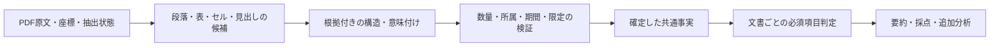

# 開発ガイド

## セットアップと確認

Node.js 20以上を使用します。依存関係とコマンドは [package.json](../package.json) を正本とします。

```bash
npm install
npm run dev         # 変更を監視してビルド
npm run build       # 配布用ビルド
npm run type-check
npm run lint
npm test
```

ビルド後、Chrome の `chrome://extensions/` でデベロッパーモードを有効にし、`dist/` を「パッケージ化されていない拡張機能を読み込む」から選択します。拡張機能のコードを変更した後は、必要に応じて拡張機能と TDnet のページを再読み込みしてください。

## テスト戦略

テストは利用者に起きる誤りと責務の境界を証明する。件数・ファイル数・カバレッジ率を増減の目標にしない。PR番号や修正履歴ごとに反例を積み上げず、次の担当へ集約する。

| 証明する責務                    | 担当テスト                                                                  | 追加・維持の基準                                                                              |
| ------------------------------- | --------------------------------------------------------------------------- | --------------------------------------------------------------------------------------------- |
| 数量・述語・指標・単位の文法    | `quantity`、`assertion-semantics`、`metric-semantics`、`numeric-evidence`   | 異なる構文分岐と受理/拒否の境界。語尾・表記の違いはここで確認する                             |
| 候補の属性解決・契約・生成/修復 | `fact-candidates`、`fact-summary`                                           | 候補→確定の接続、契約違反、初回成功/差分・全体修復/最終失敗/容量。表記ごとの修復を複製しない  |
| 意味・局所属性と必須判定の区別  | `fact-review-regression`、`fact-reporting-regression`                       | 原因ごとの正負対と候補/保存の一致。必須項目・修復先・診断所有者の別経路は残す                 |
| 実PDFの意味と利用経路           | `fact-candidates` の6資料、`ir-semantic-regression`、`fact-summary-release` | 人手で原文を確認した固定事実。6資料の一括確定/保存は1箇所、表示・採点・改変拒否は必要な代表例 |
| 設定・保存・通信・競合・表示    | Background、`useSummarize`、HTML・採点・権限の既存テスト                    | 最新要求の成功/失敗/遅い抽出、設定変更、改変保存、後続失敗時の要約保持、安全な表示を維持      |

追加前に「破れる不変条件・失敗する入力・対になる正常入力・担当テスト」を短く記す。既存例と同じ原因なら、まず置換・統合を検討する。単なる語彙追加は新しい文法分岐を証明するときだけ部品へ追加し、同じケースを生成・修復・表示・保存の各層へ総当たりで追加しない。一方、異なる責務で判定が食い違った反例は、その接続を証明する結合テストを残す。

独立した要因（会社名欄×区切り、単位注記×配置など）は各分岐と代表的な組合せで確認する。相互作用に根拠がある場合だけ組合せを増やす。版更新のたびに旧キャッシュのケースを追加せず、最古の版・直前版の拒否と現行版の復元を確認する。複数の独立条件を1つのループへ詰めて件数だけ減らさない。

fixtureは原文/座標を共通化し、期待する主体・期間・状態等は人が明示する。製品判定から期待値を生成しない。既存の評価用旧経路のテストも、利用経路が廃止されるまでは残す。未知形式・OCR・多主張の分解等は既存の未確認事項であり、整理に便乗して対応範囲や正解を増やさない。

変更中は担当ファイルだけ実行し、最終差分で `npm test`・type-check・lint・buildを各1回成功させる。Vitestの並列上限はローカル/Release workflow共通で2。成功後は新しい変更・失敗・疑問のある範囲だけ再検証する。実PDFの再抽出、保存応答の再生、画面、実LLMの選択条件は[評価ガイド](../evaluation/README.md#検証の選択と停止条件)に従う。過去の実行記録は履歴として保持し、毎回の全件再実行指示にはしない。

## リリース

[Release workflow](../.github/workflows/release.yml) は、`main` へマージされたPRの `release:major`、`release:minor`、`release:patch` のいずれか1つを読み、直前のリリースタグからバージョンを計算します。ラベルなしでは公開せず、複数のリリースラベルがある場合はエラーにします。マージ前にラベルを設定してください。

1. レビューと必要な検証を完了し、PR本文を利用者向けに整理します。PR本文はリリース説明にも掲載されます。
2. リリースラベルを付けてマージします。Actionsが依存関係を導入し、バージョン更新、型チェック、Lint、テスト、ビルド、ZIP作成を行います。
3. 検証成功後、`package.json` と `package-lock.json` を同じコミットに保存し、そのコミットとタグを一括でpushします。途中で `main` が進んだ場合は強制pushせず停止します。
4. GitHub ReleasesにタグとZIPを公開します。Actionsの成功、タグのコミット、ZIP内のManifestのバージョンを確認します。Chrome Web Storeへの公開は行いません。
5. ZIPを既存の読み込み先フォルダへ差し替え、拡張機能とTDnetページを再読み込みして確認します。設定保持、要約の先行表示、スコアON時の権限許可と採点、スコアOFF時の追加分析、採点失敗時の要約保持を確認してください。

失敗時は、まずActionsログとリモートのブランチ・タグ・Releaseの有無を確認します。タグ作成後に公開だけが失敗した場合は、既存タグのコミットからZIPを再生成してそのタグのReleaseを完成させます。タグを移動したり、再実行のためにバージョンを重ねて更新したりしません。

## 主な構成

| 場所                         | 役割                                         |
| ---------------------------- | -------------------------------------------- |
| `src/content/`               | TDnet の一覧へのボタン・要約表示の挿入       |
| `src/background/`            | PDF の取得、設定・キャッシュ、LLM 呼び出し   |
| `src/offscreen/`             | PDF.js によるテキスト抽出                    |
| `src/lib/`                   | 文書分類、プロンプト、出力検証、評価ロジック |
| `src/options/`, `src/popup/` | 設定画面と有効・無効の切り替え               |
| `manifest.config.ts`         | 権限と拡張機能のエントリーポイント           |

Content Script は TDnet の iframe 内を操作します。ページ側の CSS に影響しないよう、挿入する UI はインラインスタイルを使います。PDF.js は Service Worker から直接実行せず、Offscreen Document で動かします。

API の設定は拡張機能の設定画面から行います。実 PDF を使うローカル評価の手順とデータの扱いは [評価ガイド](../evaluation/README.md) を参照してください。

## 事実要約・採点・追加分析

通常の「要約」は、PDF.jsで抽出したテキストから構造化事実を生成し、本文の連続引用または表の根拠セルIDから、数値、単位、対象期間、物理ページ、行列の対応を検証して表示します。検証できない事実は確定事実として表示せず、必須事実を確認できなければエラーにします。投資判断や星評価は要約に含めません。PDFファイルの直接入力は既定で使用しません。

要約の表示後、実験的スコアがONなら採点を開始します。採点は要約で確認した事実を起点に、元PDFと必要な過去資料を照合します。採点に失敗しても要約は残ります。「追加分析」はボタンを押したときだけ生成し、採点設定とは独立しています。

| 場所                                | 役割                                         |
| ----------------------------------- | -------------------------------------------- |
| `src/lib/fact-summary.ts`           | 構造化事実の生成、原文照合、要約文の組み立て |
| `src/lib/additional-analysis.ts`    | 事実IDに基づく追加分析の生成と検証           |
| `src/background/index.ts`           | `summarize`、`score`、`analyze` の要求処理   |
| `src/content/hooks/useSummarize.ts` | 3段階の表示状態と個別キャッシュ              |

要約・採点・追加分析は別のキャッシュキーで保存します。設定画面の2パス切替は廃止しました。更新前の保存領域に `twoPassMode` が残っていれば、その廃止済みキーだけを削除して現在の設定を読み込みます。実PDFによる要約の確認手順と公開資料の期待値は[評価ガイド](../evaluation/README.md)を参照してください。

### 決算表の根拠参照

企業別・指標別の固定列番号は使用しません。現行の事実スキーマv4では、表の数値に `evidence` を必須とし、値セルと指標・期間・単位・文脈の根拠IDを照合します。分析指紋はv32です。旧スキーマは受け入れず、旧条件のキャッシュは再利用しません。

| 層           | 実装と責務                                                                                                                                                               |
| ------------ | ------------------------------------------------------------------------------------------------------------------------------------------------------------------------ |
| 抽出         | `pdf-layout.ts` がPDF.jsの文字列・座標・大きさとページ内IDを保持。本文も同じPDF文字から作る。数値の後続語は別IDで保持し、円銭は数値表記の構文から結合する                |
| 意味付け     | LLMが `valueId`、`metricIds`、`periodIds`、`unitIds`、`contextIds` を選ぶ。列順や企業名による分岐は持たない                                                              |
| 表構造と検証 | `numeric-evidence.ts` が参照先の行、単位見出しの列領域、指標見出しの適用範囲を確認。指標が行にある表も扱う。金額と増減率は別セルとし、両者にまたがる指標見出しを認識する |
| 確定         | 値・符号、指標の全見出し、期間、単位、実績／予想区分を照合し、参照元から引用を組み立てる。空欄・欠損記号はゼロにしない。別セクションの見出しや曖昧な列は未確認にする     |
| 利用         | 要約・採点・追加分析は確定事実v4を参照する。採点候補は事実IDだけを選び、値と属性は共通事実から作る。元PDF・過去PDFも同じ事実検証を通す                                   |

説明文は `evidence.kind: prose` と段落ID・段落全体の引用を必須とします。数量の直接対応と出来事の全文保持は別に検証します。指標・数値・単位の直接対応を検証し、表の失敗を固定列推測や単位換算で補う経路は持ちません。確認できない必須事実は従来どおり要約エラーにします。`column` は現行形式ではnullのみです。

本文の指標と数量の間は、助詞・句読点だけを同じ行の最大6文字まで認めます。「について」「に関して」「に対して」「において」「として」は語単位で扱い、「については」などの組合せも照合します。任意のひらがなや否定・概数表現は認めません。照合した行番号も共通検証器から返し、要約で対象行の期間・実績／予想区分を検証します。他の指標・数量・文を跨ぐ対応は採用しません。

`quantity.ts` は数値と原文の単位候補を分離します。文字種だけで単位の意味を確定せず、通貨・株式だけの単位リストも持ちません。PDF抽出では、数値の直後にある「店舗」「合計」などの語を結合せず別IDで保持します。要約・採点の共通検証器は、値と一体の単位、列単位、値に隣接する別IDの単位を原文の文字列と位置で照合します。値セル内に単位が含まれる場合は、単位の参照IDに値セル自身を必須とし、列見出しによる代用は認めません。120百と万円のように値セル内の単位も分かれている場合は、値セルを含む全断片のIDをunitIdsで参照し、値セル内の単位と右隣の断片を原文順に合わせて照合します。隣接単位は同じ行・右側に限り、間隔は文字高の0.6倍までとし、間に別セルがある参照は拒否します。参照済み単位の直後に、複合単位として読める未参照セルが残る場合も未確認にします。後続セルが「万円※」などの注記を含む場合も、接頭部分が単位候補として読めれば同じ条件で拒否します。セル全体が「注＋数字＋任意の末尾区切り」の参照構文（例: `注1`、`注12`、`注1）`、`注1.`）に一致する場合は、独立した注記参照として単位の続きから除外します。末尾区切りはUnicodeの閉じ括弧・閉じ引用符と句点（.、。）の合計2文字までとし、%・/・·などの単位記号や数字・文字を含めません。単位を含む「万円注1」や、番号のない曖昧な「注」にはこの分類を適用しません。注記を削除して単位を採用する処理は行いません。続きを自動的に補ったり、指標見出しと推測して無視したりしません。円銭だけは数値表記の構文から結合します。セルIDの変更を旧結果へ適用しないため、分析指紋を更新しています。

数量が1つだけの表は、指標が数量と同じ行にある場合に限り、数量セルの幅と文字高から列の領域を限定します。列単位と期間見出しの中央がその領域に入ることを確認し、曖昧な配置は採用しません。採点の累計・単独区分は、表の根拠参照を検証した後で `periodIds` と `contextIds` の文字から確認します。期間名に「累計」がなくても、参照した見出しに記載があれば照合できます。表を空の本文引用やページ内の未参照文字で補う処理は持ちません。

汎用性の検証では、固定順の合成テキストを座標付きの実PDFデータへ置き換えました。5社の6ページで、報告対象の11項目、日本基準／IFRS、赤字と欠損値、配当の決定額・直近予想を確認します。列の並び替え・追加、見出しの改行、空欄、指標と期間の行列入れ替え、同額の別指標、前年・当年、通常予想・修正後予想の誤採用もテストします。取得元と再評価コマンドは[評価ガイド](../evaluation/README.md)を参照してください。

位置情報だけで全形式を確定できるわけではありません。回転文字、数量と見出しの所属を一意に決められない配置、未対応の複雑な結合セルは表の根拠として採用しません。実PDFの位置情報をLLMへ渡すため、今回の対象ページでは入力文字数が本文のみの約5～6倍でした。固定候補の回帰と実LLM評価は別です。実装後の利用量・時間・失敗・拡張経路は、末尾の実行記録と評価ガイドに記録します。

### 汎用IR対応の調査と設計案（2026-09-30の開始前調査）

起点は[BlueMemeの2026年3月期決算短信](https://www.release.tdnet.info/inbs/140120260930543649.pdf)。正しい根拠を選んでも通期純利益予想が拒否され、小数の一部を正しい値として受理する。追加調査では、符号・期間・範囲・限定条件・否定の欠落も再現した。文字のエスケープや個別表記の許可を増やすのではなく、原文の構造と意味を保持する共通の事実表現を設計する。

#### 確認した根拠

- v0.7.1のタグは `c2c5fd6776ef6e4e5b4aa7a482f375507d82f26a`、比較したv0.7.0は `ca7eeb79305cdbd9503b053d9db45b38ee1978a4`。調査開始時のローカルHEADは `2bd805b70c93c05ef25ade9ed4c48a7b7d470cb9` で未コミット変更あり。配布版のソースを `/tmp/tdnet-v0.7.1` に取得し、`pdf-layout.ts`、`quantity.ts`、`numeric-evidence.ts`、`fact-summary.ts`、`score-extraction.ts` が作業ツリーと一致することを確認した。依存ロックはv0.7.0とv0.7.1でルートの版番号以外に差がない。
- Node.jsの同じ実行環境・PDF・正しい事実を用い、各版の現行スキーマで検証した。v0.7.0は純利益予想−400百万円を受理、v0.7.1は拒否。この検証経路での分類は `introducedByChange`。スキーマv2の引用とv3のセルIDをそれぞれ使用する検証器の比較であり、実LLMを含む要約成功率全体の比較ではない。
- 物理p.1の純利益の根拠は値 `p1s283`、指標 `p1s255,p1s261`、期間 `p1s272,p1s273`、単位 `p1s269`、文脈 `p1s253`。これで「指標見出しの一部が未参照」が発生する。隣のEPS見出しの「１」(`p1s256`) を指標参照に追加すると「指標名」で失敗する。この「１」だけを診断用のページコピーから取り除くと元の正しい参照が通る。文字の除去は原因の切り分けであり、実装案ではない。利用者の実際のLLM応答は未取得で、再生成時にどのIDを選んだかは未確認。
- `numeric-evidence.ts` は単位文字の中央から列範囲を作り、金額と増減率の範囲を合わせる。その範囲の右端が隣のEPS見出しの「１」まで含むため、文字断片単位の未参照検査が別指標を欠落と判定する。必要なのは見出しブロックの所属の確認であり、数字だけの断片を一律に無視する処理ではない。
- 同じPDFの営業利益率1.4％は `p1s118="1"` と `p1s119=".4"` に分かれる。抽出時、途中の `1.` が完成した数量として解析できず結合されない。正しい1.4は「値・符号」で拒否される一方、1を指定すると表照合を通過する。実際のモデルが1を出力した証拠はないが、検証器が誤った値を受理する経路は再現した。
- 全18ページの本文18,713文字に対し、位置情報込みの入力は88,795文字（約4.7倍）。文字数の増加だけでモデル精度低下を断定しない。リリース時のブラウザー検証はAPI応答を固定しており、実LLMの精度は未評価だった。

一時的な再現スクリプトは `/tmp/tdnet-543649-diagnosis.mjs`、結果は `/tmp/tdnet-543649-diagnosis.json`。リポジトリのルートで `node --import tsx /tmp/tdnet-543649-diagnosis.mjs` を実行し、配布版ソースと公開PDFから上記を再現した。環境ファイル・APIは使わず、製品コードは変更していない。`/tmp`のファイルは恒久的な回帰fixtureではない。

#### 追加調査で再現した抜け漏れ

本番の `parseFactSummary`、`verifyTableEvidence`、`verifyProseEvidence`、`validateScoreInput` を呼ぶ合成入力14条件で確認した。各条件の期待と実際は `/tmp/tdnet-ir-design-probes.json`、再現コマンドはリポジトリルートから `node --import tsx /tmp/tdnet-ir-design-probes.mjs`。正常な入力の誤拒否と、不正な対応の誤受理を区別する。実モデルがこれらの入力を生成する頻度を測ったものではない。

| 優先度 | 共通原因                                     | 再現した結果                                                                                                                       | 必要な不変条件                                                                                          |
| ------ | -------------------------------------------- | ---------------------------------------------------------------------------------------------------------------------------------- | ------------------------------------------------------------------------------------------------------- |
| P0     | 数量の全断片を参照しない                     | 分離した「△」を落とした正の値を受理。`1,2` を12と解析。BlueMemeでは小数部分を落とした値も受理                                      | 符号・桁・小数・桁区切りの構文と全断片を確認し、一部だけの参照を拒否                                    |
| P0     | 期間・区分を局所の根拠に結び付けない         | Q1累計の値を年度だけで表し、採点でもfullYearとして受理。文脈の「予想」を落とし実績として受理。月次本文の7月値を8月と表示しても受理 | 表／段落に適用する期間・区分を一つの対応として確定し、四半期・月・累計・単独を省略して意味を変えない    |
| P0     | 限定・否定を事実表現に保持しない             | 「配当増額を決定していません」から「配当増額を決定」だけを抜いて表示可能                                                           | 主体、述語、否定、条件、予定・決定・実施、数量の上限・概算・範囲を保持                                  |
| P0     | 会計基準・範囲が資料全体の文字存在だけで通る | 日本基準・連結の表に、別の箇所のIFRS・非連結を割り当てても採点入力を受理                                                           | 基準・連結／個別・会社／セグメントを対象の値に適用する見出しへ結び付ける                                |
| P1     | 必須項目が部分一致で、報告対象の軸を持たない | 営業利益率とEPSで営業利益・純利益を代用可能。前年だけの実績で必須判定を通過。正しい「純損失」は不足と判定                          | 指標の意味、報告対象期間、主体・範囲を揃えた充足判定。利益／損失の表記を扱い、金額・率・1株当たりを区別 |
| P1     | 行見出しと列見出しで完全性の検査が違う       | 複数行の行見出しから「調整後」を落として営業利益として受理                                                                         | 両軸とも親見出しを含む指標の経路を保持し、限定の省略を拒否                                              |
| P1     | 決算期・同一行・同一ページを全形式へ要求     | 正しい年月だけの月次表、段落内で指標が改行する本文を拒否                                                                           | 決算期、暦月、基準日、対象期間を明示的に扱い、表示上の改行と段落・セルの境界を区別                      |

公開PDFを追加で3件読み、実際の形式も確認した。手作業の候補応答による検証であり、実LLMでの成功／失敗ではない。

- [丸八倉庫の自己株取得](https://www2.jpx.co.jp/disc/93130/140120260709590524.pdf) p.1: 「取得する株式の総数200,000株（上限）」を本文引用として渡し、取得予定日の2026年7月15日・actualを指定すると、未確認事項なしで「200000株、実績」と表示する。上限と取得予定・実施結果の違いを失う。結果は `/tmp/tdnet-ir-buyback-diagnosis.json`。
- [うるるの月次IR](https://www2.jpx.co.jp/disc/39790/140120260714592844.pdf) p.4: 2026年6月のMRR338,214千円を、値・MRR・6月行・単位・直近見出しの原文IDで選んでも「対象年度・決算月」で拒否する。暦月と2027年3月期の所属を分離できない。p.5には同じ系列のグラフと速報値の注記もある。結果は `/tmp/tdnet-ir-monthly-diagnosis.json`。
- [IZUMIの子会社化](https://www2.jpx.co.jp/disc/551A0/140120260709590424.pdf): 対象会社と2023～2025年7月期の列見出しはp.1、売上・利益の続きはp.2。現スキーマの同一ページ参照では、その続きの行と期間・対象会社を結び付けられない。また取得価額は非開示、株式譲渡実行日は予定であり、数値の欠落・実施済みと混同しない表現が必要。ここは抽出結果とスキーマから確認した制約で、LLM応答を用いた再現は行っていない。

抽出の失敗状態にもコード上の不足がある。Offscreenは失敗したページを非空のエラー文字列で置き換え、fullモードではそのページも `extractedPages` に数える。`ExtractedPage` に失敗・画像のみ・読取不能を表す状態がなく、全ページ失敗でも非空判定を通り得る。これには故障注入をまだ行っていない。抽出の成功と、重要情報の確認完了を別の状態として扱う必要がある。

#### 共通設計の責務



| 層         | 決めること                                                             | 持たせない判断                                                  |
| ---------- | ---------------------------------------------------------------------- | --------------------------------------------------------------- |
| 原文取得   | 元の文字アイテム・変換行列・物理ページ・範囲・資料IDと抽出状態を保存   | 後続の日本語を単位と決める、失敗を本文で代用する                |
| 構造候補   | 文字列のまとまり、段落、表、セル、行列、結合見出し、継続表の関係を保持 | 単位文字の中央だけで列を確定する、近いものを必ず同じセルにする  |
| 意味付け   | LLMが候補の構造関係・指標・主体・期間・条件を原文参照付きで提案        | 未知の指標や欠損を既知の指標・ゼロ・別の入力形式へ読み替える    |
| 検証・確定 | コードが参照存在、構造整合、数量の完全性、適用範囲、限定の保持を確認   | 単なる文字存在・IDの有効性だけで意味も正しいと断定する          |
| 利用       | 同じ事実から必須判定、表示、比較・採点を行う                           | 採点がscopeや期間を独自に付け直す、表示が否定・予定・上限を削る |

構造は座標から一度に確定する前提を置かず、複数行の見出し、罫線の有無、表の両軸、値と単位の配置から関係候補を作る。LLMの構造提案も検証対象とし、原文の断片へ遡れることを必須とする。曖昧な候補は推測で確定しない。所属を確認できた見出しブロックの全断片で完全性を検査するため、数値で始まる指標の見出しも保持できる。回転文字や図表の値は、現行の水平表へ黙って当てはめず、対応可否を記録する。画像入力・OCRの導入は別途評価する機能であり、今回の調査で有効化しない。

共通事実には、以下を独立した属性として持たせる。LLMが自由文字列で指定しただけでは確定せず、それぞれの原文参照と適用範囲を照合する。

- 指標の原文名と意味上の区分。金額／割合／1株当たり、調整前／調整後、利益／損失を区別し、企業固有KPIも原文名を保持する。
- 発行会社、数値の対象会社・セグメント、連結／個別、会計基準。M&Aの対象会社を発行会社の実績と混ぜない。
- 対象期間の開始・終了、暦月、決算年度・決算月、累計／単独、基準日。対象期間と開示日・取締役会日・実行予定日は別属性とする。
- 完全な数値表記と単位、正負、金額／率、上限・下限・範囲・概算・速報値、非開示・未定・該当なし。数量の構文を確認してから正規化し、確定した換算規則を使う場合も原文量と導出量を別々に保持する。
- 実績／予想と修正前後、提案／決議／契約／実施の状態、否定・条件。予定を通常の業績予想へ一括分類せず、数量の上限とも別に保持する。
- 根拠の種別と所属する段落／表／セル、必要な限定語を含む参照群。継続表は各ページの参照を保ち、列構造・指標・対象範囲の継続を確認した場合だけ結ぶ。

本文は表示上の改行を含む段落内で数量と指標を照合する。イベントは主語・述語・否定・条件を含む原文の節／文を保持し、部分文字列の肯定表現だけを表示しない。どちらも、引用の存在確認と意味上の正しさの評価を区別する。一般的な意味理解を正規表現だけで保証する設計にはせず、限定を保った原文表示と実モデルの期待結果評価を併用する。

必須項目は「文書種別＋報告対象期間＋対象会社・範囲＋指標区分」で判定する。前年値・EPS・利益率を当年の利益額へ代用しない。非開示・未定など原文に明記された状態と、抽出・照合の失敗は別に記録する。曖昧な資料で必須項目が揃ったと扱わず、現在の必須事実不足時のエラー方針を維持する。

#### 実装順序と完了条件

1. **誤受理を先に固定する。** 上記の診断と実PDF文字アイテムを恒久fixtureへ移し、符号・小数・否定・上限・予定・期間・範囲を落とした候補を拒否する条件を決める。同時に、正しい値・対応・原文表示の期待結果も記録する。今回はまだ一時的な診断スクリプトであり、恒久テストは未追加。
2. **原文・構造・共通事実の契約を定義する。** 既存v3へ曖昧な任意項目を足すのではなく、対応する根拠種別と必須属性を新しいスキーマで定める。旧スキーマの黙った変換やキャッシュ再利用は行わない。抽出・要約・採点・表示の利用経路を同じ契約へ移す。
3. **数値の組立と見出し所属を修正する。** 符号・桁・小数点の途中状態を含む数量列を組み立て、未参照の続きによる桁落ち・符号落ちを拒否する。所属を検証したブロックから指標の全経路を確認する。BlueMemeの−400百万円、1.4％、−119.53円を照合し、EPSとの取り違えと限定語の省略を拒否する。既存のEBITDA・IFRS・配当表も保持する。
4. **形式横断の意味検証を統合する。** 表と本文で期間・範囲・数量の限定・実績／予定の意味判定を共通化する。月次、複数行の行見出し、段落内の改行、確認できる継続表へ拡張する。要約の確定事実を採点がIDで参照できるようにし、対象範囲を再推測しない。
5. **診断・修復・表示を更新する。** 診断に失敗段階、理由コード、対象の事実・ブロックID、原文、不足／衝突した参照を残す。抽出・構造の失敗とLLMの選択ミスを分け、修復は失敗候補と必要な原文範囲を対象とする。確認済み事実を維持し、応答内のf1等の番号だけに依存した統合・重複判定を見直す。LLMへ渡す量を減らす際も見出し・単位・限定・対象範囲を落とさない。
6. **実モデルと拡張の実経路で完了を判定する。** 以下の評価軸を、未対応・誤拒否・誤受理に分けて記録する。API応答を固定したテストだけでリリースを判定しない。

評価資料は既存5社6ページとBlueMemeに、今回読んだ月次・自己株取得・M&Aを加える。設計の検証軸は、行列の入替え・追加、複数段見出し・結合セル、罫線あり／なし、本文／箇条書き、同額の別指標、単位の位置と桁、符号・小数・欠損・注記、年度／暦月／日付、累計／単独、連結／個別・対象会社、上限／概算／予定／否定、継続表とページ失敗。単にPDF件数を増やすのではなく、各軸に正しい採用例と誤対応の拒否例を置く。文字アイテムの分割・順序、フォント・倍率、空白・改行の変化でも意味が保たれることを確認する。

固定した原文・設定・モデルで初回成功、修復成功、最終失敗、必須項目の欠落、誤値と限定の欠落、入力トークン・時間を記録する。原文の真値はモデル応答から作らず、実PDFを人が確認した期待値と根拠を使う。今回の利用者向け完了条件は、BlueMemeの当年実績・通期予想・配当と純損失の背景（調査関連費用394百万円、概算額）、自己株取得の上限と予定、月次の暦月と速報値を正しく区別して伝えること。部品の検証と文章要約の完成を分け、配布前には実際の拡張で確認する。

次の操作は恒久fixtureと共通事実の契約を用意し、誤受理を固定してから数量・構造・意味判定を順に統合すること。今回の追加調査でも製品実装・実LLM評価・リリースは行っていない。抽出失敗の故障注入と、画像・グラフを含む形式の実測は未達条件として残る。

#### 現行コードから再判断した実装計画（2026-09-30、承認済み）

目的は、正しい事実を採用し、意味を変えた候補を拒否したうえで、利用者に原文の期間・対象・限定を保った要約を届けること。上記の調査案を材料として、抽出から拡張の表示・採点までを読み直した。計画提示時にはこの文書と評価ガイドだけを変更し、製品実装へ進まず停止した。その後、利用者の「OK」により、実装・検証・コミットが承認された。以下の計画と後述の実装記録を区別する。

**基準となる状態と変更の扱い**

- 開始HEADは `2bd805b70c93c05ef25ade9ed4c48a7b7d470cb9`、元ブランチは `feat/separate-fact-summary-analysis`。専用ブランチ `feat/ir-semantic-contract` を作成した。
- 実装・回帰比較の基準は、このHEADに開始時の未コミット差分（追跡済み25ファイル、未追跡9ファイル）を含めた作業ツリー。HEAD単体や配布版へ戻して実装しない。開始時の追跡差分は `/tmp/tdnet-ir-plan-start.patch`、未追跡9ファイルは `/tmp/tdnet-ir-plan-start-untracked.tar` に保存した。前者のSHA-256は `1b51489ac81c12068762d857159595e045034e76c86c726f11603affede49840`、後者は `f0b6f146ebd3d4dce5fb28a6e81f4a51afa57805384f334b353bc851de4cb57e`。これらは一時的な保全資料で、評価fixtureではない。
- 配布版v0.7.1のSHAは上記の調査記録による。ローカルGitにはそのコミットオブジェクトがなく、今回タグをcheckoutして検証したとは扱わない。既存の `/tmp/tdnet-v0.7.1` と内容を比較し、主要な抽出・検証・採点・表示・キャッシュ経路と位置情報fixture・関連テストの一致を再確認した。一方、作業ツリーのpackage版番号は0.6.0、配布版は0.7.1で、package/lock・開発資料などに差がある。全ツリーの同一性を主張しない。
- 開始時に関連10テストファイルの222件が成功した。対象は `fact-summary`、`fact-summary-release`、`numeric-evidence`、`score-extraction`、`quantity`、`scoring`、`page-text`、background、`useSummarize`、`summaryHtmlBuilder`。これは既存動作の基準で、既知の誤受理がないという証拠ではない。
- 確認後は、開始時の既存変更を「着手前の変更」と明記した基準コミットとして独立して記録し、計画追記と新規実装を別の差分・コミットで管理する。開始時パッチと未追跡保全資料から対象を照合し、後から入った利用者の変更を混ぜない。reset・clean・既存変更の上書きは行わず、pushしない。

**実経路と原因**

現行経路は `handleSummarize` → PDF取得 → Offscreenの `extractPageLayout` → smart/fullのページ選択 → `generateVerifiedFactSummary` → `parseFactSummary` → `verifyTableEvidence` / `verifyProseEvidence` → `verifyCoverage` → `renderFacts` → Content ScriptのHTML・キャッシュ。採点と追加分析は別要求でPDFを全文再抽出し、要約事実を再検証する。採点はさらに独立したLLM応答を `validateScoreInput` と `restrictToFacts` に渡す。

| コード上の前提                                                                              | 原因・同じ前提による抜け漏れ                                                                                                             | 変更後の不変条件                                                                               |
| ------------------------------------------------------------------------------------------- | ---------------------------------------------------------------------------------------------------------------------------------------- | ---------------------------------------------------------------------------------------------- |
| `pdf-layout.ts:17` が文字を結合し、`quantity.ts` が空白・カンマを除去して完成値を判定       | 原アイテムとの対応がなく、途中の `1.` が数量として成立せず1と.4に分離。`1,2` も12に変わる                                                | 原アイテムを保存し、数量の構文と全断片を確認してから正規化する                                 |
| `numeric-evidence.ts` の `bandFor`、`metricBand`、未参照見出し検査                          | 単位中央間の境界と金額・率の合算範囲が隣のEPSの「１」へ及ぶ。行指標では同じ完全性検査をしない                                            | 表・セル・見出しブロックの所属と親見出しの経路を確認し、両軸の限定を保持する                   |
| `TableEvidence.valueId` だけで値を比較                                                      | 隣接する符号・小数・桁の未参照を拒否できない                                                                                             | 数量列の全参照を必須とし、欠損や途中状態を値としない                                           |
| `verifyPeriodAndKind`、本文の `periodVerified` / `earningsRowVerified`                      | 決算期・同じ行・近傍見出しに依存。文脈のQ1/予想を落とせる一方、年月だけの月次や改行本文を拒否                                            | 対象期間と状態を局所ブロックの適用関係として確定し、暦月・年度・累計・単独・日付役割を分離する |
| `verifyCoverage` がlabelの部分一致とactual/forecastで判定                                   | 率・EPS・前年で当年の利益額を代用でき、純損失が不足扱いになる。必須性をページ内の単語存在から推定する                                    | 報告対象期間・主体/範囲・指標の意味と量の種類・状態が一致した事実だけで充足する                |
| eventのstatementがquoteの部分文字列、`renderFacts` が数値以外の限定を持たない               | 否定の末尾を切った肯定文、上限の取得枠を実績、概算費用を確定額として表示可能                                                             | 主語・述語・否定・条件を含む文/節を保持し、数量の限定と実施状態を表示する                      |
| `score-extraction.ts:323` がbasis/scopeを資料全体で探し、採点だけのperiodKind等を受け入れる | 別セクションのIFRS・非連結を借用可能。要約はscope/basisを持たず、`restrictToFacts` でも照合できない。通常forecastは採点のValueKindにない | 元資料も比較資料も共通の事実検証を通し、採点は確定した属性をIDで参照する                       |
| Offscreenがページ失敗を本文文字列へ置換し、smart品質ゲートが単語出現で合格                  | 失敗ページが抽出済みページ数へ入り、限定や背景が未選択でも要約の完了と区別できない                                                       | 抽出状態と選択状態を持ち、根拠閉包・必須対象を欠く入力で完全性を主張しない                     |

開始時の本番検証器へ既存の公開PDF抽出結果を渡し、BlueMemeの−400の誤拒否、1.4の誤拒否、1の誤受理を再確認した。PDFのSHA-256は `2d91317dc77bcc30397b5fed3ea0d7168be8ccb91d05535ce42501f530a50dea`。`/tmp/tdnet-ir-design-probes.mjs` も現行コードで実行し、上記14条件の結果を再確認した。いずれも固定候補の診断で、実モデルの応答や恒久回帰テストではない。BlueMemeの物理p.1・p.5、月次のp.4・p.5はローカルの実PDFを画像化して期待内容を確認した。

**責務とデータ契約**

事実スキーマはv4へ更新する。v3に任意属性を継ぎ足して欠けた意味を既定値で補う方式は採らない。次の契約を、抽出・LLM候補・検証・保存・利用の各境界で厳密に検査する。

| 層         | 入出力と責務                                                                                                                                                                                                                                                                                                         |
| ---------- | -------------------------------------------------------------------------------------------------------------------------------------------------------------------------------------------------------------------------------------------------------------------------------------------------------------------- |
| 原文       | `SourceDocument` はPDFの内容ハッシュ、URL、発行会社の原文参照、物理ページ一覧を持つ。ページは成功・空/文字なし・失敗と、選択/未選択を区別。原文字アイテムにID、文字列、transform、幅・高さ・方向・改行情報を保存し、回転文字も消さない。整形本文は派生表示とし、事実検証の正本にしない                               |
| 構造候補   | `DocumentStructure` は段落/箇条書き/表/セル/見出し/注記のID、範囲、原アイテム参照、表の両軸、親子/結合見出し、適用先を持つ。文字座標・余白・反復する行列から候補を作り、原文字から遡れることを必須とする。必要な罫線情報はPDF描画情報から取得する。座標の近さや単位中央だけで確定しない。LLMの構造選択も整合検査する |
| 候補事実   | LLMは構造候補と根拠群を選び、指標・対象・期間・数量・状態を提案する。通常1回、失敗時の修復は最大1回を維持。数値/出来事/明記された非開示等の状態を判別できるunionとし、不明属性は理由付き未確認として表す。nullをactual、連結、通期などへ読み替えない                                                                 |
| 検証・確定 | 共通検証器が根拠存在・構造所属・数量の完全性・意味属性の根拠と競合を確認し、`VerifiedFact` と段階/理由コード付き診断を返す。数量は全断片の原表記と正確な十進表現を保存し、桁区切り・小数・符号・円銭を構文として扱う。JS numberへ先に丸めず、採点で数値化する場合も扱える精度・範囲を検査する                        |
| 必須判定   | 原文の報告対象を要約候補とは別に確認した `ReportingContext` と、確定事実を照合する。候補自身が当年・必須項目を決めて充足を自己証明することは認めない。原文の未定/非開示/該当なしは明示状態として、抽出失敗とは別に判定する                                                                                           |
| 利用       | 要約表示・比較/採点・追加分析が同じ確定事実を使う。利用側が期間・対象・限定を付け直さない。追加分析とスコア理由は推論であり、事実IDの存在だけで文章の正しさを保証した扱いにしない                                                                                                                                    |

`VerifiedFact` の属性と参照は次を独立して持つ。複数ページの根拠は資料ID・ページ・構造ID・原アイテムIDで識別する。

- `metric`: 原文名と見出しの全経路、金額/率/1株当たり/件数等の種類、標準指標区分、調整後・帰属先などの限定。未知KPIは原文名のまま保持し、既知の利益額の充足には使わない。
- `subject`: 発行会社と数値の対象会社を分離し、連結/個別・セグメント/事業・会計基準と各適用根拠を保持する。文書全体の見出しは対象ブロックへ適用すると確認できた場合だけ継承する。
- `period`: 対象の開始/終了、決算年度/決算月、暦月、累計/単独、基準日を別属性にする。開示日・決議日・契約日・実行予定日は役割付き日付で分離する。原文から一意に導ける月次の年などは導出元と規則を残す。
- `quantity`: 原表記、全数量断片、正確な値/範囲、単位、上限/下限/概算/速報の各限定と適用根拠。欠損記号や非開示をゼロにしない。正の「純損失400」と負の「純利益−400」は原表記を別々に残し、損益として比較する場合に限り符号の導出規則を記録する。
- `status`: 実績/通常予想/修正前後と、提案/決議/契約/実施予定/実施済み、否定、条件を別軸で持つ。上限と予定をactual/forecastに一括分類しない。出来事は主語と限定を含む完結した原文文/節を表示単位とする。
- `evidence` / `diagnostics`: 本文と表を識別し、原文範囲と構造所属、属性ごとの根拠、継続/注記の適用関係を保持。構造曖昧・参照不足・属性競合・不正値・抽出失敗を区別する。確定IDは資料と根拠/意味の同一性から作り、LLMが付けるf1等を修復前後の統合キーにしない。

量の正規化や段落の改行結合は、原表記を残す規定済み処理として行う。通貨/単位の推測、未知スキーマの変換、別根拠形式への救済は行わない。同じ指標/期間でも、百万円の切捨て値と千円の詳細値を黙って同値として統合しない。一般的な自然言語の意味をID・引用・正規表現だけで完全に証明できるとは扱わず、完結した原文の保持、検証可能な属性の制約、実モデルの期待結果評価を組み合わせる。限定の適用先や主体を解決できない候補は確定・採点に使わない。

**対応形式と停止境界**

今回の対応対象は、文字を取得できる水平の表・段落・箇条書き。決算（日本基準/IFRS、通期/四半期/中間、実績/予想、配当）、業績/配当修正、自己株取得の決議/予定/結果、月次の企業固有KPI、M&Aの対象会社情報・取引条件・日程・非開示を重点評価する。その他のIRも、同じ根拠契約に適合する数量・完結した出来事を扱うが、タイトル分類11種類の存在を全形式の対応保証にはしない。

複数段見出し・行列の入替え・セル内の複数断片・本文の表示改行・罫線あり/なしを扱う。結合セルと継続表/離れた注記は、列/指標/期間/対象の一致と適用関係が確認できたものを対象とする。M&Aのp.1→p.2の対象会社表、月次p.4→p.5の同じMRR系列と速報注記も検証例にする。隣接ページという理由だけで注記を資料全体へ適用しない。

画像だけのPDF、グラフの図形からの読み取り、回転表の数値化、所属を一意に確認できない複雑な結合、異なる系列の注記、暗黙の主体/否定/条件は未対応または曖昧として記録する。OCR・画像をモデルへ直接渡す機能はこの計画に含めない。文字として存在するグラフの数字も、系列との対応を確認できなければ値として採用しない。明記された範囲数量は上下限を保持して表示し、単一確定額への変換や採点への投入はしない。必須対象が未対応/曖昧/抽出失敗なら要約エラーにし、任意対象の未確認は理由を表示する。

smartは省略した根拠がないという保証を単語品質ゲートへ持たせない。構造候補を全ページから作り、選択する段落/表の見出し・単位・主体・注記・継続先を一緒に渡す。閉包を確認できなければ未確認/全文再要約の理由を返し、欠けた限定を補わない。自動で別保存先や別モデルへ切り替える救済は追加しない。

**変更するファイルと統合先**

| ファイル                                                                                                                                                                                          | 変更                                                                                                                                               |
| ------------------------------------------------------------------------------------------------------------------------------------------------------------------------------------------------- | -------------------------------------------------------------------------------------------------------------------------------------------------- |
| `src/lib/pdf-layout.ts`、`pdf-lines.ts`、`page-text.ts`、`src/offscreen/index.ts`、`src/types/summaryMetadata.ts`                                                                                 | 原文字・ページ状態・文書IDの契約、構造候補生成への入力、smart/fullとメッセージの厳密検査。失敗を本文へ混ぜない                                     |
| 新設 `src/lib/document-structure.ts`                                                                                                                                                              | 段落/表/セル/親見出し/注記/継続関係の候補と検証。原アイテムと派生構造のIDを分離                                                                    |
| `src/lib/quantity.ts`、`numeric-evidence.ts`、新設 `fact-contract.ts` / `fact-validation.ts` / `fact-coverage.ts`                                                                                 | v4の厳密な候補/確定型、数量全断片、本文/表共通の意味属性検証、報告対象を含む充足判定                                                               |
| `src/lib/fact-summary.ts`                                                                                                                                                                         | 構造と意味の候補生成、限定した修復、確定IDによる統合、共通事実からの表示。期間/区分の独立した再推測を廃止                                          |
| `src/lib/score-extraction.ts`、`scoring.ts`、`disclosure-search.ts`、`src/background/index.ts`                                                                                                    | 採点入力を共通事実IDの比較関係へ変更。元PDFの値の再抽出をやめ、比較PDFの追加事実も共通検証器を通す。検索候補の取得/発行会社/開示日前後の検査を維持 |
| `src/lib/additional-analysis.ts`、`src/content/hooks/useSummarize.ts`、`src/content/utils/summaryHtmlBuilder.ts`、`src/options/Options.tsx`、`src/lib/analysis-version.ts`                        | 追加分析への属性伝達、限定を保つ表示、キャッシュ契約/復元/削除、指紋更新。採点失敗時も要約を保持                                                   |
| 上記の関連テスト、`src/lib/fixtures/pdf-layout-corpus.json`、`evaluation/fixtures/fact-summary-cases.json`、`evaluation/scripts/run-fact-summary.ts` / `check-layout.ts`、`src/lib/llm-client.ts` | 正負の回帰、実PDF照合、実モデルの意味属性評価、利用量/試行/時間の観測。LLM応答は新契約として一斉更新し旧形式のfixture変換経路を残さない            |
| `docs/development.md`、`evaluation/README.md`、`CLAUDE.md`                                                                                                                                        | 契約・進捗・判断・検証コマンド/証拠・未達条件を既存正本に反映                                                                                      |

新モジュール名は責務を示す予定名であり、既存構成に合わせた通常の技術判断で整理する。旧2パスの評価経路は今回の製品経路へ戻さず、現行評価と区別する。

キャッシュは事実v4と分析指紋v28へ更新する。採点スキーマも版を付け、score cacheはV4、追加分析cacheはV2とする。summaryのV2外側の保存キーは指紋で分離できるため維持し、内部をv4で厳密検査する。内容ハッシュと全属性をresultIdへ含め、元PDFが変わったfollowupを拒否する。旧事実・旧採点・旧追加分析の暗黙変換/再利用はしない。既存キャッシュを一括削除せず、設定画面では旧データの版を確認して表示/削除できるようにする。不正な現行キャッシュは理由を表示し、別キーの旧結果を探して補わない。

**実装順序と回帰検証**

1. 開始時差分を区別して記録し、既存診断の期待と原文を恒久fixtureへ移す。BlueMeme、自己株取得、月次、M&Aの取得元・PDFハッシュ・物理ページ・原文字・人が確認した真値を保存する。現状の不具合が期待条件を満たさないことを示し、先に既存成功例と誤対応の拒否例を固定する。
2. 原文/構造/v4事実の契約と厳密な境界検証を実装し、数量列と見出し所属を統合する。−400、1.4、−119.53、分割した符号/桁/小数の全断片を採用し、一部参照を拒否する。EPSの隣接文字を除去する修正や固定列の分岐は入れない。
3. 本文/表の期間・主体・範囲・限定・状態と必須判定を統合する。月次の年度と暦月、純損失の意味、当年/前年、予定/実施、否定/条件、非開示/欠損を扱う。段落・継続表・注記の正しい採用と誤所属の拒否を一緒に確認する。
4. 生成/修復/表示、採点の事実ID参照、比較資料、追加分析、background通信、キャッシュ/設定画面を移す。新しい契約が利用者の入口から表示まで到達する結合テストを置く。事実IDの順序変更、重複、修復時の衝突も検証する。
5. 実PDFを本番と同じ抽出/検証に通し、既存5社6ページと追加資料を評価する。文字分割/順序、倍率/フォント、空白/改行、列追加/入替え、罫線/結合、同額異指標、年度/暦月/日付、累計/単独、主体/範囲、上限/概算/速報/予定/否定/条件を、正しい採用と誤対応の拒否で対にする。ページ抽出失敗・文字なし・smartの限定脱落も故障注入する。
6. `npm run type-check`、`npm run lint`、`npm test`、`npm run build`、位置情報再抽出、実PDF評価を行う。既知失敗の再診断は変更後に必要な範囲だけ実行し、成功済み条件を理由なく反復しない。
7. 現行の評価スクリプトで実モデルを評価し、ビルドした拡張の実経路を確認する。実モデルの失敗はプロンプト/構造/検証/必須性のどこに原因があるか記録して修正する。適切な単位でコミットし、最終的に成果・検証・未達・ブランチ・コミットを報告する。pushは明示指示まで行わない。

**利用者の結果で判定する完了条件**

| 対象          | 正しい表示と拒否条件                                                                                                                                                                                                                                                                                                                                                                                            |
| ------------- | --------------------------------------------------------------------------------------------------------------------------------------------------------------------------------------------------------------------------------------------------------------------------------------------------------------------------------------------------------------------------------------------------------------- |
| BlueMeme      | 2026年3月期連結の実績は売上3,298・営業利益47・親会社帰属純利益24百万円、2027年3月期通期予想は2,600・30・−400百万円。実績と予想、当年と前年、EPSと利益額を分離する。配当0、営業利益率1.4%、EPS予想−119.53円を原文の量/限定のまま扱う。物理p.5の調査関連費用394百万円（概算額）と損失予想の関係を伝え、p.18の翌連結会計年度の特別損失計上予定を実績としない。率1%・純利益+400・EPS代用・概算/予定の削除は拒否する |
| 丸八倉庫      | 200,000株と206,200,000円は取得の上限で、7月14日決議・7月15日買付予定。未実施の可能性を含む条件を保持する。取得済み実績や無条件の確定数量として表示/採点しない。発行済株式数の6月30日時点と実行日を混ぜない                                                                                                                                                                                                      |
| うるる月次    | NJSSの2026年6月MRR338,214千円と当期2027年3月期を分離する。前年比18.0%は別の率。前年の286,637千円と列を混ぜず、系列の継続を確認したp.5の速報/修正可能性も保持する。2027年6月や7月への割当、百万円のグラフ丸め値338への代用を拒否する                                                                                                                                                                             |
| M&A・既存資料 | 対象会社の実績を発行会社の業績と混ぜない。実行予定と決議/契約を区別し、非開示の価格を補わない。既存のEBITDA、IFRS帰属利益、赤字/欠損、配当決定額/直近予想の成功例を維持する                                                                                                                                                                                                                                     |

実LLM評価は、モデル応答から正解を作らず、実PDFを確認した意味属性/根拠と表示結果を評価する。初回成功・修復成功・最終失敗・必須欠落・誤受理・誤拒否・入力トークン/API利用量・時間を保存する。モデル名・設定・仕様版・PDF/原文ハッシュを固定し、最低限、上記3つの利用者向け重点資料と既存の決算/修正/提携を通す。実モデルの通常抽出と、固定した誤候補を使う拒否試験を区別する。

ブラウザーでは、ビルド済み拡張→TDnet一覧の要約ボタン→PDF取得→Offscreen→実API→表示を重点3資料で確認し、スコアON/OFF、比較可能な事実の採点/比較不能時の拒否、採点失敗後の要約保持/再試行、追加分析、非表示/再表示、キャッシュ、旧結果の非再利用を確認する。安定した結合試験のため一覧/APIを固定する試験も残すが、実サイト/実APIを通した証拠とは別記する。

計画時点の未達は、恒久回帰の追加、新契約の実装、抽出故障の検証、今回の実モデル評価、実サイト/実APIを通す拡張確認。実行時に設定不足やブラウザー制約等が生じた場合は原因と必要操作を明記し、固定応答の成功で未達を埋めない。自然言語全般や未対応の画像/グラフ形式の保証は完了条件に含めず、対応境界と残る限界を報告する。

### 過去資料の検索と取得

実験的スコアで元PDF内の比較値が不足する場合、API側のWeb検索を1回使い、JPX、EIR、IR Pocketの過去開示PDFを優先して探します。元資料の開示日と前年同期の表題を検索語に含め、同日以降の資料は採用しません。検索結果は候補発見に限り、採点根拠にはしません。API応答のモデル本文からだけ候補URLを読み、取得前にHTTPS、正確なホスト名、PDFパス、証券コードとの対応を検証します。取得後は発行会社、開示日の前後、数値、単位、対象期間、物理ページを原文と照合します。対応を確認できない共用ホストや候補は採点に使いません。

必須のホスト権限はTDnetと標準のLLM APIに限定します。実験的スコアをONで保存する場合は上記3サイトへの権限だけを要求します。カスタムAPIはその設定URLのホスト権限を別途要求します。任意のカスタムAPIホストに個別権限を求めるため、ManifestにはHTTPS全域の任意権限宣言を残しますが、採点では全域権限を要求しません。旧版で付与された全域権限は更新時に削除し、必要な権限を設定画面で保存し直してもらいます。権限がなければ過去資料を取得せず、画面に理由を示します。現行は採点キャッシュV4、追加分析キャッシュV2です。要約キャッシュの外側のV2キーは分析指紋v29で分離し、内部の事実v4を厳密に検査します。旧スキーマの結果は暗黙変換・再利用しません。

検索APIの失敗と、検索後も比較値を原文照合できない場合は採点エラーとして表示し、結果をキャッシュせず「採点を再試行」から再要求できます。要約は保持します。候補が見つからない場合も未検証の値は採用しません。

実PDFの回帰確認は[評価ガイド](../evaluation/README.md)の `npm run test:real-pdf -- --fetch` で18件を再取得して行います。JPX・IRホスティング先のURL取得、会社・期間・ページ照合、拒否されるURLも確認します。

決算短信の千円本文と百万円表を個別の正規表現で対応付ける経路、および特定の配当表を固定順で読む経路は削除しました。採点は上記の共通根拠検証を使います。過去資料の検索・発行会社・開示日・会計基準・事業範囲の検証は引き続き必要です。

## 汎用IR改善の実行記録（2026-10-01）

承認後、原文・構造候補・候補事実・確定事実・必須判定・表示/採点の実経路を変更した。基準は開始時の作業ツリーであり、配布版v0.7.1との差を含む。既存変更は `78dd320`、承認済み計画は `aa3436b` に分けて保存した。主要実装は `c1b01d4`、実モデルで見つかった参照・範囲の問題の修正は `e9d66fc`、計上予定の期間・財務範囲の修正は `931a696`、会社名の完全性と最終キャッシュ分離は `5f79440`。作業ブランチは `feat/ir-semantic-contract`。reset・clean・既存変更の破棄・pushは行っていない。

### 実装した契約と実経路

| 境界             | 実装と保持する内容                                                                                                                                                                                                                                                         |
| ---------------- | -------------------------------------------------------------------------------------------------------------------------------------------------------------------------------------------------------------------------------------------------------------------------- |
| PDF → 原文       | `pdf-layout.ts` / `document-structure.ts`。PDF.js原アイテムを `sourceItems` に保存し、文字・transform・方向・改行・幅・高さ・原IDを保持。派生spanは原IDを参照する。`ExtractedPage` のstatus=ok/empty/failedとselection=selected/omittedを分離する                          |
| 原文 → 構造候補  | 段落と表の行、数量の全断片、水平文字列のまとまりを構成する。分割符号・小数・桁区切りを保存し、EPS見出しの先頭数字を隣の数量の指標限定としない。表参照候補は行区分・列指標・単位・文脈のID群のみで、意味を確定しない                                                        |
| 複数ページの適用 | `document-links.ts`。ページ境界で完全な数量列・列の右端・年度見出し・会社概要が一致する継続表と、隣接する一意な系列の定義/注記を扱う。年度・会社・速報注記を、無関係な別ページから借りない                                                                                 |
| LLM → 候補       | `fact-summary.ts`。v4の全項目を要求し、候補のquantity/dateRoles/qualifiers/conditionsは明示null。コードが原文から導出するための契約であり、欠損した旧形式の補完ではない。重要事実を優先し、通常1回・修復最大1回。修復は不足/訂正分だけを返し、初回の確定済み事実を保持する |
| 候補 → 確定      | `fact-validation.ts` / `numeric-evidence.ts` / `quantity.ts`。数量の全断片・正確な十進値/範囲・単位・指標の全見出し・行列の所属・主体/範囲/基準・期間区分・予定/実績・否定・条件を照合する。本文出来事は段落全体の引用とstatementが必要。参照の存在だけで採用しない        |
| 確定 → 必須判定  | `fact-coverage.ts`。報告期・会社・報告範囲・指標の種類を原文と照合する。率/EPS/前年/別会社を利益額の代用にしない。業績/配当修正の前後、月次KPIと対象月、自己株取得の上限/予定/条件、損失背景と計上予定も確認する                                                           |
| 確定 → 要約/採点 | `renderFacts` が正確な数量原表記と確定属性、完結した原文を表示する。`score-extraction.ts` はv4事実IDで比較対象を選び、`toValue` が同じ値・意味属性を渡す。利用側で範囲・基準・期間を再解釈せず、会計基準nullを「非財務」へ変換しない。過去PDFも共通検証器を通す            |
| 確定 → 追加分析  | 追加分析v2の各見方に確定事実IDを要求する。根拠不足は「判断不能」。文章の推論の正しさはID存在検査だけでは証明できない                                                                                                                                                       |
| 抽出/保存/通信   | OffscreenとBackgroundのページ契約を検査し、失敗ページを架空の本文に置換しない。PDF実バイトのSHA-256をmetadataへ保存。followupでは元PDFを再取得して同一ハッシュ・事実の意味を再検証する                                                                                     |

`VerifiedFact` は原文名label、kind=number/range/event/status、値・単位・原文期間と区分、実績/予想区分、本文statement、表/proseの根拠、semantics、原数量quantity、役割付きdateRolesを持つ。根拠には物理ページ、段落/セル、指標/期間/単位/文脈/範囲/限定の各IDを保存する。期間を勝手に開示日や決議日へ替えず、複数の絶対日付は役割付きで全て保持し、単一期間へ潰さない。「翌連結会計年度」の属性欠落も検証エラーにする。開始/終了日の汎用的な会計カレンダー再構成は実装しておらず、原文期間と役割付き日付を保持する。

確定事実IDは根拠・数量・意味属性を含むcanonical JSONから作り、resultIdはPDF内容ハッシュ・URL・分析指紋・確定事実を含む。Chrome.storageによるオブジェクトキー順序の変更でID検査が壊れたため、キー順をcanonical化した。これは内容の整合性検査であり、ID/ハッシュそのものを原文意味の証明とは扱わない。

事実スキーマv4、分析指紋v29、採点の構造化入力v4/キャッシュV4、追加分析v2/キャッシュV2へ移した。要約キャッシュ外側のV2キーは指紋で分離する。旧形式・未知フィールド・不正値は明示エラーにし、別キーの旧結果を探して補完しない。不正な現行保存結果は再要約を促す。保存要約を表示するときの検査は形/数量/ID/表示の整合性であり、PDF意味の再証明ではない。外部比較資料の保存スコアもPDF全体をキャッシュして再証明する設計ではなく、使用時の元資料検証と保存値の厳密な整合性検査を分けている。

### 実モデルで再判断した箇所

原文全文を残したまま、段落と参照候補をLLM入力へ追加した。単位中央だけの検証を例外で広げる方法は採らず、横につながる見出し全体と全数量断片で所属を確認する。上下にずれた行区分、共有年度キャプション、分割した単位見出しも同じ所有関係で扱う。表参照候補に数量値や確定済み意味は与えず、検証器が不一致を拒否する。

年間配当の人手期待値に付けていた「連結」/「日本基準」は修正した。BlueMemeのp.1の「(連結)」は隣の配当性向/純資産配当率の列の限定で、1株当たり年間配当の対象限定ではない。年間配当は原文の会社名をsubjectで保持し、当該配当の株式種類などの明記がなければscope/basis=nullとする。財務諸表の範囲/基準の転用を拒否する恒久試験を追加した。業績修正の配当指標は、親見出し「年間配当金」と子見出し「期」「末」の全断片を合わせた「年間配当金期末」を、原文で確認した期待名へ追加した。いずれも原文の契約に基づく訂正で、部分一致への緩和ではない。訂正前の評価失敗JSONと、API再生成なしの再判定JSONを別々に保持した。

実APIでは候補の誤対応に加え、空応答・推論だけで出力上限に達する応答も観測した。上限到達や空応答を成功として扱わず、別モデル/認証情報へのフォールバックはしない。今回のOpenRouter評価は出力上限32,768、reasoning effort=low、temperature=0。他のプロバイダーで大きなv4応答が収まるかは未検証。失敗を含むモデル応答・利用量・設定・実装/入力ハッシュは[評価ガイドの実行記録](../evaluation/README.md#汎用ir改善の実行記録2026-10-01)を参照する。

### 対応境界と残る限界

横書きテキストの決算/業績・配当修正、上限と日程の本文、月次の年度×月のKPI、対象会社の継続した業績表、非開示と日程、基本合意/事業展開の本文を恒久fixtureと実PDFで確認した。企業名・固定列番号に基づく分岐は追加していない。

一般的な結合セル/罫線表の復元、画像OCR、グラフからの数値復元、回転文字の数値対応、曖昧な多段セル、複数の相対年度を含む段落の単一事実化は未対応。罫線の描画情報は今回取得していない。今回の誤対応は原文字の全断片と文字列のまとまりで解決できたためであり、対応を広げていない形式の正しさは主張しない。原アイテムは保持し、対応できない根拠は未確認/エラーにする。

限定・条件・状態・否定・必須項目の認識は原文構造と対応する表現の規則であり、任意の自然言語の意味を証明するものではない。共同提携の相手会社や契約関係は本文全文に残るが、複数主体の役割グラフは持たない。smart抽出は既知の根拠関係を追加選択し、未選択/空ページを警告するが、全文との意味的完全性を証明しない。重点の実モデル/拡張評価はfull抽出で行った。

採点は不明な財務基準/範囲、範囲数量、相対年度、比較属性の相違、純損失の符号を独自補正する比較を拒否する。会計基準が明示されない財務金額や月次MRRは、要約できても比較採点を確定しない。自己株取得予定日と発行済株式数の基準日が異なる比率も確定しない。追加分析やスコア理由は推論として扱い、事実IDの正しさだけで文章の妥当性は保証しない。

回帰370件、lint、build、公開PDF18件の抽出、11資料19ページの保存原文字との一致を確認した。これは利用者経路の完了判定とは別の証拠である。実モデル/ブラウザーの結果、固定応答との区別、未達の実サイト条件と次の操作は評価ガイド末尾へ記録する。

会社名の部分一致でも必須判定が通る抜けを最終確認で再現した。会社名/上場会社名/名称の欄と、独立した法人名の明記を完全な名称として照合し、「株式会社」や名称の途中だけのsubjectを拒否する。複数の属性を曖昧に連結していた合成fixtureも、会社名・基準・範囲の欄を明示する原文へ修正した。企業別の別名・略名変換は追加していない。宣言された会社名を一意に読み取れない形式は未確認とする。実モデル7件と拡張の実応答3件は、API再生成なしでこの会社名検証にも合格した。

会社名検証を強める前の途中結果を再利用しないため、最終の分析指紋をv29へ更新した。承認時の計画と途中の実API証拠はv28であり、既存の実応答をv29の意味検証へ再判定したことと、v29での新規モデル生成は区別する。

### PR #24のレビュー対応（2026-10-01）

未選択ページの本文を必須判定が走査する指摘を採用した。Offscreenが返す全ページは原文・構造・根拠関係の検証に保持し、`verifyCoverage` の本文と継続表/系列注記の必須判定だけをselection=selectedへ揃えた。smartで省略したページの事実を要求せず、選択したページの不足は従来どおり拒否する。smartの品質警告と全文再要約の経路は維持する。

Anthropicの4,096固定と打ち切り未検出の指摘も採用した。事実v4の生成/修復は通常32,768の出力予算を渡し、設定に残るSonnet 3.5の既知上限は8,192、明示予算はその値を保持する。未知モデル/上限のAPIエラーを別モデルや認証で補わない。一般のクライアント呼出しでは、予算の仕様上の省略値4,096を維持するが、不正な指定値は送信前に拒否する。`max_tokens` と `model_context_window_exceeded` は本文のJSONが有効でも採用せず、停止理由と利用量を記録する。モデル能力は[Anthropicのモデル仕様](https://platform.claude.com/docs/fr/models/sonnet-4-5/overview)、打ち切り判定は[公式の停止理由](https://platform.claude.com/docs/en/build-with-claude/handling-stop-reasons)、Sonnet 3.5の上限は[リリースノート](https://platform.claude.com/docs/ja/release-notes/overview)を確認した。

評価スクリプトも同じ出力予算関数を使って設定を記録する。生成条件と必須判定の変更を反映し、現在の分析指紋はv30。上記のv28生成/v29再判定の実API証拠をv30の新規生成成功へ読み替えない。事実スキーマv4・採点v4・追加分析v2は変更していない。

再レビューで、smartの後続要求を全文再抽出すると未選択ページの必須判定が復活する指摘を採用した。初回の必須判定は選択範囲で実施し、追加分析/採点の全文再取得では原文と各確定事実の意味だけを再照合する。事実・未確認内容・元PDFのバイトが変わればresultIdが一致せず、後続処理を拒否する。省略ページの事実を追加生成して元要約を置き換える経路は追加しない。

相対PDF URLの保存採点が破損扱いになる指摘も採用した。取得/採点生成とキャッシュ復元で同じ `normalizeTdnetPdfUrl` を使い、復元時の元資料照合には検証済みの絶対URLを渡す。要約キーやresultIdに使う元リンクは維持し、旧キャッシュの変換はしない。別のPDFへのURL差し替えは引き続き拒否する。

原文検証がscope=nullと確定した1株配当を採点入口で拒否する指摘も採用した。`ScoreSource.scope` をnullableとし、生成・比較・保存検査で、metricKind=perShareかつ配当指標に限りnullをそのまま使う。主体・指標・期間・状態・限定・条件の一致は引き続き必要で、範囲指定ありと指定なしは混ぜない。財務金額/利益率/EPSや株数比率の範囲欠落は拒否する。表示は「範囲の指定なし」で、連結等の意味を補わない。既存の採点v4の属性を変換せず扱い、利用条件の変更を反映した現在の分析指紋はv31。実APIの旧証拠をv31の新規成功へ流用しない。

### PR #24の再々レビュー対応（2026-10-01）

開始状態は `feat/ir-semantic-contract-pr` の `60f5c10`、未コミット差分なし。レビュー3件を採用した。配当総額をperShareと誤分類する原因は、通貨単位の判定より先に「配当金」だけで分類していたことだった。`metric-semantics.ts` で指標名・分母・単位を共通判定し、明示された1株当たりの指標、または円建ての配当金（総額・支払額等を除く）を1株配当として扱う。率は率、配当金総額や百万円の配当金は金額とする。原文検証、採点入口、比較のnull範囲許容、保存スコア検査に同じ判定を使う。総額が原文に正しく存在しても、範囲・財務基準なしで1株配当へ読み替えて採点しない。

決算の配当必須判定は、選択ページの配当表の構造候補から対象期と実績/予想を確認する。報告期または業績予想対象期に対応する配当予想が数値としてある場合はその予想を要求し、なければ報告期の実績配当を要求する。確定事実の指標・単位・通期・対象期・valueKind/state・主体が一致することを確認し、前年実績、当年実績による翌期予想の代用、別会社、期末EPSによる誤充足を拒否する。表の円/銭表記は原文の単位として解釈するが、本文だけの配当欄、未定/非開示などで対象期・数値区分を一意に確認できない場合は不足を明示する。構造候補の存在だけで値の正しさを保証しない。

smartでは、本文に加えて見出し候補・継続表・系列注記・段落注記のモデル入力も選択ページだけから生成する。未選択ページを主根拠とする新規事実と、未選択ページのID参照を拒否する。全ページの原文字・構造の整合性検査と、後続要求時の全文再取得による確定事実の照合は保持する。

分析指紋はv32へ更新し、弱い条件で生成した旧結果と分離する。事実v4・採点v4・追加分析v2の形式は維持し、旧形式の暗黙変換は追加しない。検証結果と実モデル/拡張の未達条件は評価ガイドに記録する。

### v0.7.2のリリース準備（2026-10-01）

利用者のパッチリリース指示に基づき、PR #24を `release:patch` で公開する。製品コードの対象は `113635c`。同コミットへの[Codex再レビュー](https://github.com/ivgtr/tdnet-digest/pull/24#issuecomment-5921872648)は重大な問題なしで完了し、レビュー指摘への返信・解決も完了した。この準備では現在の分析指紋の説明と公開記録だけを更新し、製品コードは変更していない。

直前の公開版はv0.7.1。版更新は手元で重複実施せず、マージ時のRelease workflowへ委ねる。Actionsが型チェック・lint・410件の回帰・ビルドを実行し、成功後にバージョンコミット/タグ/ZIPを公開する。公開完了の確認対象は[Release v0.7.2](https://github.com/ivgtr/tdnet-digest/releases/tag/v0.7.2)、タグのコミット、ZIP内Manifestの版とする。評価ガイドの実LLM/実ブラウザー・比較採点・7月TDnet実経路の未達条件は公開後も残る。Chrome Web Storeや利用者の既存読み込み先の差し替えはこの操作に含めない。

PR #24はUTC2026-10-01 00:16:42に `ebb8edd` へsquashマージされた。[Release Actions #36795367125](https://github.com/ivgtr/tdnet-digest/actions/runs/36795367125)は成功し、UTC00:17:29にv0.7.2を公開した。タグは版更新コミット `519a616fb42ca5f27f9bcf11466fd35ba0cc3d2e` を参照し、その変更はpackage.json/lockの版だけ。公開ZIPのManifest=0.7.2、LICENSE、ZIP整合性、公開assetのSHA-256一致を確認した。公開後のこの記録更新も文書だけで、タグは移動しない。

### v0.7.2の要約失敗と再設計判断（2026-10-01）

利用者から、損失背景f13の `COVERAGE:損失予想の背景・限定` と `SCOPE:直近見出し p5b17 が未参照` が繰り返し発生する報告を受けた。調査基準はHEAD `918658a`（文書以外は公開タグv0.7.2 `519a616` と同一）、比較対象は公開v0.7.1 `c2c5fd6`。開始時は未コミット差分なし。ブランチは `investigate/v0.7.2-summary-convergence`。今回は原因調査と対策の整理までで、製品コード・公開タグは変更しない。

#### 確認した原因

- 候補生成が、事実の選択だけでなく、段落全文の複写、局所見出し・会社・範囲・基準のID配線、同じ意味属性の再記述もモデルへ要求している。本文と構造から一意に構成できる部分まで生成の成功条件になっている。
- `fact-summary.ts` の初回指示はcontextIdsを年度・期間・実績/予想見出しと説明する。一方、`fact-validation.ts` は「今後の見通し」等の直近節見出しも要求する。`pdf-layout.ts` の見出し候補にp5b17は含まれず、本文一覧からモデルが独自に探す必要がある。会社/連結範囲の根拠が正しくても節見出しの欠落だけで背景事実が拒否される。
- `validateFact` は最初の違反で停止する。節見出しを直すと会社/範囲等の別違反が初めて判明し得るが、修復機会は1回だけ。さらにcoverageの修復文は会社/範囲を常に要求し、実際に欠けている局所文脈と区別しない。個別指示の追記と全入力の再送だけでは収束を保証できない。
- 直近見出し検査は、他ページのcontextIdを現ページで探した際に座標をInfinityとするため、p1b1をcontextIdsへ入れるとp5b17欠落の検査を通る。これは意味が誤っていることの証明ではないが、同じ適用関係を一貫して検査できていない証拠であり、欠落IDを広く許容する修正は採らない。
- 製品のBackgroundは例外のmessageだけを返す。初回/修復の応答を持つ例外情報は利用者経路で失われ、どこを直し、どこが残ったかを比較できない。既存の評価スクリプトには試行記録があるが、公開版の反復実生成は未実施だった。固定の正しいID候補や途中版応答の再判定を、現行プロンプトの生成再現性の代わりにはできない。

#### 対策の順序と責務

1. **参照適用関係を先に共通化する。** `document-structure.ts` / `document-links.ts` に段落・表・節・文書見出しの適用関係と役割を保持し、`pdf-layout.ts` のモデル入力と `fact-validation.ts` の検証が同じ関係を使う。対象会社や個別/連結を一意に確認できない関係は曖昧と明示し、別会社・別節・未選択ページから借用しない。単一の「直近」正規表現やページ越しのInfinity比較に意味の確定を任せない。
2. **モデル候補と確定事実の契約を分ける。** モデルは根拠単位と重要な主張・関係を選ぶ。引用全文・数量全断片・一意な適用根拠は共通構造から構成し、意味属性を検証した後で共通事実へ確定する。本文を言い換えた文字列を引用欄へ出させない。IDの存在だけで属性を採用せず、曖昧な主体・期間・状態・否定・条件は未確認にする。形式を変える場合は新しい候補スキーマを明示し、旧応答の暗黙補完やv4へのフォールバックを加えない。キャッシュ指紋も生成契約に合わせて分離する。
3. **修復を依存関係付きの診断から作る。** 安全に評価できる独立した不一致を候補単位でまとめ、schema/根拠不明で評価不能な検査を区別する。必須欠落と、具体的な誤対応・不足根拠を同じ事実/原文単位へ関連付ける。必要な段落・表と適用見出しを含む修復入力を作り、既に確定した事実は維持する。回数だけ増やさず、修復で違反が減ることと、新しい誤対応を受理しないことを確認する。
4. **失敗の再現資料と公開判定を揃える。** 初回/修復、原PDF/入力/実装のハッシュ、モデル・抽出方式、各候補の違反、表示までの成否を秘密値なしで比較できるようにする。利用者の生応答は未入手なので、そのまま再現したとは扱わない。最新コードの実PDF・実モデル・拡張入口で、初回成功/修復成功/最終失敗と誤受理/誤拒否を別々に確認する。

必須判定を削除して背景の欠落を隠す、会社/連結を無条件に埋める、p5b17等の固定ID例外を追加する、旧版へ戻して符号/小数の誤対応を再び許す、という対策は採らない。完了条件は「修正後の正しい候補を受け入れる」と「根拠関係を変えた誤対応を拒否する」の両方、およびBlueMemeの実績/予想/損失背景・自己株取得の上限/予定・月次対象月の実生成と表示である。モデル・モードを固定した事前に定める反復回数と終了条件で評価し、成功するまでの試行を成功率と呼ばない。製品仕様や表示の変更が必要な部分は実装前に範囲を確認する。

#### 現行コードと反証から再判断した実装計画（2026-10-01、承認済み）

今回の目的は正しい意味を保持した要約の表示と、誤った根拠対応の拒否。前節の対策案も検証対象とし、そのまま実装する前提を置いていない。以下は計画であり、製品コードはまだ変更していない。利用者の確認後に実装・検証・コミットへ進む。push・PR・マージ・リリースは対象外。

**基準と確認条件。** 開始HEADは `fbc48505a6f13e265218ac9e23c7911d8637a5a3`、開始ブランチは `investigate/v0.7.2-summary-convergence`、未コミット・未追跡差分なし。実装まで使う専用ブランチは `fix/v0.7.2-summary-convergence`（計画時の `plan/v0.7.2-summary-contract` から改名）。公開v0.7.2 `519a616fb42ca5f27f9bcf11466fd35ba0cc3d2e` とHEADの差は正本2文書だけで、製品・評価コードは同一。公開v0.7.1 `c2c5fd6776ef6e4e5b4aa7a482f375507d82f26a` も実在し、v3→v4の契約・構造・検証・必須判定・修復・キャッシュの変更を含む。lockfileの版間差はルート版番号だけ。今後の実装比較基準はこの開始HEADの製品コードと今回保存した固定3回の実生成であり、過去の途中版生成や通った保存結果で置き換えない。既存差分の破棄・reset・cleanは行っていない。

利用者からOpenRouter、`deepseek/deepseek-v4.1-flash`、full、実験的スコアOFF、更新後に再要約となる運用を確認した。利用者自身の初回/修復生応答・使用ビルドdigest・更新前後の指紋・正確な試行数は未確認。対象PDFを再取得し、SHA-256 `2d91317dc77bcc30397b5fed3ea0d7168be8ccb91d05535ce42501f530a50dea` が保存資料と一致。全18ページを現行PDF.jsで抽出し、p.1/p.5のローカル画像も確認した。Windowsの画像パスは使っていない。実生成の事前条件・結果・原文/入力/実装ハッシュは[評価ガイドの今回の記録](../evaluation/README.md#計画時の反証と固定3回の現行生成2026-10-01)に残す。

**実際の責務と失敗経路。** `Background.handleSummarize` → PDF取得 → `Offscreen.extractTextFromPDF` → `extractPageLayout`（原アイテム/座標、spans、blocks、quantities）→ fullまたはsmartの選択 → `generateVerifiedFactSummary` の `serializeLayout` / `factPrompt` → `parseFactSummary` / `validateFact` → `verifyCoverage` → 必要時に1回修復・統合 → `renderFacts` → Content表示・保存、という経路を追った。採点/追加分析は別要求で全文を再取得し、確定事実を再照合してPDFハッシュ込みresultIdを比較する。採点は事実IDを選び `toValue` で同じ意味属性を利用する。保存復元の `validateSavedFacts` は形式・数量・IDの整合検査であり、PDFによる意味の再証明ではない。

| 確認した事実                                              | 正しい候補の誤拒否／対になる誤受理・不足                                                                                                                                                                              |
| --------------------------------------------------------- | --------------------------------------------------------------------------------------------------------------------------------------------------------------------------------------------------------------------- |
| 初回context説明、見出し候補、本文/表検証の適用規則が別々  | 正しい会社/連結/基準を持つp.5背景でも節見出し不足で拒否。p1b1をcontextへ入れるとInfinity比較により同じ不足を見逃す。全文の固定候補でも再現した                                                                        |
| 「前にある」参照を適用根拠と扱う部分が残る                | 合成資料の個別業績200を、前の兄弟節の連結見出しで「連結200」と確定可能。近い見出しの自動追加だけではこの誤対応を防げない                                                                                              |
| 全段落引用と属性の根拠文字存在が混同される                | 因果を逆転したstatementは拒否するが、全文を保った背景のstate=actualは受理しcoverageも通る。全文「契約を締結していない」をpolarity=negative/state=contractedで受理する。表示が原文のままでも後続利用に誤った属性を渡す |
| `validateFact` は最初の違反で停止                         | 節参照・主体参照・否定を同時に壊すと節参照だけを診断し、そこを直して初めて否定が出る。coverageは実際の違反と無関係に会社/範囲の修復文を付ける                                                                         |
| 修復の同一原文判定にlabelを含み、確定済み事実の置換を許す | 修復で正しい翌期予定のbasisをnullへ変えた候補が単体検証を通り、初回の正しい予定を除去してcoverage失敗。同じ段落のlabel変更で重複確定。初回20件＋不足1件で統合後の上限を超える                                         |
| 根の形式不正でも修復指示は差分専用                        | 新規実生成3回目はunverifiedが規定外のオブジェクト配列で全体不受理。確定集合が空でも差分修復となり、初回の必要事実を保持/再生成できず最終失敗。未知形式を黙って変換して救済してはいけない                              |
| coverageに資料全文を連結した正規表現がある                | p.18を未選択にしても、p.15の「特別損失に計上しております」と後の別文の「予定」を跨いで予定の必須項目を発生させる。重点3ページの既存smart試験だけではこの反例を捕捉できない                                            |

新規実生成3回では初回0、修復成功2、最終失敗1。2回とも初回に同じp5b17不足があり、3回目の修復にも不足が残った。成功2回の原文背景・翌期予定の属性は確認したが、任意事実の未確認診断は残った。これは小標本の現行経路の結果であり、利用者の全失敗・v0.7.1より何％劣化したかの証明ではない。旧版には今回の本文節参照契約自体がなく、同一スキーマの実生成比較を行っていないため、利用者の劣化率への帰属は **unverified**。今回の修正前と修正後は同一PDF・モデル・モードで比較する。

**仮説と未確認事項。** 重複する構造情報・原文複写・属性再記述を減らせば選択の失敗と修復負担が減る、複数診断を揃えれば一度の修復で残る不足が減る、という点は未実証の仮説。入力154,614文字/初回91,553トークンという量だけで精度低下の原因とは断定しない。利用者の生応答、同版ブラウザーの再失敗、新候補契約の実生成、未知形式の関係検出、主張状態の一般的意味検証は未確認で、下記の検証で判定する。

新規応答のunit=円銭（原数量の単位は円）や規定外のunverifiedは生成契約への違反で、拒否自体は正当。正しい意味を持つ固定背景が参照だけで落ちる誤拒否と分ける。対策はこれらの形式/単位検査を緩めず、原文から一意に構成する責務と、形式不正を完全修復する契約を直す。

**案の比較と採否。**

| 案                                                           | 判断                                                                                                                                                                     |
| ------------------------------------------------------------ | ------------------------------------------------------------------------------------------------------------------------------------------------------------------------ |
| v4生成のまま指示/見出し候補を揃え、Infinityだけ修正          | 局所修正は必要だが単独案は不採用。全文複写・多数ID選択・同じ属性の再記述・差分統合をモデルへ任せる条件と、形式不正時の全体喪失が残る。指示を揃えた実生成の安定性は未実証 |
| v4候補へ無条件に会社/連結や直近見出しを追加                  | 不採用。兄弟節・対象会社・個別/連結の反例で崩れる。従来応答の欠損を暗黙補完する契約にもなる                                                                              |
| 原文単位と適用関係を共通化し、候補専用契約から確定事実を構成 | 採用。コードが一意に作れる部分と意味提案を分ける。ただしIDと全文だけで意味を保証する案は反証で不成立となり、以下の主張単位の検証・曖昧境界・修復規則を加える             |
| 原文を全てLLMへ再送し、意味判定を別LLM/再試行増加へ任せる    | 今回は不採用。構造の不一致を解消せず、回数・費用で隠す。一般的な意味理解を正規表現だけで保証することも採用しない                                                         |

**採用案の契約。** 原文字の `ExtractedPage` と確定事実の `FactSummary` v4の保存形は維持し、生成専用の **candidateVersion=1** を新設する。候補専用parserと保存された確定事実の再検証入口を別にする。旧v4モデル応答を新候補へ変換する分岐は追加しない。確定v4の形を維持する理由は、量・期間・主体・限定・日付役割を既に持ち、今回不足するのが生成/適用/診断の責務だからである。生成契約、意味検証、IDの計算規約が変わるため分析指紋はv32から更新し、旧キーを再利用しない。確定IDも再計算し、既存採点/追加分析は旧resultIdに残して新結果へ付け直さない。

| 層         | データ契約・責務                                                                                                                                                                                                                                                                                                                                                                                                                                                                 |
| ---------- | -------------------------------------------------------------------------------------------------------------------------------------------------------------------------------------------------------------------------------------------------------------------------------------------------------------------------------------------------------------------------------------------------------------------------------------------------------------------------------- |
| 原文       | PDFハッシュ、全物理ページ、原アイテム/変換行列、spanと原文字の対応、抽出状態、selected/omittedを保持。失敗・空ページを文字列の成功に変えない。原文をモデルに合わせて削らない                                                                                                                                                                                                                                                                                                     |
| 構造・適用 | 新しい `document-context.ts` が段落/行/数量と、節階層、表の軸、文書issuer/reporting、局所subject/scope/basis、期間、注記の役割別関係を構成。各関係に原文ID・適用対象・終端・一意/曖昧/未対応と理由を持つ。同一関係をモデル入力と検証・必須判定・修復で使う                                                                                                                                                                                                                       |
| 候補       | 共通項目はcandidateId、importance、kind、source、meaning。sourceは表ならvalueId/metricIds/periodIds/unitIdsとcontextBindingId、本文ならblockIdとcontextBindingId。本文数量はブロック内の候補数量IDと原文指標を選ぶ。meaningはsubject/scope/basis、period/periodKind、metricKind、state、polarityの提案。kindごとにexactな項目を定める。event/statusは自由なlabel/statement/quoteを出力しない。quantity/dateRoles/qualifiers/conditions、表示用value/単位の複写も候補へ要求しない |
| 構成・検証 | sourceから全文引用、数量全断片とdecimal、原文指標名、単位、日付役割、限定/条件全文、役割別の適用根拠を構成。contextBindingIdの存在だけでは採用せず、そのsourceへの適用・選択範囲・局所上書き・競合を照合。意味提案を主張の対象/述語/期間/状態/否定と検証してから確定v4へ変換する                                                                                                                                                                                                 |
| 必須判定   | 構造上の報告対象と原文の節/主張/数量単位から義務slotを作る。各slotは期間・主体・範囲・指標種別/主張役割と原文IDを持つ。意味を保った確定事実でのみ充足。未提出、提出したが不正、原文の適用が曖昧、入力範囲外を区別し、全文の離れた単語で新しい義務を作らない                                                                                                                                                                                                                      |
| 診断       | candidateId/source/slot、検査名、valid/invalid/blocked、必要な前提、関連原文、期待/提案、理由を構造化。schema不正→source参照→構造→独立した意味検査の依存順とし、安全に評価できる不一致は一度に集める。前提不足を「意味不一致」と報告しない                                                                                                                                                                                                                                       |
| 修復       | 初回の根が現行候補契約に適合し確定集合がある場合はdelta、根の形式不正ではcompleteを明示。complete時には全必須slotを再生成し、旧不正形式を部分採用しない。deltaは拒否候補/未充足slotだけが訂正/追加の対象。確定済み集合は不変                                                                                                                                                                                                                                                     |
| 利用       | 表示、採点、追加分析、保存復元は同じ確定事実/IDを参照。eventの本文は原文の因果・主語・予定・否定・条件を保持。数値はdecimalと限定/日付役割を使い、利用側でscope/state/期間を再推測しない。追加分析のID存在検査は推論文の意味の証明ではない                                                                                                                                                                                                                                       |

適用関係は「前にある」「一番近い」だけでは確定しない。番号階層・配置・表の両軸・明示する見出しの役割と対象のまとまりを使い、同階層の次節で終了し、局所宣言を文書宣言より優先する。文書の連結/基準は同じissuerの該当財務単位に限り適用し、配当・別会社の業績・取得株式へ転用しない。番号なしのscope切替や複数会社があり役割を一意に確認できなければ拒否/未確認。候補の値がnullだったことを理由に文書属性を自動補充しない。

表の数量・指標/期間軸が一意ならコードで原数量・単位・完全な指標名を作れる。一意でない行列対応はモデルが参照を提案しても、幾何・見出し所属を証明できなければ確定しない。本文数量は同一段落内の原文指標と数量・単位の対応が一意な現行の直接記述形式を対象にする。イベントは単一の主張状態または主張と複数日付役割を区別できる完結段落を対象にする。主張の主体、状態を修飾する語、否定の作用先、条件・因果の意味は単なる文字存在から作れない。明示する句/節への対応と競合検査を行い、複数の独立した状態を単一属性へ縮約できない段落、未知の言い回し、帰属の曖昧な主張はblockedとし、原文全文を未確認理由に残す。関係候補だけで確定しない。

deltaの統合はモデルのf番号・自由labelを使わず、資料/物理ページ/根拠単位/指標・期間軸/主張役割のsourceKeyを用いる。同じsourceKeyの同義再提出は重複を作らず、確定済み属性を変える提出は拒否して元事実を保持する。stableFactIdも意味を持つkind・数量/単位・状態等と正規順の根拠を含め、自由なイベントlabelで分裂させない。最大20件は最終集合にも適用する。初回の要約採用前に未充足slot分の枠を予約し、補足候補の不採用を意味検証失敗と分けて記録する。採用済み確定事実を修復時に捨てて枠を作らない。必須だけで上限を超える/予約不能ならCAPACITYの診断で停止し、上限増加・黙った切捨てはしない。

修復入力は拒否された原文単位・未充足slotと、適用する見出し・全量/単位・条件/注記を閉じた範囲として構成する。候補の返す根拠はこの集合に限る。構造の未対応を再生成で直ったことにしない。修復は1回のまま、残るinvalid/blockedと必須不足を保存してエラーにする。API失敗・打切りもphase付き記録に残し、別モデル/認証情報/保存先へ切り替えない。

smartは全抽出ページから同じ関係を構成し、モデルに渡す単位が必要とする根拠ページの閉包を選択に加える。未選択の根拠は利用できず、選択外の義務は別状態として記録し、全文の確認済みと表示しない。sourceKey/確定IDは入力selection自体で変化させず、使った根拠と意味から作る。全文再取得時は元の確定根拠を同じ関係規則で再検証し、新しく見えるslotで元要約を補充しない。PDF/原文/確定事実が変わったらresultId検査で拒否する。保存復元は新指紋のexactな確定v4だけを受け付け、旧キー・未知項目・不正値を変換しない。

**採用案への反証と残る弱点。** 診断は製品の現行関数を呼ぶ一時スクリプト/固定API試験と、範囲を限定した試作で実行した。以下の試作が通ったことを製品全体の実証と呼ばない。

1. **指示と検証の一致だけで安定するか。** 成立条件はモデルが全ての必要参照を正しく返すこと。崩れる条件は参照欠落・引用複写・未知形式・複数不足。現行3回の初回が全て失敗し、最終1回も失敗した。揃えた指示そのものの実生成比較は未実施で、安定するとも不可能とも断定しない。参照選択/複写を成功条件から減らす候補契約を採り、修正後の反復で確かめる。
2. **コードの見出し適用で別対象を混ぜないか。** 成立条件は親子・兄弟の境界と対象宣言が一意。崩れる条件は前の宣言を全て継承する、番号なしの切替、複数会社/期間、選択外の親。現行は兄弟節の連結200を誤受理した。試作は現行背景の全文/節参照を構成して受理、明示番号の兄弟節では個別だけを選び連結を拒否、2社/2年度では前会社/前年度を拒否し、番号なし連結/個別競合はambiguousとした。しかし「子会社の個別財務諸表を参考資料に掲載」の本文言及まで宣言扱いすると正しい連結事実を曖昧と誤拒否した。限定した役割判別の試作では明示宣言だけを採り連結単独に戻った。ページ跨ぎ/複雑な表/見出しと正文の識別の全経路は未実証。番号と文字列だけのこの試作はそのまま採用せず、構造・役割・局所上書きの条件を製品で検証する。
3. **IDと全文で主張の正しさを保証できるか。** 成立条件は全文自体を表示し、属性もその主張に対応すること。崩れる条件は当期という語で予想をactualとする、否定された契約をcontractedとする、自由labelで因果を逆転する。現行で全ての属性/label反例を受理した（statementの逆転は拒否）。試作の限定した主張状態ゲートは背景forecastを受理/actualを拒否、否定契約を拒否し、複数状態と未認識表現をblockedにした。自然言語一般・条件の作用先・多主語/多因果を保証する実証ではない。自由event labelを除き、主張に結び付く検証と未対応境界を採る。
4. **独立した不足を一度に直せるか。** 成立条件は根拠が解決し各検査の前提が成立すること。崩れる条件は最初のfailで終了、または不明な原文から意味違反を捏造すること。現行の複数不足では節参照だけ、節を直すと否定だけが出た。依存付きcollectorの製品実装/実LLM修復は未実施。採用案はschema/source不正をblockedの親原因にし、独立した数量・範囲・期間・状態・否定を集約する。全件を無理に実行する案を採らない。
5. **修復は良い事実を保持できるか。** 成立条件は確定集合不変、訂正対象固定、sourceKeyと枠管理が一貫すること。崩れる条件はlabelで別物にする、同じoriginを置換する、根不正時もdeltaにする、合計件数を考慮しないこと。固定APIの3反例で確定予定の除去・同段落2件・21件失敗を実行再現、新規生成3回目では根不正後の差分不足を確認。新しい統合器/予約/complete修復は未実証。必須slot数が上限内で一意なことが採用案の成立条件で、容量不能や曖昧義務は明示して停止する。
6. **smart・全文・復元で契約が変わらないか。** 成立条件は原文/役割関係がselectionから独立し、使った根拠が閉包にあること。崩れる条件は全文で新たな意味を自動適用、未選択ページの参照、資料全文の語の跨ぎ、旧指紋の再利用。全18ページからp.18だけomittedとすると本文跨ぎの予定義務で誤拒否した。p.1/p.5だけselectedなら10件を受理し、全文再照合でIDが同一だった。後者は固定候補で、実smart選択や保存復元の新契約は未実証。義務を原文単位に結び、同じ共通関係で再照合する案に修正した。

**変更ファイルと実装順。**

| 順序 | 変更対象                                                                                                                                                                    | 完了する責務/検証                                                                                                                                                                                                                                                     |
| ---- | --------------------------------------------------------------------------------------------------------------------------------------------------------------------------- | --------------------------------------------------------------------------------------------------------------------------------------------------------------------------------------------------------------------------------------------------------------------- |
| 1    | `ir-semantic-regression.test.ts`、`fact-summary.test.ts`、各実PDFfixture/期待値、評価ガイド                                                                                 | 今回の誤拒否/誤受理・跨ぎcoverage・修復置換/重複/容量/根不正を恒久の正負対へ移す。新しい期待値はモデル出力でなく原文から作る                                                                                                                                          |
| 2    | 新規 `document-context.ts`、`document-structure.ts`、`document-links.ts`、`pdf-layout.ts`、`offscreen/index.ts`                                                             | 役割付き適用関係と候補数量を共通化し、初回/修復入力とsmart閉包へ接続。既存の数量全断片/継続表/注記を維持                                                                                                                                                              |
| 3    | `fact-contract.ts`、新規 `fact-candidates.ts`、`fact-validation.ts`、`numeric-evidence.ts`、`fact-coverage.ts`                                                              | exactな候補契約、構成と確定v4の別入口、依存付き診断、主張に結ぶ状態/否定/期間/範囲、原文単位の義務。本文と表の別々のnearest判定を共通関係へ置き換える                                                                                                                 |
| 4    | `fact-summary.ts` と必要な修復用モジュール                                                                                                                                  | complete/delta、診断の閉包入力、確定不変・sourceKey・枠予約、最終検証。プロンプト単独での修正を完了としない                                                                                                                                                           |
| 5    | `background/index.ts`、`types/summaryMetadata.ts`、`content/hooks/useSummarize.ts`、`SummaryButton.tsx`/表示ヘルパー、`fact-cache.ts`、`analysis-version.ts`                | 成功/失敗とも直近1実行のphase・候補/確定・診断・生応答・ハッシュ・モデル/モード・利用量をローカルに記録し、保存操作で取り出せるようにする。APIキー/ヘッダー/環境値を含めない。保存不能は明示。通常表示の要約と診断を混ぜない。新指紋/IDで保存・復元・全文再検証を接続 |
| 6    | `score-extraction.ts`、`additional-analysis.ts` と関連Background/Contentテスト、`evaluation/scripts/run-fact-summary.ts` / `check-extension.ts` / `regrade-fact-summary.ts` | 同じ確定v4を利用し、旧生成応答との比較は診断専用入口で明示。失敗時もrepairAttempted/phase/原文範囲を記録。新規実生成・拡張入口・保存復元まで判定                                                                                                                      |

各段階は反例が崩れたら同じ正本へ理由と修正を追記する。候補契約や利用経路の部分だけを完成と呼ばない。通常の技術判断は確認後そのまま進める。画像/OCR、未知の表を自動変換する互換対応、任意の複数主張を推論分解する機能、追加分析/採点の一般的な意味監査はこの計画外。

**検証と完了条件。** 固定候補による正負対、保存実応答の現行再判定、新規実生成、ビルド済み拡張の経路を別に記録する。旧候補の新スキーマへの変換結果を新規生成と扱わない。新生成契約を固定してBlueMeme fullを3回（今回と同じモデル/温度0/推論low/上限32,768/初回＋修復最大1回）、自己株取得/月次も各3回で実行する。重点3資料の最終成功は各3/3、BlueMeme初回は最低2/3、各必須項目欠落0、確認した確定事実の誤受理0を作業内の合格条件とする。小標本のため一般的成功率・未知形式の安定性は主張しない。

同一実装で予定した回数を実行し、失敗を消すために追加しない。認証/モデル利用不可・429等の外部条件は段階を保存してその評価を停止する。意味の誤受理を見つけた場合は集計を公開可能な合格証拠とせず修正し、別digestの評価を新しい固定回数として記録する。成功済みの同条件の検証は繰り返さない。時間/利用量上限、判断基準、個別caseは評価ガイドに記載する。

BlueMemeの実績3,298/47/24、予想2,600/30/−400百万円、営業利益率1.4％、EPS−119.53円、予想年間配当0円、概算394百万円による損失見込みと翌連結会計年度の特別損失計上予定を原文の意味・根拠付きで表示する。自己株取得は200,000株/206,200,000円の上限・当社普通株式・7月15日予定・取得できない条件、月次はNJSSの2026年6月MRR338,214千円と速報/修正可能性を保持する。対になる別値/符号/期間/指標/主体/範囲/実績化/概算省略/否定・条件省略を拒否する。

ビルド済み拡張で重点3資料各1回の実API生成→表示→非表示/再表示→保存復元、BlueMeme smart→全文再要約1回、全文再取得での確定ID維持を確認する。実TDnetと一覧/PDFルート固定を分け、7月資料の実一覧が再び取得不能なら未達と明記する。採点OFFを通常条件とし、同じ事実の採点/追加分析利用と失敗時の要約保持は固定APIで検証する。`npm test`、type-check、lint、buildと必要な原文字照合を通す。実モデル・拡張経路が未達ならテスト数で全体完了とせず、成果/未達/証拠を正本と最終報告へ残す。確認待ちの今は製品実装・変更コミット・配布は行わない。

#### 要約収束改善の実行記録（2026-10-01）

利用者の「OK進めて」により、上記計画の実装・必要な検証・コミットが承認された。ブランチは `fix/v0.7.2-summary-convergence`。計画時の製品基準 `fbc4850` と固定3回の実生成を保持し、実装結果はここへ追記する。push・PR・マージ・リリースは行わない。

候補専用 `candidateVersion=1`、原文の役割別適用関係、本文の数量選択と主張状態の限定検証、独立した診断、complete/delta修復を実装した。確定集合の置換を禁止し、補足の確定前に必須修復の枠を確保する。容量不能は明示する。表示・採点・保存は引き続き確定v4を使い、分析指紋をv33へ更新、kind/value/unit/valueKind/statementもIDに含めた。出来事のlabelも原文全文という新契約を保存・再照合に適用し、旧labelを暗黙変換しない。直近1実行の生応答・phase・診断・slot・確定ID・PDF/入力/ビルドhash・時間/利用量をローカルに保存し、画面の「診断を保存」から取得できる。

実装中の反証で、生成器を固定応答へ差し替えるだけではモデル入力の不備を検出できないことを再確認した。最初の実装digest `9f304cfa199bcca17b5de963fa5cf75d8eb9020986f5a616927d6d48758b72ea` の新規BlueMeme生成は2回とも最終失敗。宣言テンプレートのd番号が原文IDで上書きされ、参照先が解決しない不具合を発見したため、予定3回のうち残る1回を止めた。この未完の集合を成功率として扱わず、入力契約の修正後は別digestの固定3回で評価する。生応答と変更前の公開ソースsnapshotはGit管理外の評価結果に保持した。正しい固定候補と実生成の証拠は別である。

さらに、背景の必須eventを数量だけで代用する生成が見られた。検証を緩めず、slotの原文単位・要求kind/state/期間区分を初回と修復へ同じデータとして渡した。役割ごとの適用候補をテンプレートへ表示し、配当へ財務の連結/基準を提示しない。数量単位の明示文法（円銭・共通単位見出し）も構成側と検証側で共有する。これは特定資料IDの例外ではない。

保存v4のlabelだけ因果を逆転してIDを再計算した反例も実行し、当初の再照合では受理されることを確認した。現在は出来事label=完結原文を保存検査でも必須とする。別の予定が同じ文にあるだけで計上済みをplannedへ変える反例は、主張ごとの状態を集めて複数なら未確認とする検査へ修正した。損失背景/計上予定の義務は、離れた本文の単語の組合せで発生させず、該当する同一段落の述語に結び付ける。

当該時点で恒久テスト430件が成功。type-checkで検出した型の絞込みも修正して成功した。実モデルの合格条件と拡張実経路はまだ未達で、部品・固定API経路の成功で全体完了とはしない。状態述語・節・宣言の認識は対応する明文に限る。多主張・曖昧な範囲・未知の期間/単位/形式は拒否または未確認とし、自然言語一般の意味の証明とは扱わない。

実装途中の次セット `638f14a38f78b342adadc042d10f6a1e8e0e663d078afee8801548fb2d6f2e42` は各資料1回で停止した。BlueMemeは生成器が10件を受理して返したが、1.4％がなく共通の人手期待値は失敗。自己株取得は修復で成功（27秒）、月次は単位参照等で最終失敗（41秒）。結果は04:31 UTCの各JSON、公開ソースsnapshotは `results/local/summary-contract-setB-sources.json`。この未完セットを成功率へ混ぜない。

反証により、モデルに完全な表参照配列を選ばせる契約を修正した。候補専用版は2とし、表候補は数量セルIDと適用文脈IDを選び、原文構造から一意な指標全断片・年度/暦月・単位をコードで構成する。幾何・意味検査は継続し、対応が0件/複数ならblocked。旧版1や参照配列を持つ候補は変換せず拒否。確定v4は完全な根拠配列を保持し、分析指紋はv34。月次の年度列と暦月の所属、M&Aの確認済み連続表を限定的に構成する。未知表は補わない。月次の速報注記は同名指標にのみ適用し、増減率など別指標へ横流ししない。

営業利益率の必須判定はページ本文の文字並びに依存していたため、原文の完全な指標対応で判定するよう修正した。修正前は親見出し参照不足の候補が拒否されても必須欠落を見逃した。修正後は1.4％を省いた固定候補が必須不足で拒否されることを恒久テストで確認する。候補・入力契約の変更後は別digestの固定3回を改めて行う。

#### 反証を反映した最終契約と確認結果

表の候補は数量セルID、本文の候補は完結段落/同段落の数量IDと直接対応する指標を選ぶ。`document-context.ts` が会社・報告/局所範囲・基準・適用見出し・注記を役割付きで構成し、`source-mappings.ts` が全断片の表対応を提案する。一意な対応だけを使用し、`numeric-evidence.ts` の幾何・原数量・期間・状態の検証を通して確定する。生成専用候補2と確定v4を分離し、確定IDの内容範囲を拡張、指紋をv34に分離した。原文を保持することは意味の証明ではないため、候補の会社/範囲/基準/期間/状態/否定も照合する。本文の因果・条件は完結原文として保持し、利用側で短い自由labelへ付け直さない。

新規生成セットC（digest `347fed9b097388c938baedc64fc4f91cc2ba54db93aa309644128f992d84cae6`）は予定9実行を完走し、BlueMemeは初回3/3、自己株取得は初回1/3・修復2/3、月次は初回2/3・修復1/3、各最終3/3だった。その後の範囲/診断の反証で、未知述語・構造証明不能はblocked、修復候補も実際に提示したページ閉包に限定し、元のsmart未選択ページを修復で選択へ変えないよう修正した。

次セットD（digest `e2b1d2974564d80f2f5d1464536c49b842ac369c38a6e5d9dad5a1cd79c0935e`）も予定9実行を完走した。BlueMeme/月次は初回各3/3、自己株取得は修復成功2/3・最終失敗1/3。失敗の初回では予定数量のperiod=null、修復ではperiodKind=nullが出た。必須slotの未指定属性もnullだった。値の一致は確認したが、モデルがコピーしたという帰属は仮説。合格したCへDを混ぜて成功率を作らない。Dの自己株取得の実ブラウザー1回も期間欠落で最終失敗した（API2回・20.5秒、初回/修復の生応答・利用量は保存済み）。評価器が「重要事実を検証できません」というエラー表示を終了と認識せず、UI待機が300秒で打ち切られた。これはモデル/通信の遅延ではない。評価器は生成後の結果行の出現で終了するよう修正し、表示と保存診断を併せて判定する。

最終版では未指定の必須制約を省略し、候補のnull値/enumと区別する。`source-periods.ts` が同じ適用段落から日付と役割・原文IDを返し、予定数量のslotと入力テンプレートに共有する。候補の予定日がnull/参照日なら検証で拒否し、複数の予定日が適用し得る場合も拒否する。無条件の期間補充はしない。初回の診断は修復要求より前に保存し、未完のrunningを最終失敗と分けた。生成の初回＋修復全体に300秒の期限を置き、API失敗・打切りをphase付きで保存する。ブラウザー側は抽出/保存/UI反映の余裕を含め330秒待つ。意味検証・必須判定・修復1回・最終20件は維持している。

| 反証対象                          | 実施した確認と結果                                                                                                                                              | 成立条件・崩れる条件、残る未確認                                                                           |
| --------------------------------- | --------------------------------------------------------------------------------------------------------------------------------------------------------------- | ---------------------------------------------------------------------------------------------------------- |
| 指示と検証の一致だけ              | 途中A/B/Dの実応答で参照配列欠落・期間欠落・schema不正が継続。単なる指示整合の案は不成立                                                                         | 構造参照・役割付き制約はコードで共有。モデルの意味選択自体は確率的で、一般の再現性は未保証                 |
| コードによる誤った見出し/属性適用 | 兄弟節、他社、配当へ財務範囲転用、別年度/月、親指標/単位の誤対応を固定反例で拒否。6原PDFを新規抽出し全29期待事実を確定・保存再照合                              | 明示する番号階層・会社欄・両軸・確認済み連続表に限る。未知の共有見出し/略称主体/OCRの帰属は未実証          |
| 原文ID/全文で意味を保証           | 因果逆転labelをID再計算して通す反例を再現後、保存でもlabel=完結原文を要求。予定/未締結を契約済み、計上済み＋別予定を単一plannedにする反例を拒否                 | 限定した明示述語・否定に限る。任意の自然言語の作用域や多主張の自動分解は未対応                             |
| 独立不足と評価不能                | 主体・範囲・状態・否定を同時診断。根拠不明・不正schema・曖昧な予定日は意味検査を実行せずblocked。slotの未指定をnullと区別する恒久反例                           | source/schemaが解決する場合だけ独立意味を評価。全ての違反を一般に列挙する診断器ではない                    |
| 修復で消去・変更・重複・容量超過  | complete/delta、sourceKey重複、確定意味変更拒否、20件＋必須追加の予約/容量拒否、修復入力外候補の拒否を実行                                                      | 確定済み集合は変更不可。容量超過・意味不明・修復の不正出力は最終失敗として残す                             |
| smart/全文/保存/利用の相違        | ビルド済み拡張でsmart→全文取得時の元ID維持、全文再生成、再表示/再読込復元、診断exportを確認。固定APIで同じ事実の採点/追加分析、採点失敗時の要約保持、旧保存拒否 | 同じPDF/根拠/確定意味に限る。PDF更新/意味改変はresultIdで拒否。未知形式・当時の7月実サイトは未達を別記する |

対応境界は狭めずに明示する。今回の月次原文では当月と現年度のMRRを構成できる一方、前年度列の共有指標や増減率には構造証明不能の拒否が残った。これらを意味が誤りだったと数えず、正しい原文の対応未確認/誤拒否として記録する。未知のイベント述語・時刻/下旬の日付形式等にも未確認が残る。小標本の成功から未知文書・モデル・抽出方式全体の改善率は断定しない。利用者自身の生応答とビルドは未入手であり、利用者の全失敗を同じ原因だったとは扱わない。

**最終版の結果。** digest `01ed775998f608abb179c458d52ed79ef53490d5f9bd403f49af3480a5abd196` を固定したセットEは、事前の各3回を完走した。BlueMemeは初回2・修復1・最終失敗0、自己株取得と月次は初回各3・最終失敗0。各資料の最終3/3、必須欠落0、原文へ照合した47確定事実（重複を含む）の誤受理0で作業内の合格条件を満たした。BlueMemeの修復1回は背景のbasis=nullを拒否した結果であり、明示基準を補充して受理せず、候補による修正を検証して確定した。保存した最終9結果も現行検証で再判定し全件通過、拒否増加0。これは保存結果の証拠であり、新規生成の試行に加算しない。

ビルド済み拡張の実APIはBlueMeme full（実TDnet）120秒/1呼出し、自己株取得full（固定一覧/PDF）24秒/1呼出し、月次full（固定一覧/PDF）44秒/2呼出し、BlueMeme smart→full（実TDnet）278秒/3呼出しで成功。全文取得での元確定IDの同一性、再生成、表示/非表示、ページ再読込による保存復元、画面からの診断JSONダウンロードを確認した。最終ビルドの固定API経路は18秒/5呼出しで、採点OFFの追加分析、採点失敗時の要約保持、現行事実による比較、旧v3拒否も確認した。

`npm test` は444件/25ファイル、type-check/lint/buildが成功。6原PDFの新規抽出による29固定事実の確定・保存再照合も成功。PDF.jsのフォント警告は残るが、原文字/数量/根拠の照合は通っている。build artifact digestは `719b56a630ae49a5583305774ada5376b3749ef53986152549fe606fa32fb9ee`、製品traceの公開コードdigestは `dd63514b3851bd1f9ad60b787ca7e8ec060207ef48f677f90e09d2df3820fc41`。実装は `253a53c`、製品診断は `92e2797` に分けてコミットした。評価の日時・hash・利用量・診断・残る限界の詳細は評価ガイドとGit管理外の `results/local/summary-final-convergence-ledger.json` に保持する。

**未達と限界。** 7月14日の当時のTDnet一覧と2PDFは、ブラウザーGETで404を確認した。原PDFと固定ルートの実API/拡張経路は確認したが、当時の実サイト経路は未達。smartの初回生応答は全文再要約前に評価JSONへ独立退避していない（製品の直近1実行traceは全文実行で上書き、最終全文の初回/修復は保存）。この保存範囲は評価器の不足として残し、smartの全生応答を保持したとは扱わない。対応未確認の月次旧年共有指標/率、未知述語・期間形式、略称主体・OCR、多主張の分解、利用者自身の実行ログは前記のまま残る。push・PR・マージ・リリースは実施しない。

最終の固定拒否試験（実モデル0回）では初回/complete修復へ不正候補版を返し、18秒/固定API2回で拒否のエラー表示に到達した。画面から初回・修復・最終失敗の生応答/診断JSONをダウンロードし、保存内容との一致も確認した。評価器の終了判定を修正後に失敗経路で検証した証拠は、05:35:54.467 UTCの `bluememe-20260930-<日時>-browser.json`（`expectedOutcome=failure`, `success=true` は拒否試験の成功）と `/tmp/tdnet-finalE-error-browser.log`。生成成功や一般成功率へ加算しない。

### PR #25のレビュー対応（2026-10-01）

開始時は `fix/v0.7.2-summary-convergence` / `b5fe1b1`、未コミット差分なし。PRの4指摘をコードへ照合し、全件を妥当と判断して対応した。比較基準はレビュー対象の `b5fe1b1`。生成候補v2、確定v4、事実ID・要約キャッシュv34の意味契約を変更せず、選択範囲・容量調整・診断の対応を修正する。

| 指摘                                        | 原因と修正                                                                                                                                                                 | 実施した診断・結果                                                                                                                                                         | 成立条件・残る境界                                                                                                                                                    |
| ------------------------------------------- | -------------------------------------------------------------------------------------------------------------------------------------------------------------------------- | -------------------------------------------------------------------------------------------------------------------------------------------------------------------------- | --------------------------------------------------------------------------------------------------------------------------------------------------------------------- |
| 省略ページの営業利益率が必須になる          | 全ページの表対応から必須を作っていた。原文構造は全ページを保持し、数量の所属ページがselectedの対応だけを必須対象にする                                                     | 選択ページに実績3指標、営業利益率は省略ページだけの反例。旧版は営業利益率欠落、新版は受理・slotはoutsideSelection。省略ページの候補は引き続き拒否                          | 構造の照合に必要な参照と、要約対象の数量を区別する。選択ページ内の営業利益率欠落の拒否は維持                                                                          |
| 容量調整後の不足slotが古い                  | detailの末尾切り落としが必須まで消し、修復入力には旧slotを使用していた。detailでも必須を満たす事実は保持し、追加不足を作らない補足だけを外す。調整後にslot/pendingを再計算 | 20件の末尾のdetailが別ページの取得株数を満たし、金額だけ未取得の反例。旧版はcount欠落で最終失敗、新版は株数の元IDを保持して金額を1回修復・20件で成功                       | 必須やkeyを任意に削除して枠を作らない。確定済み＋必須が上限を超える場合のCAPACITY失敗は維持                                                                           |
| 未解決slotが修復入力から外れる              | 既知slotの閉包だけでページを絞り、sourceIdsなしの不足を除外していた。1つでも根拠未解決なら初回の選択範囲全体を渡す                                                         | 取得株数のslotはunknown、別ページの取得金額は既知の反例。旧版はcount欠落、新版は両事実を検証して1回修復成功。元から省略の4ページ目は復活させない                           | unknownを受理に変えず、候補の意味を同じ検証で照合する。全選択ページを渡しても根拠や意味が確定できなければ拒否のまま                                                   |
| 同じPDFの過去診断を現在の失敗として出力する | PDF URLだけで照合していた。要求ごとの実行IDを設定読込前に発行し、成功/失敗の応答とtraceに共有。現在の結果はrunId、保存復元は成功traceの厳密なresultIdで照合                | 設定・PDF取得・抽出失敗、通信失敗、送信前の設定未読込、別結果・旧診断を恒久テストで拒否。ビルド済み画面で保存復元の正しい出力と、次の設定失敗後の拒否・ダウンロード0を確認 | 直近1件のため別実行で上書きされた診断は取得不能と明示する。生成前の失敗自体の生応答traceは未作成であり、対応する診断なしと表示する。旧traceにIDを補う暗黙変換はしない |

要約経路3反例は `/tmp/tdnet-pr25-review-baseline` のレビュー対象コードへ同じテストを追加して全件失敗を確認し、今回のコードで通過した。一時worktreeを恒久テストとは扱わず、恒久の反例は `fact-candidates.test.ts`、実行対応はbackgroundとuseSummarizeのテストに保持する。

検証は453テスト/25ファイル、type-check/lint/build成功。元の実生成セットEの9保存結果を新規PDF抽出・厳密な現行契約で再判定して9/9成功、拒否増加0、モデル生成0回。ビルド済み拡張の固定API・同ハッシュ原文で、正常生成→保存→再読込→診断出力→同PDFの設定失敗→過去診断拒否を15秒/固定API1回で確認した。不正候補版の初回/complete修復は20秒/固定API2回で最終拒否し、今回の失敗診断を出力できた。今回は新規実LLM生成を追加しておらず、セットEの成功率を今回の変更の新規生成評価として流用しない。未知形式、当時の実TDnet経路、smart初回生応答の保存不足等の既存限界は残る。

### PR #25の最終セルフレビュー（2026-10-01）

開始基準は外部Codexレビュー通過の `93372b458d148c4eac6d396fbdd6f575ad1d6957`、ブランチ `fix/v0.7.2-summary-convergence`、未コミット差分なし。レビュー通過を意味保証とせず、今回の生成→検証→修復→保存再照合→表示に反例を通した。固定反例は対象コードの実行で確認した事実であり、利用者の当時の生応答や旧版の劣化率を特定した証拠ではない。

| 発見と反証                               | 基準コードの診断                                                                                                                      | 対策が成立する条件・崩れる境界                                                                                                                                             |
| ---------------------------------------- | ------------------------------------------------------------------------------------------------------------------------------------- | -------------------------------------------------------------------------------------------------------------------------------------------------------------------------- |
| 本文の期間対応と最初の数量一致           | 前年100・当年200の同一段落で前年100を当年として受理し、当年200は最初の数値との不一致で拒否。本文2026年の100を見出し2025年としても受理 | 本文の明示期間を優先して照合し、同一指標の複数量・複数期間はblockedにする。当年200を推測で取り出して受理する案は採らない。段落の数量/期間を分解する機能は未実装            |
| 原指標の限定・数量の役割の欠落           | 調整後営業利益100を営業利益100、営業利益の増加100を利益そのもの100、100以上を100として受理                                            | 指標に直結する前置きは明示期間・検証する主体/範囲・文法に限定し、親指標の一部一致を拒否。数量直後の変化量・境界もscalarへ変換せずblocked。未知の修飾語を意味推定で補わない |
| 括弧で数量境界を迂回                     | 途中修正でも `100百万円（以上）` を誤受理。各資料3回が成功した途中版Fだけではこの欠陥を検出できなかった                               | 隣接する開き括弧/引用符で限定の検査を切らない。括弧内/引用符内の境界を恒久反例に追加。一覧の成功率と固定反例の誤受理検査は別に必要                                         |
| 厳密な前置き検査が正しい自己株取得を拒否 | 最初の試作ではPDFの同一段落に結合された番号付きの5固定事実が拒否された                                                                | 物理行頭の番号付き項目だけを前置きの境界として扱う。一般の改行で語を切って親指標を落とさない。実原文の「上限」数量と全29固定事実を保持する                                 |
| 設定変更で操作不能になる                 | 応答待ちにmodel変更すると古い実行を無効化する一方、古いfinallyも無視されloading=trueが残る。実フックの反例が失敗                      | 指紋変更時にloadingも解除。古い応答を表示/保存しない検査を保持し、ビルド済み拡張で応答を保留→設定変更→再操作まで確認。旧要求のAPI中止機能は追加しない                      |

本文数量の照合は `numeric-evidence.ts` に集約し、候補の独立した期間診断と `fact-validation.ts` の確定v4再照合で共有する。正しい当年・完全な調整後指標の確定/復元は受理し、復元事実のlabel/periodを書き換えて安定IDを再計算しても拒否する。検証の変更前に受理された誤対応を保存表示へ残さないため、分析指紋をv35へ分ける。候補v2・確定v4・事実ID算法は変更せず、旧値を変換する経路も追加しない。

反例・正例は `fact-candidates.test.ts` と `useSummarize.test.ts` に保持し、待機中の設定変更の実画面試験は既存の `check-extension.ts` へ追加した。予想結果や一時資料を恒久テストと呼ばず、実行ログは `/tmp/tdnet-selfreview-before.log`、`/tmp/tdnet-selfreview-loading-before.log` と修正後ログを分けた。実モデル評価の事前条件、途中版Fと最終版Gの区別は[評価ガイド](../evaluation/README.md#セルフレビュー追加検証の事前条件2026-10-01)に保持する。

最終版G（digest `fed6657838876181b16d96c1970e2dd2f95f9588d82362c6a2930ca927244a38`）は事前固定した3資料各3回で初回9/9・修復0・最終失敗0・必須欠落0。47確定事実/17種類を原PDFへ照合し、観測した誤受理0。現行v4の保存再照合も9/9・47受理・拒否増加0。最終ビルドのBlueMeme fullは実TDnet/実API1回・26秒で表示、診断出力、再読込の保存復元まで成功した。応答待ちの設定変更の固定API実画面も2回・26秒で再操作・新要求の表示/保存・旧応答の排除を確認した。462テスト/25ファイルとtype-check/lint/buildが成功。途中版Fの成功9回はGの分母へ混ぜない。

自然言語一般の意味を保証したとは扱わない。複数期間/同一指標の複数量は正しい候補でも一意に分解できずblockedが残る。Gの実生成は全て初回成功であり、Gの実モデル修復成功は未確認。未知形式、過去日の実TDnet、smart初回生応答の保存不足、利用者の当時の生応答という未達は従来どおり明示する。Gのsmart実生成・後続採点/追加分析を再実行したとは扱わず、先行経路の証拠と今回の共通確定契約の回帰検査を区別した。外部レビュー通過は `93372b4` への結果であり、今回の修正コミットへの評価として流用しない。

本文対応と指紋の修正は `7a2b7c7` に分け、設定変更時の操作回復・実画面試験・上記の検証記録は別コミットへまとめる。同じPR #25へ反映し、以前の外部レビュー対象からの差分と未確認範囲をコメントで示す。マージ・リリースは今回の操作に含めない。

### PR #25の再レビュー対応（2026-10-01）

比較基準は再レビュー対象/開始HEAD `8f56cccaf2bfa486262aa2111733df98112a4e57`、作業ブランチ `fix/v0.7.2-summary-convergence`、未コミット差分なし。新しい2指摘をいずれも妥当と判断し、同じ属性判定で起きるbasisの誤対応も修正した。既存差分の破棄やブランチ切替はしていない。

| 指摘・帰属                            | 実施した診断と対策                                                                                                                                                                                                                                                                          | 成立条件・残る境界                                                                                                                                                                                                                             |
| ------------------------------------- | ------------------------------------------------------------------------------------------------------------------------------------------------------------------------------------------------------------------------------------------------------------------------------------------- | ---------------------------------------------------------------------------------------------------------------------------------------------------------------------------------------------------------------------------------------------- |
| P2: 非財務の見出しから連結/個別を作る | `1. 連結子会社の異動` / `1. 個別契約の締結` の下の契約済み原文で、scope=nullは拒否、scope=連結/個別は受理を再現。`1. IFRS対応の方針` もbasis=nullを拒否してIFRSを受理した。番号付き見出しの単語検索をやめ、明示欄の全値、決算短信の括弧付き属性、財務報告の対象を表す表題だけから宣言を作る | 通常見出しは節の境界として保持し、報告属性の宣言と分離する。実際の連結/個別/非連結・日本基準/IFRSを削除しない。「範囲 連結子会社」は連結へ切り縮めず全値を保持して照合。既存の会社/節/選択範囲の適用判定は維持し、未知の見出しの意味を補わない |
| P1: 閉じ記号の後の数量限定を落とす    | `2027年3月期の「売上高は100百万円」を上回る見込みです。` と、期間・数量を括弧で包んで下回る文を、基準コードが確定100百万円として受理することを再現。数量直後の開き/閉じ括弧・引用符を同じ検査で越え、境界や変化量を確定額へ変換しない                                                       | 閾値のscalarはblocked、閾値でない引用符付き100百万円は受理。修復は比較を含む完結原文へ変更しても照合が必要で、モデルへ閾値から値を推測させない。未知の修飾・多期間/多数量の分解は対応を広げず未確認のまま                                      |

候補と保存v4の両経路で正誤を確認し、属性を変えて安定IDを再計算した保存結果も拒否した。固定モデル応答による1回修復で、誤った個別属性を除く契約本文、または「を上回る」を保持する完結原文を確定・表示することも確認した。正しい財務表題・明示欄、同じ節の範囲/基準、既存6原PDFの29固定事実は維持する。指紋をv36へ更新し、v35で誤受理した結果を更新後の表示へ残さない。候補v2・確定v4・ID算法は維持し、旧値の変換・属性補充・修復回数追加はしない。

基準コードの固定実行は `/tmp/tdnet-pr25-rereview-scope-before.log`、恒久反例の変更前実行は `/tmp/tdnet-pr25-rereview-before.log`。修正後は475テスト/25ファイル、type-check/lint/buildが成功。先行セットGの保存9結果/47事実の厳密再照合も9/9、拒否増加0。今回の固定候補による修復・表示の成功を実モデル修復成功とは扱わない。

今回の新規セットH（digest `982c440a0970ce5784d75dfde4bfc4be80e9d294e885a927d0550ed76e453064`）は予定各3回/計9回を完走し、初回9/9・修復0・最終失敗0・必須欠落0。48確定事実/18種類を元PDFへ照合し、観測した誤受理0。Hの保存再判定も9/9・48受理・拒否増加0。一部の補足候補は状態や根拠を証明できずunverifiedに残り、全候補の受理や誤拒否率を保証する結果ではない。GとHの生成結果を混ぜて成功率を作らない。

最終ビルドのBlueMeme fullは実TDnet/実API1回・29秒で表示・診断出力・保存復元が成功。同じ原PDFの固定API1回・13秒では保存復元の診断照合と、次の生成前失敗で旧traceを拒否することも確認した。条件・利用量・hashと証拠は[評価ガイド](../evaluation/README.md#pr-25再レビューの確認条件2026-10-01)と `results/local/summary-pr25-rereview-ledger.json` に保持する。未知形式、過去日の実TDnet、smartの初回生応答保存、利用者の当時の実行ログの未達は従来どおり。今回の実モデル修復・smart実生成・後続採点/分析は新たに確認したとは扱わない。

### PR #25のQ表記の表紙認識に関するレビュー対応（2026-10-01）

比較基準はレビュー対象/開始HEAD `93cf139c603120a2abff546697df18b2e4e73b17`、ブランチ `fix/v0.7.2-summary-convergence`、未コミット差分なし。P2「Accept Q-style earnings-report captions」を妥当と判断した。分類の正例にある `2Q決算短信` / `3Q決算短信` が原文の報告表紙として認識されず、会社は保持しても報告範囲・基準の宣言が欠ける。これはモデル生成の不安定さではなく、固定候補でも再現するコードの不一致である。

固定本文の別ページの財政状態節・通期総資産予想で、正しい連結/非連結/個別・日本基準/IFRSを拒否し、両属性nullを受理する対を1Q〜4Qと全角2Qで再現した（修正前の10検査が失敗）。経営成績/業績予想節では別の確定検査がnullを拒否するため、「全ての財務事実でnullが通る」とは断定しない。試作で四半期本文を用いた際の累計/単独とスキーマの不一致は、表紙属性の再現と分け、最終の固定本文は明示通期予想にした。

`document-context.ts` の表題正規化で、年度部分の除去後、直後が「決算短信」の `[1-4]Q` だけを取り除く。モデルの属性を補充せず、既存の宣言適用・意味照合・修復上限を維持する。候補v2・確定v4・事実ID算法は変更せず、分析指紋をv37へ分け、以前誤受理した属性欠落のキャッシュを表示へ残さない。

反証として0Q/5Q・一般のQ表題を報告属性へ読み替えないこと、非財務事実/別会社へ表紙属性を適用しないこと、同じ節の明示欄が優先されることを確認した。正しい候補と保存結果を受理し、属性の欠落/変更やID再計算を伴う誤った保存結果を拒否。固定応答の1回修復で範囲・基準を保持した予想を表示し、保存再照合まで通過した。16恒久検査を追加し、全491テスト/25ファイル、型チェック・lint・本番ビルドが成功した。

保存済みHの9実応答/48事実の厳密再判定は9/9・拒否増加0・モデル0回。3資料の原PDFと生成入力hashもHと一致し、今回新規実LLM生成は追加せず、Hの結果を先行証拠として再利用する。修正後ビルドの固定API経路は1回・12秒で表示/保存復元/診断照合/次の生成前失敗での旧診断拒否が成功した。条件と証拠は評価ガイドへ記録する。

今回は報告表紙の属性認識の修正であり、Qだけで記された期間軸の解釈を変更したり、累計/単独や第4四半期のスキーマを拡張したりしていない。Q表記の実PDF・新規実モデル・拡張での実APIは未確認。固定応答の修復は実モデル修復の実証ではない。未知形式や利用者の当時の生応答等の既存の未達も維持する。

### PR #25の報告属性の語彙に関する再レビュー対応（2026-10-01）

基準はレビュー対象/開始HEAD `e826cda3c46d7198f03c400cae88c62f3cea06d6`、ブランチ `fix/v0.7.2-summary-convergence`、開始時差分なし。小文字Q、単体範囲、国際会計基準/米国基準の3指摘をいずれも妥当と判断した。分類の正例・コードと固定候補で確認し、モデルや抽出方式の違いに帰属させていない。

| 指摘                  | 基準コードで確認した正誤の対                                                                                              | 対策と境界                                                                                                                               |
| --------------------- | ------------------------------------------------------------------------------------------------------------------------- | ---------------------------------------------------------------------------------------------------------------------------------------- |
| 小文字q               | 2q/全角3qの表紙属性を持つ候補は拒否され、属性nullは別ページの財政状態節で受理される                                       | Q接頭辞を大小文字を区別せず認識。ただし直後が決算短信の場合だけで、通常のQ表題や0Q/5Qは読み替えない                                      |
| 単体範囲              | 年度付き第3四半期表紙で単体を拒否し、基準を保持してscopeだけnullにした候補を受理。年度なし第3四半期表紙は表紙自体が未認識 | 範囲の共通語彙へ単体を追加し、年度なしの第1〜4四半期（中間期併記を含む）表紙も認識。単体を個別/非連結へ変換しない                        |
| 国際会計基準/米国基準 | 原文の基準を保持した候補は拒否され、連結を保持してbasisだけnullにした候補を受理                                           | 括弧付き表紙と独立属性欄で同じ基準語彙を使い、原文表記を保持。分類用のIFRS/US GAAPへの対応付けや分類の省略時既定値を確定事実へ転用しない |

不足していた6表題の正誤12検査が修正前に失敗した。原文ブロックから構成する宣言の語彙を `document-context.ts` で共通化し、独立属性欄・報告表紙・財務の対象見出しで表記が食い違わないようにした。一般の単体契約/国際会計基準への移行/米国基準への対応の単語は属性へしない。明示欄の全値、会社と節の所有、非財務への適用除外、意味照合、必須判定、修復最大1回は維持する。候補v2・確定v4・事実IDは維持し、旧版の属性欠落を保存表示へ残さないため指紋をv38へ分ける。

分類の全18決算正例を原文表題として固定経路へ通し、既定属性を補わず正しい明示属性/保存再照合を受理した。属性欠落・誤変更・ID再計算の拒否、追加語彙の独立属性欄、一般見出し、角括弧/小文字ifrs、複数の範囲/基準の曖昧拒否も確認。固定応答の1回修復では原文の範囲・基準を保持して表示/保存再照合した。全540テスト/25ファイル、型チェック・lint・ビルドが成功した。

先行Hの9保存結果/48事実の再判定は9/9・拒否0・モデル0回。3資料の原PDF/生成入力hashはHと一致し、新規実生成を追加せず先行証拠を再利用する。修正後ビルドの固定API経路は1回・11秒で表示/保存復元/診断照合/次の生成前失敗での旧診断拒否が成功。証拠と識別子は評価ガイドと `results/local/summary-pr25-caption-grammar-ledger.json` に保存した。追加語彙の実PDF/新規実モデル/実APIは未確認で、Qだけの期間軸や累計/単独の解釈は広げていない。修復の実モデル実証と既存の未達条件も解消したとは扱わない。

### PR #25の追加セルフレビューと残タスク（2026-10-01）

基準は `675d564`、ブランチ `fix/v0.7.2-summary-convergence`、レビュー開始時の作業ツリーは差分なし。540テスト/25ファイル・型チェック・lintは成功したが、以下の2件を固定原文・候補v2・確定v4の実行で再現した。新規実LLM・Chrome・ビルドの確認は今回のレビューでは実施していない。補助証拠は `/tmp/tdnet-final-review-probes.ts`、`/tmp/tdnet-final-review-probes.log`、`/tmp/tdnet-final-review-tests.log`。一時反例は次の実装で恒久テストへ移す。

| 指摘                           | 確認した結果と原因                                                                                                                                                                                                                      |
| ------------------------------ | --------------------------------------------------------------------------------------------------------------------------------------------------------------------------------------------------------------------------------------- |
| P1: 否定・境界付き数量の誤受理 | 「売上高は100百万円ではなく200百万円」「100百万円に満たない」「100百万円に届かない」を100百万円の予想として確定・表示し、保存再照合でも受理。置換の例は固定API1回・修復なしで生成成功扱い。数量後の検査と否定検査がこの主張を認識しない |
| P2: 節内属性と表紙属性の衝突   | 表紙が連結・日本基準、節内の明示欄が個別・IFRSの場合、財政状態では受理し、経営成績・業績予想では拒否。局所属性を優先する共通判定の後に、別検査が表紙属性を強制する                                                                      |

目的は2件の誤受理・誤拒否を解消し、生成・保存・利用で同じ意味判定を通すこと。原2件の実装・検証を承認後に完了した。以下のT1〜T4は最新再レビューの進捗も反映し、計画時点・履歴・末尾の最終結果を区別する。

| 順序・状態                                             | 残タスクと対象                                                                                                                                                                                                                             | 完了条件                                                                                                                                                                                                                                                                                                                                                                                                                                                                                                                                                                                                                                               |
| ------------------------------------------------------ | ------------------------------------------------------------------------------------------------------------------------------------------------------------------------------------------------------------------------------------------ | ------------------------------------------------------------------------------------------------------------------------------------------------------------------------------------------------------------------------------------------------------------------------------------------------------------------------------------------------------------------------------------------------------------------------------------------------------------------------------------------------------------------------------------------------------------------------------------------------------------------------------------------------------ |
| T1 / 完了・4b190ad再レビュー反映                       | 本文数量の空白と原位置を保持し、本文・値セル・列見出し・単位宣言の単位名を正の文法で証明する。主張を後続の否定・置換・境界・変化量まで検証する。`numeric-evidence.ts`、`assertion-semantics.ts` と候補・確定検証の直接の呼出し先を確認する | 3反例と括弧・引用符・助詞を含む変形をscalarとして拒否し、生成・保存再照合・表示で誤受理0。対応不明の200を推測で採用しない。完結原文のeventへの修復は意味照合を通した場合だけ受理し、再失敗ならエラー。通常の確定額、原指標全体、既存の上限・概算・条件付き事実の正例を保持する                                                                                                                                                                                                                                                                                                                                                                         |
| T2 / 完了・4b190ad再レビュー反映                       | 報告属性の適用判断を共通化する。`document-context.ts` を起点に、`fact-candidates.ts`、`fact-validation.ts`、`fact-coverage.ts` の宣言生成・適用・必須判定を追い、別判定の矛盾をなくす                                                      | 財政状態・経営成績・業績予想で同じ局所明示欄を同じルールで受理。局所宣言優先、別会社・非財務への表紙属性転用禁止、曖昧な複数宣言の拒否を維持。局所宣言がなければ表紙の明示属性を保持し、欠落・誤変更した候補/保存事実を拒否。単体・非連結・国際会計基準・米国基準・Q表題の現行対応も維持する                                                                                                                                                                                                                                                                                                                                                           |
| T3 / 完了・4b190ad再レビュー反映                       | 反例を恒久テストへ移し、生成・最大1回修復・最終拒否・保存再照合・後続採点/追加分析での共通事実利用を確認する。意味検証の変更に合わせて分析指紋をv59へ更新する                                                                              | 変更前の反例失敗と変更後の正誤の対を記録。6原PDFの29固定事実と既存保存結果を再照合し、拒否増加は原文と変更責務で判断。v38〜v58キャッシュを更新後に表示しない。旧形式変換・属性補充・修復回数追加で通さず、候補v2・確定v4・ID算法は維持。最終差分でtest・type-check・lint・build成功                                                                                                                                                                                                                                                                                                                                                                    |
| T4 / 完了・固定/実API画面と保存復元成功・L停止履歴保持 | 最終ビルドの拡張で今回の反例拒否、局所属性の表示、修復後の原文保持、保存復元、診断ID対応を確認する。新規実LLM評価の範囲は入力差分から事前固定する                                                                                          | 固定APIの成功/失敗を実画面まで確認し、実TDnet/実APIの通常要約を最終ビルドで1回確認。生成入力・プロンプトが変わった資料だけ各3回を同条件・同停止境界で追加評価し、不変の資料は既存の同条件生成証拠と厳密保存再判定を再利用する。利用者の検証トークン抑制と無変更検証を繰り返さない指示に従い、全3資料9回を機械的に再生成しない。初回/修復/最終失敗、必須欠落、確定事実の原文照合、hash・利用量・時間を記録する                                                                                                                                                                                                                                          |
| テスト整理 / 完了・bfd83e8基準                         | 責務別の証明へ整理し、表記×属性改変/修復・注記×配置・全旧指紋の重複を削減。語尾の文法を部品へ移し、6資料の一括候補/保存照合とevent fixtureを共通化。今後の追加・再実行・実APIの基準を冒頭のテスト戦略と評価ガイドへ固定                    | 972→855件（結合対象5ファイル671→516件＋述語部品44件）。元の否定数量12例、局所属性/必須単位、修復/保存/競合/表示/後続利用、6資料29固定事実を維持。最終test・type-check・lint・build成功。製品/生成入力/指紋v59/ビルド不変をhashで確認し、実API/画面を再利用、追加API0。検証結果は評価ガイドの「テスト整理の条件と結果（2026-10-03）」に記録                                                                                                                                                                                                                                                                                                             |
| bfd83e8レビュー / T2〜T4完了                           | 重複を除く9指摘の7件を採用。義務の発生・充足・修復の原文所有者/根拠IDを共有し、M&A年月を数値比較、表紙別欄は値や節の開始前の明示欄だけ参照。診断を設定読込前に作り要求全体の失敗を保存                                                     | 同原因の損失背景・M&A非開示/予定/基本合意・取得条件・子会社配当予想も修正。桁区切りは基準でも正常、累計Q4は既存の未対応範囲として拡張しない。指紋v60。整理後855件へ責務境界15件を追加し最終870件、type-check/lint/build成功。3入力・9応答・56保存結果の判定不変、最終固定2画面＋実API1画面成功。条件・結果は評価ガイドのbfd83e8レビュー節に記録                                                                                                                                                                                                                                                                                                        |
| 5ba3d3fレビュー / T2〜T4完了                           | 2件採用。M&Aは単一FYの年月だけを比較キーにし、限定付き原軸を義務/修復へ保持。確定/保存は同じ最新セルの通常の期間証明を使う。不正URLの失敗診断は同じ要求ID・原URLで照合し、成功/復元へ転用しない                                            | 期間の表記とキー、失敗要求の同一性とURL取得許可の混同を解消。既存matrixへ通期限定1例、既存URL拒否を構文不正/非PDFまで3例に拡張し873件。指紋v61、type-check/lint/build成功。3入力・9応答・56保存結果不変、新規実API0。最終固定画面で旧v60非表示/修復/復元/後続利用と、拒否URL診断保存・PDF/API取得0を確認。画面seedの固定v57も直前版へ修正し、以前の直前版拒否の画面証拠の限界を評価ガイドへ追記                                                                                                                                                                                                                                                        |
| cfc552aレビュー / T2〜T4完了                           | 1件採用。数量の原文一致と契約で表せる期間の証明が分離し、累計Q4の継続表から充足不能なM&A義務を作っていた。共通の期間区分判定を数量意味検証へ接続し、同原因の限定未証明Q2も義務/修復先・候補/保存で拒否する                                 | 累計Q4を通期へ変換せず、現行契約の意味を証明できる数量だけを義務にする。既存matrixへ拒否2境界/正常2境界を追加し、累計Q3・単独Q4の生成/欠落拒否/1回修復/保存を維持。指紋v62、877件/28ファイル・type-check/lint/build成功。3入力・9応答・56保存結果不変、新規実API0。最終固定画面で旧v61非表示/修復/表示/復元/診断/後続利用成功。証拠と未確認範囲は評価ガイドのcfc552aレビュー節に記録                                                                                                                                                                                                                                                                   |
| v0.7.3 patchリリース / 公開・配布検証完了              | 利用者のリリース指示を受け、f43443fへのCodex最終再レビューで新しい指摘なしを確認。PR #25へ単一release:patchを付け、本文を利用者向けに整理してabbb49eへsquashマージ                                                                         | [Release Actions #37125501341](https://github.com/ivgtr/tdnet-digest/actions/runs/37125501341)で877件/28ファイル・型/lint/build成功、UTC2026-10-03 13:16:24に[Release v0.7.3](https://github.com/ivgtr/tdnet-digest/releases/tag/v0.7.3)を公開。タグ4af76bbe5d5ee8571ed1182d679227f59c3981ad、版コミットはpackage.json/lockのみ。ZIPのCRC・Manifest=0.7.3・LICENSE・公開SHA-256・最終runtime一致を確認。条件は評価ガイドのv0.7.3公開節。公開後の記録更新は文書だけ、タグは移動しない。Chrome Web Storeと利用者の既存プロファイルの差し替え/更新試験は未実施。ローカルmainの既存a583602も保持し、記録はorigin/mainから作ったrelease/v0.7.3-recordで更新 |

T1は語を追加して未検査の後続文をすべて確定額とみなす対策、T2は表紙/分類の既定値で局所属性を上書きする対策では完了としない。意味を証明できない数量は拒否する。自然言語一般の解釈、複数期間・複数量の分解、未知形式への対応拡張は今回に含めず、未規定の製品判断が必要なら根拠と選択肢を示して確認する。

**現行コード調査に基づく計画（利用者のOKで承認、以下は計画時点）**

開始時は上記ブランチ、HEAD `675d5643d6201afb333a7cdc4696b4ef18b1b362`。既存差分はこの残タスク節の追記だけで、保持した。`node --import tsx /tmp/tdnet-final-review-probes.ts` を現行コードで実行し、P1の3例の候補受理・100百万円の表示・保存再照合の受理、置換例の固定API1回/修復なし、P2の財政状態のみ受理を再現した。追加の一時診断 `/tmp/tdnet-additional-plan-probes.ts` では括弧内の「に満たない」、閉じ引用符後の置換、「には届かない」「に達しない」、仮定数量の誤受理も確認した。局所が個別/IFRSの決算3指標は候補・保存で拒否され、`verifyCoverage` の独立呼出しでも表紙範囲との相違で必須不足になった。連結/日本基準の対は候補3件・保存3件・必須判定を受理。これは調査の補助証拠であり、修正成功・恒久回帰・実LLMの証拠ではない。

| 対象 | 原因・責務・変更方針                                                                                                                                                                                                                                                                                                                                                                                                                                                                                                                                                                                                                                                                                                                     |
| ---- | ---------------------------------------------------------------------------------------------------------------------------------------------------------------------------------------------------------------------------------------------------------------------------------------------------------------------------------------------------------------------------------------------------------------------------------------------------------------------------------------------------------------------------------------------------------------------------------------------------------------------------------------------------------------------------------------------------------------------------------------- |
| T1   | `numeric-evidence.ts::verifyProseEvidence` は指標と数量の接頭対応を見つけ、後続の一部の境界語だけを拒否し、残る後続を証明せず受理する。`assertion-semantics.ts::assertionPolarity/assertionStates` は数量否定・置換・境界の射程を区別できず、その穴を埋めない。数量の原位置と指標への対応から、後続の述語・限定・終端までを検査する共通の本文数量判定を設ける。未消費・未証明の後続、否定された値、置換元、閾値、変化量を確定額にせず、対応不明の200へ選び直さない。括弧・引用符・助詞で検査が途切れないこと、既存の上限/概算/条件が原文全体とともに保持されることを不変条件とする。本文全体の状態/極性も限定した対応述語で照合し、数量の否定と主張全体の極性を混同しない。event修復は完結原文・状態・極性・期間・主体等の通常検証を通す |
| T2   | `document-context.ts::applicableDeclarations/resolveScopeIds/isFinancialUnit` は局所優先を決めるが、`fact-validation.ts::validateFact` の表紙強制と参照文字列の競合検査、`fact-coverage.ts::verifyCoverage` の表紙scope/basisによる重要指標・背景・計上予定の再選別が別の意味判定を持つ。役割別の適用宣言を共通の正本にし、局所優先・曖昧拒否・別会社/非財務への転用禁止を維持する。不要な表紙強制と文字列だけの重複判定を除き、必須判定は対象原文・発行会社・期間・指標・状態と共通属性判定を使う。局所なしの場合は表紙の明示属性を保持し、欠落・改変を拒否する。`fact-candidates.ts::compose/serializeCandidateSource` の選択肢と確定/保存検証を揃え、根拠IDも同じ適用宣言から判断する                                                 |
| T3   | 恒久反例を修正前に失敗させ、修正後は候補v2と保存v4で同じ正誤を確認する。`fact-candidates.test.ts`、`numeric-evidence.test.ts`、必要な意味回帰/表示/background/hookの既存テストへ追加する。生成→最大1回修復→確定→表示、修復失敗→エラー、保存改変・ID再計算の拒否、後続利用のPDF再照合/結果ID一致を確認する。`analysis-version.ts` の指紋はv38からv39へ更新し、旧誤受理キャッシュを表示対象にしない。候補v2・確定v4・ID算法は維持する                                                                                                                                                                                                                                                                                                      |
| T4   | 最終ビルドで今回の数量拒否/最終失敗、event修復の完結原文、3財務節の局所属性、表示切替・保存復元・診断ID対応を固定APIで確認する。既存 `evaluation/scripts/check-extension.ts` の評価経路を対象反例へ必要な範囲で拡張し、実PDF/Offscreenを通す。合成原文・固定APIと実TDnet/実APIを区別する。実TDnet/実APIの通常要約は最終ビルドで1回行う                                                                                                                                                                                                                                                                                                                                                                                                   |

拒否例はP1の3例と上記変形、否定・境界・変化量を括弧/引用符/助詞で隔てた数量、未証明の後続、意味属性だけ変更した保存事実、P2の局所属性欠落/誤変更/複数宣言・別会社転用。受理例は「売上高は100百万円の見込みです」、引用符付き確定額、完全な調整後指標、既存の上限/概算/条件付き事実、局所個別/IFRSと局所なしの表紙属性の対。決算種別での3実績/3予想と背景/計上予定も確認し、`other` 種別の部品試験だけで完了にしない。eventは数量の必須slotを代替せず、適用する義務を満たせなければ修復後も最終失敗とする。

検証はT1→T2→T3→T4の順。6原PDFの29固定事実、Hの9保存結果/48事実を厳密再照合し、拒否増加は原文で判定する。通常生成の原PDF・抽出・入力・プロンプト・モデル/設定が一致し、現行検証でも全事実が正しい場合にHの生成証拠を再利用する。入力またはプロンプトが変わる場合はBlueMeme/自己株取得/月次各3回の別セットを事前固定し、既存の300秒・32,768token・修復最大1回・最大21呼出し・契約欠陥時停止/ランダム失敗を分母に残す条件を守る。変更後の修復指示は固定APIで確認し、実モデル修復が固定試行で未発生なら未確認のまま残す。最終差分のtest・type-check・lint・buildは各1回成功させ、source/build/checkerのdigest、入力/PDF hash、結果・利用量・時間を対応づける。途中版の成功を最終版へ混ぜない。

計画時点では製品・恒久テストを変更せず、新規LLM/ビルド/ブラウザー検証も未実施。追加例の後続述語の対応範囲、旧保存結果の再照合結果、最終生成入力の同一性、実TDnet/ブラウザーの利用可否は実装・検証で確定する。未知形式・OCR・多主張分解等の既存未確認事項は維持する。

最終レビューの完了条件は、T1〜T4の成果が同じ最終ソース/ビルドに対応し、2件が解消、既存正例が維持、実画面の結果が記録されていること。途中版の成功や旧レビュー通過を最終版へ混ぜない。同じ条件の成功済み検証は追加変更・失敗・疑問がなければ再実行しない。進捗はこの表、検証条件・結果は `evaluation/README.md` へ更新する。先行依頼は残タスクの定義まで。今回の修正依頼では、現行コードから計画を提示して利用者の確認を待ち、確認後にT1〜T4の実装・検証・記録更新へ進む。コミット・push・PR操作・マージ・リリースは別途指示まで行わない。

**T1〜T4の完了記録（2026-10-01）**

利用者の「テストにトークン使いすぎ、抑えて」を反映し、変更箇所の検証と失敗箇所の読み取りに絞った。続く「OK」で計画が承認された。既存差分を保持し、製品・恒久テスト・評価経路・正本を更新した。コミット・push・PR・マージ・リリースは行っていない。

| タスク | 完了した変更と証拠                                                                                                                                                                                                                                                                                                                                                                                                                                                                                                                                                                                                                          |
| ------ | ------------------------------------------------------------------------------------------------------------------------------------------------------------------------------------------------------------------------------------------------------------------------------------------------------------------------------------------------------------------------------------------------------------------------------------------------------------------------------------------------------------------------------------------------------------------------------------------------------------------------------------------- |
| T1     | 本文数量の後続を `assertion-semantics.ts::verifyQuantityAssertion` で終端まで検査する。明示された上限/下限/概算/速報と、対応する確定/予想/予定の述語、または数量だけで完結する欄を認め、それ以外の後続は拒否する。番号付きの次欄以外は独立境界にせず、後の文による撤回も未検査で通さない。`verifyProseEvidence` がこの判定を候補確定・保存再照合で共有する。極性では数量否定・置換を認識し、置換元の否定と置換後の述語を分けて状態を検証する。3反例、括弧/引用符/助詞、未対応述語、後続文、極性変更による回避を拒否し、200の推測採用も拒否。完結eventの修復は通常の状態/極性/期間/主体検証を通し、誤属性や再度の誤数量は1回修復後に最終失敗 |
| T2     | `document-context.ts::verifyScopeEvidence` に属性と役割参照の検査を集約し、`validateFact` と `verifyCoverage` が使う。表紙強制と参照文字列だけの競合検査を削除し、必須の3実績/3予想・損失背景・翌期計上予定も原文単位の適用属性で判定する。既存の属性選択肢・局所優先/曖昧拒否・別会社/非財務への転用禁止・表紙属性の欠落拒否は維持。生成候補と保存事実の3財務節の個別/IFRS受理、欠落/表紙への改変/ID再計算の拒否、局所なしの正常対が成功                                                                                                                                                                                                   |
| T3     | `fact-review-regression.test.ts` に33件、hookにv38非再表示を1件追加。初期29件のうち18件が修正前に失敗した記録を保持し、最終は574件/26ファイル・type-check・lint・build成功。既存6原PDF/29固定事実の回帰も成功。 保存反例は完全な原数量/参照/日付役割/IDを持ち、保存形式の検査を通る事実でも意味で拒否されることを確認。強化後の対象33件・型・対象lintも成功し、製品入力が変わらない全件/ビルド/APIの成功証拠は再利用した。分析指紋はv39、候補v2・確定v4・ID算法は維持。最終ソースでHの9結果/48事実を厳密再照合し、9/9・拒否0・モデル0回。原PDF/通常生成入力は3資料ともHと一致し、プロンプト/モデル条件も変更せず新規9生成は追加しない       |
| T4     | 同じ最終ビルドで合成PDFを本物のOffscreen/PDF.jsへ通し、固定APIの3反例拒否、完結event修復、3財務節の局所属性表示を確認。v38キャッシュ非表示、画面/保存復元/診断ID照合、改変保存事実の後続API前拒否、正しい事実の追加分析、比較不能な採点での要約保持が成功。BlueMemeは実TDnet一覧/PDF→実API→11事実表示→保存復元→診断保存まで1回・25秒・要約API1回で成功                                                                                                                                                                                                                                                                                      |

最終artifact digestは `b38efa21903e2d43644b087310f811041037e71caab84d8d681e2ab21b457001`、製品traceの公開ソースdigestは `93abb2134d96302e4ae0af2eaad425b4ec48c006ea3e2d8fa574a71626b51fdb`。固定3経路と実APIの全てで一致する。checker digest、入力/PDF hash、利用量、日時付きの各証拠は評価ガイドと `evaluation/results/local/summary-pr25-additional-final-ledger.json` に記録した。実モデル修復は今回の1回では発生せず、固定APIの修復成功と区別する。未知の後続述語は推測で通さず未確認扱いであり、自然言語一般・OCR・多主張分解の対応は広げていない。

今回の修正は、利用者の「25にまとめる形でいいや」に基づき既存[PR #25](https://github.com/ivgtr/tdnet-digest/pull/25)へ統合する。作業ブランチは `fix/v0.7.2-summary-convergence`、追加修正の基準は `675d564`。一時的に作成した未コミットの新PR用ブランチは同じHEADから元へ戻して削除し、全差分を保持した。製品・テストの変更は完了検証から増えていないため、上記の同一ソース/ビルド/検証結果を再利用し、PR説明を最終のv39・574件・保存再照合・実API証拠へ更新する。今回の指示はコミット・push・既存PR更新までで、マージ・リリースは含まない。

既存の未確認事項は別途残す。実APIで過去資料取得を含む比較採点成功、smart初回生応答の独立保存、新しい表題語彙の実PDF/実モデル経路は資料と試験条件を定めて追加確認する対象。実モデル修復は事前固定した試行で発生すれば評価し、未発生なら未確認を維持して成功まで追加試行しない。過去日TDnetの404と利用者当時の生応答は、新資料または保存証拠が必要。未知述語・期間・表、OCR、多主張の分解は別の対応範囲判断が必要であり、今回の完了条件へ自動的に追加しない。これらが残る状態で、v0.7以降の問題全体が解消したとは表明しない。

**PR #25再レビュー `352943b` の対応（2026-10-01、実装・検証完了）**

最新レビューの4件（`4156442287` 番号付き欄の正規化、`4156442300` 決算必須値の出典、`4156442311` 括弧内否定、`4156442323` 修復後の未確認保持）は現行コードで妥当と判断した。初期恒久テストは40件中7件失敗し、全4件を再現。T1はNFKC後の`;`境界と括弧を分断しない極性へ修正し、完結eventの通常照合を維持。T2は実績/予想の必須値と修復slotの出典を報告節・表の対応見出し・表紙直下の明示報告値へ制限し、同名の事業値や経営成績内の別子節による代替を拒否。局所属性は引き続き優先する。T3はモデルの未確認と検証診断を分け、受理された修復元の診断のみ解消する。同じ段落の別数量の警告・出典未確定の警告・CAPACITYを保持し、分析指紋v40へ更新。恒久43件（従来33件＋10件）とv39キャッシュ非表示を含む585件、type-check・lint・buildが成功。T4の最終ビルドで括弧否定のevent修復/未確認表示と番号付き欄の受理・保存復元・診断・後続利用が成功した。

Hの保存9結果/48事実は最終ソースの厳密再判定で全件受理、モデル0回。ただし必須slotの正しい出典選択によりBlueMemeの通常生成入力hashが変わり、自己株取得/月次は同一だった。Hは保存回帰として再利用し、最終入力の生成証拠とは区別する。評価ガイドの事前条件に従い、新規集合Jを重点3資料各3回/計9回（CLI最大21呼出し、300秒/回、32,768token、修復最大1回、契約欠陥・認証/429/期限の停止境界維持）へ固定する。試行結果・最終ビルドの実API1回と残る未確認事項を追記後、PRへpushし各指摘に返信する。マージ・リリースはしない。

Jは事前固定した9試行を完了し、BlueMemeは初回2/3・最終3/3、自己株取得/月次は初回・最終とも各3/3。CLI API10回/上限18回、最終50事実、評価条件内の必須欠落・検証エラー0。BlueMemeの1回は配当予想へ連結/日本基準を誤適用した初回候補を拒否し、確定10件のIDを全て保持して差分1回で11件へ修復した。今回この実モデル修復経路は確認済みとし、数量否定のevent修復・局所個別/IFRSの実モデル修復は固定APIの証拠と区別して未確認のまま残す。最終ビルドの実TDnet/実APIも通常要約1回・22秒・11事実、表示/保存復元/診断保存・再表示のAPI追加0で成功。固定API4経路はreject（2呼出し/1秒）、repair（5呼出し/10秒、要約2回・4eventとモデル未確認保持）、boundary（4呼出し/10秒、要約1回）、attributes（1呼出し/2秒）で成功。全5画面経路のartifact digest `7c31e812b2a0fd56f0855461de89742213890fd2c5580e1f785c4d86c6d3da87`、公開ソースdigest `41742c4e3f2aa086b3fc6059dfa92ad54d1f90a3ea3a9bc5173d514e43d2c604` が一致した。各生応答・診断・slot・hash・usage・日時付き結果と集計は `evaluation/results/local/summary-pr25-review-final-ledger.json` と評価ガイドに記録した。成功済みの全件検証は繰り返していない。環境ファイルを指定する一時起動/集計ラッパーは保護フックで拒否され、許可された既存npm評価と公開結果の集計で完了した。秘密値は取得・表示していない。その他の未知形式/OCR/多主張分解・smart生応答・実API比較採点等の未確認事項は維持する。

**PR #25再レビュー `e81d816` の対応（2026-10-02、実装・検証記録完了、実API再読込は未確認）**

最新5件（`4157150135` 今後の見通し、`4157150155` 修復指標の正規化、`4157150177` 丁寧な否定、`4157150195` 対比のmixed、`4157150208` 表紙直下の財務属性）は全て妥当と判断。恒久54件の修正前検証で9件失敗し、全5件を再現した。T1は否定述語と主張句の分割を極性・状態で共有し、明示述語を持つ対比だけを句へ分ける。括弧や主語後の読点だけでは分割せず、数量の否定境界は予想状態を保持する。T2は原文単位の報告見出し・表紙直下の判断をdocument-contextへ共通化し、今後の見通しの予想も必須へ対応させる。表紙直下の財務指標と表に対応した文脈では明示された範囲/基準を要求し、別節への転用と局所優先は維持する。T3は修復元指標もNFKC/空白除去で比較し、未解消の別数量・モデル未確認を保持。分析指紋v41へ更新した。候補v2/確定v4/ID算法は変更しない。

Jの保存9結果/50事実は現行コードで厳密再判定し、全受理・拒否0・モデル0回。ただし原文単位の財務判断を修正したためBlueMemeの通常生成入力hashが `b07babc8b6ba4ede0164a8fb3ede6e755acf7f627ec99f25c17967d74302d22b` へ変更、自己株取得/月次は同一。Jは保存回帰として再利用し、現行生成の証拠と分ける。正本の条件に従い、新規集合Kを重点3資料各3回/9試行へ開始前に固定する。CLI最大21呼出し、300秒/回、32,768token、修復最大1回、契約欠陥・認証/429/期限の停止境界を維持し、成功まで追加しない。最終ビルドでは丁寧否定/mixed、表紙直下＋今後の見通し、指標の同義修復と警告消去を実PDF抽出/固定APIで確認し、実TDnet/実APIは通常要約1回へ限定する。未知形式/OCR/多主張の事実分解等は範囲へ追加しない。

T3の最終全件597件/26ファイルとtype-check・lint・buildが成功。6原PDF/29固定事実を含む。主語後の読点の正常対を強化した後は対象54件だけを再確認し、製品ソース・ビルドが同じ全件成功証拠を再利用した。Kは初回9/9、修復0、最終失敗0、45事実、必須欠落/評価エラー0、実モデル9呼出し（入力298,035・出力51,381token、合計174.9秒）。未確認として拒否した候補は残し、全候補が正しかったとは扱わない。実モデル修復はこの固定試行内では発生せず未確認。

T4は固定APIのsemantics/cover-outlook/metric-repairの3経路が成功。誤候補拒否→1回修復、局所属性を保持した表示、通常の保存意味照合、旧v40非表示、保存復元、診断ID対応、改変保存事実のAPI前拒否、追加分析、比較不能な採点での要約保持を確認した。実TDnet/実APIは1回・要約API1呼出しで11事実の生成/表示、診断保存、表示切替まで成功。その後のページ再読込でTDnet一覧の20秒待機がタイムアウトしたため、当該実経路の保存復元・復元後の診断ID対応は未確認として失敗記録を保持し、停止境界に従い再試行しない。固定APIでの同一ビルドの保存復元成功とは区別する。

最終artifact digest `7f2aad63525ac79c0a3f419a92c8891aeb5b57cf9fe9c19459104f3fe7a58e83`、公開ソースdigest `b09c231af0c7af42a38cdb227accffdb8a07590ab1bc7bb0cec01df9ad1afeb1` は4画面記録で一致。評価実装digest・hash・利用量・結果・失敗境界は `evaluation/results/local/summary-pr25-e81-final-ledger.json` と評価ガイドへ対応づけた。製品変更と恒久反例は完了し、実API再読込と既存未確認事項は残す。利用者のレビュー対応依頼に基づきPR #25へコミット/pushし、妥当と判断した5件へ個別返信する。マージ・リリースは行わない。

**PR #25再レビュー `428b325` の対応（2026-10-02、実装・検証完了）**

最新3件（`4158410886` 否定が先に来る対比、`4158410896` 表紙の出典範囲、`4158410908` 行っていません）は全て現行コードで妥当と判断した。恒久回帰へ12件を追加し、修正前66件中10件失敗で全3件を再現。T1は `assertion-semantics.ts` の対比前の終端判定へ共有の否定述語を適用し、「取得予定ではないが、別案件を取得しました」をmixed/completedとして生成・保存で同じように照合する。「行っていません」「行っていない」「行っておらず」も同じ否定述語で極性・状態を照合する。括弧、主語後の読点、数量否定と予想状態の区別は維持した。

T2は `document-context.ts::isReportingCoverUnit` で、認識済み表紙より後の連続した報告値だけを表紙直下の出典にする。会社欄・明示報告属性を経て始まる値の範囲は、番号のない見出しや未証明の本文で閉じ、後の同名数量で再開しない。表紙への単なる言及を表紙そのものにしない。財務属性と必須値の共通判定へ適用し、別事業の売上高で必須実績を代替せず、属性を欠落/誤借用した保存事実も拒否する。正常な連続3実績、表の対応文脈、局所属性の優先、番号付き節の境界は維持する。表紙配置を証明できない本文を越えて属性を補わず、未知配置は未確認のまま残す。

T3は分析指紋v42へ更新し、旧v38/v39/v40/v41を非表示にする。候補v2・確定v4・ID算法・修復最大1回を維持。最終610件/26ファイル・type-check・lint・build成功、6原PDF/29固定事実を含む。Kの保存9結果/45事実は現行ソースで厳密再判定し、全受理・拒否0・モデル0回。重点3資料の原PDF・生成入力hashはKと全て一致し、プロンプト/モデル/設定も変更しないため、Kの生成証拠を再利用し新規9生成は行わない。修復条件の今回の反例は固定APIで別に確認する。

T4は最終ビルドで固定APIの2経路が成功。semanticsは通常否定と否定先行の対比の誤候補を拒否→通常の意味検証を通す2eventへ1回修復。cover-boundaryは表紙直下の実績を欠落し後の事業値へ属性を借用した候補を拒否→本来の売上高へ修復し、局所個別/IFRSの今後の見通しと確定済み5件を保持する。別出典の修復で事業値の未解消警告は消さない。両経路で旧v41非表示、表示、保存意味照合・保存復元、診断ID対応、改変事実の後続API前拒否、追加分析、比較不能な採点での要約保持が成功した。実TDnet/PDF・実APIも1回/31秒・要約API1呼出しで11事実の生成/表示/期待値/診断保存/保存復元が成功し、復元時のAPI追加0。前回ビルドの再読込失敗を成功扱いにせず、新しい最終ビルドの独立した1回として区別した。

最終artifact digest `578764bda36b4556fefd1645ea6497741676a9792b5cb44d36352a0d1a4540b3`、公開ソースdigest `c3332b3cbb2d5b9ffa79d7170fa91e642462fde4c13b32f5e2a8d2ea8f83fb4d` は全3画面記録で一致。保存再判定checker digest・hash・usage・日時付き結果は `evaluation/results/local/summary-pr25-428-final-ledger.json` と評価ガイドに記録した。今回の反例の実モデル修復・未知形式/OCR/多主張分解・smart生応答・実API比較採点等は未確認のまま維持する。利用者の依頼に従いPR #25へ反映し、3件へ個別返信後に差分説明を添えてCodexへ再レビューを依頼する。マージ・リリースは含まない。

**PR #25再レビュー `8cabd2f` の対応（2026-10-02、実装・検証完了）**

3件（`4162473878` 読点なしの「おらず」接続、`4162473891` 表紙の負号、`4162473898` 同じ主張の期間変更による修復保護回避）は全て妥当と判断。T1は括弧外の明示否定接続を、後に別の対応述語がある場合だけ分割し、極性・状態で共有する。T2は表紙直下の負号を数量解析の `[△▲−-]` と揃え、未知本文で閉じる出典境界と局所属性を維持する。T3はevent/statusの原文キーから任意の期間を除き、主張ブロックの同一性を初回候補・差分修復・保存再照合で共有する。確定済み意味の変更は拒否し、意味が同一の再送は1件に保つ。数量のキーは維持。候補v2・確定v4・ID算法・修復最大1回は変更せず、分析指紋v43へ更新した。

恒久12件を追加し、修復の必須不足と明示statusを整えた最終78件を、隔離したレビュー基準 `8cabd2f` で実行して10件失敗を確認した。修正後は全623件/26ファイル・type-check・lint・build成功。重点3資料のPDF/生成入力はKと同一。既存生成証拠の再利用は、現行の厳密保存再判定でも全事実を受理した場合だけとする。T4の最終ビルド検証は固定APIのsemantics/cover-signs/assertion-conflict各1回と実TDnet/実APIの通常要約1回へ限定し、結果を評価ガイドへ記録する。未知形式/OCR/多主張分解は範囲を広げない。各指摘へ返信し、差分説明付きでCodexへ再レビューを依頼する。マージ・リリースは含まない。

T3/T4の最終結果: K保存9結果/45事実を現行ソースで厳密再判定し全受理・拒否0・モデル0回。全3資料のPDF/通常生成入力とプロンプト/モデル/設定が同一のためKの生成証拠を再利用し、新規9回生成は行わなかった。最終ビルドの固定semanticsは読点なしの否定接続の誤候補を通常の意味照合を通す2eventへ1回修復、cover-signsは▲/−の損失値を含む属性修復で6事実を受理し、両経路で表示・保存意味照合・保存復元・診断ID対応・改変事実の後続API前拒否・追加分析・比較不能採点での要約保持が成功。assertion-conflictは必須実績不足の差分修復中に同じ確定eventの期間を変更する候補をREPAIRエラーとして拒否し、事実を表示せず両応答の診断を保存した。実TDnet/PDF・実APIは通常要約1回/45秒・要約API1呼出しで11事実の期待値・表示・診断保存・保存復元が成功し、再表示API追加0。

全4画面記録のartifact digest `83d05a97d03c218b22a332867b27db43b996e7ba9b487db4643b64a7d039df73`、公開ソースdigest `687919ef7e5ffdc480e648ccfecd948bae933c80df6fd741f4e1b298e83bab4e` は一致。checker digest、入力/PDF hash、usage・日時付き結果・623件/78件の最終検証は `evaluation/results/local/summary-pr25-8cab-final-ledger.json` と評価ガイドへ対応づけた。修復起動条件を満たさない初期other試験と明示statusのない中間試験は最終反例証拠へ混ぜず、最終形をレビュー基準で失敗させた証拠を正とする。隔離作業ツリーは検証後に削除し、ログと基準SHAを保持した。今回の反例の実モデル修復、実API復元後の診断再export、未知形式/OCR/多主張分解・smart生応答・実API比較採点等は未確認のまま残す。秘密値の直接取得・表示はしていない。

**PR #25再レビュー `9a55639` の対応（2026-10-02、実装・検証完了）**

最新3件 `4162667235` / `4162667240` / `4162667242` は全て妥当と判断した。基準HEAD `9a5563939256419c926ef64f11950a430679620b`、ブランチ `fix/v0.7.2-summary-convergence`、開始時の未コミット差分なしを確認。通常の技術判断として既存T1〜T4へ反映し、利用者の依頼範囲でPR #25へpush・各指摘返信・Codex再レビュー依頼まで行う。マージ/リリースは範囲外。

| 既存タスク | 今回の変更と証拠                                                                                                                                                                                                                                                                                                                                                           |
| ---------- | -------------------------------------------------------------------------------------------------------------------------------------------------------------------------------------------------------------------------------------------------------------------------------------------------------------------------------------------------------------------------- |
| T1         | `negativePredicate` に「行いません」を加え、通常否定をnegative/unspecified、対比をmixed/completedで生成・保存とも照合する。否定された予定からplannedを推論しない。「行います」の肯定正常対を保持し、整合した保存IDを持つ誤極性も拒否。数量後続の許可範囲は変更しない                                                                                                       |
| T2         | `metric-semantics.ts` のnet-profit名の核を、表紙報告値・財務属性・必須判定で共有。純なしIFRS当期/四半期利益・中間損失と後続報告値を受理し、属性欠落を拒否。`declaredSubjectsIn` が会社名3欄の任意コロンを欄区切りとして消費し、`fact-validation.ts` の同じ会社名解釈の重複を削除。表紙範囲の終端・局所優先・別会社転用禁止は維持                                           |
| T3         | 恒久100件（従来78＋22）とv43キャッシュ非表示を追加。基準9a55639で最終反例は18件失敗、修正後646件/26ファイルとtype-check・lint・build成功。6原PDF/29固定事実を含む。指紋v44、候補v2/確定v4/ID算法を保持。K保存9結果/45事実は全受理、拒否0/モデル0回。重点3資料のPDF/通常入力hashはKと同一で、プロンプト/モデル/設定も変更せず生成証拠を再利用                               |
| T4         | 最終ビルドの固定API semantics（行いません）、cover-ifrs-company（コロン会社名・純なしIFRS利益）各1回と実TDnet/実API BlueMeme通常要約1回が成功。固定2経路は誤候補拒否→1回修復、2/6事実表示、旧v43非表示、保存復元、復元後診断ID、改変保存事実の後続API前拒否、追加分析/比較不能採点での要約保持まで確認。実APIは1回/24秒・初回11事実、表示切替/保存復元成功、再表示API追加0 |

検証条件・結果・hashは `evaluation/README.md`、公開集約は `evaluation/results/local/summary-pr25-9a-final-ledger.json`。初期恒久98件の16件失敗から正常対/修復の固定まで強化し、最終100件を基準で再現した。最後に保存誤極性の整合ID/形式検査を追加したため全件testを更新し、製品ソースが不変のtype-check/lint/build・入力同一性・画面証拠は再利用した。同条件の新規CLI9回は省略。今回の実モデル修復、実API復元後の診断再export、未知形式/OCR/多主張分解・smart生応答・実API比較採点等は既存未確認事項として残す。秘密値の直接取得/表示はしていない。

**PR #25再レビュー `17f5ca9` の対応（2026-10-02、実装・検証完了）**

最新2件 `4162783746` / `4162783749` は妥当と判断した。開始時ブランチ `fix/v0.7.2-summary-convergence`、HEAD `17f5ca9681a9cc3e9502f2e2a2791bf3fe96c7d6`、未コミット差分なしを確認。既存T1〜T4へ反映する。

| 既存タスク | 今回の変更と証拠                                                                                                                                                                                                                                                                                                                                                        |
| ---------- | ----------------------------------------------------------------------------------------------------------------------------------------------------------------------------------------------------------------------------------------------------------------------------------------------------------------------------------------------------------------------- |
| T1         | 数量後続の許可述語へ終端一致の「と見込まれます」を追加し、既存のforecast状態認識との矛盾を解消。否定・撤回・置換・追加文は拒否し、100百万円を未検査の後続から確定しない。必須予想の受動形を生成・差分修復・表示・保存で受理                                                                                                                                             |
| T2         | net-profit名の共有核は所有者/当期・四半期・中間/明示された純のいずれかを必要とし、裸の利益/損失を表紙報告値・必須純利益から除外。所有者/期間必須だけでは既存の純利益/純損失も失うため、この明示正常対は維持。一般利益は通常の属性なし事実として保存できるが、財務節を含め必須純利益の代替にしない。表紙範囲終端・局所優先は維持                                         |
| T3         | 恒久120件（従来100＋20）、基準17f5ca9で8件失敗、修正後全667件/26ファイルとtype-check・lint・build成功。6原PDF/29固定事実を含む。整合した保存ID/形式での拒否、曖昧な利益しかない場合の1回修復後最終失敗、別原文への修復と未解消scope/basis診断保持も固定。指紋v45で旧v38〜v44を表示せず、候補v2/確定v4/ID算法は維持                                                      |
| T4         | 最終ビルドの固定API net-profit-passiveを1回、実TDnet/PDF・実API BlueMeme通常要約を1回実行し成功。固定経路で偽の必須純利益代替を拒否→1回修復、受動形の局所予想を含む6事実表示、旧v44非表示・通常保存意味照合・保存復元・復元後診断ID・改変事実の後続API前拒否・追加分析/比較不能採点の要約保持を確認。実APIは1回/33秒、初回11事実、表示切替/保存復元成功、再表示API追加0 |

Kの保存9結果/45事実は現行ソースで全受理・拒否0・モデル0回。重点3資料のPDF/通常生成入力hash、プロンプト/モデル/設定は同一で、K生成証拠を再利用し新規CLI9回は省略した。条件・最終ソース/ビルド/checker hash・証拠は `evaluation/README.md` と `evaluation/results/local/summary-pr25-17f-final-ledger.json` へ記録。初期118件の6件失敗から財務節の2反例を追加し、最終120件を基準で再現した。中間の診断件数1件という試験期待値は実際のscope/basis2件保持へ修正した。今回の実モデル修復・実API復元後診断再export、未知形式/OCR/多主張分解・smart生応答/実API比較採点等は未確認のまま残す。秘密値の直接取得/表示はしていない。利用者の依頼範囲でPRへのpush・指摘返信・Codex再レビュー依頼まで行い、マージ/リリースは行わない。

**PR #25再レビュー `739bc75` の対応（2026-10-02、実装・検証完了）**

指摘 `4163616358` は妥当と判断。開始時ブランチ `fix/v0.7.2-summary-convergence`、HEAD `739bc75de6b4c5f077b62db823460cff87e9f8fa`、未コミット差分なしを確認。既存T1〜T4の直接経路へ限定して対応した。

| 既存タスク | 今回の変更と証拠                                                                                                                                                                                                                                                                                                                                                    |
| ---------- | ------------------------------------------------------------------------------------------------------------------------------------------------------------------------------------------------------------------------------------------------------------------------------------------------------------------------------------------------------------------- |
| T1         | 数量後続の肯定受動形を `と見込まれ`＋`る/ます/ている/ています/ております` の終端一致で受理。既存forecast状態認識と生成/保存の数量検証の不一致を解消し、否定・撤回・追加文の拒否は維持。未知の後続を確定数量へ変換しない                                                                                                                                             |
| T2         | 指標明示性・局所属性・表紙範囲の判定は変更せず、136件の意味回帰と決算種別の3実績/3予想の生成・保存で維持を確認                                                                                                                                                                                                                                                      |
| T3         | 恒久136件（従来120＋16）は基準739bc75で10件失敗、修正後全684件/26ファイルとtype-check・lint・build成功。6原PDF/29固定事実を含む。各肯定受動終止形の必須予想の差分修復、否定の整合した保存事実の拒否を固定。指紋v46で旧v38〜v45非表示、候補v2/確定v4/ID算法/修復最大1回は維持                                                                                        |
| T4         | 最終ビルドの固定API passive-endingsを1回、実TDnet/PDF・実API BlueMeme通常要約を1回実行し成功。固定経路で「る/ております/ています」の局所予想3値と誤実績状態の拒否→1回修復、6事実表示、旧v45非表示、保存意味照合/復元/復元後診断ID/改変事実の後続API前拒否/追加分析/比較不能採点の要約保持を確認。実APIは1回/37秒、初回11事実、表示切替/保存復元成功、再表示API追加0 |

K保存9結果/45事実は現行ソースで全受理・拒否0・モデル0回。重点3資料のPDF/通常生成入力hashとプロンプト/モデル/設定は同一のため生成証拠を再利用し、新規CLI9回を省略。条件・hash・日時付き証拠・利用量は `evaluation/README.md` と `evaluation/results/local/summary-pr25-739-final-ledger.json` へ集約。今回の実モデル修復、実API復元後診断再export、未知形式/OCR/多主張分解・smart生応答/実API比較採点等の既存未確認事項は維持する。秘密値の直接取得/表示はしていない。利用者の依頼範囲でPRへのpush・指摘返信・Codex再レビュー依頼まで行い、マージ/リリースは行わない。

**PR #25再レビュー `979e6eb` の対応（2026-10-02、実装・検証完了）**

最新3件 `4164052255` / `4164052259` / `4164052262` は妥当と判断。開始時ブランチ `fix/v0.7.2-summary-convergence`、HEAD `979e6ebfbf18f4a2c3720410c8ff9554ac63c073`、未コミット差分なしを確認。event/statusを含む直接経路を調べ、既存T1〜T4へ反映した。

| 既存タスク | 今回の変更と証拠                                                                                                                                                                                                                                                                                                                                                                                                                                             |
| ---------- | ------------------------------------------------------------------------------------------------------------------------------------------------------------------------------------------------------------------------------------------------------------------------------------------------------------------------------------------------------------------------------------------------------------------------------------------------------------ |
| T1         | 受動形否定を共有negativePredicateへ追加し、negative/mixedのままforecast状態を保持。肯定受動形は数量後続と対比の有限述語で共用し、行います/します/行っています/行っております、能動/受動予想の対比・否定接続もmixedとして照合。予定否定からplannedを推定しない規則を維持。event/statusのactual推定から一般的な「となりました」を削除し、未来取決めは未証明の予定/決定を補わずunspecifiedにする。明示された予定/決定/完了/計上と財務numberのとなりましたは維持 |
| T2         | 局所優先・表紙範囲・必須指標の定義は変更しない。財務numberの実績は数量/出典役割で検証する責務を保ち、164件の意味回帰、3財務実績、原PDFと保存結果の再照合で維持を確認                                                                                                                                                                                                                                                                                         |
| T3         | 恒久164件（従来136＋28）、基準979e6ebで23件失敗、修正後全713件/26ファイルとtype-check・lint・build成功。6原PDF/固定29事実を含む。形/IDの整合した保存誤極性/誤状態、status否定、各誤eventの1回修復、数量否定→event修復の通常意味検証/誤極性最終拒否を固定。指紋v47で旧v38〜v46を表示せず、候補v2/確定v4/ID算法/修復最大1回は維持                                                                                                                              |
| T4         | 最終ビルドの固定API event-semantics1回と実TDnet/PDF・実API BlueMeme通常要約1回が成功。固定経路で3誤event拒否→1回修復、negative/forecast・mixed/unspecified・未来取決めunspecifiedの3事実表示、旧v46非表示、保存意味照合/復元/復元後診断ID/改変事実の後続API前拒否/追加分析/比較不能採点での要約保持を確認。実APIは1回/61秒、初回11事実、表示切替/保存復元成功、再表示API追加0                                                                                |

K保存9結果/45事実は現行ソースで全受理・拒否0・モデル0回。重点3資料のPDF/通常生成入力hash、プロンプト/モデル/設定は同一で、生成証拠を再利用して新規CLI9回は省略した。条件・hash・日時付き証拠・利用量は `evaluation/README.md` と `evaluation/results/local/summary-pr25-979-final-ledger.json` へ集約。初期160件の19件失敗へ関連対比4件を追加し、最終164件を基準で再現。テストのreplaceAllによるES2020型エラーは同じ置換の正規表現へ修正し、最終全件/型/各チェックを更新した。製品不変の入力/K証拠は再利用。今回の実モデル修復、実API復元後診断再export、未知形式/OCR/多主張分解・smart生応答/実API比較採点等は既存未確認事項として残す。秘密値の直接取得/表示はしていない。利用者の依頼範囲でPRへのpush・指摘返信・Codex再レビュー依頼まで行い、マージ/リリースは行わない。

**PR #25再レビュー対応 `4a2cd9a`（2026-10-02、修正反映・実評価停止）**

3件 `4164490894`（空白付き本文数量）、`4164490900`（本文利益率の必須判定）、`4164490903`（見通しの予想状態）は全て妥当と判断し修正。T1は数量抽出をquantity.tsへ共用し、空白を保持した原位置と全断片を候補・保存で証明する。数字の空白連結は拒否し、後続の否定/置換/閾値の検査を維持。T2は本文利益率の当年期間・報告出典・完結主張から必須/修復slotを作り、表紙で期を繰り返さない正常例にも、連続報告値の境界内で表紙の明示期を参照する。局所属性を上書きせず、事業本文・別期間・単なる言及を必須にしない。T1/T3は限定した見通し述語を数量・状態・対比終端で共用し、損失背景の必須/修復出典は語順に依存せず同じblockの意味で判断する。候補v2/確定v4/ID算法・修復最大1回・未証明意味の拒否を維持。指紋v48で旧v38〜v47を非表示。

T3: 最終恒久189件（＋25）、基準4a2cd9aの隔離ツリーで13件失敗。最終739件/26ファイル・type-check・lint・buildと6原PDF/29固定事実が成功。K9結果/45事実とL成功5結果/30事実を最終ソースで厳密再照合し75事実全受理・拒否0・モデル0回。PDFは3資料とも不変、生成入力はKからBlueMemeだけ変更。L6実行の入力は、最後の見通し対比/表紙明示期の修正後も全て同一で、プロンプト/モデル/設定も不変。保存再判定のchecker digest `3a6f06c86420d368e9c55adafc8d360565063ebfbce69d08c871321c38861a79`。

T4: 評価Lは事前固定した9回中6回を実行し、初回成功5、修復成功0、最終失敗1、残り3回未実施。月次2回目の初回は根拠/状態等10件を拒否し、修復はunverified配列のobjectが候補v2契約に違反。事前の契約失敗境界で停止し、成功まで繰り返さず、旧形式へ変換しない。基準4a2と最終ソースへ同じPDF/保存応答を再生し、生成入力・初回10診断・修復1契約診断が一致（baselineReproducedUnchanged、モデル0回）。基準での実生成成功率や一般的な因果独立性は主張しない。実API7呼出し/204.8秒・入力215,995/出力50,284token。停止後の最終v48実API通常画面1回は未実施、v47の成功を現行成功へ読み替えない。

最終ビルドの固定API prose-disclosuresは5呼出し/2秒で成功。空白付き3金額の初回確定、誤利益率/誤予想状態の拒否→1回修復、5事実と局所個別/IFRSの表示、原文保持・保存意味照合・保存復元・旧v47非表示・診断ID・改変保存のAPI前拒否・追加分析/比較不能採点での要約保持を確認。画面試験は誤期待値での初回失敗を保持し、試験修正/製品変更後の中間成功と最終成功を区別。最終証拠 `bluememe-20260930-review-prose-disclosures-2026-10-02T10-07-41-483Z-browser.json` のartifact digest `88d4b806e30e99b499484b84a9461acba28527bdab7b9a044efe5d03a954da0e`、公開ソースdigest `dd364dd37a3e73c5987a92b8b8c313207a3ab2a0287a2bccaebf4d9b14f812cd` は現在の成果物と対応する。

条件・全6実行/停止・失敗帰属・中間/最終画面の履歴はevaluation/README.md、集約は `evaluation/results/local/summary-pr25-4a2-final-ledger.json`。L残り3回、最終実API画面、実モデル修復成功、実API復元後診断再export、未知形式/OCR/多主張分解・smart生応答/実API比較採点等は未確認として残す。コミット/同PRへのpush・レビュー返信・再レビュー依頼は今回の依頼範囲で進め、マージ/リリースは行わない。

**PR #25再レビュー対応 `af9738e`（2026-10-02、修正・検証完了）**

開始時ブランチfix/v0.7.2-summary-convergence、HEAD af9738e5dd19ed2fcec2a6be5eda2717eb4d36ac、未コミット差分なし。最新3件4164890104/4164890118/4164890127は全て妥当と判断し修正。T2の本文利益率は通常のverifyPeriodAndKindも通して本文/継承期とactualを証明し、本文だけの期間照合と語による重複状態選別を置き換える。前年の本文利益率は前年として保持し、当年の存在しない義務/修復slotを作らず、当年への改変を候補/保存で拒否。同じ期の正常例は必須/1回修復を維持。T1は限定した見通し否定をnegativePredicateへ含め、消去前にforecastを保持する。否定scalarは拒否し、negative/forecastまたは置換のmixed/forecastを持つ完結eventだけを通常意味照合で受理。損失背景の義務/修復出典も同じ状態判定を使う。数量候補は既存の単位仕様が認める万を含め、万円の値/単位・空白・範囲・原位置を維持し、倍率を推測変換しない。

T3: 恒久201件（＋12）を基準af9738eの変更前コードで実行し10件失敗、最終752件/26ファイル・type-check・lint・buildと6原PDF/29固定事実が成功。指紋v49で旧v38〜v48非表示。K9とL成功5の計75事実を最終ソースで厳密再判定し、全受理・拒否0・モデル0回（checker digest `ca13ad25bf99c7548e227eefe2160f21d3d7c7f926ade6b54863b135bb41ea61`）。候補v2/確定v4/ID算法・最大1回修復・旧形式/不正値を補わない境界を維持。

T4: 3資料のPDFは不変、BlueMemeだけ生成入力変更。利用者の検証トークン抑制と無変更成功検証を繰り返さない指示に従い、上のT4表を資料単位の再利用に更新。新規実評価MはBlueMeme3回へ開始前に固定し3/3初回成功・修復0・失敗0、33事実の期待値/原文照合成功（API3回/71.6秒・入力236,652/出力11,633token）。入力不変の自己株取得/月次はK各3回の生成証拠を、プロンプト/モデル/設定不変・厳密再判定全受理の条件で再利用した。Mを新規9回成功とは呼ばず、前回Lの6実行/失敗1/停止と残り3回未実施を保持し、月次の失敗をやり直さない。

最終ビルドの固定API inherited-outlook-yenは5呼出し/2秒で成功。万円の必須金額、2026本文利益率を2027義務にしないこと、誤金額種別/見通し誤状態の拒否→1回修復、negative/forecastと個別/IFRS、表示・原文保持・保存意味照合/復元・旧v48非表示・診断ID・改変保存のAPI前拒否・後続利用を確認。初回画面試験は修復後の配列を元fixture順序で参照する誤期待値により2呼出し/9秒で失敗。指標/種類による選択へ修正し、同じ製品ソース/ビルドで試験だけ再実行した。失敗を分母に残し、成功済みの全件/Mは再実行しない。

実TDnet/PDF→実API通常画面は1呼出し/23秒で初回11事実の期待値・表示・診断保存・表示切替・保存復元成功、再表示API追加0。実API生成10.3秒・入力78,884/出力3,560token、修復未発生。最終固定/実画面のartifact digest `e29642bdf716cef983b6ae57b368272ec2b2283ef7eb13d571335bcf3cbe09a8`、公開ソースdigest `ba53610b1911cf69f3b13700e71cbb78181e1c384a6112a024d98bd92d1610e5` が一致し現在の成果物と対応する。証拠はevaluation/README.md、集約はevaluation/results/local/summary-pr25-af9-final-ledger.json。今回の反例の実モデル修復成功、実API復元後診断再export、未知形式/OCR/多主張分解・smart初回生応答/実API比較採点等は未確認のまま残す。L残り3回の未実施は履歴として保持。今回の範囲のコミット/同PRへのpush・返信・再レビュー依頼を進め、マージ/リリースは行わない。

**PR #25再レビュー対応 `eef6961`（2026-10-02、修正・検証完了）**

開始時HEAD eef6961f2e88887106abc4d49807a801c26de0e2、fix/v0.7.2-summary-convergence、未コミット差分なし。最新4165189357/4165189365/4165189367/4165189372は全て妥当。利用者の追加指示に従い、同原因を数量・状態・期間付き必須/修復・ページ間参照の直接経路で確認した。T1: 単位列挙を単位構文と述語境界に分け、台/口/件/月/kg/m2/人日/か月を候補と保存で一致させる。否定・未満/以上/程度/変化量/見込み等を偽の単位へ取り込まず、完結後続は通常の意味検証を通す。日付は期間選択肢へ分け、数字連結や改行先の別欄の取り込みを避ける。見通しの主題否定「はありません/はございません/はない/はなく」はnegative/forecastとして共通判定し、scalarは拒否、unspecifiedへの改変も拒否する。

T2: 表利益率と配当の義務は候補対応だけで作らず、通常の表数量・単位・期間・状態証明を通す。利益率の存在判定/修復sourceIdsを共用し、前年・予想・別四半期の表を当年義務へしない。表の明示期間を見出し年で上書きできる共通検証の変形も修正し、正しい前年事実は保存可能。報告期/四半期は必須と修復で同じ抽出を共用する。配当のglobal mappingは全ページで参照解決し、選択値の判定へ絞る。修復slotの配当対象期・区分も義務に揃え、未選択ページのヘッダを全ページから解決する。候補/保存/必須/最大1回修復/表示の対を恒久化した。

T3: 恒久229件（従来201＋28）、基準eef6961の隔離ツリーで18失敗、修正後全件成功。全781件/26ファイル成功。指紋v50、旧v38〜v49キャッシュ非表示。6原PDF/29固定事実を含む。旧形式補完・属性既定値・ID算法・修復回数は変更しない。最終type-check/lint/buildも成功。保存済みK9/L成功5/M3の17結果・108事実を厳密再照合し、拒否0・モデル0回。

T4: 入力比較で重点3資料のPDF不変・生成入力全3変更を確認したため、各3回の評価Nを事前固定した。条件/停止境界と最終固定/実画面の範囲はevaluation/README.md末尾へ記録。既存K/L/Mは保存再判定の回帰証拠として再利用し、新規生成成功率へ混ぜない。成功済み無変更検証は繰り返さない。未知形式/OCR/多主張分解など既存未確認事項は維持する。

最終結果: 781件/26ファイル・type-check・lint・build成功（/tmp/tdnet-pr25-eef-final-{test,type,lint,build}.log）。恒久229件、基準eef6961で18失敗、最終全件成功。旧v49非表示。6原PDF/29固定事実とK/L/M保存17結果・108事実全受理を確認（evaluation/results/local/summary-pr25-eef-final-regrade.json）。同条件成功を再実行せず、入力不変なら生成を再利用する判断基準を維持したが、今回は全3資料の入力が変更されていたため各3回のNを実行した。

Nは初回成功8/9・最大1回修復後成功1/9・最終失敗0、確定58事実。BlueMeme2回目は明示会計基準の欠落を拒否し、通常の意味検証で1回修復した。これは今回反例自体の実モデル修復とは区別する。必須/期待値の成功を無警告とは呼ばず、自己株取得・月次の任意候補拒否/未検証警告を記録に保持する。API10回/179.3秒、入力326,222・出力60,312token。認証/429/期限/契約停止は発生せず、成功までの再実行は0。N9を旧K/L/Mの保存再判定に混ぜず、Lの失敗1/残り3未実施の履歴も維持する。

最終固定画面は7ページ合成PDFを実Offscreen/PDF.jsへ渡し、前年表利益率を当年義務にしないこと、主題否定見通しのnegative/forecast、100台、他社継続表と予想配当の共存を確認。誤種別/誤状態/配当欠落→最大1回差分修復、7事実・個別/IFRSの表示/原文保持・保存意味照合/復元・旧v49非表示・復元診断ID/後続利用成功（固定API5回/4秒）。最終実TDnet/実APIの通常要約も11事実・表示・診断保存・再表示/保存復元に成功（要約API1回/14秒、再表示追加API0）。今回の2画面は各1試行で成功。実API生成8.5秒、入力79,795・出力2,728token、修復なし。

固定/実画面のartifact digest fdc1c8731c6edc85a5fca58f35b46fc1007954dcdd386c03212e405e156e66f5、公開ソースdigest 785b0a02998d29690a2d5b5572bae69d44f83ceb8b1b34234565622af9537e9d が一致し、公開ソースの現在値も同値。評価入力/PDF/checker/実装hash、全N試行/利用量、画面・最終検証はevaluation/results/local/summary-pr25-eef-final-ledger.jsonに集約。実モデルでの今回反例修復、実API復元後診断再export、未知形式/OCR/多主張分解/未知述語・smart初回生応答/実API過去比較採点等は未確認。確定継続リンク以外のページ間本文見出し継承も今回へ拡張しない。コミット/push/PR返信/再レビュー依頼は今回の利用者指示に従い同PRへ反映し、マージ/リリースは行わない。

PR #25再レビュー基準 `02733e4`（2026-10-02）: 4165518710/4165518714/4165518719/4165518725を全て妥当と判断。変更前の現行ツリーで本文の偽単位4変形、累計Q2/Q3の利益率、日付区間2表記、文脈予想配当を再現し9失敗。禁止語の追加では未知の後続が単位になるため、`quantity.ts` に単位宣言のない本文・値セル用の正の単位文法を置き、構文parserから意味証明を分離した。通貨尺度・助数詞・測定記号・比率の対応形式だけを数量候補とし、残りの後続文は従来の完結意味検証へ渡す。未知の裸の単位を推測せず、明示単位宣言も原文・座標と単位の意味を照合する。本文・表のinline/adjacent・列見出し・宣言で同じ単位証明を通し、未知の名称や境界語を単位へ取り込まない。同じ原因の「未達/強/弱/超/任意英字」も扱い、対応不明の置換額を推測せず、完結event修復も通常の意味照合を通す。

期間と数値状態の意味を `period-semantics.ts` へ集約。通常検証と配当義務が同じ軸/文脈による実績・予想判定を使い、利益率義務は検証済みの決算期・四半期・periodKindで比較する。明示日付区間は両端・順序・接続を検証し、文脈による年度上書きや片端の省略を拒否する。表紙/分類で局所属性を補充する変更はない。候補v2・確定v4・ID算法は維持し、意味変更で指紋をv51に更新、旧v50を非表示にする。

テスト整理: 履歴hashをdescribe名から外して不変条件で分類し、報告対象の意味検証を `fact-reporting-regression.test.ts` へ分離。決算資料・保存再照合・event変換のfixtureを共有し、重複した見通し否定matrixを統合、単位7形式の重複した全経路試験を部品matrixと代表2形式の統合試験に分けた。元の12否定数量、局所属性、極性/状態、保存の有効shape、修復上限、後続利用、6原PDF/29固定事実の意味境界は保持する。

最終結果: 恒久回帰236件（従来229件から全経路の単位重複5件を部品matrixへ移し、境界/区間/累計/配当の12件を追加）。主回帰ファイルは2114→1732行、報告対象の統合経路と共通fixtureを分離した。基準02733e4の隔離ツリーに最終と同じ4テストファイルを置いて21失敗、最終803件/27ファイル・type-check・lint・buildは全成功。6原PDF/29固定事実を含む。後続検査では境界語を列単位・単位宣言へ移す反例も現行途中コードで再現し、列の意味証明へ同じガードを適用した。未知の単位名は宣言だけで数量にせず未確認に残す。

既存K9/L成功5/M3/N9の26結果・166事実は最終ソースの厳密保存再判定で全受理、追加拒否0・モデル0回。Oは入力差分から各3回/計9回に限定し、初回成功8・修復成功1・最終失敗0、46事実、API10回/308.6秒、入力322,353・出力56,650token。BlueMeme初回の損失予想背景欠落を1回修復した。列単位ガードの追加はO終了後だが生成入力を変更しないため、9応答/10初回・修復応答を最終コードでネットワークなしに再生し、入力hash・初回/修復判定・最終事実・警告・期待値の完全一致を確認した（results/local/summary-pr25-027-O-replay.json）。同じ9生成を繰り返していない。モデル実行時のimplementation digestと最終のsource/checker digestは区別する。

最終ビルドの固定semantic-ownership画面は9事実・固定API5回/2秒で成功。境界scalar拒否→通常の完結event修復、累計Q3率の欠落扱いなし、両端日付区間、文脈予想配当、局所属性、表示/保存意味照合/復元/旧v50非表示/診断ID/後続利用を確認。実TDnet/実API BlueMemeは初回11事実・API1回/14秒、生成7.967秒・入力78,847/出力3,497token、修復なし。再表示・再読込による追加API0。画面の初期試行は満たされた利益率slotを「存在しない」と要求した試験側の誤りで1失敗、修正後の途中ビルド成功は履歴とし、列ガード追加後の最終固定/実画面を区別して記録した。

最終artifact digest a7362d6ce6a2a863b171680158fc4176a0f8de965707fd2f2d86415983ae23bb、公開ソースdigest d76641dc596c37a8ac2b7fd9291f4d70f19a18e52240120be67765c96e0dea75 は2つの最終画面診断で一致。保存再判定checker digest cb9266a68e029b95dbad3f630114e2ecdccb6fcfdc4f67cf4b1c87df7c888719。O生成時implementation digest 70ed2a64daac6894ff6b5398653e21acda228974c6764dc5d87fbdfc54b5c9bf は最終ガード前の実行条件として保持し、最終検証のhashと読み替えない。検証ログは/tmp/tdnet-pr25-027-{baseline-final,header-before,final-test,final-type,final-lint,final-build,replay,regrade,fixed,live,O}.log、条件・結果はevaluation/README.mdと既存評価JSONに記録した。補助台帳作成は保護フックで拒否されたため追加せず、既存診断/評価のhashを参照する。一時領域の容量不足は今回作成した隔離ツリーのみを削除して解消し、基準コミット・恒久テスト・検証ログを保持した。

Lの5成功/1契約失敗/未実施3は保持。今回反例自体の実モデル修復、実API復元後診断再export、未知形式/OCR/多主張分解/未知述語・単位/smart初回生応答/実API過去比較採点、確定継続リンク以外のページ間本文見出し継承は未確認のまま残す。

#### PR #25再レビュー27e41ffの対応（2026-10-03）

開始時はfix/v0.7.2-summary-convergence、HEAD 27e41ff、未コミット差分なし。最新の未解決P2指摘7件を原文/呼出し経路で確認し、全件を妥当と判断した。T1は単位の桁接頭辞・円銭の全量保持と本文検証の集約、T2は保存された文脈全断片の必須参照と自動補充除去、T3は累計/単独の必須判定・同一数量の期間別名・不可能の否定と対比を追加する。期間別名の重複防止は候補確定だけでなく保存再照合/修復mergeの共通判定に置き、意味が違う候補の競合拒否を維持する。単独Q2/Q3は補足として受理し、累計の3必須指標/率とは区別する。明示累計/単独期間の本文は候補と保存で同じ原文からperiodKindを照合する。

新しい年代別テストファイルは増やさず、既存単位matrixと報告経路テストに正誤の対を追加。本文数量の別々の正規表現照合と未参照binding.contextIdsの補充を除去する。6原PDFの固定根拠で省略されていた見出し番号/末尾断片は実原文に対応するIDを補い、量・期間・属性の期待値は変更しない。検証条件はevaluation/README.mdの同日節へ事前記録。全3生成入力/PDFはOと一致したため新規9生成を機械的に行わず、最終コードでOを完全再生して再利用条件を確認する。/tmp満杯によるテスト/サンドボックス起動失敗は製品失敗と分け、再生成可能なtsxキャッシュ7.1MBだけを削除し、今回の一時領域を既存の無視対象評価出力配下へ移した。

最終: 基準27e41ffで今回の恒久3ファイルは19失敗、現行824件/27ファイル・type-check・lint・build成功。7指摘と同原因の単独率義務・期間別名の修復merge/保存・円銭の本文確定・否定対比を修正した。統合回帰250件、語彙の組合せは既存部品matrixで検証し、同義の経路を反例別に重複展開しない。分析指紋v52で旧v51非表示も確認。生成入力不変のO9/10生応答は最終の判定・事実・警告・期待値が完全一致し、35保存結果/212事実は追加拒否0・追加生成モデル0回で再利用した。

固定画面は12ページ/12事実で拒否→1回修復、千kWh/円銭/明示累計/否定対比/期間別名の単一表示、保存意味照合/復元・局所属性・診断ID・後続利用を確認（固定5回/4秒）。最終ビルドの実TDnet/実APIは1回で11事実の生成/期待値/表示/診断保存/表示切替に成功。その後の実一覧iframe再読込待機20秒でタイムアウトし、画面試験全体は失敗（1実行/39秒）として記録した。再生成はせず、実サイト復元と復元後診断再exportを未確認として残す。最終ソース/ビルドのdigestは固定/実API経路で一致し、詳細・証拠パスはevaluation/README.mdの同日節を正本とする。未知形式/OCR/多主張分解等の既存未確認事項は今回へ広げていない。

#### PR #25再レビュー22fec63の対応（2026-10-03）

開始時はfix/v0.7.2-summary-convergence、HEAD 22fec63、未コミット差分なし。最新6件を妥当と判断。1Q/2Q/3Q表紙、単体業績、平叙否定「しない」、四半期表紙下の明示通期、key任意事実の修復枠、明示年度の計上予定を恒久テストで再現した。非連結業績は旧コードでも通るためその指摘の説明とは区別し、報告範囲文法による共通判定を正常対として保持する。

| タスク | 今回の進捗・判断                                                                                                                                                                                                                                                                                                                                                                                                                             |
| ------ | -------------------------------------------------------------------------------------------------------------------------------------------------------------------------------------------------------------------------------------------------------------------------------------------------------------------------------------------------------------------------------------------------------------------------------------------- |
| T1     | period-semanticsで対応済みQ別名/中間期を共有し、原文の明示通期を継承四半期より優先。numeric-evidenceと必須判定で同じ形を使い、四半期省略や年度違いを拒否する。しないを共有否定・有限述語へ追加し、対比も候補/保存で一致させる                                                                                                                                                                                                                |
| T2     | document-structureの報告範囲文法から経営成績の役割判定を共有し、表候補生成・financial ownership・必須原文選択の単体/非連結を整合。局所優先は維持。固定PDF調査で本文とは別に両表題のinline表候補も欠落すると判明し、source-mappings/tableReferenceHintsの重複判定を同じ責務へまとめた。損失計上予定の修復制約は原文の一意な期間から導き、表紙既定や固定relativeYearを使わず、不明なら制約を省略して通常意味検証へ渡す                         |
| T3     | 修復容量はモデルimportanceによる除外を撤去し、既に満たした必須義務を失わない事実だけ削除。detailの必須事実を保持しkeyの任意事実も枠確保対象。既存matrix/報告回帰へ14件追加し、新規テストファイルなし。分析指紋v53。初期180件中12失敗、表も含む最終恒久ケースは基準22fec63で13失敗/180件、現行838件/27ファイル・type-check・lint・build成功（6原PDF/固定29事実を含む）                                                                        |
| T4     | BlueMemeだけ生成入力変更（本文5単位の会計基準候補、PDF不変）。実評価Pは3/3初回成功・33事実、他2資料O6とP3の生応答を最終コードで完全再生して判定/事実/警告/期待値一致。旧35+P3の38保存結果/245事実をstrict再判定、拒否0。固定14ページ/14事実の拒否→修復・局所属性・旧v52非表示・表示/保存復元/診断ID/後続利用は成功。実TDnet/実API1回は11事実の生成/表示/診断保存/表示切替成功、再読込の一覧待機20秒で失敗し、実サイト復元/復元後診断は未確認 |

実評価の条件・停止境界はevaluation/README.mdの同日節に固定する。成功まで繰り返さず、旧L失敗/未実施や以前の実サイト復元失敗は保持。未知形式/OCR/多主張分解、累計Q4など現行スキーマ外の拡張は今回に含めない。

PはAPI3回/40.7秒・入力236,223/出力9,923token、修復0・失敗0。途中の表対応/書式変更も生成入力を変えず、各生成時の実装digestは上書きせず最終再生と区別した。固定/実画面の最終artifact/公開ソースdigestは一致し、evaluation/README.mdとresults/local/summary-pr25-22f-final-ledger.jsonで対応する。追加の全件/型失敗はテスト追記先を誤ったscope未定義で、修正後の最終チェック成功を記録。隔離基準の最初の再実行はclassification fixtureのコピー不足でsuiteが起動せず、補充後の13失敗/180件と区別する。製品・恒久テストの変更後は必要な検証を更新し、成功済み同条件の生成を反復しない。6件へ返信し同PRへ反映後、差分を説明してCodex再レビューを依頼する。マージ/リリースは含まない。

#### PR #25再レビューf68e3a4の対応（2026-10-03）

開始時はfix/v0.7.2-summary-convergence、HEAD f68e3a4、未コミット差分なし。最新4件は全て妥当で、恒久反例の初期74件中16失敗を確認。反復する原因は、同じ意味を異なる表記のまま判定すること、節全体を消して内外の述語を混同すること、同一段落内の期間出現を述語との対応の証拠にすること。共有関数の存在だけを解決とせず、呼出しが所有する原文/継承文脈と受理文法をそろえる。

| タスク | 今回の進捗・判断                                                                                                                                                                                                                                                                                                                                               |
| ------ | -------------------------------------------------------------------------------------------------------------------------------------------------------------------------------------------------------------------------------------------------------------------------------------------------------------------------------------------------------------- |
| T1     | period-semanticsで全形を同義正規化後に一意化し、異なる四半期/通期は拒否。期間形と属性取得の複合表紙、確定/候補/必須での局所原文と継承文脈の連結を是正。否定の内側は状態を証明せず、ことを/方針を等で明示される外側の肯定述語だけを保持。外側も否定なら決定等を推測しない                                                                                       |
| T2     | reportingScopeHeadingを属性抽出・報告役割・表候補の共通文法にし、累計期間/のの省略組合せを検証。計上予定の期間はlossRecordingPeriodsで計上述語に直接対応するものだけを導き、通常の確定/保存が同じ証明を要求する。候補composeの重複したevent期間判定を除去。参照された予想の年度や相対年度は転用せず、原文全体を保持したperiod=nullのeventを通常検証で受理する  |
| T3     | 同じ原因の表紙属性欠落、予想を参照するだけの本文からの必須義務、複数の計上予定へ一方の期間を強制する修復制約も是正。正常な見出し/予想説明・直接対応の翌年度/FY/日付は保持。既存matrixへ19件、旧v53非表示を1件追加、新規テストファイルなし。最終基準f68e3a4で18失敗/76件、現行858件/27ファイル・type-check・lint・build成功。6原PDF/29固定事実を含む            |
| T4     | 重点3資料のPDF/生成入力は前回と同一。O6+P3の9生応答が最終判定/事実/警告/期待値まで完全一致、38保存結果/245事実もstrict再判定で全受理。新規CLI生成0回。固定15ページ/15事実で通常拒否→修復・局所属性・制約省略・旧v53非表示・表示/保存復元/復元後診断ID/後続利用が成功。実TDnet/実APIは1回で11事実の初回生成/表示/診断保存/表示切替/保存復元成功、再表示追加API0 |

検証条件・停止境界はevaluation/README.mdへ事前固定。既知の受理文法と直接の利用経路を確認する方針で、任意の日本語・未知形式・OCR・多主張分解まで解決したとは扱わない。以前の実サイト再読込失敗やL停止履歴は保持し、今回も成功までの追加試行はしない。

実サイト再読込の試験は対象日へ戻す前に今日の一覧表を待っていたため、対象iframeの存在→元の対象日への復帰→当該一覧待機へ修正した。最終固定/実画面はいずれも成功し、以前の失敗を上書きしない。固定5回/11秒、実API1回/総21秒（生成12.983秒、入力78,741/出力3,367token）。最終source/build/checkerと証拠はevaluation/README.mdおよびresults/local/summary-pr25-f68-final-ledger.jsonへ対応づける。全件初回の1失敗は意味で正しく拒否された原PDF反例の診断語句が変わったためで、テストを拒否事実0件＋PERIOD分類へ更新し、最終全件を成功させた。途中検証の失敗・型/入力/API条件の履歴は保持。実API復元後診断再export、今回反例そのものの実モデル修復、未知形式/OCR/多主張分解等は未確認のまま残す。4件へ返信・同PRへ反映し、原因の傾向と関連差分も説明してCodexへ再レビューを依頼する。

#### PR #25再レビュー89ba53eの対応（2026-10-03）

開始時はfix/v0.7.2-summary-convergence、HEAD 89ba53e、未コミット差分なし。最新4件を全て妥当と判断。傾向は、期間の形・限定・対象述語を別々の原文から組み合わせること、共有文法の接頭辞一致を完全な意味証明とみなすこと。同じ文字列の共通化だけでなく、どの原文が形と限定を証明するか、区間全体がどの述語へ対応するか、見出し自体が何を宣言するかを不変条件にした。

| タスク | 今回の進捗・判断                                                                                                                                                                                                                                                                                                                                                                                                                                                            |
| ------ | --------------------------------------------------------------------------------------------------------------------------------------------------------------------------------------------------------------------------------------------------------------------------------------------------------------------------------------------------------------------------------------------------------------------------------------------------------------------------- |
| T1     | reportingPeriodOwnerを期間区分と数量照合で共用。局所にQ2/Q3があれば限定もその原文が証明し、別の四半期だけでなく同じQの継承限定も補充しない。局所の明示累計/単独と四半期自体の継承は維持。累計と単独の混在は拒否                                                                                                                                                                                                                                                             |
| T2     | lossRecordingPeriodsで当社は/がと目的語を含む直接対応を受理し、区間を一点より先に認識。末端だけの採用・逆順・省略・参照期間借用を通常の候補/保存で拒否。日付役割にも同じ区切り文法を使い、正規化後の波線と「から」の両端を保持。forecastReportingTitleは全文に限定し、番号付き参照/検討から義務を作らない。財務属性・必須原文・表候補も同じ文法へ通し、連結業績の接頭辞で連結業績予想を実績扱いしない                                                                       |
| T3     | 既存の報告matrixへ14件、旧v54非表示へ1件を追加し、新規ファイルなし。最終恒久90件は基準89ba53eで12失敗、現行873件/27ファイル・type-check・lint・build成功（6原PDF/29固定事実を含む）。分析指紋v55。Q3利益率からQ2義務を作る追加探索は現行でも正常で、別の製品変更は不要と判断                                                                                                                                                                                                |
| T4     | 重点3PDF不変、BlueMemeの13組の日付役割だけ入力変更。他2資料O6は完全再生、新規BlueMeme評価Qは事前固定の3回すべて初回成功・33事実・修復0。O6+Q3の生応答は最終判定/事実/警告/期待値まで一致。旧38保存結果は177事実受理・68事実拒否。拒否はBlueMeme17結果の各4予想/EPSに保存された旧日付役割だけで、旧P3のモデル0再生でもその他の意味属性と初回判定を保持。新Q3のstrict保存再判定は33事実全受理。固定17ページ/17事実と実API11事実の画面/保存復元/診断保存が成功、再表示追加API0 |

QはAPI3回/49.1秒、入力236,223/出力12,526token。生成入力不変の他2資料を再生成せず、旧BlueMemeの保存失敗を現行生成成功率へ混ぜない。固定API5回/14秒、実TDnet/実API1回/21秒（生成14秒、入力78,741/出力4,825token）。最終source/build/checker/証拠はevaluation/README.mdとresults/local/summary-pr25-89b-final-ledger.jsonに対応づける。途中の17回帰失敗は正常な予想見出しの期間区間・FY付き今後の見通しを狭め過ぎたためで、対応済み文法を保持する形へ修正した。全件成功後に製品変更は追加せず、成功済み検証を反復しない。

未知形式/OCR/多主張分解、未知述語・単位、累計Q4、今回反例自体の実モデル修復、smart初回生応答/実API過去比較採点、確定リンク以外の本文見出し継承、実API復元後診断再export等は未確認。任意の日本語を全て解決したとは扱わず、同じ原因の対応済み形式と直接経路に範囲を限った。4件へ修正内容を返信・同PRへpushし、傾向と差分を説明してCodexへ再レビューを依頼する。マージ/リリースは含まない。

#### PR #25再レビュー66928dbの対応（2026-10-03）

開始時はfix/v0.7.2-summary-convergence、HEAD 66928dbd2f4ef5d3f865bd4f941b9c925879a96d、未コミット差分なし。最新5件4168861086/4168861098/4168861105/4168861113/4168861122は全て妥当。傾向は、同じ原文にある名詞・年度・会社・事実を対応証明なしに共有すること。対応済み形式の直接経路を調べ、未知形式/OCR/多主張分解へ範囲を広げない。

| タスク | 今回の進捗・判断                                                                                                                                                                                                                                                                                                                                                                                                                                                                                                                                                                                    |
| ------ | --------------------------------------------------------------------------------------------------------------------------------------------------------------------------------------------------------------------------------------------------------------------------------------------------------------------------------------------------------------------------------------------------------------------------------------------------------------------------------------------------------------------------------------------------------------------------------------------------- |
| T1     | activePlan/cancelledPlanで予定状態を述語と明示日程欄から証明し、予定/価格の名詞と取消から推定しない。候補・確定/保存・数値stateSupported・datedStatesで共有。取消を決定した完結原文のdecided、肯定予定、取得内容の予定欄・日付/時刻（予定）は維持                                                                                                                                                                                                                                                                                                                                                   |
| T2     | reportingPeriodOwnerが異なる局所FYへ継承Qを貸さず、同じFYの正当な継承は維持。発行者/報告表紙属性の文書宣言を表紙領域で閉じ、同じページの対象会社は局所宣言のまま保持。forecastReportingTitleは完結した修正/概要＋について/に関するお知らせを受理し、参照修飾は拒否。候補表・必須/修復・数量期間/状態・保存へ共用                                                                                                                                                                                                                                                                                    |
| T3     | 原文キーにevent/statusのkindを含め、同じ段落の決議event＋非開示statusを両方保持。同種の重複排除/確定意味の変更拒否を維持し、別kind修復で独立した診断を消さない。表示は既存の同一本文の重複排除を利用。既存matrixへ21件と旧v55非表示へ1件を追加、新規テストファイルなし。基準66928dbの最終恒久111件は19失敗、現行895件/27ファイル・type-check・lint・build成功（6原PDF/29固定事実を含む）。分析指紋v56で旧v55も再表示しない                                                                                                                                                                          |
| T4     | 3原PDF・モデル/プロンプト/設定不変。日付状態の生成入力が変わったBlueMemeだけ実評価Rを開始前に3回へ固定。入力不変の自己株取得/月次O6は最終コードで確定事実・生成成否・期待値を保持。1応答の誤planned status c8は同じ拒否のままSEMANTICSからSTATEへ診断が変わり、完全一致とは扱わず差を記録して再利用。新規BlueMeme R3は全て初回成功/33事実・修復0。O6+R3の9生応答は最終入力/確定事実/成否/期待値が一致。保存44結果は243事実受理・既存の誤日付役割68事実拒否で、旧38結果の判定は不変。最終固定19ページ/20事実と実API11事実の画面・保存復元・診断保存が成功、再表示追加API0。旧L停止・未実施履歴は保持 |

実評価Rは3呼出し/37.1秒・入力236,235/出力10,468token。最後の取消接続形の追加前に生成した結果で、追加後の入力・生応答の判定/確定事実/警告/期待値・strict保存再照合の一致を確認し、再生成しなかった。実API通常画面は最終ビルドで1回/25秒（生成18.045秒・入力78,745/出力4,279token）、初回11事実・保存復元成功。固定は最終5呼出し/6秒、決議event＋非開示statusを2事実として保存し、同じ完結本文の実表示は1回。公開ソース/ビルド/検証結果の対応はevaluation/README.mdとresults/local/summary-pr25-669-final-ledger.jsonへ保存した。

途中の既存日程欄の失敗は、裸予定の削除で日付（予定）と日付取得予定を狭め過ぎたためで、明示日程と取消・時刻の対を共有判定へ揃えた。修正見出しの初回fixtureは未対応の表配置で対応を提案できず、通常の独立単位欄へ訂正した。取消を決定した正常eventの誤期待unspecifiedはdecidedへ訂正。中間固定画面の成功を最終成功へ読み替えず、追加修正後の最終ビルドで確認した。再生脚本の最初の期間フィルタが新Rを除外した失敗も保持し、修正後の9応答を正式証拠とした。

未知形式/OCR/多主張分解、未知述語・単位、累計Q4、今回反例自体の実モデル修復、smart初回生応答/実API過去比較採点、確定リンク以外の本文見出し継承、実API復元後診断再export等は未確認。任意の日本語を全て証明できたとは扱わない。5件へ対応内容を返信し同PRへ反映、原因の傾向と同原因の追加差分を説明してCodexへ再レビューを依頼する。マージ/リリースは行わない。

#### PR #25再レビュー926115dの対応（2026-10-03）

開始時は `fix/v0.7.2-summary-convergence` / `926115d2c3b588ffee97336fe07db7b42a73e109`、未コミット差分なし。04:52 UTCの8件を全て妥当と判断。共通する原因は、原文の語の存在と、主張・日付・数量・発行者・対象期への対応を別々に判定すること。直接の候補生成・確定/保存・必須・修復診断の経路を調べ、既存の責務へ集約する。任意の日本語を解釈する機能へは拡張しない。

| タスク | 今回の進捗・判断                                                                                                                                                                                                                                                                                                                                                                                                                                                                                                                                                                           |
| ------ | ------------------------------------------------------------------------------------------------------------------------------------------------------------------------------------------------------------------------------------------------------------------------------------------------------------------------------------------------------------------------------------------------------------------------------------------------------------------------------------------------------------------------------------------------------------------------------------------ |
| T1     | `activePlan` / `datedStates` で裸の譲渡実行日欄の役割を保持し、日付状態と主張状態を共有。取消済みの欄から予定義務を作らない。可能形の見込めません/ない/ず/ていませんをnegative/forecastとして生成・保存で照合し、肯定の見込めますを維持。FY/月注記と接続された2実日付を別に扱い、区間全体を照合する。末端だけ、逆順、異なる期間は拒否                                                                                                                                                                                                                                                      |
| T2     | `document-context` が同役割の後の明示欄で前の欄を置き換える。見出しのないページの複数会社欄も順序どおり適用し、見出し前の欄は後の同roleの欄で上書きする。単独のページ会社欄を維持。同じ欄内の複数宣言の曖昧拒否、selfOnlyの非継承、局所優先を維持。`documentSubject` を必須判定へ共有し、上場会社名/会社名/名称に同じ発行者義務を課す。完結した業績予想＋配当予想の修正見出しを共通文法へ通し、参照修飾拒否を維持。未定/非開示statusの例外は肯定・発行者・原文の予想役割・対象FY・局所scope/basisを満たす場合だけ。同原因の否定status、別範囲/他社/他期/参考節のstatusによる義務省略も防ぐ |
| T3     | 数量の診断を同段落event/statusの修復だけで解消しない。完結原文は通常意味照合を通して保存・表示できるが、未証明のscalarの診断を保持。既存4テストの保存roundtripも診断保持を確認する。既存matrixへ34ケースと旧v56非表示1件を追加、新規恒久テストファイルなし。分析指紋v57、候補v2/確定v4/ID算法/最大1修復/20件上限は維持。最終930件/27ファイル・type-check・lint成功。最終基準926115dでは恒久145件中31失敗。build・最終固定/実API画面も成功。ログとdigest対応はevaluation/README.mdへ記録                                                                                                    |
| T4     | 3原PDF・生成入力・モデル/設定/プロンプトが前回と同一。O6+R3の9生応答を最終コードで再生し、基準v56最終再生と判定・事実・警告・期待値が完全一致。44保存結果のstrict再判定は243事実受理/68拒否で基準と同一。旧Oの診断差1件とL停止履歴を保持。新規CLI実生成0回。最終固定19ページ/20事実で拒否/修復・未証明scalar診断保持・表示/保存復元/診断/後続利用が成功。実TDnet/実API通常要約1回/26秒、初回11事実・修復0・保存復元成功。条件と停止境界はevaluation/README.mdへ事前固定                                                                                                                    |

未知形式/OCR/多主張分解、未知述語・単位、累計Q4、今回反例そのものの実モデル修復、smart初回生応答/実API過去比較採点、確定リンク以外の本文見出し継承、実API復元後診断再export等は引き続き未確認。指摘8件への返信と同PRへの反映、差分を説明したCodex再レビュー依頼まで進め、マージ/リリースは行わない。

最終反例は既存matrixへ34件と旧v56非表示1件を追加。見出しなし/欄の前/最初の欄の後の3位置、会社欄3表記、局所scope/basisの切替、未定statusの主語/期/役割/範囲/否定、予定取消・可能形否定、複合予想修正＋配当、注記付き区間、quantity→event/statusの診断保持を候補/保存と正常対で検証した。基準926115dでは31失敗/145件、最終930件/27ファイル・type-check・lint・build成功。固定5呼出し/4秒、同段落event/statusを両保存し本文は1回表示、未証明の数量診断2件は保存復元後も保持。実API画面は1呼出し/26秒、生成20.56秒・入力78,745/出力5,068token、初回成功/修復0/最終失敗0。今回のCLI追加実生成は0回。

公開ソースdigest `aeb9ebaf2558f8c3e2d4c858d8dfa0cb6bff0af03f09962e900c9a25aec0fff8`、成果物digest `cd944dda1045380c4740524d66b8004a6e38b69aaec8d2f580c5123a8629443c` は最終ソース/ビルドと固定/実画面で一致。集約は `evaluation/results/local/summary-pr25-926-final-ledger.json`。途中の型/fixture属性/表配置/保存診断期待の失敗、見出しなし切替の3失敗、ページ会社欄の一律削除で月次入力を変えた中間再生失敗、旧日付役割のstrict拒否、中間画面成功は保持する。一律削除は単独ページ所有者という現行契約も失うため、複数欄の順次切替へ限定し、最終3入力の不変を確認した。今回の変更で消すべきでない診断を旧画面試験がゼロと要求した失敗も、診断2件を明示する期待へ直して最終ビルドで再確認した。成功した同条件の全件/実APIは再実行しない。

#### PR #25再レビュー2ba1477の対応（2026-10-03）

開始時 `fix/v0.7.2-summary-convergence` / `2ba1477f18209d52a2e4497f8a67be77ef4fee55`、未コミット差分なし。05:48 UTCの5件を全て妥当と判断し、直接の生成・確定/保存・必須・修復経路と同原因を調べた。原因の傾向は、継承する属性の所有する節、取消が効く節、必須項目の報告単位、修復で変えてよいメタデータの境界を一律に扱うこと。任意の多主張を分解する機能は追加しない。

| タスク | 今回の進捗・判断                                                                                                                                                                                                                                                                                                                                                                                                                                                                                                                                                                     |
| ------ | ------------------------------------------------------------------------------------------------------------------------------------------------------------------------------------------------------------------------------------------------------------------------------------------------------------------------------------------------------------------------------------------------------------------------------------------------------------------------------------------------------------------------------------------------------------------------------------ |
| T1     | reportingPeriodOwnerは明示された異なるFYからQを借りず、年度を持たないQ形/限定は局所FYと矛盾しないため継承する。累計/単独/中間期の本文・表と誤通期の保存拒否を対にした。予定の節と原位置をplanClauseBindingsで共有し、取消前の予定を閉じ、後の新たな明示予定を保持する。datedStatesも同じ節を使い、旧日付を取消・新実行日をplannedとして区別。括弧内句点は節を切らず、契約への言及だけで日付をcontractedにしない。明示締結日と締結述語は維持                                                                                                                                          |
| T2     | 局所欄は構造上の親節へ所属させ、子/孫へ保持。子の同roleは上書きし、兄弟へ出ると子だけ、親の外へ出ると親も除く。別会社/局所範囲/基準の3属性と、同じ親の子兄弟・文書発行者への復帰を候補/保存で確認。発行者・原文報告役割・適用属性・正確な期間をmatchesReportへ共有し、予想EPSにも適用。同原因の子会社利益率による代替と、子会社利益率だけから発行者義務を作る経路も修正                                                                                                                                                                                                              |
| T3     | 同原文/同意味のdetail→keyだけをpromoteSourceImportanceで許可し、元の意味・期間表記・IDは保持。key→detailへ降格しない。初回候補の重複・修復統合・保存再照合の直接経路へ共有。number/event/statusの1回修復と通常保存を確認。既存matrixへ17ケース、旧v57非表示1ケースを追加、新規恒久ファイルなし。指紋v58、候補v2/確定v4/ID算法/修復最大1回/20件上限は維持。基準2ba1477の恒久162件は16失敗。最終948件/27ファイル・type-check・lint・build成功（6原PDF/29固定事実を含む）                                                                                                               |
| T4     | 入力差分はBlueMemeの承認段落の1日付役割（契約への言及を締結日としない）と、自己株取得の4単位の親から子への株式範囲継承だけ。原PDFは全3不変、月次入力も不変。評価Sは自己株取得3回→BlueMeme3回を開始前に固定し、月次O3は最終再生で前回と判定/事実/警告/期待値まで一致し、再生成0回。S6は各3/3初回成功・修復0/失敗0・計42事実。O3+S6の9生応答は最終条件で完全再生。旧44保存結果の243受理/68拒否は不変、新規S6の42事実はstrictで全受理。最終固定19ページ/20事実と実TDnet/実API11事実の表示/保存復元/診断対応が成功、後続利用は固定で成功。条件と停止境界はevaluation/README.mdへ事前固定 |

未知形式/OCR/多主張分解、未知述語/単位、累計Q4、今回反例そのものの実モデル修復、smart初回生応答/実API過去比較採点、確定リンク以外の本文見出し継承、実API復元後診断再export等は未確認のまま残す。妥当と判断した5件へ返信し同PRへ反映、原因と差分を添えてCodex再レビューを依頼する。マージ/リリースは行わない。

実評価Sは6呼出し/330.1秒、入力249,879/出力32,239token。自己株取得は3/3・各3事実、BlueMemeは3/3・各11事実で、必須欠落/生成失敗0、追加修復0。入力不変の月次3応答は完全再生して再生成を省略した。最終固定は5呼出し/14秒、年度なし子見出し＋FY表軸・親の単体/IFRS・取消後の新日付・初回確定detailのkey昇格を表示/保存復元まで確認。原文key/意味/確定IDは保持し、旧v57を表示しない。実API画面は1呼出し/21秒、生成14.54秒・入力78,745/出力3,284token（reasoning2,239）、初回11事実・修復0/生成失敗0・保存復元成功。

最終公開ソースdigest `efa2995975644255b9c32b1cb9f0c34621711d24f8198abfc28c35070cf7461d`、成果物digest `abb843dee2ee7052ac5099c19bdac9d05384abf4be162b4e2e13cdc79030797a` は現在のソース/ビルドと固定/実画面で一致。実評価Sのimplementation digest `4612885c7646ec7afa561ea5937885418e494394cd29bc95a484096e81602606` は最終の生成ソースと同一。集約は `evaluation/results/local/summary-pr25-2ba-final-ledger.json`。途中のfixtureのFY/予想述語欠落、兄弟fixture変数の追加漏れ、型targetが未対応のArray.at、省略ページテストの他社issuer混入、集約脚本のtrace属性名誤りを最終成功と区別する。製品の確認済み意味を変更せずに試験を通すためではなく、原文と期待の対応・現行target・正しい保存属性へ直した。基準反例の失敗と途中ログを保持し、無変更の全件/実APIを再実行しない。多主張の一般分解・任意の日本語の保証へは拡張しない。

#### PR #25再レビュー4b190adの対応（2026-10-03 JST）

開始HEAD 4b190adf039563e7190094a55ba4f456b3470a12・未コミット差分なし。2026-10-03 08:18 UTCの5スレッド＋レビュー本文2件を採用。表紙/予想宣言と局所事実の報告属性の混同、辞書形の取消、古い要求の診断上書き、修復先の対象期欠落、数量本文の見出し誤認、自己株取得の発行者不足、未開示のM&A指標の強制を対象にする。

共通原因は、原文で局所的に正しい事実と、報告対象の必須項目を満たす事実を区別せず、義務・充足・修復が別条件を使っていたこと。必須の報告単位を共有し、局所意味は通常の照合で保持する。予想宣言直後の同節明示欄はその単位の属性を定め、表紙で上書きしない。修復先は同じ単位の主体/属性/年度/四半期に限定。M&Aは継続表の最新期に普通の数値証明を通る行だけを義務にし、同じ根拠集合で充足と修復を照合する。同原因の自己株取得条件・予想修正属性・月次他社値も修正する。診断は要求開始時のrunIdを所有者とし、全保存を直列化、抽出遅延や古い完了で最新診断を消さない。候補v2/保存v4/安定ID算法/1回修復/20件上限を維持し、分析指紋v59へ分離。

既存matrixへ正誤の対を追加し、新しい恒久テストファイルは作らない。以前の単体/非連結試験8件は局所意味の正常例を保ったまま、表紙を同じscope/IFRSへ揃える。旧表紙との相違を必須実績の代替として受理する期待値は、新反例で拒否に置換する。途中の広すぎる数量見出し除外、修復期の累計限定欠落、合成表の行結合、型fixture誤りは保持し、最終成功と区別する。検証条件と結果はevaluation/README.mdへ記録する。

最終経路で、必須は選択範囲の予想宣言を使う一方で修復だけ全文の先行宣言へ向く変形も修正。同じ報告単位の選択境界を適用する。月次では他社の速報/KPI義務を発行者へ貸さず、修復先も発行者に限定する。Uの通常全文入力は不変だが月次の修復候補6単位は変わったため、再利用の条件不成立を記録し、新規V3を評価ガイドで事前固定する。既存テストのheadline正常例は表紙も同じ属性に揃え、元の局所3節の意味受理試験は表紙相違のまま維持した。表の候補fixtureを既存fact-review-sourceへ共通化し、期待する意味属性は手動で明示する。新しいテストファイルは追加しない。

最終結果: 7指摘を修正し、同原因の自己株取得条件・予想修正属性/役割・月次他社値/速報/KPI/修復先・選択外の予想宣言も対応。恒久matrix20件、完了逆転/最新失敗/旧抽出遅延の3件、旧v58キャッシュ1件を既存ファイルへ追加。隔離基準4b190adで最終23ケースの22失敗/正常1成功、最終972件/27ファイル・type-check・lint・build成功。局所3節の原文受理は維持し、headlineの必須充足だけを報告単位へ限定する。

U3（BlueMeme33事実）＋V3（月次7事実）は全て初回成功・修復0/最終失敗0。自己株取得S3は入力・判定・事実・警告不変を確認して再利用、旧月次O3は入力差分により新規成功率へ再利用しない。最終S3+U3+V3の9応答を再生して完全一致、モデル0回。旧50保存結果の285受理/68既知拒否は不変、新6結果40事実はstrictで全受理。U/Vの生成時実装digestは保持し、最後の修復選択/役割の変更後に同じ生成入力・生応答の判定/意味/事実/警告/期待値が一致したことを最終評価への再利用条件とする。新規APIを成功するまで追加していない。

最終buildのsemantic-ownership（20事実）・設定変更の完了逆転（11事実）・実TDnet/PDF/API（11事実）が成功。拒否→通常の意味照合を通る修復、未解消数量/期間診断、局所属性表示・旧v58非表示、保存復元/診断対応/後続利用を確認。最終source/buildは各画面traceと一致し、証拠はevaluation/README.mdとresults/local/summary-pr25-4b1-final-ledger.jsonへ集約。過去の未確認（未知形式/OCR/多主張分解・未知述語/単位・累計Q4・今回反例自体の実モデル修復・smart初回生応答/実API過去比較採点・確定リンク以外の本文継承・実API復元後診断再export）は維持。完了逆転の画面は1秒の収束窓を補助証拠とし、決定的な並行条件はBackground試験で証明した。

### v0.7.3の2資料の失敗と根本原因（2026-10-04、調査のみ）

基準HEADは `23b71ea`、開始時の作業ツリーに差分なし。公開v0.7.3の候補v2・確定v4・分析指紋v62を使用した。利用者からOpenRouter / `deepseek/deepseek-v4.1-flash` / full、更新後の再要約でも失敗することを確認した。今回の範囲は原因調査と対応範囲の整理で、製品コード・候補契約・指紋・リリースを変更しない。

**結論。** 原文の数値を抽出できていても、表/本文分類でモデル入力から根拠を落とす、表の役割を単なる文字種と直近座標から決める、期間の構成要素を一つの文字列の所有者へ押し込む、というコード側の問題がある。必須判定は拒否された正しい値を欠落として報告し、その原文IDも修復先から外す。正しい値と意味を固定しても失敗するため、プロンプト追記や再生成回数の増加だけでは解消しない。

#### 原PDFと期待する事実

公式URLからPDFを取得し、本番と同じPDF.js / `extractPageLayout` で全ページを抽出した。両PDFの物理p.1を画像化して、表の配置・見出し・数値を目視で照合した。

| PDF                                                                                           | 原文で確認した主要事実                                                                                                                                                                              | ページ / SHA-256                                                               |
| --------------------------------------------------------------------------------------------- | --------------------------------------------------------------------------------------------------------------------------------------------------------------------------------------------------- | ------------------------------------------------------------------------------ |
| [IDEC：業績予想の修正](https://www.release.tdnet.info/inbs/140120261002545326.pdf)            | 2027年3月期通期連結。前回→今回の売上高75,500→85,000、営業利益7,200→9,400、経常利益6,750→8,950、親会社帰属当期純利益6,000→8,600百万円。EPS203.25→290.46円。本文では配当予想変更なし、年間130円を予定 | 全2ページ / `134259576104c0c29ce32307191ea619d12ba11a397bbba848eed7b882285506` |
| [エクスモーション：第3四半期決算](https://www.release.tdnet.info/inbs/140120260930543358.pdf) | 2026年11月期第3四半期連結累計。売上高1,062、営業利益155、親会社帰属四半期純利益103百万円。通期予想1,451・204・133百万円とは別の実績                                                                 | 全8ページ / `d1718491c7538584a176c97797cc5271f3fd13d273e31dcf8ff7067729c054e9` |

#### IDEC：表の分類・役割・対象期が連続して壊れる

1. **日付がある表行を本文へ分類する。** `document-structure.ts:139` の `isRow` は同じ行に日付があると、数量が並んでいても表行から除外する。前回予想行の左欄に「2026年5月14日発表」があるため、単位の行と値の行が段落 `p1b12` へ結合される。内部 `page.quantities` には75,500等の5数量が存在するが、本文用 `proseQuantities` は後置単位がない値を認識できず空になる。
2. **分類の誤りが入力の欠落になる。** `serializeCandidateSource` は、段落の数量アンカーを `unitContexts` から、表行以外の数量をページの `quantities` から除く。前回予想の `p1s100/102/103/105/106` は対応hintがあるのに、モデル入力に必要な数量と文脈が揃わない。「PDFに数値がない」のではなく、「内部にある数値が生成入力の契約から落ちる」。分類だけ変更しても次の問題が残る。
3. **発表日を単位見出しとして使う。** `tableReferenceHints` は `isUnitToken` で見出し候補を集める。この判定は文字種を認めるため、「前回発表予想」も日付の「年」「月」も候補になる。今回予想85,000等に対しては、百万円/円銭の行より近い前回の発表日の `p1s95=年` と `p1s97=月` を単位行として選ぶ。その結果 `p1s110`～`p1s114` のmappingが全て0件になる。報告の5件のSTRUCTUREエラーを同じIDで再現した。
4. **前回のhint自体も正しくない。** 前回売上のhintは発表日を期間軸として選び、文脈を資料タイトル `p1s44` へ向ける。営業利益の指標には表外の「記」`p1s61` も混ざる。固定候補を渡すと、売上は別セクション、営業利益は明示期間軸の不一致で拒否された。値・指標・期間・単位を表領域と役割で管理せず、別々の距離条件で組み立てる影響である。
5. **対象期も認識できない。** `forecastReportingTitle` は `p1b8` の「2027年3月期 通期連結業績予想数値の修正（対象日付区間）」を認めない。認める資料タイトルには年度がない。`declaredForecastUnit` は対象期を解決できず、必須slotは4件の前後数値ではなく `COVERAGE:予想修正の報告対象期を確認できません` / `sourceIds=[]` となる。表の生成入力だけ直しても最終成功にはならない。

配当本文の「年間配当金は1株当たり130円」を、指標「年間配当金」・数量130円として選ぶと、`compose` の助詞だけの対応判定が「1株当たり」を跨げず、報告と同じQUANTITYエラーになる。「上記のとおり修正いたします」の段落をforecastのeventとして選ぶと、述語判定が状態を決められず同じSTATEエラーになる。これらは原文から作った代表候補の再現であり、利用者のc6/c7生応答との同一性は未確認。期間・条件・状態を段落全体から一律に検証する現行本文契約の境界として、主要表の欠陥とは分けて扱う。

#### エクスモーション：同じ表の「第3四半期」と「累計」を合成できない

実績の `p1s57=1,062`、`p1s61=155`、`p1s67=103` には、正しい指標・単位・行期間・見出しのmappingがある。意味検証を除いた通常の幾何検査は3件とも通る。行期間は「2026年11月期第3四半期」、対応する見出し `p1s40` は「連結経営成績(累計)」で、原文に必要な情報は揃っている。

しかし `reportingPeriodOwner` は行に四半期表記があれば行文字列だけを返し、`periodKind` もその所有者だけから累計/単独を判定する。行に「累計」がないため、正しい `cumulativeQ3` 候補が `PERIOD:累計・単独を確認できません` で全件拒否される。第2四半期でも、行に四半期・表見出しに累計という分担を固定すると同じ失敗になる。行に累計を明記する対、年度だけの行に年度/四半期/累計を持つ見出しを適用する対は現行処理で通り、欠落情報ではなく属性の合成規則の問題であることを確認した。

通期予想3金額・EPS・期末配当の正しい5候補は受理される。これらと実績3候補を同時に本番の生成・最大1回修復経路へ固定応答で渡すと、初回も修復後も利用者報告と完全に同じ3件のCOVERAGEエラーとなった。実績slotは `expected.periodKind=cumulativeQ3` を要求する一方、通常の期間証明に失敗したmappingを修復先選定から除くため、3件とも `sourceIds=[]` / `status=unknown`。独立した候補のperiod診断は残るが、slotと当該原文IDの対応が失われ、修復には全文が再送される。

#### v0.7.3の既存証拠がこの失敗を防げなかった理由

v0.7.3は候補のID配線や本文複写をコードへ移し、意味検証・義務・保存の共有を進めた。一方、共有する原文構造そのものの妥当性と、通常の正しいIRがその構造で表現・受理できることは、限定した資料での確認に留まっていた。

恒久の位置情報コーパスには第1四半期・通期・中間期表記の資料があり、今回の「四半期行＋別見出しの累計」の実PDFはない。GMOの予想修正資料はあるが、「前回発表日を含む複数行の左欄・その行内の単位」の今回の配置はない。直近の通常実生成の重点3資料はBlueMeme・自己株取得・月次であり、新しい2資料の通過証拠ではない。877テストの成功、既存応答の再生、公開ZIP整合性は、それぞれの既存条件の証拠として保持する。今回のような標準表の正しい値の受理を保証したとは扱わない。

#### 追加調査で見つかった考慮漏れ

- **今回2資料だけの問題ではない。** 既存のT&S第3四半期短信 `earnings-20260813` とAR第3四半期短信 `140120260714593346` の全ページを現行抽出で確認した。表紙の売上高/営業利益/親会社株主帰属純利益は、それぞれ3,393/634/418百万円、12,145/908/528百万円で、「四半期行＋累計見出し」の同じ期間拒否を再現した。T&Sは通常生成評価の7資料に登録済み、ARは18資料の抽出確認に登録済みである。登録や別ページの代替値の受理だけでは、表紙の対応を証明したことにならない。新規実モデル生成の成否は調べていない。
- **期間拒否を直すだけでは誤対応を通すおそれがある。** T&Sの包括利益注記の1,361を営業利益列へ、ARの前年包括利益250を当年親会社株主帰属純利益列へ対応させるhintが存在し、幾何検査だけは通った。現行の最終意味検証で誤受理した証拠ではない。累計継承の修正前に、表本体と注記の領域・役割を分ける必要がある。
- **株式分割の基準を落とせない。** エクスモーションは1対2の株式分割があり、EPSは遡及調整、当年第2四半期配当5円は分割前、期末予想10円は分割後である。年間合計欄は「－」。5＋10を年間15円とする、10円を年間配当とする、分割がなかった場合の年間25円を実際の年間合計とする代替は認めない。注記の適用先と分母・調整基準を保存/表示/比較へ渡す必要がある。
- **固定テストが生成入力の利用可能性を十分に検査していない。** `validatePages` は同じ抽出関数で数量/ブロックを再構成して一致を見るため、自己整合した誤分類も通る。既存の実PDF候補テストには、期待事実から数量・表IDを組み立てるものがあり、モデルが見るシリアライズ済み入力だけで全必須項目を選べることとは異なる。確定事実を手動構成する表示テストも、上流の正常受理を代替しない。
- **評価の合格判定と画面評価の対象が狭い。** `expectedErrors` は指定事実の存在確認が中心で、余分な誤った重要数値・必須項目の未確認を独立に十分検査しない。配当などの期待値に年間/期末を広く許す箇所も、原文上の同値条件を確認する必要がある。`check-extension.ts` の通常表示検査はBlueMeme/自己株取得/それ以外は月次という分岐であり、追加する決算資料に適用できない。新規プロファイルの成功も、利用者の既存プロファイルを更新した成功とは異なる。
- **公開条件との接続がない。** Release workflowの型/lint/test/build成功には、今回のような正しい標準表の入力→必須項目充足を確認する固定合格条件と、同じ最終コードでの通常生成/画面証拠を揃える条件が不足している。罫線利用にもOffscreenとNode評価の共通抽出が必要で、評価脚本だけの修正では利用者の経路に届かない。

#### 実装計画（2026-10-04承認、実装中）

目的は、今回の2資料を同じ設定の通常要約で成功させ、正しい重要事実とその対象期・前後区分・注記を表示/保存できること。必須項目の削除、誤対応の許容、企業/PDF ID別の例外、成功までの再試行で達成したことにしない。上記の追加調査を踏まえ、以前の4点の提案を次の実装順序へ具体化する。2026-10-04に利用者が計画を承認し、新しいPRと段階的なコミットでの実装を指示した。作業ブランチは `fix/verified-source-structure`、開始HEADは `23b71ea`。

| 順序                          | 成果物・主な変更先                                                                                                                                                                           | 次へ進む条件                                                                                                                                 |
| ----------------------------- | -------------------------------------------------------------------------------------------------------------------------------------------------------------------------------------------- | -------------------------------------------------------------------------------------------------------------------------------------------- |
| 1. 正解と失敗基準を固定       | 人手で原PDFの値・対象・期間・状態・単位・注記・原位置を記録したコーパス。`fixtures`、`fact-summary-expectations.ts`、既存候補/実PDFテストを更新する計画を確定                                | 現行版で正しい表紙値の受理失敗と構造入力の欠落を再現し、期待値が製品hintから独立している。今回2資料、追加Q3の2資料、既存コーパスの役割が明確 |
| 2. 原文の構造・根拠契約を定義 | `pdf-layout` / `document-structure` / `fact-contract` / `fact-candidates`。表領域、複数行セル、指標/単位/値/前後区分/対象期/発表日/注記、本文の数量・主張範囲と適用文脈を明示する共通モデル  | IDECの前回5セルと今回5セルが全断片を伴って生成入力へ出る。包括利益注記や前回発表日の年月は別役割であり、同じ表の単位を奪わない               |
| 3. 適用範囲と意味解決を共有   | `period-semantics` / `numeric-evidence` / `assertion-semantics` / `fact-validation`。構成要素を同じ表・節の証明済み範囲で合成。本文配当の分母、予想修正/配当据置の状態、分割注記の適用も扱う | Q3累計の正常受理と、別年/別表/単独/注記からの誤継承拒否が対で通る。候補と保存再照合で期間・状態・数量の意味が一致                            |
| 4. 必須判定・修復・診断を接続 | `fact-coverage` / `fact-summary`。必須項目の原文ID・失敗段階を保持し、上流で表現不能な場合とモデルの選択ミスを区別する                                                                       | 必須事実が入力から選べることをAPI前に確認。選べない必須項目を落として成功にしない。固定初回成功/選択ミスの1回修復/上流失敗を代表例で区別     |
| 5. 拡張の利用経路へ統合       | Offscreen/共通型/Background/保存/表示/比較と `check-extension.ts`。契約版・分析指紋・キャッシュ検証と診断を一括更新                                                                          | NodeとOffscreenの抽出・入力が一致。新契約の表示/保存復元/再要約が成功し、旧結果の非表示と設定保持を確認。smartと後続利用は必要な代表例で検査 |
| 6. 通常生成で最終判定         | 最終コードの実モデル結果、最終buildのブラウザー結果、原PDF/入力/コード/buildのhashを既存評価記録へ集約                                                                                       | [評価ガイドの事前固定条件](../evaluation/README.md#今回の実装後評価計画2026-10-04承認)を満たす。全件テスト成功だけで完了/公開可能としない    |

**構造と契約の具体方針。** 文字座標に表の領域・セルの所属を加え、すべての根拠を原文字断片へ戻せるようにする。近い文字や単位らしい語だけで役割を確定しない。罫線ありはPDFの描画情報から実際に描かれた水平/垂直線・矩形を抽出して証拠に使い、変換行列・ページ回転・クリップと塗りの区別を処理する。罫線なしは文字配置・見出しの所属から証明する別の認識規則とし、罫線抽出エラー時の黙った代替にしない。描画演算が取得できることは今回確認済みだが、表検出の精度は未確認。段階2の先頭で2資料と既存の罫線あり/なし資料を試作し、誤った注記境界や過大な処理時間が残れば、期間継承の変更へ進まず設計を再判断する。全描画命令をLLMへ送らず、原位置付きの必要な構造だけを入力へ渡す。

本文では数量を含む原文範囲とその主張・条件を保持し、「1株当たり」を飛ばす単純な近接正規表現の緩和をしない。完結した状態・否定・条件を切り離して肯定にしない。分割注記は対象のEPS/配当へ関連付け、分母と原文の調整基準を明示する。全ページの注記を全数値へ適用しない。表/本文の範囲と分母・基準の根拠を確定結果に保存するため、候補v3/確定v5への契約更新を計画する。詳細なフィールド一覧・不変条件と入力例は段階2の成果物とし、現行v2/v4に任意項目と推測補完を積み足さない。現在の数量ID/表の参照群は原文への参照として保持し、LLMは提示された原文と関係から候補を提案、コードは所属と意味の保持を検証する。LLMの自由記述だけで原文関係を確定しない。

**共有する責務。** 解決済みの対象期・主体/連結範囲・基準・前後区分・注記の適用を、候補入力、数量検証、必須充足、修復先、保存再検証、表示から参照する。表題の通期と行内の発表日を別役割として扱う。生成入力に出した値IDには、必要な数量断片・単位・適用文脈が存在するか、選択不能な理由が明示されることを不変条件とする。構造と意味の判定を一つの巨大関数へ集める方針ではない。

必須項目は原文の対象を保持したまま「検証可能/構造未解決/期間衝突」等を区別する。上流の未解決をモデルへ同じ入力で再送せず、参照欠落の修正が可能な候補だけを最大1回修復する。既に確認した事実とその意味は保持し、未確認の金額をevent/statusに変えて必須項目を満たさない。20候補上限、通常1回＋修復最大1回、既定full/採点OFFは維持し、必要な重要事実が上限内に収まることも検査する。

**利用経路と変更境界。** 原文モデルが変わるため、Offscreenの抽出・メッセージ型・抽出検証・Node評価を同時に揃える。安定IDは同じ原文から決定的に再構成し、smartで選択されたページも根拠の見出し・単位・注記を閉じた集合で保持する。旧契約/未知項目/不正値は拒否し、分析指紋更新で旧結果を再表示しない。利用者の設定と拡張IDは維持する。更新試験では実際に読み込んだManifest/分析指紋とWorker/Offscreenの更新も確認し、ディスク上のbuildだけを根拠にしない。ページ/描画情報の抽出失敗は非空本文で代用せず、必須根拠への影響を診断する。描画情報の処理量・メッセージサイズ・モデル入力量・抽出時間も基準と比較し、全演算の保持による肥大化を避ける。採点/追加分析は新契約の確定事実を参照する接続と、分割基準が比較不能な値の拒否を確認する範囲に留め、採点設計全体を作り直さない。OCR、任意の多主張解析、全PDF形式対応、累計Q4の契約拡張、別プロバイダーへの変更は今回の範囲に含めない。

**テスト戦略の変更。** 既存の文法・誤受理拒否テストは維持し、追加する主な証拠を「原PDFの正しい重要項目を選べて受理できること」へ置く。PDF文字アイテム/描画情報→抽出→モデルに送る入力→候補確定→必須判定/保存を通す固定コーパスを `npm test` に含め、Release workflowでも実行される合格条件にする。期待は原PDFから人が定め、製品mappingから生成しない。表紙と詳細表の代替はそれぞれ証明し、詳細表からの成功だけで表紙の失敗を隠さない。出力評価は必須の欠落、未確認、誤った重要数値の追加、禁止する代替、注記の欠落を検出する。任意の正しい追加事実まで拒否する完全一致にはしない。語彙は部品、生成/修復/保存/表示は代表例に留め、全ケースを各層へ複製しない。

固定候補と実モデル生成の成績は分ける。最終通常生成と最終ブラウザーの証拠をコード/buildへ対応させ、入力・契約・判定が変わった旧結果を新規成功へ数えない。公開前の手順へこの確認を追加する。CIに認証情報や実LLM通信を導入する変更、マージ・公開は、この計画の実装範囲に含めない。新規PRの作成と段階的なコミットは利用者の追加指示により実施する。

今回の調査では公開PDFの取得・全ページ抽出・目視照合・固定候補検証・固定応答による初回/修復を実施。追加の実API呼出しは0回。利用者の初回/修復生応答、正確な拡張ビルドdigest、今回2資料の新規実モデル生成とブラウザー経路は未確認。設定は利用者確認済みでも、固定再現を利用者の試行そのものや新規生成成功率とは扱わない。調査時点では実装未着手であり、過去の未対応/未確認は維持する。再現操作とハッシュは[評価ガイドの今回の記録](../evaluation/README.md#v073の2資料の原因調査2026-10-04)に残す。

実装中の契約は候補v3 / 確定v5 / 分析指紋v67。候補の表sourceは `tableId,valueId,contextBindingId`、本文sourceは `blockId,assertionId,quantityId,metric,contextBindingId` を必須とする。本文assertionは段落全体1件に限定し、数量だけの選択で否定・条件を切り捨てない。確定事実の `provenance` は原表所属、NFKC原文の主張/数量範囲、1株の分母と明示/指標慣行の根拠、適用する分割注記と分割前/後/調整済みの区分を保存し、確定IDへ含める。生成候補からコードが構成し、保存の再照合では一致を要求する。旧契約を新形式へ変換しない。

原PDFの描画情報と文字配置から表領域・セルを構成し、発表日を年度/単位と分けた。期間限定の合成は同じ表の所属を証明した数量だけに適用し、本文の明示四半期には貸さない。生成入力の数量ごとに検証可能性と、選べない場合の理由を明示する。必須根拠の不足は `SOURCE_PREFLIGHT` としてAPI前に拒否する。保存・採点にも分割基準を引き渡す。重点2資料・追加Q3の表紙受理、包括利益注記の拒否、本文配当と分割注記、既存回帰を実装済み。最終通常生成とブラウザー確認は未実施であり、PR #26はDraftのまま評価を継続する。

2026-10-04の通常生成初回は、従来の必須判定が売上高/営業利益のみであったため4件で成功扱いになり、独立期待値で9件欠落を検出した。評価を停止し、原表に明示された経常利益・純利益・基本EPS、据置配当、修正理由/修正なしを必須判定へ接続した。原文確認済みの既存goldenへ不足指標を追加し、別の当期利益や希薄化EPSによる代用を拒否する。本文数量にもAPI前の検証可能性チェックを適用。詳細な試行・回数・再開条件はevaluation/README.mdの承認済み評価節へ記録する。

通常生成Bのエクスモーション1回目は、正しい原文行表記「2026年11月期第3四半期」と保存済みcumulativeQ3を返したが、評価器が「累計」込みの文字列だけを認めて停止した。原文p1s40の累計見出しと行表記を根拠に、期区分を固定したまま期間文字列の同義表記を評価側へ追加。一方表示は期間文字列しか使わず累計を欠落させたため、原文照合済みのperiodKindを使って累計/単独を表示し、指紋v65へ更新した。生成入力・候補判定・確定事実・未確認は変わらない。Bの既存4応答を再生成せず固定transportで再実行し、入力hash・初回/修復・確定全項目の完全一致と新表示を確認する。旧失敗記録は保持する。

2026-10-04の再開後、上限追加は不要と判断した。エクスモーション3回目と最終実画面の1回を、PDF/生成入力hash・設定・判定が同条件の場合だけ共用し、23要約/46APIを維持する。消費12要約/15APIで評価を停止。IDECは3/3、エクスモーションは2/2、BlueMemeは3/3。自己株取得は重要項目を確定したが追加候補の拒否診断が残り、既存評価条件では0/3。失敗を取り消したり、モデルのkind/importanceだけで重要項目を決め直さない。

未使用資料の反例は設計の未完成を検出した。エコムの予想修正表は年度を含まない「通期業績予想の修正」を表題と認識せず、罫線85本があっても表領域を捨て、対象期宣言も未解決となる。行のずれを直接原因と断定しない。一方、QPSは主要3指標が通ってもEPSの見出し完全性検証が表外の前年ダッシュ/包括利益注記を要求する。全ページのpreflightで両資料とも停止する。表構成の範囲だけを直し、下流の数値検証がページ全体を再探索する責務を残した点が未解決。凍結原文を恒久コーパスへそのまま追加し、表紙の正常受理と通常生成前の根拠検査の2失敗を保持する。資料の差し替え・期待値緩和・この未使用資料を使う製品の調整は実施していない。PR #26はDraftで、完了判定を停止した。

固定画面の新規fullとsmart/full・保存/診断・追加分析・実績比較採点は成功。更新試験は旧実ビルドのv4キャッシュ表示と同一プロファイルの設定/保存保持までで、新Workerによる生成は未達。Manifest版や表示だけでなく実行Workerのsource digestを評価器で照合する。利用者本人のプロファイルは未確認。証拠・未実施分・失敗履歴はevaluation/README.mdの今回の評価節と `results/local/source-structure/final-ledger.json` を正本とする。

次の設計判断では、表の所属と指標見出しの完全性を同じ原文範囲で検証し、年度を含まない通期表題の認識と報告期の解決を分ける。表の対象日付区間と本文の明示FYを結ぶ場合も、適用先の原文参照を保持する。行軸のずれは実際のセルや一意な構造関係を確認し、表題未認識と混同しない。自己株取得の任意候補の正しい拒否と重要項目の未確認を区別し、生成入力が許すevent/status等のkindを検討する。旧Workerを混在させない更新試験の成立条件も必要。凍結資料の役割・次の通常生成群・旧証拠再利用・残予算を先に定め、成功するまで試行を追加する方式へ戻さない。

**評価計画の改訂（2026-10-04承認）。** 追加予算ではなく、未使用資料の役割を変更する案を提示する。QPS/エコムの今回の失敗記録と期待値を保存し、以後は既知の回帰資料とする。追加の製品修正に入る前に、別の未使用2資料の原PDF/hash/独立期待値を凍結し、修正中は調整に使わない。製品修正は上記の表所属・表題/報告期の責務と更新経路に対して行い、企業/PDF別の分岐や期待値の緩和は加えない。自己株取得の0/3も維持し、評価条件を変更する場合は旧条件の結果を併記する。

修正後はAPIを使わず固定テスト・型/lint/buildと代表画面を確認する。その後、既存の生応答を再照合し、PDF/生成入力/設定/契約/判定/事実の一致を満たす試行だけを証拠として再利用する。残り11要約は月次3、既存の残り4資料各1、新しい未使用2資料各1、今回2資料の実画面各1へ割り当てる。エクスモーションの実画面は同条件の場合だけ通常生成3回目と共用する。総上限23要約/46APIは維持する。入力や判定の変更で既存群を再生成する必要が生じた場合、または固定/未使用資料で失敗した場合は、消費前に計画を再判断し、上限内に収まるという理由だけで必要検証を省略しない。利用者の「OK」により改訂を承認済み。追加の製品修正を再開し、外部APIは固定検査と旧証拠の再利用判定が揃った後に限る。


**改訂後の実装・停止地点（2026-10-04）。** 表内の数量/単位/見出し/行軸の探索範囲を共有し、FYのない通期表題と同じ日付区間に明示的に結び付くFYの解決を分けた。QPS/エコムの固定反例と全ページpreflightが通る。明示FYを原文参照としてmappingへ保持し、異なる期間・FY・主体・節による補完を拒否する部品テストを追加。新契約の意味を更新するため分析指紋はv66。最終902テスト/29ファイル、型/lint/buildが成功した。

更新試験は、旧v0.7.3実ビルドがキャッシュを表示した同じChromeプロファイルを保持し、現在のdistへ置換後、Chromeの拡張再読み込み操作を行う方式へ修正。新Workerのsource digest、設定/旧保存の保持、旧指紋の非表示、新生成/保存復元を最終buildで確認した。テスト用Manifestの版変更や内部Workerキャッシュ削除は不要。最終smart/full・比較採点の固定画面も成功。いずれも外部LLMは0回で、利用者本人のChromeの確認を代替しない。

旧12試行の原PDFを現在の製品で再抽出し、入力hash/生応答/初回・修復/事実/未確認を比較した。IDECの3成功と自己株取得の3失敗は同一。エクスモーション2回とBlueMeme3回は入力が変わったため現条件の通常生成成功へ数えない。既存条件だけでも再生成5要約が追加で必要だが、次の未使用反例と自己株取得の課題が残るため、この数で完了を保証しない。追加予算は申請せず、23要約/46APIと消費12要約/15APIを維持した。

新しい未使用資料は、ファルコムの全8ページpreflightが成功、インソースの全1ページがAPI前に失敗した。インソースのp1b10「連結業績予想数値の修正」とp1b11「2026年9月期 通期（日付区間）」は別見出しで、数量18件の表は構成され、金額の幾何的eligibilityもselectable。しかしp1s51等のcontextIdsには年度のないp1s34しか入らず、意味を含む必須の前後4slotがunknown/sourceIds空となる。モデルが本文から年度を読めても、コードが結ぶ原文の参照へ年度を渡せない。表の幾何検査成功と、指標・対象期・状態を保った生成可能性を分ける必要がある。凍結期待値を変えず失敗を記録し、製品の追加調整と実APIを停止した。

**次の改訂（2026-10-04承認、実装中。外部APIは引き続き停止）。** インソースを既知の回帰資料へ移し、通期予想の表題、FY/日付区間の宣言、前後の行軸を別の役割として、同じ表の所属・節・主体を証明した原文参照から構成する。表題の全文正規表現へ個別配置を追加する修正だけで済ませない。入力/mapping、意味検証、必須充足/修復、保存で同じ期間参照を使用する。年度が表題内・同じ表の別見出し・同一日付区間の前置本文にある配置と、別表/節/主体/相反FYの対を既知資料と固定テストで確認する。自己株取得は、条件の段落をstatusに選ぶ失敗が3回共通なので、event/statusを許す原文条件を生成入力と検証で一致させる。既存の拒否と0/3を維持し、任意候補の拒否を独立評価でどう扱うかは重要な条件の保存・表示の原文照合を根拠に事前に決める。

未使用ファルコムは調整に使わず保持し、追加の製品修正前に別の未使用1資料を凍結する。固定の正常受理・誤受理拒否・全件検証・最終buildの代表画面が揃った後に未使用資料を評価する。通常生成は最終入力/契約/判定の比較で再利用可否と必要回数を確定する。上限の追加を先に求めず、23要約/46API内で完了条件を満たせないと証明された場合に具体的な追加枠を提示する。利用者の「OK」でこの改訂を承認済み。製品修正前にマクアケの原PDFと独立期待値を固定した。


**承認された追加修正（2026-10-04、検証継続中）。** 表題と同じ表のFY/通期/日付区間宣言を別の役割として解決し、原文参照をmapping・文脈・数量検証・必須判定・保存で共有した。FYだけの下位見出しが表の財務役割を消すことを防ぎ、同じ表題の明示連結範囲も数量へ渡す。別表/ページ/節/主体の年度補完、相反FY、年度と区間末の不一致を拒否する。インソースの原文字/描画を既知コーパスへ追加し、前後10数値と据置35円、2段落の理由の計13事実について生成入力→受理→表示→保存再照合を確認。

全ページ検査で、括弧番号の修正理由と発表日を挟む据置配当も従来の必須判定から漏れていた。原文の発表日を対象年度にしない数量対応、1株の分母、予想据置の状態、普通/記念配当内訳を共有し、理由は各原文段落を必須にした。既存GMOの利益/配当の修正理由も原PDFで照合してgoldenへ補った。本文assertionのallowedKindsとstatusの受理条件を同じ関数へまとめ、原文条件をeventとして選べるよう入力/プロンプトに明示する。候補v3/確定v5は維持し、分析指紋v67で旧入力/キャッシュと分離する。

独立評価は範囲予想を片側の単一値で代用せず、重要な取得条件を独立eventの有無でなく原文条件の保持に対して要求する。重要欠落と残る拒否診断は別欄へ記録するが、従来の厳格合否と自己株取得0/3は変更しない。全923テスト/30ファイルと型/lint/buildが成功。評価条件追加後の専用4テストも成功。外部APIは0回追加、消費12要約/15呼出しのまま。最終buildの代表画面・旧応答再利用比較・未使用資料の固定判定はこれからで、全体完了を意味しない。


**v67の完了判定は停止。** 最終全924テスト/30ファイル、型/lint/build、既知12資料の全ページpreflight、最終buildの同一プロファイル更新とsmart/full固定画面が成功。旧12生成は全件で入力が変わり、現条件の通常生成証拠へ再利用できるものは0件。一方、未使用マクアケの範囲予想4件を入力から選べず、独立受理検査で失敗した。preflightは10slotで成功するが、p1cell9/10の原文「670」「～800」のうち670だけが数量になり、営業/経常利益670百万円という単一値の前回予想として受理される。罫線セルの所属を確認しても、セル内の数量断片全体を確認していない。APIなしの公開評価入口 `npm run test:fact-source` を追加し、全件テスト合格とは別の失敗として保存した。外部APIと製品の追加調整を停止。消費12要約/15API、PR #26はDraft、全体未完了。

**次の改訂案（未承認、API停止を継続）。** マクアケの失敗・原PDF/hash・4範囲の凍結期待値を保持して既知の回帰資料へ移す。数量を物理行の部分文字列ではなく、所属を証明した値セル全体から構成する。同じセル内の単位と数値/範囲端点・範囲記号を別の役割として、全原文IDを保持する。別セルや別行軸の近い値を上限へ結ばず、単位以外の未処理数量断片があるセルの部分scalarは拒否する。罫線なしも一意に証明した値領域を必要とし、描画失敗や未知配置を近接探索で黙って補わない。

生成入力、表mapping、数量/意味検証、必須項目/修復、保存で同じscalar/rangeの数量区分を使う。原文がrangeなら両端点を持つrangeを要求し、下限・上限・中点の確定値で必須項目を満たさない。候補v3/確定v5が既に持つrangeの契約を利用できるか確認し、意味変更は分析指紋で旧結果と分離する。語彙/複数行セルの組み立てと片側拒否は部品、原PDFのモデル入力→4範囲の受理と片側候補拒否→保存は代表例に集約し、全文正規表現や企業/PDF IDの例外を足さない。

ファルコムは製品調整に使わず維持し、追加の製品修正前に別の未使用1資料の原文・hash・独立期待値を固定する。既知資料の正常受理・誤受理拒否・preflightと独立期待値の一致、必要な全件検査と最終buildの代表画面を先に確認し、未使用判定で再び失敗したら停止する。外部APIを再開する前に最終入力/プロンプト/契約/判定の再利用比較と評価群を確定する。現状で元の反復条件を全て維持する配分は新規22要約（累計34）、最大44追加呼出し（累計59）だが、枠の追加を先に承認・消費する案ではない。再現可能なセル全体の数量契約と正負の検査を成立させてから評価の必要性を再判断する。


**あるべき振る舞いの再考（2026-10-04、設計考察のみ）。** 利用者の目標は、通常の開示から重要な数値・変更・理由・条件を保った簡潔な要約を、指定した設定で表示できること。正しい通常資料を受理すること、誤った事実を受理しないこと、重要情報を欠落させないことを別々に証明する。今回の前回予想表や当年累計実績表は通常対応すべき対象で、生成モデルの再試行だけへ解決を委ねない。924テストの合格と未使用資料での誤受理を併記し、製品の完成とはしない。

数量の区分は原文が決める。マクアケの営業利益は「前回予想670～800百万円、今回予想860百万円」と表示し、前回を670・800・中点の確定値へ変えない。主体、指標、対象期、状態、単位、数量区分、両端点、意味に影響する条件を一組として検証する。生成モデルは根拠や要約対象の候補を選べるが、原文の範囲を単一値へ変える権限を持たない。入力、受理、必須充足、修復、保存、表示と後続分析でこの不変条件を保つ。

直前の「値セル全体から構成する」案は数量の境界を証明する一手段として扱う。表示上のセルと意味上の数量は同一とは限らず、一セルに金額・増減率・内訳・注記が共存し得る。全セルの文字を機械的に連結することや、数字が複数あるセルを一律に拒否することを目的にしない。複数行の範囲は一数量として構成し、別指標・別行・別セルの数字を端点へ借りない。どの断片が数量・単位・別の主張・条件か説明できず、選んだ部分で原文の意味が変わり得る場合は未確定とする。物理的な参照候補が複数あることと、意味が複数通りになることも区別し、今回の修正で扱う境界は実装前に明示する。

必須判定は、抽出に成功した数量だけから作ると欠落を見落とす。開示内の当年実績・予想前後等の役割から必要な指標を確認し、数量が未解決の重要な領域も欠落として残す。preflightは重要な原文単位を候補へ表現できるかを調べる入口であり、モデル生成成功の証拠とはしない。同じ数量解析を共有するだけでは、解析と検証が同時に間違う今回の盲点を防げないため、人手で原PDFを読んだ独立期待値との照合を残す。

要約の完成条件は内容から定める。重要な数値、修正の主な理由、判断を変える条件を保つことを要求し、原文段落数やモデルのimportance/kindだけで必須性を決めない。現在の「理由の全段落をeventとして必須」「最大20候補」も当然の前提にせず、冗長さと欠落の両方を考察する。条件が数値のconditionsに正しく保存・表示されていれば、同じ条件の独立eventを重ねる必要性は内容から判断する。この考察は現行の必須判定を変更する承認ではなく、数量の修正と要約粒度の変更を一度に実装する計画でもない。

製品の結果は、(1)重要情報を検証できた通常の要約、(2)重要情報は揃い任意候補等の拒否・未確認が残る要約、(3)重要情報を確認できず通常の要約を完成できない状態、と区別する。任意の誤候補を拒否しただけで全体を失敗とするか、警告付きで表示するかは重要情報の充足に基づいて決める。重要な不明値をゼロ・片側値・別の期の値で埋めない。利用者には未確認の項目・ページと制約を伝え、候補ID等の内部診断は詳細として保持する。自己株取得の旧厳格0/3は維持し、新しい成功条件を採る場合は実行前に明示して旧結果と併記する。

検証は上記の不変条件ごとに正常受理と誤受理拒否を対にする。範囲の一行/複数行、セル内の複数量、表題と別見出しの期間、別表/主体からの借用、条件を保持した要約と重要欠落を分ける。部品の組立は部品、責務の接続は代表例、実PDFは独立期待値、通常生成と画面は指定設定での利用経路が担当する。同一資料の反復はモデルのばらつきの観察であり、構造の網羅や成功率の保証とはしない。未使用資料の補充だけを反復する計画にせず、発見した共通原因の対を先に成立させる。反復回数と予算は必要な証拠から再判断し、現行の停止条件・上限をこの考察で変更しない。

次の実装計画は、原文由来の数量区分とその完全性を生成から保存まで保つ責務を中心にまとめ直す。マクアケを既知へ移すこと、新しい未使用資料を選ぶこと、製品修正と外部APIの再開は未承認のまま。この節は利用者の「あるべき振る舞いを考察して考えて」に対する設計記録で、追加実装の開始を意味しない。


**責務境界の補足（2026-10-04、利用者の指摘を受けた設計考察）。** パースは原文字・座標・行・表/セル等の構造を保つ責務とし、会社の自信、予想の信頼性、重要性等の評価を付加しない。「670～800」を原文参照付きの範囲構文として表すことはパースであり、670へ置き換えることは原文の改変。原文の保存と構文の組立、主体/指標/期/状態の候補と原文の照合、会社の説明や数値を材料にした分析を別の責務として設計する。前節の「数量区分は原文が決める」は、パースへ経済的意味の解釈を持ち込む要求ではない。既存の抽出経路へ意味判定の規則を足す前提で計画を進めない。

予想の幅は分析の材料にできるが、幅だけから会社の自信の無さを確定しない。JPXは経営環境の大きな変化に際する開示例として、予想の前提・変動可能性の説明とレンジ開示を挙げている（https://faq.jpx.co.jp/disclo/tse/web/knowledge8246.html）。外部環境、会社が述べた幅の理由、予想対象や発表時点等を併せて推論し、原文の事実と推論を区別する。一点予想の有無だけで会社の自信を判定せず、範囲を確率分布や信頼区間として扱う根拠も補わない。この分析機能の追加は今回の数量修正の範囲へ自動的に含めない。


**原文保持の修正を再開（2026-10-04承認）。** 利用者の「はい、その前提で進めて」により、パースを原文/構造の保持へ限定した数量修正を承認。過去の「670で確定」の説明は不正確で、診断はforecastBeforeの予想という状態を保ったまま上限のない数値断片を受理した事実を示す。予想を実績/確定へ変更する問題と混同しない。会社の自信等の分析、要約粒度や厳格合否の変更は今回の実装へ含めない。マクアケの6数値/4範囲の凍結期待値は変更せず既知資料へ移す。追加修正前にリミックスポイント2026-06-11の全4ページPDF/hashとp1の前期5数値・当期予想5範囲を原PDFから固定した。末尾の範囲記号と次行上限という別配置を含む未使用資料で、ファルコムと共に修正中の調整へ使わない。数値の独立受理は完全な要約・実モデル生成の証拠と区別する。外部API上限23要約/46呼出し、消費12要約/15呼出しを維持。

**原文保持の実装結果と別責務の停止（2026-10-04、分析指紋v68）。** 同じ閉じた罫線セルに所属する、明示の範囲記号を含む連続した数値行を範囲構文として組み立て、改行を含む原文と全span IDを保持する。一セルの全文字を無条件に連結せず、単位、別数量、介在文字、別セルを区別する。所属を証明できない配置を近接探索で補わない。候補入力に数量の構文区分を渡し、原文照合・必須判定・保存再照合で範囲の両端点を要求する。前回予想という状態を保ったままの下限/上限/中点の代用も拒否する。パースに会社評価や実績/予想の意味規則は追加していない。候補v3/確定v5と公開版0.7.3は維持し、キャッシュ指紋をv68へ更新した。

マクアケの原PDF文字/描画を既知コーパスへ収録し、単一値6件と範囲4件の生成入力→正常受理→表示→保存、および片側/中点の候補・保存改変の拒否を確認した。最終931テスト/30ファイル、型/lint/build、既知13資料の全ページpreflightが成功。最終buildの旧実ビルドから同一Chromeプロファイルへの更新・旧設定/保存保持・新Worker照合・新生成/復元と、smart/full・比較・追加分析の固定画面が成功。外部API追加0。今回2資料の利用者本人のChrome・指定実モデルによる最終通常生成は未確認で、固定画面をその代用としない。

未使用の初回受理検査ではファルコム13数値は成功し、リミックスポイントは独立期待10項目を受理できず失敗した。最初の `holdout-source-2026-10-04T08-24-46-924Z.json` を保持。範囲5件の原文パース自体は成功していたが、表終端を数量の先頭行から決めるため上限の文字が表の照合対象から外れていた。今回の原文保持の接続不足として、全数量断片の位置から表終端を求める修正と部品検査を追加した。これを新しい独立成功へ読み替えず、診断後の再照合として記録する。最終入力では単一値5件・範囲5件がselectableだが、原文の正しい状態では10件とも拒否され、必須slotは0件のままpreflightが通る。全件成功と独立失敗を併記し、PR #26はDraft・全体未完了とする。

読み取り専用の対照確認で、原文「前期実績」の売上高はactualを拒否しforecastを受理、初回公表の当期予想売上高はforecastを拒否しforecastAfterを受理した。既存の `numericValueKind` が行の実績より表題の予想を優先し、「今回」だけから修正後を決めることと、業績修正分類の必須判定が前後の修正対に寄り過ぎることを、数量パースとは別の問題として残す。次の修正案は、明示された行の実績/予想を原文照合で優先し、前後の修正区分には原文の修正根拠を要求すること、初回の予想公表でも重要指標の欠落を検出することを中心とする。候補入力・照合・必須判定・保存を同じ意味規則へ接続し、正しい状態の受理と誤状態の拒否、重要項目を落とした候補の欠落検出を対にする。未使用資料の補充で失敗を消さず、凍結期待値と最初の失敗を維持する。この別責務の実装と外部APIは停止条件に従い未着手。診断・最終証拠は評価ガイドと既存台帳へ記録し、旧12生成を現在の成功へ数えない。

**PR #26のレビュー対応（2026-10-04、分析指紋v69）。** レビュー6件を確認し、初回予想公表の必須項目、中間期の表示、株式分割基準の比較、IFRSのEPS注記、評価CLI引数、続表の根拠所属を修正した。共通する原因は、層の間で原文の区分・注記・所属を失うこと、各層の指標語彙がずれること、必須対象が空でも検査を通すことだった。部品の存在やリンク生成だけでは、正しい候補の受理・保存と誤った候補の拒否を証明できなかった。

初回公表は、表に宣言された前期実績と当期予想の指標・対象期・状態ごとに必須項目を持つ。数量の照合成功だけから義務を作らず、対応を失った列も欠落として残し、対象を確認できない空集合は生成前に止める。閉じた行軸セルの「実績」と期を入力へ保持し、状態照合では明示の実績を表題の予想より優先する。「今回」だけで修正後とはせず、修正・変更・決定の根拠を要求する。原PDFのリミックスポイント10項目について、正しい状態の受理・表示・保存、実績を予想へ変える候補と初回予想を修正後へ変える候補・保存改変の拒否、各重要項目を落としたときの欠落検出、EPSの対応が失われても義務が残ることを検査する。

続表は隣接ページの列数・位置・年度・主体・文脈・複数行の一致を証明した範囲だけに、前ページの見出しと単位を所属させる。生成入力、候補照合、必須判定、保存照合は同じ一時的な投影を使い、元ページや無関係な表の所属を変更しない。単位なしの数値にも証明した単位を渡し、位置不一致の別表は拒否する。EPSの利益・損失表現と「当たり/あたり」は共通規則を使い、IFRSの分割注記を落とさない。採点へ分割注記の原文・ID・区分とPDFハッシュを渡し、調整済みという一般区分だけで別の分割を比較しない。現時点で分割を含む値は同一PDF内容・同一注記の場合だけ比較可能とし、別PDFの分割事象同一性を推測しない。同一URLのPDF差し替えもハッシュで区別し、保存復元では元要約のハッシュと照合する。

評価CLIはオプションと値を任意のケースIDから分離し、不明・重複・値欠落を拒否する。`--holdout --list-cases` はAPI・環境ファイルなしの直接実行で全凍結ケースを選べる。中間期へ「累計」を重ねず、既存の「あたり」へ分母表示を重ねない。数量パースへ状態や会社の自信の評価は追加しない。候補v3/確定v5、公開版0.7.3を維持し、分析指紋をv69に更新した。

最終949テスト/32ファイル、型/lint/build、15資料の全ページpreflight、最終ビルドの旧版から同一Chromeプロファイルへの更新・保存復元とsmart/full・比較・追加分析の固定画面が成功。原PDF由来の候補の成功は指定実モデルの通常生成成功とは分ける。凍結資料・期待値・最初の独立失敗を保持し、リミックスポイント10項目の成功は調整後の再照合として記録した。評価資料の既知回帰への再分類は自動承認審査に拒否されたため行わず、元の区分を保ったまま原文字・描画を回帰検査へ追加した。外部API追加0、累計12要約/15API、上限23要約/46APIを維持。実装コミットは `82cc43d`、最終証拠は評価ガイドと既存台帳へ追記した。指定実モデルと利用者本人のChromeの確認は未完了で、PRのレビュー対応と元の改善作業全体の完了を区別する。


**追加レビュー5件の対応（2026-10-04、分析指紋v70、実装 e2cfcdf）。** 前回の必須判定は単一指標の対応欠落を検査していたが、残った数量対応から期間・状態の集合を作るため、実績行全体が消えると必須集合からも消えていた。原文の表所属を持つ閉じた行軸セルと行宣言から対象期・実績/予想を独立して取得し、数量対応を失った行の義務を保持する。原PDFのリミックスポイントで実績行・予想行・全行の対応を除いても10項目を保持し、残りの事実だけでは充足できず、生成前検査も拒否することを確認した。単一列の欠落検査は維持する。

続表は、境界行が所属する元表の文脈を先に確定し、その文脈以降かつ同じ表に所属する年度だけを継承する。表所属がある場合は年度と文脈のID所属を要求し、表所属がない行形式では文脈と単位行の区切りを越えて借用しない。別の経営成績表の年度を財政状態の表へ貸す反例と、同じ文脈内で単位行が変わる反例を拒否し、財政状態表自身の年度を使う正常例を確認した。会社名欄は共通の原文語彙を使い、「上場会社名」を普通の続表から落とさない。続表の証明は行IDだけでなく値セルIDも保持し、1株当たり指標名の分母を数量列へ混ぜない。

分割注記も続表の証明済み所属を使って探し、入力の注記IDと保存する調整基準を同じ原文へ接続する。入力側に残っていた「純利益」限定の別規則を除き、共通のEPS認識と注記の適用期間規則を使う。注記で対象期を限定した場合は、適用しない期へ注記ID・分割調整を貸さない。明示した複数年度、四半期累計/単独の違いと、仮定した期首の年月を対象期制限として扱わないことを部品で検査する。上場会社名の続表IFRS EPSを入力選択→正常受理→保存再照合まで通し、前期の注記非適用と当期の適用を対に確認した。数量パースへ状態や会社評価を追加せず、候補v3/確定v5・公開版0.7.3を維持し、分析指紋だけv70へ更新した。

傾向は、数量対応の生成結果を必須対象の宣言と取り違えること、表の共有を各年度・注記への適用の証明と取り違えること、代表正常例の語彙・配置が狭いことだった。対策は、宣言から必要対象を保持し、表・行・対象期の境界を個別に証明し、数量対応の単一欠落だけでなく集合全体の欠落を検査すること。今回の具体的な反例を既存の担当テストへ統合し、層ごとの同じ例の大量複製や未知形式へのフォールバックは追加しない。最終957テスト/32ファイル、型/lint/build、15資料の全ページpreflight、固定APIの更新・保存復元とsmart/full・比較・追加分析の画面が成功。外部API追加0、指定実モデルの最終通常生成と利用者本人のChromeは未確認。評価区分・初回失敗と予算を維持し、レビュー対応を元の改善作業全体の完了とはしない。


**注記の指標別対象期の追補（2026-10-04、実装 cb1d110）。** 追加の反証で、同じ注記に「前期のEPS」と「当期の配当」が別々の文で記載されていると、配当の年度までEPSの対象期として扱う不備を確認した（review2-mixed-note-before.log）。EPSの期間制限を読む前に配当だけの文を除き、EPSに関する文と指標を限定しない共通の期間宣言を使う。同じ文で複数指標・複数年度の対応を証明できない場合は推測せずSTRUCTUREとして拒否する。既存の部品へ正常な前期適用・当期非適用と未解決の混在文の拒否を追加し、入力と保存は同じ規則を使う。最終958テスト/32ファイル、型/lint/build、15資料の全ページpreflightと最終ビルドの固定画面が成功した。957件の成功と以前の画面も途中の証拠として保持し、最終の指紋・成果物は評価ガイドと既存台帳へ追記した。


**追加レビュー4件と残存経路の対応（2026-10-04、分析指紋v71、実装9a5bff0 / 5cac8f8）。** 指摘の共通原因は、表全体の共有を行の宣言・指標・対象期・計算基準の対応証明として扱うことだった。番号付きの非財務見出しを含む節境界を共通の構造規則で取得し、続表だけでなくページ内の行形式の対応と表終端にも適用する。分割注記を読む範囲も次の表・見出し・会社名欄までに限定し、従業員の状況のような別節へ経営成績表の年度・文脈を貸さない。

閉じた罫線セルは同じ行の年度と実績/予想を先に組み立て、候補の行軸と必須宣言で共有する。数値列とその欠損記号を行宣言へ混ぜない。単一の期間だけを明記した閉じた結合セルは内包する行へ共有し、複数の期間・状態を持つセルは物理行の対応を要求する。節見出しのない表は元の行にある数量の文脈所属を使用し、数量mappingを除いても必須集合を保持する。データ行を節見出しとして扱わない。これにより「125.00」を節番号と誤認して親見出しを失っていた既存の配当fixtureも構造参照を訂正した。GMOの配当理由はp2b2、配当修正なしの注記はp1b30を参照し、根拠が変わる確定IDを再計算する。原文の数値・意味の期待値と凍結資料は変更しない。

分割注記は基本/希薄化後、当期/四半期/中間、利益/損失を対応させ、対象期が一致する同じ節から分割前/後・仮定による調整を取得する。注記全文の「仮定」を別の期へ貸さない。別の文と、対象期・EPSを明示して言い直す読点の節を区別する。同一期の矛盾や、分離できない複数指標/対象期の対応は拒否する。文分割で独立した共通期間宣言が消える反証も確認し、指標の節へ対応を証明できない期間を黙って落とさずSTRUCTUREで拒否する。入力の注記IDと保存する基準は同じ節対応を使い、全文と原文IDは保持する。数量パースに会社評価は追加せず、候補v3/確定v5・公開版0.7.3を維持する。

正常な隣接セルと年度結合セルを入力→受理→必須判定→保存まで通し、全mapping欠落でも6義務を保持する。基本のみの注記を希薄化後へ渡さないことは既存の続表EPS検査へ統合し、節ごとの基準と未解決期間は部品で担当する。旧実装19fa59dへの同じ新規反例の検査は8件失敗/214件成功、修正後は963テスト/32ファイルと型/lint/buildが成功。15資料の全ページpreflight、原PDFの数値受理・保存、最終ビルドの固定画面も成功した。反証と途中の失敗を保持し、外部API追加0、累計12要約/15API・上限23要約/46APIを維持する。指定実モデルの最終通常生成と利用者本人のChromeは未確認で、レビュー対応を元の改善作業全体の完了としない。


**追加レビュー6件の対応（2026-10-04、分析指紋v72、実装16e6426）。** 前回は別行の見出し・後続列の欠損・一つのspanの年度を中心に検査し、同じ責務を持つ別の生成経路と配置を確認できていなかった。番号付き見出しと数量が同じ行にある場合も節境界を保持し、ページ内の行形式・続表の元行/先頭行/後続行・単位見出しから作る表領域の開始/終端に適用する。予想表題に続く既存仕様の完全な対象期宣言は同じ表の補足として扱い、別の非財務節には年度・文脈を貸さない。

閉じた行軸は明記された単位列の位置も使い、先頭のデータ列が欠損でも欠損セルを期の根拠へ混ぜない。年度の列は横方向の文字片を全て保持したまとまりとして扱い、列ごとのID集合を対応生成・続表・必須判定・数量照合で共有する。保存済み根拠に欠損セルを足す改変や、年度の文字片を省く改変も拒否する。EPSと基本的1株当たり当期利益の別名は共通の指標キーで対応させ、希薄化後・四半期・中間・損失は区別する。注記の分割実施時期をEPSの報告対象期とは扱わず、対応未証明の共通期間宣言の拒否は維持する。原文字、範囲、数値、会社評価は変更しない。

語彙の正負はmetric-semantics.test.ts、注記の節・期間・基準はsource-provenance.test.ts、生成入力→受理→必須→保存の代表的な配置はfact-reporting-regression.test.tsが担当する。既存の正常例へ先頭欠損と分割年度を統合し、人/千円の非財務節で別経路への抜けを確認した。修正前2ad6082では新規反例7件が失敗し、途中の期間宣言の誤拒否は固定したインソースPDFで検出・修正した。最終977テスト/32ファイル、型/lint/build、同じPDF内容hashの15資料、数値受理・保存、最終ビルドの固定画面が成功。指定実モデルの最終通常生成と利用者Chromeは未確認で、未知形式全ての解決や元の改善作業全体の完了とはしない。


**追加レビュー3件の対応（2026-10-04、分析指紋v73、実装d5cbf19）。** 受理できる指標の語彙と必須判定の語彙が別だったこと、注記の実施時期の文法が狭かったこと、採点の呼出し先に原文証明を渡していなかったことが原因だった。表の単位列に所属する指標見出しの全断片をtableHeaderColumnsで取得し、根拠対応の生成と宣言由来の必須判定で共有する。EPS別名・小文字の本文にも基本EPSの義務を作り、数量mappingが消えても保持する。希薄化後と配当金を基本EPSの代わりに数えない。原文の数量・意味や凍結した期待値は変えない。

分割実施期の文法は普通株式と株数比率を伴う明示の行為まで扱い、EPSの報告期を述べた節とは区別する。独立した共通期間の未証明対応や基準の矛盾の拒否は維持する。据置の「配当予想」は円単位と既存のunchangedDividendReferenceの原文証明があるときだけ1株配当とし、toValue・比較条件・保存採点の検査へ引用を渡す。通常予想を修正後には変えず、一般の配当予想で年次表の義務を代替しない。

本文/表のEPSの実績・予想、義務/保存と対応欠落はfact-reporting-regression.test.ts、株数比率と対象期の区別はsource-provenance.test.ts、分母の正負はmetric-semantics.test.ts、受理済み据置配当の採点入力と保存・引用改変はscore-extraction.test.tsが担当する。原PDFのインソース35円の採点値化を既存コーパスへ接続した。途中で検出した改行見出しの義務欠落とIDECの配当義務の誤代替も修正した。最終989テスト/32ファイル・型/lint/build、15資料のpreflight、原PDF数値の受理・保存、変更した採点/復元を含むsmart/fullの固定画面が成功。無関係な更新画面は再実行せず、前回v72の履歴として保持する。指定実モデルと利用者Chromeは未確認、外部API追加0で全体未完了を維持する。


**追加レビュー5件の対応（2026-10-05、分析指紋v74、実装d4e0199）。** 必須判定と生成前検査で語彙が一致していないこと、全文から注記の基準を拾い対象期・区分を失うこと、描画の状態更新を欠落させることが共通原因だった。EPSは完全な指標名の語彙を共有し、大小文字を問わず取得してから基本/希薄化後を判定する。希薄化後EPS・潜在株式調整後epsを基本EPSの義務や注記に読み替えず、本文の明示分母と注記の節分割にも同じ語彙を渡す。

配当注記は年度・配当区分に該当する節だけから基準を求め、生成入力のqualifierIds・候補受理・保存で共有する。期末の注記を第2四半期末や年間合計、別年度へ貸さない。年度だけの全配当宣言と共有述語を保持し、同じ対象の矛盾・未解決は拒否する。「分割を考慮しない場合」の別数量は表の基準を述べる節と区別し、注記全文と原数値を保持する。

PDF.jsのRGB色設定演算を保持して透明色からの復帰を反映し、色とCA/caを別の状態として管理する。色だけの復帰でalpha=0を解除しない。現行PDF.jsがGray/CMYK等をRGB演算へ正規化することを実コードで確認した。続表には既存のforecastReportingTitleを使い、予想/予想修正の表題を認識しつつ、主体・年度列・単位・列位置・節境界の証明を維持する。

語彙の区分はmetric-semantics.test.ts、演算抽出から線・色/alpha/復元の境界はpdf-drawing.test.ts、注記の年度・配当区分・節・矛盾はsource-provenance.test.ts、preflightと生成入力→受理→保存はfact-reporting-regression.test.tsが担当する。既存の続表テストへ予想2形式を統合し、同じ反例を全経路へ複製しない。最終1,012テスト/32ファイル・型/lint/build、同じ原PDF15資料の全ページpreflight、数値受理・保存、最終ビルドのsmart/full固定画面が成功。原PDFで見つけた退行と途中の失敗を保持し、凍結期待値や初回失敗は変更しない。外部LLM追加0、指定実モデルの最終通常生成と利用者Chromeは未確認で、改善作業全体は未完了。


**追加レビュー5件への対応（2026-10-05、分析指紋v75、実装a80f57e）。** 共通原因は、括弧で限定された期・状態を部分一致で落とすこと、位置の一致だけで単位を継承すること、本文の先頭指標だけで必要な根拠を割り当てることだった。原文字・数量・範囲・状態の意味を変更せず、宣言全体と所属の証明を各利用経路で共有する。

配当の「年度（予想）の期末」とEPSの「年度（第2四半期累計）」を完全な限定として保持する。累計/単独・他四半期へ注記を貸さず、節分割にも同じ非捕捉の期間構文を使い、未知・矛盾した括弧限定は受理しない。続表は各列の証明済み単位と先頭/後続行の明示単位を尺度まで照合し、円→人/株/百万円の境界で継承を止める。後続の不適合で既に証明した財務行を捨てず、1行でも証明できた範囲は保持する。PDFのForm BBoxは4頂点を変換し、回転・せん断後の四角形の内側だけを罫線として残す。外接矩形だけでは形の外側も採用するため、実際の形と入れ子のclip・復帰も検査した。パースへ財務評価は追加しない。

本文の初回予想は段落内の全指標を必要項目へ割り当て、preflightは必要指標自身の数量を確認する。列挙の後続指標を検証して原文引用全体を保持し、別指標の数量による代用、否定・撤回・再指定を拒否する。期間の語彙/節分割はsource-provenance、Formの幾何はpdf-drawing、本文列挙と拒否境界はnumeric-evidenceの部品テストが担当する。続表の単位・正しい先行行の保持と、初回予想3指標の入力→preflight→受理→必須充足→保存はfact-reporting-regressionの代表例が担当する。配当の既存統合例を括弧付き年度へ置き換え、同じ語彙の全経路への複製を避けた。

修正前1a8c33bへの反例は15件失敗。途中の続表の正しい先行行を失う退行も修正し、最終1,044テスト/32ファイル・型/lint/build、同じPDF内容hashの15資料全ページ検査、原PDF数値の受理/保存、固定APIのsmart/full・比較・追加分析・復元が成功した。候補v3/確定v5・公開版0.7.3を維持し、指紋v75で旧結果を分離する。凍結資料・独立期待値・最初の失敗・評価区分は維持、外部API追加0。指定実モデルの最終通常生成と利用者本人Chromeは未確認で、全体未完了。証拠の所在は評価ガイドと既存台帳へ追記する。


**追加レビュー3件への対応（2026-10-05、分析指紋v76、実装3e77c70）。** 前回取得した状態限定を照合へ渡していないこと、修飾語を指標の境界で失うこと、別名を同じ指標として扱わないことが原因だった。属性を取得しただけでは接続の証明にならない。注記のAPIはvalueKindを必須引数にし、生成入力の行の原文状態と受理/保存の事実状態を照合する。実績限定はactual、予想限定はforecast/forecastBefore/forecastAfterへだけ適用し、未確定状態へ貸さない。限定のない注記の既存適用は維持し、年度宣言へ所属できない状態限定は無視せず拒否する。

本文の左境界は、明示の主体/範囲・対象期・句読点・番号付き項目に限定し、調整後/コア等の修飾語から標準指標の末尾だけを抜かない。宣言・source割当・preflight・数量照合が同じ境界を使い、原文を保持する。関連する表の追加指標も完全な列名から判定し、修飾付き経常利益やEPSを標準指標の義務へ縮めない。物理行頭の番号付き項目を本文の境界として共有し、名詞途中の改行は区切らない。EPSの基本/希薄化後・期間・利益/損失の区分は保持し、表記の大小や別名は共通の指標キーへ対応する。列挙の再指定は表記でなくキーで拒否し、選んだ数量より前の別名も検査する。基本EPSと希薄化後EPSの異なる指標は受理でき、完全な名前の末尾だけを選ばない。

語彙・左境界・番号付き項目はmetric-semantics、別名による再指定の前後の拒否と異なる指標の受理はnumeric-evidence、注記の状態対はsource-provenanceが担当する。配当の既存統合例を「同年度の実績/予想」へ置き換え、入力→受理→保存で状態限定が一致することを確認した。異なる年度だけの例では状態の欠落を見逃していたため、今回の不変条件を変える属性の組合せで正負を作る。初回予想の既存統合例へ調整後経常利益の別段落を加え、誤った義務なしでpreflight/受理/保存まで通ることを確認し、同じ語彙を全経路へ複製しない。

修正前7ea541aへの反例は16件失敗。原PDF検査で自己株取得の番号付き項目が同じ段落にまとまる退行を検出し、境界処理の共有で修正した。最終1,074テスト/32ファイル・型/lint/build、同じPDF内容hashの15資料の全ページpreflight、原PDF数値の受理/保存、固定APIのsmart/full・比較・追加分析・保存復元が成功。候補v3/確定v5・公開版0.7.3は維持、指紋v76へ更新。凍結資料・期待値・評価区分・最初の失敗を維持し、外部API追加0。指定実モデルの最終通常生成と利用者本人Chromeは未確認で、全体未完了。


**追加レビュー3件への対応（2026-10-05、分析指紋v77、実装4899712）。** 拒否規則を厳しくした際、通常の主体名・話題への言及・損失表記という正例との区別が不足していた。「当社グループ」を明示主体へ加え、呼出し側の宣言も含めて長い名前から照合し、「当社」や短い会社名で先に切らない。未知の主体や修飾語を補うことはしない。

同一指標の再指定は、同じ番号付き項目内で指標へ直接対応する数量の原位置から判定する。話題への言及だけを数量へ数えず、別名・同値でも同じ項目に二数量あれば拒否する。EPSの明示分母1株も金額の再指定へ数えない。既に選ばれた原数量のstart/rawを生成前検査・候補受理・保存照合へ渡し、異なる項目に同じ値/範囲がある場合も、その所属を確定する。数量の重複判定・頭部の照合・末尾述語を同じ項目へ限定し、原文全段落、quantity/assertion IDsは維持する。対応できない原位置や別の数量へ代替せず、選択がないときの曖昧な数量も拒否する。話題への言及で重複した根拠IDは一意化する。

経常利益(△)、経常利益又は経常損失(△)等の有限の標準表記は、完全な名前を保って共通の指標キーへ対応する。営業/純利益の標準的な利益・損失併記も共有し、未知の「又は」以降や修飾付き名称を標準指標へ縮めない。義務の宣言、根拠割当、preflightと充足判定が同じキーを使い、△から数値の符号を補わない。

主体の重なりと標準表記はmetric-semantics、話題/数量・別名による再指定・項目の境界・同値/範囲の原位置選択はnumeric-evidenceが担当する。初回予想の既存統合例へ当社グループと話題への言及を、表の既存反例へ通常の損失表記との正負対を組み込み、preflight→受理→保存と重要列の欠落拒否を確認した。同じ語彙を各層へ複製せず、拒否規則の根拠となった不正例と、それに隣接する通常正例を対で証明する。

修正前915ce08への反例は9件失敗。最終1,095テスト/32ファイル・型/lint/build、同じPDF内容hashの15資料の全ページpreflight、原PDF数値の受理/保存、最終ビルドの固定API画面が成功。候補v3/確定v5・公開版0.7.3は維持し、指紋v77へ更新する。凍結資料・期待値・評価区分・独立初回失敗を維持し、外部API追加0。指定実モデルの最終通常生成と利用者本人Chromeは未確認で全体未完了。


**番号付き本文の物理境界の保持（2026-10-05、分析指紋v78、実装38558b2）。** 原文にある同一行の「；(2)」と、物理改行から挿入した同じ記号を区別できず、同じ指標の数値再指定を別項目として受理していた。正規化後の記号を走査して項目の所属を復元する処理を除き、原文の物理改行と番号付き行頭から項目を分け、各部分を照合用に正規化した長さで範囲を作る。指標検索の区切りと、数量・述語の所属を証明する物理境界を分ける。通常の名詞の折返しは区切らず、元段落・原数量・ID・公開スキーマを維持する。パースに状態や会社評価を追加しない。

傾向は、正規化で失った情報を同じ文字から復元することだった。直接の生成・利用経路を確認し、項目所有範囲の推測はこの1か所だけであることを確認した。以後、文字の正規化を根拠の所属宣言へ使わず、原文由来の範囲と照合用文字列を分ける。numeric-evidenceでASCII/全角セミコロン、全角番号、別名・同値・範囲、実改行との混在、CRLFと字下げを対で検査する。候補→保存への接続はfact-review-regressionの代表反例1件と既存正常例が担当し、同じ変種を全経路へ複製しない。改行直前のセミコロンなど、既存の述語規則にない語法を受理対象へ拡張しない。

最終1,104テスト/32ファイル、型/lint/build、同じPDF内容hashの15資料の全ページpreflight、原PDF数値の受理/保存、最終ビルドの固定API画面が成功。候補v3/確定v5・公開版0.7.3は維持し、分析指紋だけv78へ更新。凍結資料・期待値・評価区分・独立初回失敗を維持し、外部API追加0。指定実モデルの最終通常生成と利用者本人Chromeは未確認で全体未完了。


### v0.7.4のリリース準備（2026-10-05）

利用者のpatchリリース指示に基づき、PR #26を `release:patch` で公開する。製品実装の最終コミットは `38558b2`、記録を含むレビュー対象は `2b578f7`。[Codex再レビュー](https://github.com/ivgtr/tdnet-digest/pull/26#issuecomment-5987036686)は重大な問題なし。利用者はレビュー後のビルドを既存のChrome読み込み先 `F:\Download\tdnet-digest-v0.5.0` へ配置して確認し、「出力エラーは一旦見える範囲で解決した」と報告した。この報告を実機確認として記録するが、全資料・全モデルや事前固定した条件での反復評価の完了へ拡張しない。過去の未確認記録・初回失敗・凍結期待値は維持する。

最終1,104テスト/32ファイル、型/lint/build、15実PDFの全ページpreflight、原PDF数値の受理/保存、固定API画面の証拠を再利用する。今回の準備で製品コードは変更せず、版更新は直前タグv0.7.3からRelease workflowへ委ねる。PR本文を利用者向けの変更内容・確認範囲へ整理し、マージ後のActions、v0.7.4のタグ、公開ZIPのManifest・LICENSE・配布hashを確認する。公開ZIPは利用者が読み込んでいる既存フォルダへ配置し、ChromeとTDnetの再読み込み後の確認は利用者側の操作として残る。Chrome Web Storeへは公開しない。


PR #26はUTC2026-10-05 02:47:25に `9804d45` へsquashマージされた。[Release Actions #37256772812](https://github.com/ivgtr/tdnet-digest/actions/runs/37256772812)は型チェック・lint・1,104件のテスト・ビルドを含めて成功し、UTC02:49:37に[v0.7.4](https://github.com/ivgtr/tdnet-digest/releases/tag/v0.7.4)を公開した。タグは版更新コミット `1e1cd53b09b36fcf7708f843cf05042aee342cef` を参照し、その変更はpackage.json/lockの版だけ。公開ZIPのManifest=0.7.4、LICENSE、ZIP整合性、公開assetのSHA-256 `c1f8a15acd9bf8d8ad00d21127e184fa5a732ae795391ee4228025406fad662a` の一致を確認した。公開ZIPを既存のChrome読み込み先へバックアップ後に配置し、全24ファイルの内容hash一致と拡張キーの保持を確認した。Chromeの拡張機能とTDnetページの再読み込み、および公開版での利用者確認は操作待ちとして残す。公開後のこの記録更新は文書だけで、タグは移動しない。

### v0.6を参考にした要約表示の改善案（2026-10-05、設計整理のみ）

利用者から、v0.7.4で要約エラーは一旦解消したが、出力フォーマットが以前より劣るとの報告を受けた。比較・表示案・実装境界を整理し、「素早く要点を把握する」「出力全体で中身を省略しない」という条件を反映した。2026-10-05の「具体的な実装計画に移ろう」を受け、末尾に実装計画をまとめた。今回は計画までとし、製品コードや生成契約は変更していない。画面での読みやすさや実モデルでの生成品質は未検証。

**目的と保持条件。** 利用者の目的は、TDnetの開示を素早く、要点を押さえて把握すること。加えて、冒頭に要約することはよいが、出力全体を通して中身を省略することは許容しないと明示された。冒頭だけで「何が起きたか・規模や変化・理由・重要な条件」を把握でき、その後の本文で数値・説明・条件・補足を省略せず読める構成にする。短くする対象は冒頭と冗長な表現であり、出力全体の情報量ではない。

#### 目的に照らした表示の優先順位

一覧では会社名・開示タイトル・時刻が既に見えている。要約はそれを長く言い直すより、タイトルだけでは分からない内容を補う。原文を開かずに読み進められるか、気になる論点を原文で確認するかを判断できる情報を最初に置く。

| 読み手が知りたいこと | 最初に出す情報 | 避ける表示 |
| --- | --- | --- |
| 何が起きたか | 修正・決定・実施・業績の動き等の核心を1行 | 文書の種類だけの言い換え、全事実の羅列 |
| どのくらいか、何と比べてどうか | 代表的な金額・比率、変更前後、前年同期比等 | 比較軸のない数値、全指標の同列扱い |
| なぜか、会社は影響をどう説明しているか | 主要な理由、一時損益、会社が明示した業績影響 | 核心となる説明を補足や追加分析だけへ送ること |
| いつ、どの条件で成立するか | 実施時期、上限、未定、精査中、承認条件等 | 予定を完了に見せること、重要条件を詳細へ隠すこと |

冒頭は**核心の1行＋短い要点2～3項目**を目安とし、その後に文書別の本文を続けて表示する。冒頭に選ばなかった内容も本文に残す。本文全体に項目数・文字数の上限を設けて情報を切り捨てず、低い重要度や分類の難しさを理由に省略しない。2～3項目は冒頭の目安であり、複合開示や重要条件を落としてまで固定しない。表は変更前後や複数指標を比較しやすい場合に使う。本文の折り畳みは今回の前提にせず、生成情報等の表示だけを別に扱う。

「増収減益」「予想据え置き」などの表現は、比較する指標・期・範囲と原文の裏付けが揃う場合に使う。会社が説明した原因とモデルの解釈を区別する。事実の重要性は単に数値が大きいかでは決めず、開示の主題、変更、業績への影響、条件に関わるかで選ぶ。検証の合格は事実の正しさの証拠であり、要点の選択が適切である証拠とは分ける。

#### 比較の根拠と取り入れる点

比較対象はローカルのタグ `v0.6.0` と `v0.7.4`。v0.6.0の `src/background/index.ts` は2パスを既定ONとし、`src/lib/format-prompts.ts` の文書別テンプレートで表示していた。1パス側の `src/lib/prompts.ts` にも全体要約、主要項目、理由、トピックスの順序があった。これはコードから確認した形式の比較で、同じPDF・モデルによる過去と現在の出力品質の比較ではない。

| 観点 | v0.6.0 | v0.7.4 | 改善案 |
| --- | --- | --- | --- |
| 最初に読む内容 | 全体要約 | 「確認できた事実」の列挙 | 全体要約を戻し、何の開示かと重要な変更・数値を先に示す |
| 情報のまとまり | 文書別の業績、予想、修正理由、取引内容など | 重要度順の一つの箇条書き | 文書別の見出しと表で実績・予想・変更を区別する |
| 数値の比較 | 指標ごとに金額と増減を並記 | 値・文脈が別々の行に散る | 対応を確認できた値を同じ行に並べる |
| 文脈の表示 | 期間などを見出しに配置 | 各行に期間・主体・範囲・基準・状態を反復 | 同じ文脈を見出しにまとめ、異なる文脈は別のまとまりにする |
| 評価・解釈 | 決算評価、利益の質、時間軸別の見方等を一体表示 | 要約、任意の追加分析、既定OFFの採点を分離 | 読みやすい構成を取り入れ、解釈は現在の追加分析に配置する |
| 根拠 | 主に `[p.N]` | 毎行の長い括弧内にPDFページ | 短い `[p.N]` を各行・各値へ付け、原文を辿れるようにする |

v0.7.4の `renderFacts()` は文書タイプで表示を分けず、重要度で並べ替えた全事実へ同じ書式を適用している。主な劣後は情報の階層と比較のしやすさにある。一方、v0.6の事業P/L、増減要因、利益の質等の情報が現行の確定事実に含まれない場合、表示の変更だけでは取り戻せない。情報の不足と、存在する情報の見せ方を別に評価する。

#### 冒頭要約と本文の分担

1. **冒頭の核心**：何が起きたかを1行で示す。対象期・累計/単独等は必要な範囲で短く添える。タイトルの再掲だけで終わらせない。
2. **冒頭の要点**：規模・比較、主な理由・会社が明示した影響、重要な日程・条件を原則2～3項目にまとめる。数値だけでなく説明もここへ出す。上限・レンジ・未定・分割基準など、意味を変える条件を保つ。
3. **本文**：文書別の指標・取引・制度変更の表、会社説明、条件、補足事実、根拠を省略せず配置する。冒頭への掲載の有無で本文の項目を削らない。表や見出しで読む場所を分かりやすくする。
4. **未確認事項**：任意の補足事実が検証できなかった場合だけ表示する。通常の要点把握を制限する不足は冒頭にも短く明示する。必須事実が欠けたときは現行どおりエラーにする。
5. **追加分析・材料スコア・生成情報**：追加分析は操作後、採点は設定ONの場合に独立して表示する。生成情報は末尾の折り畳みに置く。抽出の品質警告は要約を読む前に分かる位置へ残す。

冒頭はそれだけで要点を把握できる内容とし、本文の目次だけにしない。例えば売上高・営業利益と増減要因を冒頭に出した場合も、本文の業績表には経常利益・純利益・EPS等を含む対象指標を保持し、説明には他の要因や条件を残す。会社が明示した減益理由、一時利益が主因であること、予想の未定等が核心なら、先に伝える。短さのために条件のある要点を無条件の断定へ縮めない。冒頭と本文で要点が重なることは許容し、重複削減を理由に本文を不完全にしない。

#### 文書別に最初に伝える内容と本文の見出し

冒頭の選択は次を目安とし、本文を下表の順序で整理する。該当する検証済み事実がある見出しだけを出し、必要な内容が分類できない場合も「その他の開示内容」に保持する。文書タイプが一つでも、配当・自己株取得等を併記した複合開示の内容を落とさない。

- 決算：主要業績の増減とその理由、通期予想の変更、配当の変更。売上と利益で傾向が違う場合や一時損益が主因の場合は冒頭で区別する。
- 業績修正・配当・制度変更：何をどれだけ変更するか、その理由と適用時期。主要利益だけが逆方向に動く場合も隠さない。
- 自己株式取得・資本政策：新たな枠の決定か実施状況か、規模、期間。取得実績を新規の取得枠に見せない。
- M&A等の取引：相手先、何を取得/譲渡するか、価額や比率、目的、時期、会社が明示した影響・未確定事項。
- 月次：当月の主要KPIと比較、累計と異なる動き、会社が明示した要因。前年同月比と前月比を区別する。
- ガバナンス・その他：具体的な変更や出来事、対象、実施時期、会社が明示した影響や対応。通常の人事と重大な問題への対応を同じ定型文へ押し込めない。

| 文書 | 主要内容以降の順序 | 表示で区別するもの |
| --- | --- | --- |
| 決算短信 | 業績サマリー → 通期予想/翌期予想 → 予想修正・配当 → 会社の説明・補足 | 当期/前年、累計/単独、連結/個別、実績/予想、基本/希薄化EPS |
| 業績修正 | 修正内容 → 修正理由 → 配当予想の修正 → 補足 | 前回予想/修正後予想、金額/増減率、対象期 |
| 配当 | 配当内容 → 変更内容 → 配当方針・条件 | 年度、実績/予想、中間/期末/年間、普通/記念・特別、分割前後 |
| 自己株式取得 | 取得内容 → 取得状況・消却 → 目的・条件 | 決議した取得枠/今回の取得実績/累計実績、株数/金額の上限 |
| M&A・組織再編 | 取引概要 → 日程・条件 → 目的 → 会社が説明する業績・連結への影響 | 対象会社、取得/譲渡、契約/予定/完了、価格/持分比率 |
| 株主優待 | 変更内容 → 対象・保有条件 → 基準日・開始日 → 目的・影響 | 変更前/後、新設/変更/廃止、株数/継続保有条件 |
| 株式分割・併合 | 比率・対象 → 基準日・効力発生日 → 配当等への影響 → 目的 | 分割/併合、変更前/後、調整済み/未調整 |
| 資本政策 | 調達・発行内容 → 相手先・日程 → 資金使途・提携 → 条件・影響 | 調達予定/払込完了、発行株式/新株予約権、価格/希薄化率 |
| 月次・事業進捗 | 主要KPI → 比較 → 会社が説明する増減要因・補足 | 当月/累計、全店/既存店、前年同月比/前月比 |
| ガバナンス | 変更内容 → 人事・体制 → 実施時期 → 理由・対応策 | 就任/退任、変更前/後、決定/予定/実施済み |
| その他 | 開示内容 → 対象・日程 → 会社が説明する影響・条件 → 補足 | 事実と会社の見通し、実施条件と確定事項 |

#### 出力例

以下は形式を示す架空例で、実PDF・実モデルの評価結果ではない。数値・前年比・修正なし・理由・ページ番号がすべて検証済みである場合を想定する。

現行では、例えば次のように共通文脈を各行へ繰り返す。

```text
## 確認できた事実
- 売上高: 10000百万円（2027年3月期 第2四半期累計、株式会社サンプル、連結、日本基準、実績、PDF p.1）
- 営業利益: 800百万円（2027年3月期 第2四半期累計、株式会社サンプル、連結、日本基準、実績、PDF p.1）
- 売上高: 22000百万円（2027年3月期、株式会社サンプル、連結、日本基準、予想、PDF p.1）
```

改善案は、同じ文脈をまとめて次のように見せる。下の例は上の3行に加えて前年比、予想営業利益、修正の有無と会社説明も確定事実にある場合の表示例である。冒頭要約は次の部分とし、続けて本文を表示する。この例の数値表は構成の例であり、実際に他の指標・説明・条件があれば本文へすべて追加する。

```text
2027年3月期2Q（累計・連結）：増収減益、通期予想は据え置き。
- 売上高10,000百万円（前年同期比+8.0%）、営業利益800百万円（同-5.0%）。[p.1]
- 会社説明では、人件費の増加が営業減益の要因。[p.2]
- 通期予想は売上高22,000百万円、営業利益1,900百万円。変更なし。[p.1]
```

冒頭の後には次の表・説明が続く。本文の条件や見通しを冒頭にも残す前提で、根拠と全指標をこちらへ集約する。

```text

## 業績サマリー（2027年3月期 第2四半期累計）
対象：株式会社サンプル／連結／日本基準／実績

| 指標 | 実績 | 前年同期比 |
| --- | ---: | ---: |
| 売上高 | 10,000百万円 [p.1] | +8.0% [p.1] |
| 営業利益 | 800百万円 [p.1] | -5.0% [p.1] |

## 通期予想（2027年3月期）
対象：株式会社サンプル／連結／日本基準／予想

| 指標 | 会社予想 |
| --- | ---: |
| 売上高 | 22,000百万円 [p.1] |
| 営業利益 | 1,900百万円 [p.1] |

## 会社の説明
- 会社は、営業利益の減少要因として人件費の増加を挙げています。[p.2]
```

同様に業績修正は「指標｜前回予想｜修正後予想」を基本とし、原文にある増減率だけを追加する。自己株式取得は「取得株数：上限100万株」「取得金額：上限10億円」のように、上限を値の隣へ残す。M&Aは対象・比率・価額と契約/取得予定の日付を並べ、会社の「業績への影響は精査中」を「影響なし」へ変えない。

業績修正の冒頭なら、例えば「通期営業利益予想を下方修正」「1,000→600百万円（前回予想比-40%）」「会社説明：主要顧客の発注減。配当予想は変更なし」をまとめる。こちらも架空例であり、比較率や理由が原文から確認できた場合を想定する。要点・規模・理由が離れた節を探さずに読めることを重視する。本文では他の修正指標、理由の内訳、配当の内容等も省略せず示す。

#### 数値・文脈・根拠の表示規則

- 同じ主体・範囲・基準・期・実績/予想区分の事実だけを共通見出しの下に置く。異なる会社・年度・累計/単独を見た目の都合で統合しない。日程表は日付ごとの決定/予定/完了を各行へ明記する。
- 原文の指標名、単位、精度、符号、レンジを保つ。読みやすさのための桁区切りは数値を変えない範囲に限る。単位換算、レンジの中央値化、丸めは初期案に含めない。
- 前年比や修正前後を結合するには、同じ指標・主体・範囲・対象期・比較基準である根拠が必要。表の隣接やラベルの部分一致だけで結合しない。対応が未確定の正しい値は独立した項目として表示する。
- 分割調整の注記は対象値の近くへ置く。1株当たり、上限、概算、予定、条件、否定を対象値から切り離さない。長い原文引用は本文の根拠欄へまとめられるが、説明や条件を短縮して意味を変えない。
- 前年比・増減率・進捗率・利益率を表示側で新たに計算しない。原文由来の確認済み比率は表示できる。計算値の復活には、比較可能性・計算式・分母ゼロ・赤字・レンジ等を扱う別の設計が必要。
- 各値や説明の末尾に `[p.N]` を付ける。要約でもPDF URLと物理ページを使ったリンクを付ける案とする。複数根拠は `[p.1, p.3]` とし、見出しへの集約だけで行ごとの根拠対応を失わない。
- 原文に項目がない場合は空の列・行・見出しを省略する。原文に「未定」「非開示」「変更なし」がある場合は、それ自体が重要な情報なので表示する。未検証は原文の非開示とは区別する。
- 任意項目の未確認理由は利用者が不足内容を理解できる短い説明へ整理し、事実ID等の内部診断は詳細に保持する。読みやすさのために未確認を消したり、確認済みと見せたりしない。

#### 追加分析との関係

会社が原文で説明した理由・目的・業績影響は、開示を理解するための要約本体に含める。これを知るために追加分析ボタンを押す構成にはしない。モデルが推論する投資上の見方は追加分析へ置く。

v0.6の時間軸別の見方と次回確認点は、現行の `AdditionalAnalysis` に解釈・短期・中期・長期・確認点として存在する。表示は「追加分析」内の見出しに整理し、生の `fact-...` IDの列挙を、参照した要約項目名とPDFページへ置き換える。IDは内部の接続に保ち、PDFページへのリンクが分析の正しさを原文で直接証明するかのようには扱わない。根拠事実を参照するモデルの解釈であることが分かる表示にする。

「好材料」「リスク」「評価理由」を独立して復活させるには、現行の自由記述からの切り分けでは足りず、追加分析の出力契約を検討する必要がある。今回の表示改善の初期範囲には含めない。決算の星評価も自動復活させず、現行の材料スコアは独立した表示を維持する。

#### 実装へ進む場合の責務と完了条件

まず確定事実v5で可能な要点・文脈の集約・表・根拠表示を試す。冒頭に出す事実は `importance` の順で先頭3件を切り出すだけでは足りず、開示の核心・比較・説明・重要条件が揃うかで選ぶ。本文には選択から外れた事実も保持する。現行には `documentType`、`importance`、期間、状態、主体・範囲・基準等がある一方、「修正理由」「目的」「会社の説明」等の表示上の役割や数値と増減率の接続を網羅する項目はない。上の完成形すべてを現在の属性だけで再現できるとはしない。

出力の完全性は「確定済みの事実がすべて表示された」だけでは足りない。生成・選択の段階で指標や説明が抜けていれば、表示側で欠落なく並べても要件未達である。文書別に原文から出力すべき項目と説明・条件を定め、抽出・選択と表示の両方で保持を確認する。v0.6の参考項目も、現行にないから不要とは判断しない。今回の設計整理では不足を埋める実装や生成契約の変更は行わない。

文書タイプは見出し候補を決め、確定事実とその根拠は所属と比較可能性を決める。既存の共通指標キーと証明済み原文参照を利用し、表示専用の企業分岐や意味を推測する正規表現を増やさない。分類できない有効な事実を「その他の開示内容」に載せることと、不正な入力を代替値で受理することは別であり、後者は認めない。

説明の役割や比較関係が足りない場合は、確定事実IDを参照する表示構成を別に設計する。事実の値・意味を再生成せず、存在しないIDや関係は拒否する。整形のためのLLM呼び出しを常に追加する案は採らない。情報が生成段階で欠けている場合は、必要な抽出・選択の変更を表示改善と分けて判断する。

| 対象 | 次の作業で担う責務 |
| --- | --- |
| `fact-summary.ts` と表示用の組み立て処理 | 検証済み事実から見出し・行・要点を作り、すべての事実と条件を辿れる状態にする |
| `summaryHtmlBuilder.ts` / `markdownParser.ts` / スタイル | 冒頭と本文の階層、表、余白、根拠リンク、補足と生成情報の配置。Content Scriptのインラインスタイルとエスケープ・URL制限を維持する |
| `useSummarize.ts` / `fact-cache.ts` / `analysis-version.ts` | 保存復元と表示文の整合性。現行は `renderFacts(facts) === summary` を要求するため、表示変更時の指紋・保存契約を同時に決める。旧表示を黙って変換しない |
| 追加分析の表示 | 要約の項目と根拠への参照を読みやすくし、要約とは独立した成功/失敗状態を保つ |

実装後の完了条件は、(1) 冒頭だけで核心・規模や比較・主要な説明・重要条件を答えられる、(2) 本文で数値・変更前後・日程・説明を文書別に探せる、(3) 原文から出力すべき内容が抽出・選択・表示の各段階で欠落せず、全確定事実と条件も本文に残る、(4) 異なる期・主体・状態を混ぜない、(5) 各値と説明から根拠を辿れる、(6) 新規生成と保存復元で同じ表示となり、追加分析・採点の失敗で要約が消えない、の6点とする。

読みやすさの評価は同じ確定事実から現行・先の案・改訂案を作り、代表的な開示について「何が起きたか」「比較と規模」「理由」「未確定の条件」を読む人が答えられるかで行う。冒頭を10秒程度で把握できることを暫定目標に置くが、効果は未検証とする。読む時間だけでなく、答えの正確さ、本文の内容保持、情報の探しやすさ、一覧の次の行への移動のしやすさを確認する。冒頭を短くしただけで成功としない。原文に照らした内容の完全性は、同じ確定事実からの表示比較とは別に確認する。

検証は既存の確定事実を使った表示の比較を先に行い、決算・業績修正・非決算の代表画面と、レンジ/上限/否定/分割条件の部品検査で判断する。表は狭い幅での折り返し・横スクロールも確認する。純粋な表示変更の確認に外部APIは使わない。生成入力や事実選択を変更する必要が出た場合は、既存の評価ガイドに従い対象と停止条件を定める。今回の整理で実装・画面検証・API評価は実施していない。

#### 具体的な実装計画（2026-10-05、実装済み・検証結果）

**成果物と基準。** 成果物は、冒頭の短い要約と、文書別に内容を保持した本文が一続きで表示される要約。本文は折り畳まず、会社説明を読むための追加分析操作も不要にする。実装基準は `e41c1bf8a9ba11247052b23f9f3fb762b9cd6309`（公開版v0.7.4、候補v3・確定v5・分析指紋v78）と今回の文書差分。開発ガイドのこの節を進捗の正本とし、別の計画書は作らない。

**コードから分かった変更の必要性。** `fact-summary.ts` の生成、`fact-candidates.ts` の応答検査、`parseFactSummary()`、`fact-cache.ts` の保存検査は20件を上限にしている。差分修復では、不足項目の枠を確保するため検証済みの補足事実を除く処理もある。`verifyCoverage()` の文書別分岐は主に決算・業績修正・自己株取得・月次・M&Aで、すべての本文項目を保持する検査ではない。したがって、今回の変更は表示関数の置換だけで完了しない。数値・原文の検証を緩めず、必要な内容の選択と容量の扱いを修正する。

**責務の決定。** PDF抽出は原文字と構造を保持し、会社の評価や出力の重要度を決めない。文書別の内容方針は「何を本文へ残すか」を決め、候補生成はその原文単位と意味属性を提案する。現行の共通検証器が事実を確定し、表示構成は確定事実だけを参照する。冒頭への選択は本文への選択とは別に扱う。整形専用のLLM呼び出しは追加しない。

**段階1：本文の保持対象と独立した期待値を固定する。**

- 上の11文書タイプの表とv0.6.0のテンプレートから、本文項目の方針をコード化する。新設候補は `src/lib/summary-content-policy.ts`。決算なら主要業績と原文の比較率、予想、修正の有無、配当、事業別情報、増減要因、一時損益、営業CF・財務・関連施策を対象にする。非決算も取引/制度/進捗の数値、変更前後、対象、時期、理由、影響、条件、補足を対象にする。
- 原文にある対象項目を残す。「原文にない」と「検証できない」を区別し、未知の項目や異なる文脈を黙って捨てない。原文の見出しを持つ未分類の関連内容も本文に残す。会社説明の一段落に複数の理由があれば、主な理由一つだけへ縮めない。
- 既知の原文fixtureを読み、人が確認した出力対象・数量・段落・条件と所属先を `summary-content-expectations.json` に記録する。製品の分類結果から期待値を作らない。既存の凍結資料・期待値・初回失敗・評価区分は書き換えない。
- 段階の完了条件は、各文書タイプの本文項目と、冒頭に選ぶ例/選ばなくても本文に残る例が決まること。既存の表現では保持できない説明が見つかった場合は、その制約を記録して後続の契約を再判断し、項目を削って合わせない。

**段階2：原文の対象一覧と欠落検査を生成・修復へ接続する。**

- 新設候補 `src/lib/summary-source-inventory.ts` で、本文の対象単位を原文から列挙する。数量は既存の表対応・本文数量ID、説明は段落/主張ID、見出しは `ContextBinding.sectionIds` を利用する。対象一覧には原文ID・対象役割・期/状態/主体の制約と所属見出しを持たせる。同じ数値でも指標・期が違えば別対象とする。
- 既存の `fact-coverage.ts` の必須事実検査を維持し、本文対象の保持検査を追加する。`source-preflight.ts` は対象の根拠が生成入力へ残ることをAPI前に確認する。LLMの「重要度」や生成された件数を、対象一覧の代わりにしない。
- `serializeCandidateSource()` と `factPrompt()` に本文対象を渡す。初回応答と修復後に、対象原文→確定事実の対応を照合する。本文対象の不足は修復対象にし、最終的に埋まらなければ欠落内容を明示してエラーにする。「補足だから」という理由で本文対象の欠落を正常終了にしない。
- 固定20件と修復時の補足削除を撤去する。候補・確定・保存の件数検査は、対象一覧が持つ検証可能な原文事実単位数に基づく同じ制約へ統一する。同段落内の複数数量と段落全体の説明を区別し、重複・競合は既存の原文キーで検査する。
- APIの出力上限・実行時間は評価ガイドの条件を維持する。容量不足や応答打切りを事実の削除で補わない。対象一覧が1回の生成と1回の修復で保持できないと判明した場合は、入力分割と実行予算を再設計する境界とし、成功するまで呼出しを足さない。
- fullで全文を対象に検査する。smartでは選択外にも本文対象があるかを確認し、必要根拠が対象外なら全文での再要約を明示的に促す。自動で設定を変えたり、選択範囲内の成功を全文の内容保持として扱ったりしない。抽出器の表認識やPDF文字の意味判定をこの変更に便乗して作り直さない。
- 段階の完了条件は、20件超の正常な本文とその差分修復を保持でき、数値・説明・条件のいずれを除いても対応する不足が検出されること。

**段階3：事実と表示構成の契約を分ける。**

- 新設候補 `src/lib/summary-presentation.ts` で `SummaryPresentation` を作る。内容は `version`、冒頭の項目、本文セクション、表/説明の行、原文対象と確定事実の対応。項目は事実IDを参照し、値・意味・会社説明を別の自由文で保存しない。
- 本文の数値行は事実ID、比較行は比較する各事実ID、説明行は段落事実IDを持つ。本文全体の参照ID集合が全確定事実ID集合と一致することを検査する。冒頭の参照はその部分集合とし、冒頭を変えても本文の集合が変わらないことを保証する。
- 所属見出しと共通属性から文書別に組み立てる。理由・目的等の役割は原文の見出し/関係が確認できるものを使い、未分類の有効な内容は原文見出しまたは「その他の開示内容」に保持する。不正な参照・矛盾した所属は明示エラーにする。
- 比較値は指標・主体・範囲・期・状態・単位・分割基準の対応を確認できた場合だけ同じ行に置く。確認できない正しい値は別行へ残す。数量の近接や部分一致で結合しない。
- 新たな容量/保持契約を旧版と区別するため候補v4・確定事実コンテナv6へ更新する。個々の `VerifiedFact` の値・原文・意味・IDの算出方式は必要がなければ維持する。表示構成は別のv1契約とし、要約応答・キャッシュに必須で保存する。指紋は最終契約が揃った段階でv79へ更新する。
- 段階の完了条件は、存在しないID、本文での事実欠落、条件の欠落、比較の取り違え、未知項目、旧契約を拒否できること。

**段階4：冒頭要約と本文を組み立てる。**

- 新設候補 `src/lib/summary-renderer.ts` へ表示の責務を切り出し、`renderFacts()` の呼出し先を生成・復元・評価で揃える。本文は文書別見出し、共通文脈、数値表、説明、条件、補足、未確認事項の順に組み立てる。
- 冒頭は文書別の核心、代表値と比較、会社が説明した主因/影響、重要条件から組み立てる。先頭3事実の切出しや数値の大きさだけによる選択はしない。「増収減益」等は原文の確認済み比較がある場合に使い、新しい前年比・進捗率・利益率を計算しない。
- 出来事・理由の本文は完結した原文の主張を保持する。冒頭でも条件を失う段落の途中切りや文字数での切断はしない。現在の原文単位では短い説明にできない場合は長さを許容し、意味の改変で短くしない。説明の再要約をモデルへ依頼する拡張は別の判断とする。
- 本文に経常利益・純利益・EPS・配当・事業別情報等を残し、冒頭の代表指標だけへ縮めない。符号、小数、原単位、レンジ、1株当たり、分割基準、条件、否定、予定/完了を値や説明の近くへ配置する。
- 段階の完了条件は、同じ事実から常に同じ表示となり、冒頭への選択を変えても本文の情報が欠けないこと。

**段階5：画面・通信・保存・後続利用を揃える。**

- `SummaryButton.tsx` → `useSummaryRow.ts` → `summaryHtmlBuilder.ts` に表示構成とPDF URLを渡す。本文は続けて表示し、項目数による隠蔽や折り畳みを追加しない。生成情報は末尾へ、品質警告は冒頭付近へ置く。表は長い指標名と狭い幅を扱い、TDnetの既存CSSへ影響を出さない。
- 事実IDをHTML属性へ直接連結せず検証・エスケープする。Markdownの区切り・HTML特殊文字を含む原文を安全に表示し、リンクは安全なPDF URLと物理ページから生成する。全確定事実と表示行の対応を保持し、追加分析の根拠は項目名・ページで読めるようにする。
- `background/index.ts`、`types/summaryMetadata.ts`、`useSummarize.ts`、`fact-cache.ts`、Optionsのキャッシュ管理と評価ランナーを同時に新契約へ合わせる。保存検査は事実/表示構成/表示文の整合性、後続要求はPDFとの再照合を担う。
- 新規生成と保存復元で同じ表示を作り、結果IDは指紋・PDFハッシュ・事実・表示構成に結び付ける。旧v5/旧指紋の結果を新表示へ黙って変換しない。設定・固定拡張キーは保持し、不正な現行保存結果は再要約を案内する。
- 採点/追加分析の後続要求にも元要約の表示構成を渡し、事実IDとの整合性検査、PDFによる事実の再照合、結果IDの一致確認を同じ順序で行う。保存されていない表示構成を推測して補わない。
- 採点と追加分析は新しい事実コンテナに接続する。事実と表示構成を区別し、採点用の検証を表示構成で代用しない。後続結果の失敗・遅着・設定変更時も、対応する要約の内容を保持する。

**段階6：必要な証拠で検証する。**

| 証明する内容 | 担当と証拠 |
| --- | --- |
| 原文の内容を対象に残す | `summary-content-policy` / `summary-source-inventory` の部品検査。11タイプ、複合開示、見出し未分類、20件超、説明の内訳と条件を扱う |
| 対象→候補→確定→修復 | 既存 `fact-candidates` / `fact-summary` に接続検査。本文項目欠落、補足を削らない差分修復、上限打切りの失敗を担当させる |
| 事実→冒頭/本文 | `summary-presentation` / `summary-renderer`。全事実IDの本文保持、冒頭選択の独立、比較不能値の保持、原文名と条件の保持を検査する |
| 保存と後続利用 | 既存 Background・Hook・`fact-cache` の担当へ新契約の復元/改変拒否、最新要求、採点/追加分析との接続を追加する |
| 利用者の実経路 | 最終ビルドの固定API画面で決算・業績修正・非決算を確認。生成→表示→非表示/再表示→再読込復元、smart/full、後続失敗を確認する |

同じ反例は担当部品へ集約し、各層へ複製しない。実PDFは既存の原文を再利用して対象一覧と期待値を人手照合し、新しい抽出が不要な資料を再抽出しない。担当テストが通った最終差分で `npm test`・`npm run type-check`・`npm run lint`・`npm run build` を各1回実行する。

生成入力・プロンプトが変わるため、旧生応答は回帰の証拠として再照合できても、新契約での通常生成成功の証拠にはしない。実LLMは評価ガイドの重点3資料（BlueMeme・自己株取得・月次）の変更対象を各3回、全対象なら9要約/最大21呼出しの枠で確認する。各試行の対象一覧・事実・表示構成・本文・usageを保存し、数値の合格だけで内容保持の合格にしない。モデル/抽出モード/期待値/回数を実行前に固定し、認証・429・期限・共通契約欠陥では既定の条件で停止する。他8タイプの通常生成を確認したとは報告しない。追加資料や新しい試行枠が必要になれば、評価ガイドで対象と停止条件を先に再判断する。今回の計画作成でAPIは使用しない。

**完成判定と停止境界。** 冒頭で要点を把握できること、本文の対象内容が生成段階から保存復元まで欠落しないこと、原文照合と比較境界を維持すること、最終ビルドの画面で通ることをすべて満たして完成とする。段階4の表示関数だけの成功を全体完了としない。新しいPDFパース、多主張の分解、OCR、別プロバイダー、計算値・星評価・投資判断の復活、公開・配布は含めない。これらが必要になった場合や、対象一覧の確定/既存原文単位の検証/容量が成立しない場合は、未達条件と具体的な選択肢をこの節へ記録して再判断する。

**実装時の再判断と進捗。** 作業ブランチは `feat/summary-format`。説明段落には、数値の個別抽出に向かない内訳や、契約済みと実施予定が混在する主張がある。既存の意味検証を緩めてこれらを確定事実にする方法は採らず、原文ブロックを `SourceExcerpt` として全文保持する。したがって、計画の「表示構成は確定事実だけを参照する」を、確定事実IDと原文引用IDを別々に参照する契約へ改訂する。引用はPDF文字との一致を検査し、意味の確定や採点の根拠には使わない。新しい数量・説明を生成する代替経路ではない。

- `summary-source-inventory.ts` は全文の非空ブロックを保持する。除外は独立した会社名・連絡先等の管理情報だけで、説明・条件・日程・未分類の内容は原文で残す。抽出器が取得しない画像/OCRは従来どおり対象外。
- 候補v4、確定コンテナv6、表示構成v1、指紋v79へ更新した。固定20件と修復時の補足削除を撤去し、原文数量・段落に基づく容量へ変更した。本文の全確定事実と全引用はそれぞれ1回所属し、冒頭の選択から独立する。
- 本文は共通文脈と数値表、会社説明・条件、原文の説明・補足を見出しで配置する。比較関係の確定した比率だけ同じ行へまとめ、未対応の値は別行に残す。空の比率・条件列は出さない。本文は折り畳まず、生成情報だけ末尾へ置く。
- 生成・保存・復元・後続要求へ表示構成を接続した。結果IDには原文引用を含む表示構成をSHA-256で結び付ける。後続要求はPDFから再照合する。画面は各項目から物理ページへ移動でき、追加分析の生IDを項目名とページへ置き換える。
- 恒久テストは新しい保持・表示契約の代表例6件に集約し、不要になった20件容量の重複を整理した。開始時1,104件から1,107件へ純増3件。全1,107件、型チェック、lint、ビルドが通過した。表示修正後は責務を持つ表示テストを再実行する。
- 固定API画面で自己株取得の生成→保存→非表示/再表示→再読込、追加分析、採点失敗後の本文保持、旧形式拒否を確認した。BlueMemeでは採点待ちの検証が本文の数値に誤反応する問題、月次ではURL内の記号をMarkdownとして扱う表示問題を検出した。前者は採点領域を待つように評価側を修正し、後者は原文記号をリテラル表示するように製品側を修正した。初回の失敗証拠を保持し、修正後の決算・業績修正・自己株取得・月次の4画面で成功した。smartの本文不足はAPIを呼ぶ前に明示エラーとし、「全文で再要約」ボタンでfullの生成へ進めることも確認した。

**通常生成の評価結果。** OpenRouter / `deepseek/deepseek-v4.1-flash`、full、temperature=0、出力上限32,768、期限300秒、初回＋失敗時1回修復の条件で、BlueMeme・自己株取得・月次を各3回（9要約、10 API呼出し）実行した。独立した必須事実の期待値は既存のケース定義を維持し、説明・条件の期待値は `summary-content-expectations.json` に原文から固定した。BlueMemeの第一試行は保持期待値を同じ原文で別途照合し、分母から外していない。

| 資料 | 必須事実の充足 | 説明・条件の保持期待値 | 未確認診断のない厳密成功 | 修復 |
| --- | --- | --- | --- | --- |
| BlueMeme | 3/3 | 3/3 | 3/3 | 0/3 |
| 自己株取得 | 3/3 | 3/3 | 0/3 | 0/3 |
| 月次 | 3/3 | 3/3 | 0/3 | 1/3 |

自己株取得では本文の状態・否定区分、補足数量の期間・指標対応が未確認になった。月次では表の列対応・速報の状態等に未確認が残った。必須事実が成立した要約は本文と未確認事項を表示する既存方針を維持しているが、これら6試行を厳密成功に含めない。意味が確定できない会社説明は原文引用へ残り、採点へ流さない。診断を消したり検証を緩めたりして成功率を上げる変更はしていない。追加の通常生成試行は行わない。

9結果の保存事実を最終の表示コードで再照合し、全確定事実・既存の本文セクション・全原文引用を保持することを確認した。管理情報の判定を絞る最終修正では、月次の「会社名を入力するだけで設定完了 電話自動応答サービス」を管理情報として落とさず、本文へ追加した。API評価時の独立期待値は変更せず、追加の原文保持は別の再照合証拠に記録した。第一試行の実装digestは `06443ec1529016ca6cff63006f50f92a7c424718981253c49e8cc123c13b3c49`、以降8試行は `e4a31a408382f8fab0a157f3d955afe80ccfaf39808563f170ff0a5d5c0c421b`。差分はsmart不足のエラー型・明示的な再試行案内で、生成プロンプトと原文入力の条件を変えていない。その後の冒頭の優先順位と管理情報判定の修正は保存事実から再表示して確認し、通常生成の再試行として数えていない。

**成果と残る制約。** ブランチ上の表示・全文保持・保存復元・後続利用の実装と担当検証は完了した。本文から内容を落とさないため、長いPDFでは原文の説明・補足も長くなる。全文保持は既存PDF抽出器が取得する文字ブロックの範囲であり、図の意味解釈やOCRは含まない。補足の未確認を解消する抽出精度改善、読み手による10秒の把握効果、他8タイプの通常生成は未達・未確認として残す。公開・配布は行っていない。

最終固定画面のsource digestは `7db0243398a5c7ebbfad65bd9bb6aae66d930b120d12631b8f96786800273469`、build digestは `b8fffb93b8d970a03fe1e38b84c8cc38a38a55652e6cecfa136b39f3159882ba`。決算・業績修正・自己株取得・月次とsmart→fullの5経路が同じビルドで成功し、`summary-format-final-browser.json` に時刻付き証拠への参照を記録した。最終差分で全1,107テスト、型チェック、lint、ビルドが成功した。

ローカル証拠は `evaluation/results/local/summary-format-model-runs.json`（9試行への参照）、`summary-format-final-replay.json`（最終表示の再照合）、各caseの時刻付き `*-browser.json` と `*-summary-top.png` / `*-summary-narrow.png`。次の操作はこのブランチの表示例と差分のレビュー。抽出精度改善へ進む場合は、上の未確認が原文単位・意味検証・候補提案のどこで生じたかを既存の証拠から切り分け、変更対象と次の評価枠を先に決める。

**利用者確認後の補足表示の修正（2026-10-05）。** 原文の抽出ブロックごとに引用枠とページリンクを並べた表示は、説明を細切れにしていた。原文引用の保存・照合は維持し、表示では引用枠を撤去した。同じ見出し・ページ内の文途中の断片をつなぎ、句点等で終わる段落・見出し・表の行・ページ境界を保つ。出典リンクは連続する同一ページの補足末尾へ集約し、「説明・補足（原文）」で確定事実との違いを示す。本文を省略・折り畳みせず、生成入力・意味検証・採点の扱いは変更していない。表示文の旧キャッシュを使わないよう分析指紋をv80へ更新した。

恒久テストは分断文・段落・ページ・原文保持・引用枠なしを担当する代表例1件だけ追加した。担当5ファイル44件、型チェックを含むビルド、lintが成功した。最終ビルドのBlueMeme固定API画面では全文引用の表示、引用枠なし、ページ参照、生成・保存復元・後続失敗時の本文保持を確認した（22秒、模擬API4回、外部LLM0回）。画面は `evaluation/results/local/bluememe-20260930-summary-supplement.png`、実行ログは `/tmp/tdnet-supplement-final-browser.log`。冒頭の長い文脈や数値表の比較構成を含む出力全体の再整理は今回の補足修正では未実施で、利用者の再確認へ残す。

利用者の動作確認先 `F:\Download\tdnet-digest-v0.5.0` もこの最終ビルドへ置換し、LICENSE込み24ファイルのSHA-256一致と旧アセットの除去を確認した。直前のビルドは `/tmp/tdnet-digest-supplement.Y29V9J/backup` へ退避した。Chrome側の拡張・TDnetページ再読込と利用者の表示確認は未実施。

**原文補足のトグル化（2026-10-05）。** 利用者の依頼で、原文補足を初期状態で閉じる表示へ変更した。これまでの「本文は折り畳まない」は、確定事実・数値表に適用し、原文補足は内容を保持したまま開閉できる仕様へ改訂する。各セクションの「原文の説明・補足」を標準のdetails/summaryで開閉し、原文、段落、ページ参照を省略しない。HTML生成時に原文補足の範囲だけを包み、次の本文見出し・表・未確認事項は折り畳まない。保存するMarkdown・事実・表示構成は変更せず、指紋v80の既存要約にも表示時に適用する。生成入力・検証・API呼出しを変えないため、再要約によるキャッシュ更新は不要。

テスト件数を増やさず、既存の代表例へ閉じたトグル・原文保持・本文の境界の確認を追加した。担当3ファイル23件、型チェックを含むビルド、lintが成功。最終ビルドのBlueMeme固定API画面で、初期状態で閉じていること、クリックで開いて全原文とページ参照を表示すること、再度閉じても本文の事実が残ること、保存復元を確認した（22秒、模擬API4回、外部LLM0回）。証拠は `/tmp/tdnet-source-toggle-browser.log` と `evaluation/results/local/bluememe-20260930-summary-{top,narrow,supplement}.png`。既存の動作確認先へ置換し、24ファイルのSHA-256一致と旧アセット除去を確認した。直前ビルドは `/tmp/tdnet-digest-toggle.UcWQVc/backup` へ退避済み。利用者本人のChromeでの再読込・開閉確認は未実施。

**見出しと情報の役割の再評価（2026-10-05、調査・設計判断）。** 利用者が提示したきょくとうの2027年2月期中間決算のHTMLを基準に、分類・冒頭選択・原文保持の直接経路を確認した。現在の表示は「重要情報を俯瞰できる」という完成条件を満たしていない。保持・開閉の確認と、要約として十分な情報が見えることを分けて扱う。

- 表の事実はspanIdを、原文引用はblockIdを起点にする。`composePresentation` は表のvalueIdを引用のblockIdへ直接照合するため原文見出しへ接続できず、「実績」「会社予想」「配当」の分類となる。一方、本文の事実と引用は原文見出しで分類する。同一の配当・見通しが別見出しになり、事実を先に、原文を後に追加する順序で全体の読み順も崩れる。
- 原文の複合見出し・番号付きの注記をそのまま画面見出しにする。見出しのみの引用は表示時に除く一方、セクション自体は残るので空見出しも生じる。ページごとに見出し文脈を組み立てるため、継続する表の原文が未分類へ入る場合もある。これは表示の帰属の問題で、数量の意味検証を緩める理由にはしない。
- 冒頭は売上・営業利益を選び、残りは「修正・変更・理由…」を含む最初の非数値事実を選ぶ。配当修正なしの注記が先にあると、業績変化・理由・業績予想の方針より優先される。確定事実の重要度だけでは、原文側にしか保持されていない理由・季節性・条件を選べない。
- 提示HTMLでは売上の前年同期比4.9%減、営業利益20.2%減、需要減・コスト増、春季への売上集中、予想据置と中東情勢長期化時の不確実性が主に原文トグル内にある。数値の保持や必須項目の成立から、これらが確定事実として抽出されたとは判断しない。中間営業利益247百万円と通期予想100百万円の併記では、季節性を見える位置に置く必要がある。提示原文の将来説明にある「2026年2月期」と表示上の2027年2月期の違いも黙って修正・同一視しない。

**次の設計方針。** PDFの構造見出し・意味検証の文脈と、利用者向けの表示分類を分離する。共通の役割は「結果／変更内容」「規模・対象」「背景・理由」「影響・見通し」「条件・日程」とし、文書種別に応じて名前と読み順を定める。決算では「業績と増減要因」「通期見通し・前提」「配当」「財政状態・キャッシュフロー」「その他の重要事項」へ整理し、同じ役割の数値・説明・原文を同じ見出しへ所属させる。原文の章立てや管理情報・明細は、その話題のトグル内または末尾の資料情報・未分類原文へ保持する。空の見出しを作らず、未知の内容は未分類であることを明示して残す。分類できたことと、説明の意味が検証できたことは区別する。

業績修正は修正前後・理由・配当への影響、配当／優待は変更内容・対象条件・適用時期、自己株取得／分割は規模・方法・進捗・日程、資本政策／M&Aは取引条件・目的・資金使途・影響、月次はKPIの変化・対象期間・速報性、ガバナンス／その他は変更・対応・影響・日程を主軸にする。数値のない開示、複数の話題、会社固有KPI、未定・非開示にも同じ役割で対応し、全種別に決算用の売上・営業利益を要求しない。

まず表示分類と表／本文の根拠への接続を直し、原文見出しの名称置換だけで終えない。冒頭と本文で、各種別の重要な変化・理由・条件が確認できるかを別の完成条件にする。理由等を短い説明として生成・確定するには現在の原文全文保持とは別の責務が必要であり、見出し修正に便乗して任意の原文を確定事実へ変換しない。意味を確認できない重要情報は、その原文の説明と確認状態を見える位置に置く。全確定事実・全原文の保持、比較対象・期間・主体・条件の不変条件、採点との境界は維持する。

今回の成果は提示HTMLと現行コードに基づく再評価・設計方針で、製品コード・ビルド・配置先は変更していない。次の実装では、きょくとうの重複／空見出し、説明だけの開示、数値・説明が混在する非決算の代表例で役割と内容保持を検証し、既存テストを拡張する。全11種別の通常生成の成功や利用者本人の画面を確認済みとはしない。

#### 最終出力仕様（2026-10-05、実装済み・抜粋修正）

この節を今後の表示変更の正本とする。上の実装記録は履歴として保持し、異なる表示方針はこの仕様で置き換える。目的は、TDnetの一覧で何の開示か、重要な変化・規模・理由・条件を素早く把握し、必要な詳細と原文へ迷わず進めること。冒頭を短くしても、出力全体から内容を落とさない。設計時点では製品コード・ビルド・配置先・生成設定を変更せず、利用者の実装承認後に以下の実装と検証へ進んだ。

**表示する順序と役割。**

| 順序 | 表示 | 内容・初期状態 |
| --- | --- | --- |
| 1 | 会社名・開示タイトル | 一度だけ表示。再要約・追加分析の操作はここに置く |
| 2 | 共通の前提 | 文書種別、対象期間、連結／非連結、会計基準など、読むために必要な前提。各事実に同じ説明を再掲しない |
| 3 | 開示の要点 | 何が起きたか、規模や比較、主要な理由、重要な条件・見通しを短い文章で示す |
| 4 | 話題別の本文 | 数値・説明・変更前後・日程・条件を同じ話題に集め、通常表示する |
| 5 | 各話題の原文 | 本文の直下に閉じたトグルを置く。対応する原文の段落・表・見出しをすべて保持する |
| 6 | その他・確認事項 | 上の話題に属さない内容、未分類の内容、意味を確定できない内容を区別して残す。資料情報・目次等は閉じたトグルへ置く |
| 7 | 生成情報・後続結果 | 生成情報は末尾の閉じたトグル。追加分析・採点は独立した結果として表示する |

共通の前提は文書全体へ一律に当てはめない。複数の対象会社・事業・期間・状態がある資料では、異なる前提を該当する表や説明へ明記する。実績と予想、当年と前年、会社と買収対象会社を統合しない。原文の目次順を通常表示の読み順にしない。

**冒頭と本文の内容。** 冒頭はおおむね3～4項目を目安にするが、固定件数や文字数を理由に核心・重要条件を切らない。見出しの定型文や「修正」という語を含む最初の文ではなく、文書種別に必要な情報の役割で選ぶ。冒頭に選ばなかった全確定事実は本文へ残す。重要な変化・背景・条件を原文トグルだけに置かない。通常表示の説明と、それに対応する全文原文の保持を別々に成立させる。

会社の説明はその主体と原文参照を保持し、独自の推論と混同しない。「原文抜粋」には意味のまとまりがある文・明示的な因果の節を選び、一般的な経済環境の前置きや数値表と重なる結果の列挙を段落ごと再掲しない。金額を省く場合も、原文に明示された比較対象・増減率・増減の向きは短い引用として残し、途中の省略を「…」で示す。この引用を照合済みの比率事実へ昇格させず、比率を計算しない。冒頭と本文で同じ抜粋処理を使い、文字数で文を途中切断しない。季節性は偏り・傾向を明示した文を選ぶ。承認・未定・可能性・対比など、前後の主張を限定する内容は切り離さない。選ばなかった文・内訳も全文トグルに保持する。重要な説明を短い文章として確認できない場合は推測・補完せず、未確認の内容や矛盾を通常表示に示し、対応する原文トグルへ接続する。その状態を核心や理由まで把握できる完成した要約とは扱わない。原文の存在だけで短文化・因果の確定が済んだとは扱わない。必須事実が確認できない場合の既存のエラー方針も維持する。要約に投資判断や独自の因果・予測を追加しない。

**文書種別ごとの本文構成。** 次の見出しは内容の探し場所であり、存在しない話題の空見出しは出さない。原文にある未定・非開示・変更なしは、空や失敗に置き換えない。複数種別の話題がある資料では、該当する話題を一続きの本文へ追加する。

| 種別 | 冒頭の主軸 | 本文の見出し・読み順 |
| --- | --- | --- |
| 決算 | 業績の変化、理由、見通し・還元、重要な前提 | 業績と増減要因 → 通期見通し・前提 → 配当 → 財政状態・資金の動き → 事業・その他の重要事項 |
| 業績修正 | 上方／下方等の変更、修正前後、理由、関連影響 | 修正内容 → 修正理由 → 配当・関連する影響 → 前提・適用時期 |
| 株主優待 | 新設／変更／廃止、対象、適用時期 | 優待内容と変更点 → 対象・保有条件 → 基準日・適用時期 → 理由・補足 |
| 配当 | 決定額・予想額、変更、特別配当等の内訳 | 配当内容と変更点 → 方針・理由 → 基準日・支払日・条件 |
| 自己株取得 | 決議／進捗／終了、取得規模・上限、方法・時期 | 取得内容・取得状況 → 目的 → 方法・期間・条件 → 累計・残枠等の原文情報 |
| 分割・併合 | 比率、対象、効力日、関連する変更 | 分割・併合内容 → 日程・対象条件 → 配当・優待・株式数等への影響 → 目的 |
| 資本政策 | 調達・発行等の内容、規模・対象、用途・条件 | 調達・発行内容 → 資金使途・目的 → 株式・財務への影響 → 日程・条件 |
| M&A・組織再編 | 取引内容・対象、規模、目的、実行条件 | 取引内容・相手先 → 目的・背景 → 価格・資金・取引条件 → 業績等への影響 → 日程 |
| 月次・事業進捗 | 対象月・KPI・比較、背景、速報性 | KPIと比較 → 事業の動き・背景 → 見通し・速報性・条件 |
| ガバナンス | 変更・対応内容、対象、影響、時期 | 変更・対応内容 → 背景・理由 → 体制・影響 → 日程・今後の対応 |
| その他 | 開示の核心、対象・規模、理由・条件 | 開示内容 → 背景・理由 → 影響 → 条件・日程。内容に応じて読み手が分かる名前にする |

数値のない開示にも説明・対象・条件・日程で対応する。月次や企業固有KPIへ売上高・営業利益を必須表示として当てはめない。会社や資料ごとに見出し語を追加する例外処理ではなく、上の役割と原文への対応で所属を決める。財務諸表の原文継続ページを業績や財政状態以外の雑多な欄へ流さない。分類に確信がない内容は「未分類の原文」と明示して保持し、推測で別の意味へ変換しない。

**数値・説明・根拠の書式。**

- 会社名はタイトル、期間・範囲・会計基準・実績／予想区分は必要な表や説明の共通前提に一度示す。各値へ長い括弧を付けない。「否定」「状態未特定」といった内部の区分名を本文へ機械的に追記しない。
- 比較関係を根拠から確認できる値は同じ表へ置く。決算は当期・前年同期・原文の増減率、修正は修正前・修正後、月次は対象月と原文の比較を主軸にする。予想の据置等は該当する表の近くに短く示す。未確認の比較や率を計算・推測して埋めない。
- 数値に桁区切りを付ける。共通単位は表の列見出しへ置き、円・株・％などが混在する場合は列または値ごとに明記する。金額換算や丸めは今回の整形に追加しない。原文の桁・符号・単位を変えない。
- 上限／下限、概算、実施予定／決定／実績、速報、株式分割調整、承認条件など、意味が変わる情報は該当する値・説明の近くに残す。同じ前提をまとめることと条件を削ることを区別する。
- 根拠リンクは表・段落の末尾に小さく配置する。同一ページはまとめられるが、値と説明が別ページなら対応を辿れるリンクを残す。複数ページを参照する表は、必要な行・列への控えめな参照を併用する。冒頭の文末へ毎回「p.1」を連結しない。
- 原文トグルは「原文を見る（p.1、p.4）」など、開く前に対象が分かるラベルにする。PDFの細かい章番号・見出し、管理情報・目次、財務諸表の明細はトグル内で保持する。同じ話題を、短い表示見出しとPDFの長い見出しの二つに分けて通常表示しない。
- 原文は同じ話題内でも物理ページ・意味の異なる段落・表の行を保持する。抽出断片ごとの引用枠を復活させず、原文の見出しを削除して内容の区別を消さない。全確定事実と全原文の対応を保存・復元でも維持する。

**きょくとうの完成イメージ。** 下は利用者が提示したHTMLの内容に基づく仕様例で、製品による生成・照合・画面検証済みの結果ではない。本文ではこの例に抜粋した主要情報に加え、EPS、その他の確定事実、店舗施策・内訳・日程・注記等も該当する話題へ保持する。原文全体も各話題のトグルと末尾の資料情報で残す。

> **きょくとう｜2027年2月期 中間決算**
>
> 中間実績の対象：2026年3月1日～8月31日／非連結・日本基準
>
> **開示の要点**
>
> - 売上高2,976百万円（前年同期比4.9％減）、営業利益247百万円（同20.2％減）。
> - クリーニング需要の減少と節約志向、燃料・原材料費の上昇が減収減益の背景。
> - 2027年2月期の通期業績予想、年間配当予想11円は変更なし（p.1の表・注記に基づく）。
> - 売上は春季に偏る季節性がある。中間実績と通期予想の比較にはこの前提を併記する。

業績と増減要因では、次の比較表と、需要・コスト・店舗施策・季節性の説明を一緒に置く。単位は金額列に百万円、率列に％と明記する。

| 指標 | 当中間期（百万円） | 前年中間期（百万円） | 前年同期比（％） |
| --- | ---: | ---: | ---: |
| 売上高 | 2,976 | 3,130 | -4.9 |
| 営業利益 | 247 | 309 | -20.2 |
| 経常利益 | 288 | 355 | -18.8 |
| 中間純利益 | 207 | 245 | -15.5 |

表と会社説明の末尾に対応する根拠を置き、その下に「原文を見る（p.1、p.4）」を置く。以降は通期見通し・前提、配当、財政状態・資金の動き、事業・その他の重要事項が続く。通期予想は中間実績と異なる対象期間を明記する。配当は年間11円だけでなく、中間・期末の内訳、変更の有無、支払予定を同じ見出しにまとめる。

提示原文p.5の業績予想説明には「2026年2月期」とあり、p.1の2027年2月期の予想と期表記が一致しない。p.1に基づく変更なしの情報とは分け、説明の対象期を確認事項として通常表示する。黙って2027年へ書き換えたり、p.5の条件を確認済みの2027年予想の前提へ接続したりしない。

**完成条件と実装への引継ぎ。** 冒頭だけで核心・変化・規模・主要理由・重要条件を把握できること、本文で同じ話題が分散しないこと、各確定事実・会社説明・原文の所在が明確で内容が欠落しないこと、期・主体・状態・限定を混ぜないこと、全根拠へ移動できること、生成・保存復元・原文開閉・後続失敗でこの条件が保たれることを完成条件とする。見出し数や文字数が減っただけで完成とはしない。

実装は、(1) 表／本文の原文への接続と表示分類、(2) 共通前提・比較表・原文トグルの書式、(3) 冒頭と重要な説明・条件の選択、(4) 保存・後続処理・実画面の確認の順に進める。原文の所属は表示判断であり、金額・因果・状態の意味を確定する責務は既存の検証から分離しない。現在の確定事実だけで理由等を十分に伝えられない場合、表示だけで達成したとせず、その生成・検証の未達条件をこの節へ更新する。整形専用APIは追加せず、生成入力を変更する必要が出た場合だけ評価ガイドの対象・試行数・停止条件を適用する。

テストは既存の担当を再利用する。分類では重複・空見出し・継続表と内容保持、表示では共通前提・比較・条件・根拠・トグル境界、情報選択では決算の季節性と説明主体の非決算、保存では復元一致を責務ごとに確認する。同じ資料の全例を各層へ複製しない。仕様例の原文事実から独立した期待値を用意し、きょくとう・既存の業績修正・説明と条件を含む非決算の代表画面で確認する。純粋な表示変更では既存応答を再利用し、外部APIを呼ばない。設計整理時点の検証未実施という記録は履歴とし、承認後の結果を以下に記す。

**実装結果（2026-10-05、表示構成v2・分析指紋v81）。** `feat/summary-format` 上で承認後の実装と検証を完了した。候補v4・確定事実v6、プロンプト・生成入力・モデル設定は維持し、整形専用APIは追加していない。

- 原文のブロックIDと数量のspan IDを接続し、数値・説明・原文を11文書種別の話題へ所属させた。表示上の話題は物理ページをまたぐ続表にも引き継ぐ。見出しと本文が同じブロックに抽出された「修正の理由」も表示分類で扱う。意味の確定・採点の規則を表示分類で代用しない。
- 全確定事実と全保持原文はそれぞれ本文に一度所属する。冒頭の選択とは独立して保存・再照合する。表示構成v2には原文のspan ID・話題と説明の参照を保存し、旧v1や未知項目を拒否する。指紋v81により旧表示のキャッシュは再生成となる。
- 会社名・会計範囲・基準を共通表示し、期間・状態は表の列で示す。同じ原文表または主張に属し、主体・範囲・基準・期間区分・状態が対応する値だけ比較する。限定・条件・分割基準は該当項目に残し、対応未確認の比率・差額を計算しない。数値の桁区切りと共通単位、末尾の小さな根拠リンクを整えた。
- 冒頭は主要な値と原文で対応する前年値、主要理由、重要条件、予想変更の有無を選ぶ。理由は会社説明の原文抜粋であり、新しい因果の要約や確定事実ではない。原文に明示された因果の節を抜き出せる場合だけ短く表示し、それ以外は省略を明示した抜粋とする。条件・季節性・対比を含む段落は切断しない。本文では説明段落の全文と外部注記から適用される条件を保持する。
- 原文の長い見出しは通常表示へ重複させず、閉じた「原文を見る（p.1、p.4）」へ残す。表紙の配当支払開始予定日は原文のフィールドを配当欄へ抜き出す。元の表紙ブロックも同じ欄のトグルに全文保持し、抜粋を採点や確認済みの日付主張へ昇格させない。きょくとうのp.5とp.1の予想対象期の不一致は確認事項として通常表示する。
- きょくとう実PDFで、EPSの期間IDが辞書順（s100、s99）になった際の再照合不一致も検出した。ID配列ではなく原文座標順で期間軸を読むように修正し、生成・保存・後続の再照合を確認した。

恒久テストは既存の表示担当を更新し、別段落の条件が出来事から落ちる反例一件だけ追加した（1,108→1,109件）。全1,109件/33ファイル、型チェック、lint、ビルドが成功。最終ビルドの固定API画面はきょくとう・BlueMeme・業績修正・自己株取得・月次の5件が同一source/build digestで成功した。原文の初期閉状態と開閉、全原文表示、各値と期間・単位・条件の対応、生成・保存復元、後続失敗時の要約保持・改変拒否を確認した。外部LLM呼出しは0回で、固定APIの成功を実モデルの新しい生成成功に含めない。

基準は `51215f5`。既存9生成結果は現行契約で再照合し、入力hash・確定事実・未確認診断が変わらず、全原文と本文の全事実を保持した。証拠は `evaluation/results/local/summary-format-v81-replay.json` と `summary-format-v81-browser.json`、各時刻付き画面JSON・画像。最終source digestは `d3aaa5065f9b72414a188f7bfab4b8815e71cc4030f5597724b16be3480c2e8a`、build digestは `d59c3bbac2140c22ab77ab110140b33b98d9e8234fdef76b6d9b712f56f4cb9b`。途中の検証スクリプトの読み取りエラー、業績修正で条件を落とした失敗、修正前のビルド・画面結果は成功へ上書きせず保持した。

既存の意味照合で確定できない増減率セルは残る。きょくとうでは照合可能な当期・前年の金額を比較し、減収・減益率は会社説明の全文と原文で保持する。未知形式の説明を短い確認済み要約へ変換する生成・検証、他の文書種別の実モデル通常生成、利用者による把握速度は未確認。図の解釈・OCRや既存の未確認診断の解消は今回の表示実装に含めず、従前の評価結果と制約を維持する。

動作確認先 `F:\Download\tdnet-digest-v0.5.0` を最終ビルドへ置換し、LICENSE込み24ファイルのSHA-256一致と旧アセット6件の除去を確認した。直前の配置は `/tmp/tdnet-digest-v81.kAZMqQ/backup` へ退避した。公開版表記0.7.4・固定拡張キーは維持。利用者側ではChromeの拡張とTDnetページを再読み込みし、再要約してこの表示を確認する。

**会社説明の抜粋修正（2026-10-05、分析指紋v82）。** 利用者の指摘を受けてv81の表示を見直した。句点を持つ段落を広く選び、本文で全文を表示していたため、画面確認が通っていても「原文抜粋」の短文化は成立していなかった。表示構成v2・候補v4・確定v6・生成入力は維持し、表示だけを修正した。

- `summary-company-excerpt.ts` に文・節の選択を集約した。一般的な経済環境・つなぎの前置きを通常表示から外し、明示的な増減要因と、偏り・傾向を述べた季節性の文を選ぶ。施策は主体・実施内容・時期を残して過去の経緯を省略する。財政状態は報告された増減を選び、詳細な収支内訳は全文トグルに残す。
- 冒頭は理由を選び、本文は原文の比較対象・増減率・向きも短い引用で保持する。引用内の省略は「…」で示す。PDF折り返しの「比 べ」も扱う。比率を計算せず、引用を照合済み事実や採点へ使わない。承認・条件・未定・対比を含む段落と、照合済み事実に別段落から適用される条件は切り離さない。全確定事実・全原文の所属と保存内容は維持する。
- 恒久テストは既存の表示担当へ反例を一件だけ追加し、通常表示の抜粋・比較率・施策・条件と全文保持を同じ代表例で検証した。最終1,110件/33ファイル・型・lint・buildが成功。固定API画面5資料も同じ最終ビルドで成功し、通常表示の理由・4種の増減率・施策・季節性・条件、全文トグル、保存復元を確認した。外部LLM呼出しは0回。証拠は `evaluation/results/local/summary-format-v82-browser.json` と時刻付き結果・画像、`/tmp/tdnet-excerpt-*-done.log`。途中の型エラー・比較語法の失敗・増減率が落ちた初回画面は上書きせず保持する。

最終source digestは `092236a7e2df178802dff6ca93fa924aca71a758d4ee43de20698c7b975887a5`、build digestは `ef82b49afd97d059d9c681bace184b3b8d14f287f856c3c0a5e2d6e84b01aefc`。既存Chrome読み込み先へ配置し、LICENSE込み24ファイルのSHA-256一致、固定キー維持、旧アセット4件の除去を確認した。直前の配置は `/tmp/tdnet-digest-v82-final.sgO8EO/backup` に保持する。条件を安全に切り離せない説明は全文表示を続け、未知形式を短い確認済み要約へ変換できたとは扱わない。過去の実モデル結果は継続し、今回の画面成功へ読み替えない。

**会社説明と増減の表示修正（2026-10-05、分析指紋v83）。** 利用者が提示したカルラの決算短信（`140120261002545369.pdf`）で、目次・定型注意書きの混入、単一セグメントの記載省略を理由として選ぶ問題、経常・純利益と増減方向の欠落を再現した。基準は `603b772`。候補v4・確定v6・表示構成v2、生成入力とプロンプトは変更していない。

- 目次と完結した定型注意書きは資料情報の原文トグルへ所属させる。「該当事項なし」「単一セグメントのため記載省略」は会社説明から外す。実PDFでは期間見出しと本文が読書用段落へ結合されるため、その期間付きの注記も扱う。意味のある説明や条件を含む混在段落は一括除外せず、全原文と全確定事実を保持する。
- 一般的な景況説明より会社の増減要因を選び、モバイルオーダー導入・マニュアル整備などの実施内容を抜粋する。条件・対比・不確実性を含む会社説明は切断しない。カルラの通常表示から目次・免責・記載省略・該当なしを外し、人件費・原材料費の上昇を吸収できなかったという説明を冒頭で確認した。
- 冒頭の主要数値は売上・営業・経常・純利益を一項目ずつ表示する。同じ表／主張、主体・範囲・基準・単位・期間区分・限定・条件・分割基準が一致する一意な確定値だけを原文の十進値で比較し、増収／減収・増益／減益・赤字縮小／拡大・黒字転換等を明示する。範囲の中点・増減率を計算しない。対応する前年値が未確認なら比較未確認と表示する。
- 業績修正は対応する修正前後を「前 → 後」と上方／下方／据え置きで示す。カルラの短信には「修正あり」と別開示への参照があり、修正前の数値や方向は記載されていない。前年実績から修正方向を推測せず、冒頭に「修正前の数値・方向は本資料では未確認」と明示する。別PDFの自動取得は追加していない。

恒久テストは既存の表示担当に3件を追加した（1,110→1,113件、33ファイル維持）。資料情報／定型注記と重要条件・全文保持、確定値の比較条件と赤字・損失表示、実資料の修正前後という異なる境界を担当する。全1,113件が成功し、その後の損失表記と期間付き注記の修正は対象12件を再検証した。最終の型・lint・buildも成功。固定API画面はカルラ・きょくとう・BlueMeme・業績修正・自己株取得・月次の6資料で成功し、通常表示・全原文の開閉・保存復元・改変拒否・後続失敗時の要約保持を確認した。外部LLM呼出しは0回で、実モデルの抽出成功を追加で証明したとは扱わない。照合済み比較値が生成結果にない場合の制約は残る。

証拠は `evaluation/results/local/summary-format-v83-browser.json` と時刻付き結果・画像。公開PDFのSHA-256は `a4f45c78c09fe947fe1a35ef03261031ed49d1f51af3d426b1691577caf5e701`。最終source digestは `f3e65a7b1967ba092236c91332dff3bb1effb9f320ca012b814b4aaa887ffbfe`、build digestは `b7c2d4d5dbe4d50e35965ef4ce9c417d043c8def8430faaeee866d48e93bf602`。初回のテスト呼出し不備、期間付き記載省略の初回画面失敗、改修前の検証は別ログ・結果として保持した。

検証済みビルドを `F:\Download\tdnet-digest-v0.5.0` へ置換し、LICENSE込み24ファイルのSHA-256・配置一覧の一致、固定キーと公開版表記0.7.4の維持、旧アセット4件の除去を確認した。直前の配置は `/tmp/tdnet-digest-v83-final.6g8nRc/backup` へ退避した。Chromeの拡張・TDnetページを再読み込みし、再要約すると指紋v83の表示になる。

**比較未確認と定型注意書きの調査・表示修正（2026-10-05、分析指紋v84）。** 不二越の決算短信（`140120261002545509.pdf`）と利用者が提示したHTMLで確認した。前年の売上174,194・営業6,628・経常5,141・親会社株主の純利益3,640百万円、および当年の増減率はPDF p.1にあるが、要約の数値表には当年しかない。現行の決算必須判定は当年の主要指標を要求し、前年値の欠落だけでは要約を失敗にしない。比較は確定事実内の対応する値を使うため、原文を保持できていても「比較未確認」になる。今回の原因は資料の比較情報不足ではなく、比較値の構造化抽出不足である。

- 「前年の値が要約に未抽出」と「比較条件・根拠の対応が未確認」を分けた。前者は対応する期間・指標の確定事実がない場合、後者は値があっても条件・根拠・一意性が成立しない場合に表示する。範囲値や対象期を特定できない場合は引き続き比較未確認とし、原文に比較情報がないと断定しない。修正後予想には対応する修正前値の欠落を表示する。
- 監査レビュー、予想利用上の定型見出し、発表日現在のデータ・不確定要素を述べる定型文、予想説明への参照文が、PDFの読書用段落として結合される書式を扱った。完全な定型文だけ資料情報へ所属させ、会社説明・冒頭の条件から外す。具体的な承認条件や会社固有のリスクを含む混在段落は一括除外せず、全原文は閉じたトグルに保持する。

候補v4・確定v6・表示構成v2、プロンプト・生成入力・必須抽出の条件は変更していない。前年の比較値を必ず抽出させる改修は未実施であり、原因の表示変更で解消したとは扱わない。未知の比較値を原文引用から確定値へ昇格させる補完や、別資料・別モデルでの代替は追加していない。基準は `b19d5a1`。

恒久テストは既存の資料情報・比較担当を更新し、件数を増やしていない（1,113件/33ファイル）。全件・型・lint・buildが成功。不二越の同じ公開PDFで、前年値を含まない候補14事実は正常な要約として受理されて欠落理由を表示し、前年4事実を加えた18事実は4指標とも増収・増益となることを、通常の候補照合・保存再照合で確認した。固定API画面はこの2構成とカルラの旧書式回帰の3件で成功。原文の初期閉状態、全原文表示、非表示／再表示、ページ再読込後の保存復元、改変拒否も確認した。外部LLM呼出しは0回で、前年値が実モデルから安定して生成される証明には含めない。

証拠は `evaluation/results/local/summary-format-v84-browser.json` と時刻付き結果・画像、`/tmp/tdnet-nachi-comparison-proof.log`。公開PDFのSHA-256は `b8ac6a6a4ee91a4388f4d4f0ff88a0c133273930fe48e5b10901e4abd2727e46`。最終source digestは `0d490ab9c251f25bb95171eb7af06eb51f0476a6fd40cdb092b4ff25e379e6d1`、build digestは `9b3a442bf548abd31b67abe6f629456785b29b9fbfed393116c4fcbf68794906`。生成入力が変わらないため、無関係な実LLM・全資料の画面評価は再実行しない。

Chrome読み込み先 `F:\Download\tdnet-digest-v0.5.0` へ反映し、LICENSE込み24ファイルのSHA-256・配置一覧一致、固定キーと公開版表記0.7.4維持、旧アセット4件の除去を確認した。退避先は `/tmp/tdnet-digest-v84-final.VENmJ7/backup`。拡張とTDnetページを再読み込みして再要約すると、定型文の除外と欠落理由の表示が反映される。

**比較値の共通抽出義務（2026-10-05、分析指紋v85）。** 利用者の実装依頼により、v84で残っていた前年値の抽出漏れを必須判定へ接続した。基準は `0093557`。会社名・特定PDF・特定セルIDによる製品分岐は追加せず、既存の報告単位・指標・原文の表対応を利用する。

- 決算短信の表に明示された前年同期間の売上・営業利益・経常利益・帰属先の対応する純利益・基本EPSを抽出義務に加えた。年度・決算月・四半期／通期、発行者・連結範囲・会計基準が報告対象と対応する原文数量だけを選ぶ。前年通期を当期四半期の比較に借用しない。予想・別主体・別範囲・欠損記号から値を補わない。
- 必須判定と修復先の原文IDは同じ検出関数を使う。入力のobligationsに前年の期間・状態・数量種別・報告単位を渡し、事前照合でも通常の表の数値証明を要求する。当期だけの応答は受理せず、既存の最大1回の差分修復へ不足値を渡す。確定済みの当期事実は保持する。修復後の生成と保存再照合も同じ義務を検査する。
- 業績修正の前後は既存の共通義務を維持する。比較方向は従来どおり原文と意味・条件・根拠が対応する一意な確定値から判断し、別表・条件違い・範囲値から方向や比率を推測しない。本文だけの比較表現、未対応の表軸・OCRをこの改修で網羅できたとは扱わない。
- 候補v4・確定v6・表示構成v2、プロンプト・モデル設定・API回数の上限は維持する。生成入力の義務が変わるため指紋をv85へ更新し、前年値が抜けた旧結果は再生成となる。新しいスキーマ互換や値の自動補完は追加しない。

恒久テストは既存の実PDF期待値へ前年値を加え、当期のみの応答拒否・不足5値の差分修復・保存照合を既存の候補テストで確認した。新規テストは通期／四半期の転用を拒否する境界1件だけ（1,113→1,114件、33ファイル維持）。6資料の固定事実を含む全件、型・lint・buildが成功。不二越・カルラ・きょくとうの公開PDFも同じ事前照合を通った。

実モデルは開始前にBlueMemeと不二越各3回、OpenRouter `deepseek/deepseek-v4.1-flash`、初回＋修復最大1回・300秒・32,768出力token/呼出しに固定した。全6回で原文の前年4指標とEPSを抽出し、通常の保存再照合と4指標の増収／増益比較が成立した。BlueMemeは3回とも初回成功。不二越の最初の2回は前年値が初回で揃い、別の「予想変更なし」の候補を修復して成功した。3回目も生成・必須照合は初回成功したが、配当表の列対応や本文数量に関するモデルの未確認診断5件が残り、独立した品質評価は不合格だった。**比較値抽出6/6、品質評価全体5/6、実API8呼出し**として記録し、追加試行・別モデルで失敗を埋めない。この残存診断は未解消である。

保存済み9応答の厳密再判定では、前年値のないBlueMeme3件を新しい義務で拒否した。自己株取得・月次の6件は生成入力hash、確定事実・未確認診断が不変で受理し、現在の原文から表示を構成して全原文spanの保持を確認した。旧表示構成を現行形式へ変換・受理した証拠にはしない。証拠は `evaluation/results/local/summary-format-v85-model.json`、`summary-format-v85-replay.json`。

最終ビルドの固定API画面は不二越の当期のみ→修復と初回完全抽出、カルラ、BlueMemeの4構成で成功した。不二越の修復では初回14事実・前年5義務absentから、全14事実を保持した19事実へ進み、4指標の増収／増益表示・原文トグル・非表示／再表示・ページ再読込後の保存復元・保存改変拒否を確認した。BlueMemeの後続失敗時の要約保持も確認した。固定APIは実モデル成功数に含めない。証拠は `evaluation/results/local/summary-format-v85-browser.json` と時刻付き結果。最終source digestは `534d588f539f1f9950d66a143af4f389c68c63279922815889eda09d5b133ffb`、build digestは `29e8e7894e9af2932bed7c0b498eca57aec4cad0d8907397f9986af44329d1b7`。

途中の当期のみの旧fixtureによるテスト失敗、選択外ページ参照の不備、ビルド完了前に起動した画面での旧Workerのhash不一致、過去表示と現行表示の原文保持検証の前提不一致は各 `/tmp/tdnet-v85-*.log` に保持し、修正後の成功へ上書きしない。

Chrome読み込み先 `F:\Download\tdnet-digest-v0.5.0` へ反映し、LICENSE込み24ファイルのSHA-256・配置一覧一致、固定キーと公開版表記0.7.4維持、旧アセット6件の除去を確認した。退避先は `/tmp/tdnet-digest-v85-final.w7KK7V/backup`。拡張とTDnetページを再読み込みし、再要約すると指紋v85の抽出と表示が反映される。

**主要数値の成長率と赤字表示（2026-10-05、分析指紋v86）。** 利用者の追加要件により、増収／減益の方向に加え、会社説明とは別に冒頭の各主要数値へ前年同期間の率を表示する。v83の「増減率を計算しない」という表示方針をこの範囲で更新する。基準HEADは `9fb1107`。会社・PDF別の製品分岐は設けない。

- 比較条件・根拠・期間・一意性が既存の比較関数で確認できた確定数値の組だけを利用する。対応する原文の率も確定事実として照合済みなら「原文」の率を優先する。それ以外は `(当期−前年)÷前年×100` を十進整数で計算し、小数1桁の概算を「↑増収 約+10.4%」「↓減益 約−20.1%」のように方向とともに太字で示す。範囲値・比較未確認から率を補わない。修正前後には前年比の成長率を付けない。
- 両期赤字は赤字額の絶対値を基準に縮小／拡大率を示す（−120→−100は「↑赤字縮小 約16.7%」）。正の数で報告された損失額も同じ縮小／拡大の意味で扱う。黒字転換・赤字転落は通常の成長率を出さず、その転換と両期の金額を示す。赤字からゼロは赤字解消100%、前年ゼロはゼロ除算せず「前期／前年同期0のため比率なし」とする。微小な変化は0.0%で横ばいに見せず0.1%未満とする。
- 計算率は表示専用で、原文の確定事実・保存値・採点入力へ追加しない。当期と比較元の根拠ページを冒頭の参照へまとめる。概算があるときだけ端数処理の説明を一度表示する。短信の切捨て金額から算出する率は原文率と一致しない場合があり、不二越の営業利益11,457／6,628百万円では概算72.9%、原文72.8%となる。原文の率を新たな必須抽出義務にはしておらず、未照合の原文率を確定値として昇格させない。

候補v4・確定v6・表示構成v2、生成入力・プロンプト・モデル設定を維持する。表示キャッシュの更新のため分析指紋のみv86へ進めた。既存の比較テストを更新し、率の丸め・微小値・大きな十進値・ゼロ基準・符号転換という新しい計算境界を既存の表示担当へ1件だけ追加した（1,114→1,115件、33ファイル維持）。全件・型・lint・buildは成功。初回の表示テストは通期比較を「前年」と期待したため失敗し、正しい「前期」に直して対象13件を確認した。失敗ログは `/tmp/tdnet-v86-focused.log` に保持する。

保存済み12応答（v85のBlueMeme／不二越各3件、自己株取得／月次各3件）を通常の厳密照合で再生し、生成入力hash・全確定事実・未確認診断の不変、全原文spanと各確定事実の本文保持を確認した。BlueMemeの黒字転換には成長率を付けず、不二越の4指標は概算率を表示した。新しい外部LLM呼出しは0回。v85の比較値抽出6/6・独立品質5/6と不二越の残存診断はそのまま保持し、今回の表示検証を実モデルの新しい抽出成功へ読み替えない。証拠は `evaluation/results/local/summary-format-v86-replay.json`。

最終ビルドで不二越・BlueMeme・カルラの固定API画面3構成を確認し、成長率・減益率・黒字転換、原文開閉、非表示／再表示、保存復元、保存改変拒否、後続処理失敗時の要約保持が成功した。証拠は `evaluation/results/local/summary-format-v86-browser.json` と時刻付き結果・画像。source digestは `737032111cb130532d4d1deb9fefd2ab2959f3e1f49f4be84028bd34d717eb46`、build digestは `08b77f160698837d192dd25db2052a607156d1d558c71ca6b0c0b88d695d45e9`。無関係な実API・全資料の画面評価は再実行していない。

Chrome読み込み先 `F:\Download\tdnet-digest-v0.5.0` へ反映し、LICENSE込み24ファイルのSHA-256・配置一覧一致、固定キーと公開版表記0.7.4維持、旧アセット4件の除去を確認した。退避先は `/tmp/tdnet-digest-v86-final.8sxlqxhz/backup`。拡張とTDnetページを再読み込みし、再要約すると成長率・赤字変化の表示が反映される。

**金額・率の共有見出しと予想据置の根拠対応（2026-10-05、分析指紋v87）。** 基準HEADは `eba0077`。利用者が提示したダイセキの公開PDF `140120261003544976.pdf`（9ページ、SHA-256 `8e445ce9586fc2d5507bb7414d7bd4685eaee6543a806474533cc1b8fd4ca757`）で、通期予想の売上高・純利益と配当／業績の修正なしが不足する問題に対応した。作業中に利用者から元の診断が提供され、初回は `unverified` に規定外のオブジェクトを返したため応答全体を拒否していたこと、修復では入力が示した率セル `p1s235`／`p1s247` を金額として選び、据置2件を `affirmative` として返していたことを確認した。初回のモデル自身も、指定セルが金額ではなく率であると記載していた。

原文抽出には売上高74,200百万円・純利益11,200百万円と両方の据置注記が存在した。しかし、罫線表の指標見出しが金額・％の2列にまたがり、その中央が列境界になるため金額側へ対応できなかった。全角「％」の比較も未正規化だった。さらに必須判定と修復候補は金額／率の種類を区別せず、金額の不足に率セルを提示し、生成前検査もこれを通していた。会社・PDF・セルIDによる製品分岐を追加せず、責務を次のように修正した。

- 表の親見出しを閉じた罫線セルから解決する。指標の親列と数値・単位の子列を分け、生成候補と通常の原文照合が同じ列関係を使う。全角％は既存のNFKC正規化で扱う。隣の指標、表全体の見出し、別の単位で金額を補わない。
- 金額・基本EPSの必須判定、比較元・予想の根拠候補、修復入力、生成前検査へ数量種別を通す。検証済みの成長率も金額の代わりにはならない。率自体は独立した原文事実として保持できる。
- 「修正なし」は原文ブロックごとの同じ文の重複要求ではなく、同じ会社・範囲・基準・対象期の説明を根拠候補にできる。配当と業績は区別し、業績据置の本文には完結した明示述語を要求する。本文に年度がない場合は、発行会社の予想年度が一意で、業績予想の説明に属する場合だけ対応させる。条件付き・別年度・別主体は代用しない。修復入力へ否定の属性を明示し、照合済みの据置は冒頭で「業績予想：変更なし」と表示する。全文は既存トグルへ保持する。

候補v4・確定v6・表示構成v2、モデル・プロンプトを維持し、入力と判定の変更に合わせて指紋をv87へ進めた。既存の報告単位テストへ親列／子列と据置の正負対を2件だけ追加した（1,115→1,117件、33ファイル維持）。既存6資料の固定意味コーパスを含む全件・型・lint・buildは成功。新しい固定PDFの評価は既存ランナーを拡張し、個別の製品テストや新しいテストファイルを増やしていない。対象テストの初期失敗はfixtureの文書種別・重複ID・表示構成の指定漏れを修正し、ログを `/tmp/tdnet-v87-*.log` に保持した。

保存済み12応答を厳密再判定し、全確定事実・既存診断・全原文spanの保持を確認した。BlueMeme／自己株取得／月次は各3応答の入力hashも不変だったため実APIを再実行しない。不二越は据置の根拠候補と期待属性により入力が変わった。証拠は `evaluation/results/local/summary-format-v87-replay.json`。

実モデル評価は開始前にダイセキ／不二越を各3回と固定し、OpenRouter `deepseek/deepseek-v4.1-flash`、full、temperature=0、初回＋修復最大1回、300秒、32,768出力tokenの条件で6実行／6呼出しを実施した。全6応答が初回に原文照合と通常の必須判定を通り、診断は空だった。独立期待値は初期5/6。ダイセキ3回目は正しい数値を原文どおり「中間期」と表記していたが、新しい評価fixtureが「第2四半期／累計」の別名だけを許容していた。原文の行・表題と `cumulativeQ2` の一致を確認して期待値に「中間期」を加え、同じ応答を再判定して6/6となった。初期失敗の結果JSONを上書きせず集計へ併記し、追加生成は0回。各実行のPDF／入力hash・利用量・初回応答・独立判定は `summary-format-v87-model-plan.json` と `summary-format-v87-model.json`、時刻付き結果に保存した。これは6回の観測結果であり、未知の表や自然言語全般に対する成功保証ではない。

最終ビルドの固定API画面では、同じダイセキPDFをOffscreenで再抽出し、初回の検証済み17事実（売上・純利益の率を含む）へ不足した金額2件と据置2件だけを修復で追加して21事実を保持した。業績の据置は表紙注記 `p1b42` ではなく同じ期の本文 `p4b14` で充足する。金額表示、原文の開閉と全内容、診断保存、非表示／再表示、ページ再読み込み、保存改変の拒否を確認した。初期画面評価は従来の表示検査が本文全文を要求したため失敗し、据置の簡潔表示を独立した明示述語で検査するよう更新して成功した。両結果は `summary-format-v87-browser.json` に保持した。固定APIの修復を実モデルの修復成功へ数えない。

提供診断を受け、応答全体の拒否条件は維持しつつ、不正フィールドを具体的に示す診断へ変更した。`candidateVersion=4` が正しくても `unverified` のオブジェクトで拒否したときは、文字列配列が必要と明示する。既存の拒否担当テストを更新し、恒久テスト数は増やしていない。該当する15個の正常な表候補と4個の不正候補を診断から再構成して照合し、金額／否定の拒否と修復候補の正しい金額IDを確認した（原診断全文の再生とは区別する）。記録は `summary-format-v87-user-diagnostic.json`。診断変更後も全1,117件・型・lint・buildが成功し、既存6実応答の最終照合と同じ固定API画面を新ビルドで確認した。生成入力hashは不変のため実APIを追加していない。

最終source digestは `1bba2220a53dfd329af4ff1415a15d7f426ca03746d4fcba97a8b24029406f91`、build digestは `ccc28e716d07f3b77a3a32b7c1bff29feb1b3d775c0a200f2ee7ce4b397b9190`。Chrome読み込み先 `F:\Download\tdnet-digest-v0.5.0` の旧24ファイルを照合・退避した後、検証済み24ファイルを反映し、SHA-256と配置一覧の一致、旧アセット6件の除去、公開版0.7.4と固定キーの維持を確認した。最終配置記録と直前ビルドの退避は `/tmp/tdnet-digest-v87-final.6bfukf8h/deployment.json` と同じディレクトリの `backup`。元のv86退避は `/tmp/tdnet-digest-v87-final.8n98n6gz/backup` に保持する。拡張とTDnetページを再読み込みし、再要約すると反映される。

**長い注記を挟む表の文脈所属（2026-10-05、分析指紋v88）。** 基準HEADは `78a7d4d`。利用者のワールドの公開PDF `140120261001544846.pdf`（19ページ、SHA-256 `a2957635486a22dedbea2c45f9698a29138eb8a4071da946740bb1506bfd031b`）で、基本EPSの原文根拠が未解決となり、生成前の `SOURCE_PREFLIGHT` で停止することを再現した。EPS表と連結経営成績の見出しの間に経営指標の長い注記があり、候補対応と数値照合の双方が文字高32倍の距離制限で同じ節の見出しを除外していた。原文には当期77.11円・前年82.74円があり、表領域には節境界を越えずに所有する見出しが既に記録されていた。

候補対応は検出済みの表領域の所属見出しを使い、通常の数値照合もその見出しに限って距離制限から除外する。表に所属しない文脈には従来の距離照合を残し、単位・指標・期間・主体・別節の照合は維持する。会社、PDF、セルIDによる製品分岐や、距離上限の拡大は行っていない。候補v4・確定v6・表示構成v2、プロンプトとモデル設定を維持し、入力・照合変更に合わせて指紋をv88へ進めた。

既存の報告単位担当へ、長い注記後の基本EPSの候補受理・保存と、途中の別節見出しによる拒否の正負対を1件追加した。全1,118件／33ファイル、型・lint・buildが成功。固定6資料の意味コーパスを含む全件結果は `/tmp/tdnet-v88-tests.log`。初期テストの失敗は、改行されたEPS見出しを一つの文字列として探すfixtureの誤りで、部分見出しから候補を組み立てて修正した。元の失敗ログを保持する。

保存済みv85の12応答とv87の6応答を厳密再判定し、確定事実・診断・本文保持を確認した。BlueMeme／自己株取得／月次の入力hashはv85から不変。不二越／ダイセキは直近v87の各3応答と入力hashが一致したため実APIを追加していない。記録は `evaluation/results/local/summary-format-v88-replay.json` と `summary-format-v88-replay-recent.json`。ワールドは原PDFの当年・前年の売上／営業利益／親会社利益／基本EPSと通期予想を独立期待値とし、開始前に実モデル3回を固定した。OpenRouter `deepseek/deepseek-v4.1-flash`、full、temperature=0、300秒、32,768出力token、修復最大1回の条件で3実行／3呼出しすべて初回受理・独立期待値成功、診断空となった。当年・前年EPSは同じ株式分割注記 `p1b22` の `splitAdjusted` を保持する。記録は `summary-format-v88-model-plan.json` と `summary-format-v88-model.json`。新しい資料一般の成功保証とはしない。

最終ビルドの固定API画面では同じ公開PDFをOffscreenで再抽出し、当年・前年EPS、分割注記、原文開閉、診断保存、非表示／再表示、ページ再読込、保存改変拒否を確認した。固定API1回、外部LLM0回で、実モデル評価と区別する。証拠は `summary-format-v88-browser.json`。原文保持の追加集計では、既存方針で除外される単独の連絡先URL `p6s48` を検出した。財務内容と分割注記は保持されており、この既存の資料情報方針は今回変更しない。途中の集計失敗（全spanを要求したことと、固定API結果を実モデル集合へ含めたこと）、固定候補IDの形式誤りは `/tmp/tdnet-v88-*.log` に残し、正しい集合で同じ保存応答を再集計した。追加APIは0回。

最終source digestは `6b37cc0bbcbe1cbbc1a5dc47cd4a0dcb2adda4d6405e125524bb05dad3b017a1`、build digestは `62b7401371400f4e44bf2f2cec0b42d731908640ddf492953d2c45d7e1b927f7`。Chrome読み込み先 `F:\Download\tdnet-digest-v0.5.0` の直前24ファイルを照合・退避して置換し、新24ファイルのSHA-256・配置一覧一致、旧アセット6件の除去、公開版0.7.4・固定キーの維持を確認した。配置記録は `/tmp/tdnet-digest-v88-final.wrcqrufz/deployment.json`、直前v87の退避は同じディレクトリの `backup`。拡張とTDnetページを再読み込みし、再要約すると反映される。

**中間期の予想修正と診断コピー（2026-10-05、分析指紋v89）。** 基準HEADは `74ad945`。エコートレーディングの公開PDF `140120261005545723.pdf`（2ページ、SHA-256 `db4dae9bb3c06482d374f99c7a87ee8649f77e2f0d86220ecae68a9d78d7e8bb`）で、利用者の対象期未解決の `SOURCE_PREFLIGHT` を基準ソースから再現した（`/tmp/tdnet-v89-baseline-revision.log`）。予想の宣言と必須判定が通期だけを扱い、中間期の表題を認識できなかった。さらに、分割された「前回」の「回」を数量単位とみなして表領域を打ち切り、罫線内の行ラベルでも文字断片を除外していた。

表題は既存の報告期間の語法を共用し、対象期を宣言から表の対応・必須判定まで保持する。発行会社と対象期が同じ場合、表に直接所属する表題から連結範囲を確認する。通期の値を中間期の不足へ代用しない。表の終了は独立した単位行で判断し、罫線内の行ラベルは物理行全体で保持する。会社・PDF・セルIDによる製品分岐は追加していない。候補v4・確定v6・表示構成v2と通常の拒否条件を維持する。出来事の期間は候補の独立診断と保存時の検証で同じ関数を使い、状態の誤りによって期間の誤りを次の修復後まで隠さない。否定区分の診断にも原文で確定できる区分を示す。

「診断を保存」を「診断をコピー」へ変更した。同じPDF・実行IDまたは結果IDに対応する診断JSONをコピーし、選択可能な読み取り専用欄にも表示する。クリップボードに書けない場合は欄を開き、選択してコピーする操作を案内する。結果が変わった後に古い非同期読み取りの表示を残さない。新しい拡張権限は不要。報告単位の既存担当へ中間期修正と通期代用拒否の1件を追加し、独立診断の既存テストに期間も含めた。全1,119件／33ファイル、lint・build（型チェックを含む）が成功した（`/tmp/tdnet-v89-tests-final.log`、`tdnet-v89-lint-final.log`、`tdnet-v89-build-final.log`）。固定6資料の意味コーパスを含む。保存済みv85の12応答、v87の6応答、v88ワールドの3応答を厳密に再判定し、確定事実・原文保持・直近入力hashの一致を確認した。優先資料の入力は変わらず、実APIを追加していない。記録は `evaluation/results/local/summary-format-v89-replay{,-recent,-world}.json`。

指定PDFの実モデル評価は開始前に3回と固定し、OpenRouter `deepseek/deepseek-v4.1-flash`、full、temperature=0、300秒、32,768出力token、修復最大1回で実施した。開発途中の2回は修正理由の状態・期間・否定の不一致で失敗し、元応答を保持した。否定診断の明示と独立した期間診断の修正後、予定した最後の1回は修復1回で13事実を受理し、独立期待値の修正前後5指標すべてを満たした。追加試行は0回、計3要約／6API呼出し。初期失敗を成功へ数えず、未知資料一般の成功保証としない。条件・各実装digest・原応答・利用量は `summary-format-v89-model-plan.json`、`summary-format-v89-model.json` と時刻付き結果に保持する。財務表と理由本文は全spanを保持し、従来の資料情報除外に該当する会社・代表者・連絡先の10spanは集計に明示した。保持検査の初期失敗ログを残し、除外方針は今回変更していない。

最終ビルドの固定API画面では指定PDFをOffscreenで再抽出し、中間期の上方／下方修正、原文開閉、診断の実クリップボードと表示JSONの一致、非表示／再表示、ページ再読み込み後の結果ID一致、設定不足での新しい失敗診断を確認した。別の生成前エラーの固定経路では、Permissions-Policyによるコピー拒否とJSON全選択を確認した。外部LLM0回で、実モデル評価と区別する。画面検査の途中の失敗は、閉じたJSON欄の検査、検査用読み取り権限の解除漏れ、固定候補のないケース指定によるもの。検査側を直して同じビルドの証拠を取得した。全結果を `summary-format-v89-browser.json` に保持する。ワールドの再判定で不要な追加成長率検査が失敗したログも保持し、元の確定事実と原文保持・入力hashの照合で検証した。

最終source digestは `e260c1bffa3f1626e4c1c4b5c479821d57e217aa6e570879ed5302c89284abc8`、build digestは `8664f57f731c7a53c7ff691d9893be9d8319f93b7996a63c24b51a24d3009309`。Chrome読み込み先 `F:\Download\tdnet-digest-v0.5.0` の直前24ファイルを照合・退避して置換し、新24ファイルのSHA-256・配置一覧一致、旧アセット6件の除去、公開版0.7.4・固定キーの維持を確認した。配置記録は `/tmp/tdnet-digest-v89-final.tsqrms1f/deployment.json`、直前v88の退避は同じディレクトリの `backup`。拡張とTDnetページを再読み込みし、再要約すると反映される。

**同じ罫線セル内の予想期間と中間利益の表示（2026-10-05、分析指紋v90）。** 基準HEADは `f0fc61c`。クリエイトSDの公開PDF `140120261002545520.pdf`（12ページ、SHA-256 `f9b5c94eaf749f87e18842c3bf9ee04f27536e8c5c419a592c5af54114d0fa75`）で、生成前の `PERIOD:異なる報告期間の形が混在しています` を再現した。予想表は第2四半期と通期を同じ罫線セルに持つが、表領域の数値行判定が年度・通期等だけを扱い、年度のない四半期行を除外していた。その結果、通期の値へ両行の期間名が対応していた。四半期・中間期の物理行も表へ含め、既存の物理行の対応で各値の期間を分離する。必須根拠探索でも、期間形の混在する局所単位が他の根拠の探索全体を停止させない。曖昧な単位を受理せず、必要な根拠がなければ生成前の未解決として扱う。期間・指標・単位の通常照合、候補v4・確定v6・表示構成v2は維持し、会社・PDF・セルIDによる製品分岐は追加していない。

ワールドの冒頭では、指標名の独自判定が「中間利益」を認識せず、通期予想の「当期利益」を選んでいた。共通の指標判定と実績／予想修正後の状態を使い、中間利益5,877百万円・前年5,640百万円・約+4.2%を表示する。冒頭の結果理由は一つに絞り、一般的な施策や表内取引の説明を重要条件へ選ばない。引用内の句点は括弧・引用符の内側では分割せず、未完の同じ話題の段落はページをまたいでつなぐ。定型の将来予測注意書き・表の小見出しは会社説明へ出さず、原文に保持する。正文の数値、条件、段落・spanは変更しない。詳細と原文は本文・閉じたトグルに残す。

既存の報告単位担当へ、罫線セルを共有する第2四半期／通期の正負対を1件、表示担当へ、中間利益・冒頭理由・引用内句点・ページ継続の接続を1件追加した。定型文の境界は既存例へ補足し、新規テストファイルは0。全1,121件／33ファイル、型・lint・buildが成功（`/tmp/tdnet-v90-tests-pass.log`、`tdnet-v90-types-pass.log`、`tdnet-v90-lint-pass.log`、`tdnet-v90-build-last.log`）。途中のfixtureの文書種別誤り、対象外の必須指標まで要求した検査、ES2020で使えない配列APIは修正し、失敗ログを保持した。固定6資料の意味コーパスを含む。7資料をPDFから再抽出し、直前の生成入力hashの一致を確認した（`evaluation/results/local/summary-format-v90-native.json`）。保存済みv85の12応答、v87の6応答、v88ワールドの3応答、v89エコーの最終成功応答を厳密再判定し、確定事実・原文保持を確認した。v85不二越の古い入力との差は以前の変更によるもので、直近v87の3応答とは一致する。重点3資料の追加APIは0回。再判定記録は `summary-format-v90-replay{,-recent,-world,-echo}.json`。

クリエイトSDは当年・前年の4指標とEPS、通期予想5指標を独立期待値とし、開始前に実モデル3回を固定した。OpenRouter `deepseek/deepseek-v4.1-flash`、full、temperature=0、300秒、32,768出力token、修復最大1回。全3回で主要15項目は一致し、2回は未確認なし。初回は配当の候補に不正な期間形があり2件を未確認として残したため、厳密成功は2/3、追加試行0、計3API呼出しである。元の失敗を成功に数えず、未知資料一般の保証としない。条件・原応答・利用量・実装digestと最終再判定は `summary-format-v90-model-plan.json`、`summary-format-v90-model.json` に保持する。画面は別の固定API経路で両公開PDFをOffscreenから抽出し、当期比較・予想の期間分離・説明の分断防止・全原文・診断コピー・保存復元・設定不足の新しい失敗診断を確認した。外部LLM0回で、証拠は `summary-format-v90-browser.json`。途中の画面も保持し、最終ソースdigestの一致する2画面だけを最終証拠とした。

最終source digestは `7afe64f7b3efba973409adf4d1793b2820d6513c97925bba9f748950a25987e3`、build digestは `a7f49397fc672b7f7ec3c054ef7f7451cde2cc79c2edfbf29ac3bf2bed8e40a6`。Chrome読み込み先 `F:\Download\tdnet-digest-v0.5.0` の直前24ファイルを照合・退避して置換し、新24ファイルのSHA-256・配置一覧一致、旧アセット6件の除去、公開版0.7.4・固定キー維持を確認した。配置記録は `/tmp/tdnet-digest-v90-final._4kafsv8/deployment.json`、直前v89の退避は同じディレクトリの `backup`。拡張とTDnetページを再読み込みし、再要約すると指紋v90で反映される。

**各項目の説明を生成要約へ変更する表示案（2026-10-05、承認済み）。** 利用者は「（原文抜粋）に出て欲しいのは原文ママではなく要約」と明示した。v90までの文・節の選択による短文化では、この要件を満たさない。以下は現行表示の見直し案であり、採用・生成品質の確認・実装・配置は未実施。今回の成果物は出力フォーマットと内容保持条件の整理で、製品コード・生成契約・分析指紋・配布ビルドは変更しない。

**目的と構成。** TDnet開示を、何が起きたか・規模や変化・理由・重要条件の順に素早く把握する。冒頭は核心と主要比較、会社が説明した主因、見通し等を選んで表示する。本文は原文の段落順ではなく論点ごとに説明を再構成し、重要な数値・理由・対比・条件・例外・日程を保持する。全文原文が保存されているだけでは本文要約の内容保持を満たしたことにしない。細かい内訳や原文の表現を確認する用途には、引き続き話題別の閉じた原文トグルを使う。

各本文項目は、必要な比較表 → 内容を言い換えた箇条書き → 小さな根拠リンク → 原文トグルの順とする。「会社説明（原文抜粋）」という共通見出しは外す。説明には、読み手が知りたい役割を表す短いラベル（増収要因、減益要因、一時要因、比較上の注意、修正理由、業績への影響、実行条件等）を必要なときだけ付ける。短い説明ならラベルなしの1～2文とする。空の説明枠や、原文にない理由・影響を埋める文は作らない。

| 本文項目 | 要約で伝える内容 |
| --- | --- |
| 全社業績と増減要因 | 指標別の結果と前年比、売上・利益の主因、一時損益・比較上の前提 |
| 事業別業績 | 事業ごとの売上・利益と増減率、黒字転換・赤字拡大／縮小、事業間の違いと理由 |
| 受注・需要の動き | 受注高と受注残高、対象期間・基準日、比較対象と増減率、増減理由・納期等の前提 |
| 通期見通し・前提 | 予想の数値と修正の方向、会社が示す前提・修正理由、未定や見積もり困難の内容 |
| 配当・株主還元 | 配当額・変更前後、増減配または据置、権利・支払日、株式分割等の比較基準 |
| キャッシュフロー | 営業・投資・財務CF、期首→期末の現金同等物、資金の主要な流入・支出と変化の主因 |
| 財政状態 | 借入・資産・負債等の変化、その主因、財務上の重要条件 |
| 事業・施策／取引・制度変更 | 実施・変更内容、対象・規模、目的、会社が述べる影響、予定・承認等の条件と日程 |
| その他の重要事項 | 本文の他項目に属さない会計変更・リスク・重要事実。その意味と影響 |

文書の種類や内容に応じて項目を使う。決算の枠を月次、M&A、自己株取得等へ強制しない。会社の定型紹介、目次、一般的な免責・参照案内は要約を埋める材料にせず原文側に置く。意味のある内容を「その他」へまとめる前に、既存の話題へ整理できるか確認する。

**事業別・受注・CFを一目で比較する要件（利用者の追加指定）。** 原文の順に短い文章を並べるだけでは、どの事業が伸び、どの事業が落ちたかを横断して読めない。開示されている比較可能な指標を表の列として揃え、理由は該当行の短い要約にする。全社業績とは別に「事業別業績」「受注・需要の動き」「キャッシュフロー」を通常表示する。内容がない項目の空表や固定枠は作らない。冒頭には、全社の増減だけでは分からない事業間の大きな差、受注残の変化、資金の重要な動きがあれば選ぶ。金額の大きさだけで全社指標や他の重要条件を押し出さない。

- **事業別業績**：基本は「事業｜売上高｜売上前年比｜開示上の利益｜利益前年比／黒字赤字の変化｜主因」。期間・単位・利益の定義は表の共通前提に置く。通常表示には開示された全事業を残し、好調事業だけ抜かない。共通部門・消去調整は別行・注記で説明する。売上は外部顧客向けと内部取引込みを混同せず、比率の比較基準も揃える。営業利益・事業利益・セグメント利益等を勝手に同じ名称へ置換しない。赤字から黒字へは「黒字転換」、逆は「赤字転落」、赤字が続く場合は「赤字縮小／拡大」と金額を示し、成長率だけで隠さない。区分変更・組替え・比較不能は該当する表の近くへ残す。別の地域別・製品別分類を同じ事業の表へ足して二重計上しない。
- **受注・需要の動き**：受注高は期間中の受注、受注残高は期末時点の残高として別行にする。基本は「事業／指標｜比較値｜当期値｜増減額・率｜比較基準｜背景」。前年同期と前年同期末、前期末は区別し、異なる対象期間・日付を同じ比較へ混ぜない。残高は表内で「↑増加 +X%」「↓減少 −X%」が見える形にする。受注高の増減もあれば併記し、減った理由が受注減・納入進行等のどれかは会社の説明に基づいて短く書く。受注残の増加をそのまま売上成長確定と書かない。納期長期化・キャンセル・為替・集計範囲変更等の重要な前提を隠さない。受注を開示していない業種では、開示された販売数量・稼働率・契約数等の需要指標を扱い、受注の値を補わない。
- **キャッシュフロー**：先に「営業CF｜投資CF｜財務CF｜現金同等物の期首→期末」を短い表で示す。フローの比較は同じ長さの前年同期等、現金の変化は期首→期末と比較基準を明記する。増減が意味を持つ場合は金額差を見せ、負数を分母にした率で良化・悪化と読ませない。営業CFの主な変化（売上債権・在庫・支払税等）、投資の内容（設備・M&A・資産売却等）、財務の内容（借入・返済・配当・自己株取得等）を重要な動きごとに要約する。利益と営業CFに差があれば両方を示し、理由が記載されていなければ推測しない。投資CFの流出を悪化、借入による財務CF流入を改善と一律に評価しない。一時的な流入・支出や会社が重要と述べた制約は通常表示に残す。小さな科目の逐語説明や同じ合計の再掲で本文を埋めない。全明細は原文トグルに保持するが、大きな動き・異なる原因・重要条件をトグルだけへ隠さない。CF計算書を作成していない旨が明示されていれば、残高の増減からCFを推計しない。原文にないFCF等の派生指標はこの案では追加しない。

表の矢印は数量の増減を示す。受注・CFの増減だけで投資上の良し悪しや将来利益を評価せず、その意味を会社が説明した理由とともに読む構成とする。業績・受注・CFの重要情報を短く整理する責務と、原文の全明細を保持する責務を両方満たす。

**文章と数値の規則。** 一つの箇条書きは一つの論点を扱う。複数の原文段落にある同じ原因はまとめ、異なる原因・正負の対比・一時と継続の違いは残す。2～4項目は通常の読みやすさの目安であり、本文の上限ではない。説明が多ければ「事業別」「一時要因」「比較上の注意」等に整理して追加する。表と同じ金額を繰り返さず、説明ではなぜ変化したかを優先する。率が意味の把握に必要なら併記し、金額・率・符号転換・赤字拡大／縮小の既存区別を維持する。株式分割・会計変更・前年の一時利益など比較の意味を変える条件は、原文トグルだけへ隠さず該当する表・説明の近くに残す。

要約の因果・影響は会社が原文で述べた範囲に限る。要因の寄与率、将来の成長性、評価益反動を除いた独自利益、株価への示唆は推論して追加しない。「予定」「可能性」「未定」「承認条件」「影響は軽微」等を確定・実績へ言い換えない。原文に具体的な理由がない場合は、定型文で代用せず必要に応じて理由の記載なしと区別する。

**ワールドの表示例（利用者が提示した本文に基づく案）。** 業績表では売上収益・事業利益・営業利益・財務及び法人所得税前利益・親会社の所有者に帰属する中間利益を別の指標として残す。その下の要約は次のように構成できる。数値は利用者が提示した会社説明に基づく例で、今回の製品による生成・検証済み結果ではない。

- **増収要因**：新たに連結したライトオン等と、アパレル以外の事業の成長が寄与。アパレルはMD改革の効果が全ブランドに広がらず弱含み。
- **事業別の利益**：B2Bはエムシーファッション等の外販拡大が牽引。B2Cは前年並みにとどまり、共通部門は費用増と先行投資で減益。
- **一時要因**：前年のライトオン関連のオプション評価益の反動で、財務及び法人所得税前利益は10.6%減。
- **中間利益**：完全子会社化による非支配持分への利益流出抑制と税負担減により、親会社帰属の中間利益は4.2%増。
- **比較上の注意**：前年の数値は変更後のセグメント区分とIFRS第18号に合わせて組み替え。EPSは株式分割調整済みの値で比較する。

この例は会社説明全体の縮約見本で、事業別の数値と増減は別の比較表で通常表示する。実出力では重要な内訳、他の施策・見通し・配当等も該当する本文項目へ保持する。冒頭に載せる一つの原因だけへ本文を縮めない。

**実装を判断する際の境界。** 現行候補生成は根拠単位と意味属性を提案し、本文の `statement` は原文から組み立て、表示構成は事実ID・原文IDを参照する。見出しを「要約」に替えるだけでは文章の再構成は成立しない。次の実装計画では、説明要約の生成、各要約と根拠・確認済み数値の対応、内容の欠落と意味改変の検査、生成失敗の表示、保存復元を扱う必要がある。生成回数・応答契約等は計画時に再判断し、この案だけで新しいモデル呼出しや互換対応を確定しない。原文との文字列一致による数値照合と、言い換えの意味確認は別の検査として設計する。

完了条件は、(1) 各項目の説明が原文の転載や断片連結ではなく内容を再構成した要約である、(2) 原文を開かずに結果・理由・条件を把握できる、(3) 数値・正負・対象期間・主語・条件・対比を変えない、(4) 重要な論点が本文要約から欠けず原文保持だけで代用しない、(5) 要約の各主張から根拠を辿れる、(6) 保存復元でも同じ説明となる、の6点。今回API・テスト・ビルド・配置は行っていない。


**実装開始（2026-10-05）。** 利用者が上記の実装と適宜のコミットを承認した。基準HEADは `1572ff2`。既存の候補v4・確定事実v6の照合を維持し、その後に、原文IDと数量参照に対応した説明・比較表を生成する。表示構成は新しい版で保存し、旧表示構成は読み込まない。原文抜粋を説明要約の代替として表示する障害時のフォールバックは設けない。

生成文章の意味は文字列一致で証明できないため、数値の原文照合と別に、生成元応答を渡さない独立したモデル要求で、主張の根拠・主体・期間・正負・条件と重要な論点の欠落を点検する。これはモデルによる点検であり、意味の正しさを決定論的に保証するものではない。数値は原文の数量を丸ごと参照し、表示用比較は明示した比較対象から計算する。新しい表示用の数量参照を採点用の確定事実へ混入させない。各工程の応答・失敗を診断コピーへ保存する。

区切りは、(1) 承認済み仕様と実装方針、(2) 生成・点検・保存の契約と比較表示、(3) 実経路の検証・配置記録とする。通常は候補抽出、説明生成、意味点検の3要求。各工程の修復は最大1回、全体300秒、各要求32,768出力tokenを上限とし、失敗が続けば終了する。追加生成が必要になったため、旧1回生成のAPI回数を新経路の上限と混同しない。実API評価は開始前に資料・期待値・試行数を固定し、成功まで試行しない。部品の境界と接続は既存担当テストへ集約し、新しい生成契約の担当だけを追加する。

**生成・保存契約の実装（2026-10-06、分析指紋v91）。** 説明要約と比較表を原文ID・数量IDに対応させる新しい表示構成v3を実装した。数値の直書き、未知の根拠、異なる単位の計算、重要な確定数量の本文欠落、保存後の説明改変、旧表示構成を拒否する。利益の符号付き比較と正の損失額比較を区別し、CFの比較は増減額で表示する。モデルによる意味点検は全説明・全原文を対象とし、問題が残れば要約をエラーとして終了する。全原文を閉じたトグルで保持し、点検前後の応答・失敗と実API回数を診断・生成情報に記録する。

新しい担当テストは3件に限定した。生成→独立点検→保存再照合→通常表示で事業別の赤字・受注高/残高・負のCF・納期条件を確認し、数量/根拠/保存境界と意味点検の再失敗を扱う。既存の候補・原文照合テストはその責務を継続し、全経路へ同じ生成応答を複製しない。対象4ファイル277件と型・lintが成功。実PDF＋実モデル、最終全件、ビルド、画面、配置はこれから行う。

**実モデル評価からの責務の整理。** 初期評価では、数値と全角の制度名/時刻/条項の区別、JSONの必須項目、説明IDの重複、数量の根拠IDの列挙で説明生成が拒否された。初期失敗と未実施を各モデル計画A/Bへ保持し、成功として扱わない。説明生成の現行応答は、各項目のtitle/summary/tables、各説明のtext/sourceIds、各表のcaption/headers/rows、各行のcells/sourceIdsを必須とする。表示IDはコードで付け、数量の原文IDも数量参照から追加する。モデルにコードの所有するIDや根拠を重複生成させず、原文に対応する説明の意味を選ばせる。旧生成応答のid等の未知項目は拒否し、保存構成v3の厳密な検証は維持する。

表示用数量の共通単位は、表内の明示宣言と、表領域を作れない場合の宣言から続く原文ブロックを参照する。別の見出し・説明文・異なる列単位で適用を止める。ワールドの事業別表は表領域の外に単位があり、この一般的な宣言対応で外部収益・事業利益の当年/前年を比較できる。採点用の確定事実へ昇格しない。全角を原文と同じNFKC形でラベル照合し、実数の直書きは引き続き拒否する。修復には拒否した応答と具体的な対象文/項目を渡す。説明生成の独立点検・原文保持・保存改変拒否を緩めない。新しい境界は既存3件の中へ追加し、テスト件数は増やしていない。

**列単位・説明修復の共通対応。** 単位が明示された列と数量行を位置で対応させる。左の報告年や欠測列を数量列へ割り当てず、各値の対応が一意でない場合と別見出し/本文を跨ぐ場合は未確認のままにする。確定数量の原文参照には既存検証済みの指標・期間・単位を含め、表captionは行の根拠を共有する。数字を含む指標名・原文に存在する英字名称・時刻・換算期間は数量の直書きと区別し、名称の意味や使い方は独立点検で確認する。金額・数量・未知の名称は引き続き拒否する。説明本文の複数の不整合をまとめて修復へ渡し、最初の不整合だけを直した後に別の不整合で再失敗する問題を減らす。

モデル評価Cの最初の5実行も失敗として保持した。現時点で恒久全件1123件が成功したが、追加修正後の最終確認、実モデルの成功、画面と配置は未達。途中の実装・部品確認を利用者の実経路完成として扱わない。

独立点検が月次資料の未到来月にある前年値だけの行まで本文へ要求したため、点検基準を明確にした。当期対象月の推移と同じ月の比較、重要な過去傾向・条件を通常本文に残し、過去年の全明細の転記は要求しない。全明細は原文側に保持する。数値/ラベルの不整合と必須数量の欠落を一括して修復へ渡す。評価Cの残り2実行は予定した最終回として実施し、成功までの追加はしない。

**形式修復と意味修復の分離。** 実モデルで形式修復の後に意味点検が重要事項の欠落を見つけたが、同じ修復枠を消費済みで修正できなかった。説明形式の修復と独立点検による意味修復を別々に各1回に限定し、全体は通常3・最大7要求、300秒のままとした。点検では表示金額から正しく計算した「約」の率と原文の端数処理前の率の差を誤りにしない。生成では開示済みの同条件の率を優先し、損失額と符号付き損益を区別する。参照の不足は原文候補IDを示し、モデルが意味の一致を確認して参照を選ぶ。コードが日時の誤りを黙って補正することはない。追加境界は既存3テスト内で確認する。

**点検入力と修復稿の共通設計の修正。** 評価Eの最初の4実行は失敗として保存し、残り6実行は停止した。重要な特別損失・引当金の欠落を点検した後、新しい説明稿の形式エラーを直せなかった例があり、初稿と意味修復稿へそれぞれ最大1回の形式修復を割り当てた。候補修復と意味修復は各1回、全体最大8要求・300秒。数量参照直後の同じ単位の重複も形式エラーとしてまとめて修復へ渡す。

点検要求には原文全文と数値を表示した要約/表を一度ずつ渡す。点検に不要な数量レジストリ、生成テンプレート、重複する表示主張、全IDの復唱を削除する。生成入力の数量/原文は列名を明示した配列形式で渡し、原文内容を減らさない。点検の現行生成応答はversion=2とissuesのみ。旧応答/未知項目は受理しない。保存時の内容hashと点検対象IDは実際に渡した全主張/全原文からコードで構成し、保存構成v3と再照合は維持する。ID復唱は意味の正しさの証明ではなく、独立点検もモデル判断であるという境界を変えない。担当3テスト内で両稿の形式修復、単位重複、保存改変を確認した。

**工程ごとの任意推論設定。** 評価FのBlueMemeは説明生成が32,768出力tokenすべてを推論へ消費し、本文0で打ち切りとなった（入力36,395token）。Fの残りを停止し、同じ設定での追加はしない。OpenRouterの[推論仕様](https://openrouter.ai/docs/guides/best-practices/reasoning-tokens)と公開モデルAPIで `deepseek/deepseek-v4.1-flash` の `mandatory=false` を確認した。対応が明示されたモデルの説明生成/形式修復だけ `reasoning.enabled=false` を送信し、抽出と独立意味点検はlowを維持する。未確認モデルの推論を無効にせず、モデル・設定・API障害を別モデルで補わない。無効指定と強度の同時指定、不正な真偽値、非対応プロバイダーへの指定は送信前に拒否する。生成→点検の既存テスト内で工程設定を確認し、API転送の境界テストだけ1件追加する。

**説明中の数値を原文へ構成する責務。** Gの2実行では説明生成の推論tokenが0となり、BlueMemeの初稿/修復は11.0/9.1秒で応答した。ただ、存在しない数量IDの修復情報が抽象的で、原文にある株主総会の期番号や説明中の数量が一律に拒否され、最終成功には至らなかった。Gの残り8実行を停止する。

説明生成の現行応答をversion=2へ変更する。原文IDを参照した説明文中の単位付き数量は、当該原文ブロックに属する完全な原文数量へ、値・単位とも一意に一致した場合だけコードで数量参照へ構成する。未知の値・単位、単位換算、根拠のない値、複数数量への曖昧な対応は拒否し、値や意味を補わない。曖昧な箇所と表では現行レジストリの数量IDを明示できる。原文数量以外の独自計算率は受理せず、増減計算は引き続き明示した2数量からコードで作る。旧生成version=1は受け入れない。保存する構成v3/数量参照/内容hashの厳密再照合は維持する。期・回番号は原文の分類名として引用一致を確認し、任意の数値へ一般化しない。現行3テスト内へ、原文と一致した数値の構成、未知値/異なる単位/別根拠/曖昧対応/旧応答拒否を追加した。

**同じ数量の複数掲載と修復診断。** Hの最初の2実行は生成に失敗し、残り8実行を停止した。表と説明に同じ18.0%が載るケースを別の値と扱っていた。現行の構成は、引用原文に属する値と単位の完全一致を確認する。67.00と67のような末尾ゼロはBigIntへ落とさず正確な十進表記の同値性で比較し、同一の数量が複数箇所に載る場合は表示参照だけを決定的に選び、引用先をすべて保持する。どの主体/期間の数量かは独立した意味点検で照合する。引用に一致する数量がなければ、原文中に同じ数量がある候補IDを修復情報へ示すが、自動で別原文へ変更しない。複数の数値/参照不整合をまとめて修復へ返し、未解決の文は保存・表示しない。

**表示数量の直接単位と検証済み期間。** Iの最初の2実行も失敗として保持し、残り8実行を停止する。月次表の前年値に千円が隣接しているのに表示レジストリでは未確認となり、計算比較を拒否していた。表示数量の同一物理行・直後の近接した明示単位を、元の単位spanとともに構成する。離れた単位/別行/未確認の単位は補わない。省略された月軸を展開した年月は、数量/原文ブロックを引用する場合のみ既存の原文照合済み事実の期間と一致させる。別年・別数量から期間を補わない。初稿は任意推論無効、修復稿は抽出/独立点検と同じlowへ分け、参照対応の修正に推論を使う。説明では件数の独自集計・丸めた率の帯等を追加せず、原因・影響・条件を優先する。明示単位と距離の境界、検証済み年月と別年の拒否は既存3テスト内で確認する。


**修復生成の所要時間と実モデルの到達点。** Jの月次資料は初稿の形式修復後に独立点検を通過し、原文のMRR前年比17.9%/18.1%/18.0%と速報・修正可能性を本文へ表示した。候補抽出には前年表の指標列など7件の未確認が残り、独立期待値の重要事実は満たしたが、厳密成功とは数えない。ワールドは配当の列対応、利益剰余金・投資CFの因果、重要財務指標の欠落を独立点検で検出し、修復稿を構成した後の再点検が300秒で停止した。失敗も保存する。初回形式修復だけで99.7秒・14,353出力tokenを使ったため、任意推論対応が確認済みのモデルでは説明修復も推論無効へ戻す。抽出と独立点検のlow、意味の不一致を拒否する責務、回数・期限は変えない。Jのワールドの残り試行は行わず、変更後を別集合として扱う。


**数量IDを生成器の責務から除く。** Kの3実行はいずれも失敗し、失敗・利用量・原応答を保持した。説明修復を推論無効へ戻しても、BlueMemeの事業別表/CFで存在しない数量IDを多数作り、ワールドは原文にある数量分類と複合金額を扱えなかった。生成器に原文IDから数量IDを選択・捏造させる責務を除く。現行生成応答はversion=3で、説明・表には原文の値と単位を丸ごと書き、比較も単位付きの当期値/比較値を指定する。コードが引用原文中の完全な数量へ値・単位を照合し、保存用の数量IDと比較式を構成する。生成時のvalue-IDと旧version=1/2は拒否する。モデル入力には原文IDと原文数量の表記/単位を渡し、数量IDは渡さない。修復にも保存内部形式ではなく実際の生成応答を渡す。未知値・未知単位・原文参照の不足や意味の不一致は引き続き失敗として残す。

原文にある「つ」「区分」「領域」等の数量は表示専用の文法で照合する。複合通貨表記は降順の位の完全な原文表記を保持し、後半の金額だけへ分割せず、スカラーへの換算・計算比較はしない。採点用数量や候補抽出の文法は変えない。重要確定数量の本文保持は指標名・表の指標見出し、原文の数量根拠、完全な値/単位を照合し、同額の別指標で代用させない。主体/対象期間などの意味は独立点検で確認する。冒頭の事実抽出に比較値が未確認でも、同じ指標・数量を示す点検済み本文行に原文の前年比が一意にある場合はその率を表示する。異なる率が競合する場合は採用しない。担当テストは3件のまま、比較式の構成、原文の分類数量/複合金額、未知値と生成数量IDの拒否、保存、冒頭の原文率を確認する。
